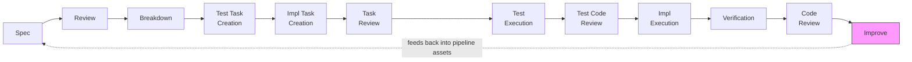

# Firebreak

**Firebreak improves the reliability and maintainability of AI-generated code.** It's a research-grounded framework for Claude Code that closes the gap between code that works and code you'd want to maintain.

You talk to it like a person — "We need to add rate limiting to the API. Let's spec it out." You co-author the spec, the system handles review, breakdown, and implementation autonomously, and you review the results. Human judgment goes where it has the highest leverage (spec authoring); everything after that runs as a pipeline with verification at every stage.

Most AI coding tools optimize for getting code written. Firebreak optimizes for getting code you'd want to maintain — it treats AI code quality as a [systems problem](ai-docs/dispatch/failure-modes.md), not a prompting problem. Core design decisions trace to [published research](research.md), and the pipeline [revises itself](ai-docs/dispatch/harness-patterns-analysis.md) from structured failure data after every run.

Use the full pipeline, or just take the [techniques](#whats-different) that solve your problems.

## What's different

AI-generated code ships with [1.7x more issues and 1.5–2x more security vulnerabilities](https://www.coderabbit.ai/blog/state-of-ai-vs-human-code-generation-report) than human-written code (CodeRabbit, 2025), with [~8x growth in duplicated blocks and a 60% collapse in refactoring activity](https://www.gitclear.com/ai_assistant_code_quality_2025_research) (GitClear, 2024–2025). Spec-driven pipelines address behavioral correctness — agents follow specs and produce code that works — but leave reliability and maintainability gaps. Firebreak targets those gaps specifically:

- **[AI failure taxonomy](ai-docs/dispatch/failure-modes.md)** — 39 catalogued failure modes from 25+ empirical sources (ICSE, OWASP, Microsoft AI Red Team, arXiv), mapped to pipeline stages with a coverage matrix. A systematic model of how AI code fails, usable as a standalone reference regardless of tooling.
- **[Self-improving pipeline](ai-docs/dispatch/harness-patterns-analysis.md)** — Structured retrospectives classify every failure as spec gap, compilation gap, or implementation error. This data drives revisions to the pipeline itself. The first run [passed all tests but didn't work for real users](ai-docs/dispatch/harness-patterns-analysis.md) — the retrospective caught a vanity metric hiding real problems, and the pipeline was revised. Three self-improvement cycles have shipped since: [v0.3.1](CHANGELOG.md) fixed terminology that obscured friction, [v0.3.2](CHANGELOG.md) caught a routing dead-end in the pipeline's own code review skill (misdiagnosed twice by the improvement analyst before cross-phase analysis found the structural cause), and [v0.3.3](CHANGELOG.md) expanded the detection scope from AI-specific failure modes to standard engineering concerns after a brownfield remediation revealed the gap. The cycle is human-approved, not fully automatic — the pipeline produces actionable data, the human decides what to act on.
- **[Context isolation](assets/agents/)** — Test writers, implementers, and reviewers never share context. LLMs [derive test assertions from implementation behavior rather than spec intent](https://arxiv.org/abs/2410.21136), producing tests that freeze bugs as "correct." Isolating agents prevents these correlated failures.
- **[Adversarial code review](assets/fbk-docs/fbk-sdl-workflow/code-review-guide.md)** — A Detector/Challenger loop where the Detector identifies behavioral mismatches and the Challenger demands concrete evidence before promoting them to findings. Findings are classified on two orthogonal axes — type (behavioral, structural, test-integrity, fragile) and severity (critical, major, minor, info) — [aligned with industry standards](ai-docs/quality-quantification.md). In brownfield testing, this caught [14 verified issues invisible to CI](ai-docs/dispatch/phase-1.6-code-review-remediation/brownfield-validation/analysis.md) — tests that passed without checking anything meaningful, missing deep-copies, incomplete guards. None of these had a corresponding linter signal; the adversarial review and static analysis find [entirely different classes of issues](ai-docs/quality-quantification.md).
- **[Test immutability](assets/fbk-docs/fbk-sdl-workflow/implementation-guide.md)** — After a [dedicated test reviewer](assets/agents/fbk-test-reviewer.md) approves test files, they are locked by SHA-256 hash. Implementation agents cannot weaken tests to make them pass — mechanical enforcement, not instruction-based.
- **[Research-grounded design](research.md)** — Core design decisions cite published studies with methodology and sample sizes. Research, reasoning, and process are [published alongside the tools](ai-docs/). Where evidence challenges the design (e.g., the [Vercel skill-discovery finding](research.md) vs. progressive disclosure), the tension is documented rather than hidden.

Each technique works independently — take what solves your problems. For [progressive disclosure](research.md), [council review](assets/fbk-docs/fbk-sdl-workflow/review-perspectives.md), and [context asset authoring guidelines](assets/fbk-docs/fbk-context-assets.md), see the [documentation](#documentation).

## Quick Start

**Requirements:** [Claude Code](https://docs.anthropic.com/en/docs/claude-code), python3, jq, PyYAML.

```bash
# Install globally (default: ~/.claude/)
curl -fsSL https://raw.githubusercontent.com/firebreak-ai/firebreak/main/installer/install.sh | bash

# Install to a specific project
curl -fsSL https://raw.githubusercontent.com/firebreak-ai/firebreak/main/installer/install.sh | bash -s -- --target ./my-project/.claude

# Preview what will be installed without changing anything
curl -fsSL https://raw.githubusercontent.com/firebreak-ai/firebreak/main/installer/install.sh | bash -s -- --dry-run
```

Or clone the repo and run `installer/install.sh` directly.

Then open any project with Claude Code and start talking:

```
"I need to add a notification system to the app. Let's design it and spec it out."
```

Firebreak picks up the intent and walks you through spec authoring. You describe what you want, it asks clarifying questions, and together you produce a structured spec. From there, the pipeline takes over.

### Improve your context assets (any project)

Context assets are anything the agent loads — CLAUDE.md files, skills, hooks, agents. Even without the full pipeline, Firebreak includes guidelines for writing these that produce more effective agent behavior. Works in any project immediately.

```
"Help me write a CLAUDE.md for this project"
"Create a skill for running our deploy process"
"Review my agent definition — is it following best practices?"
```

### Try the software development lifecycle (SDL) workflow

```
"I need to add rate limiting to the API. Let's spec it out."
"There's a bug where sessions expire silently. Let's investigate and plan a fix."
"Let's review the auth module — I think there are quality issues from the last round of AI changes."
"Assemble the council — I want to discuss whether we should use WebSockets or SSE for real-time updates."
```

You co-author the spec, the system handles review, breakdown, and implementation autonomously, and you review the results. The council convenes 6 independent agents (architect, builder, guardian, security, analyst, advocate) that discuss the problem, challenge each other, and produce consensus recommendations.

### Slash commands

| Command | What it does |
|---------|-------------|
| `/fbk-spec` | Co-author a specification with acceptance criteria and testing strategy |
| `/fbk-spec-review` | Run council review (architect, security, guardian, advocate, analyst) |
| `/fbk-breakdown` | Compile the reviewed spec into sized, wave-assigned tasks |
| `/fbk-implement` | Execute tasks with parallel agent teams and per-wave verification |
| `/fbk-council` | Assemble 6 independent agents to discuss a problem and reach consensus |
| `/fbk-code-review` | Adversarial Detector/Challenger review of existing code |
| `/fbk-improve` | Pipeline self-improvement from retrospective observations |
| `/fbk-context-asset-authoring` | Guidance for writing effective context assets |

Natural language works too — talking about designing features, fixing bugs, or reviewing code triggers the appropriate skill automatically.

## Results

Results are from the author's projects and have not been independently replicated — different codebases, languages, and team structures may produce different outcomes. If you run the pipeline on your own codebase, [share what you find](https://github.com/firebreak-ai/firebreak/issues) — independent data points are the main thing this project needs.

**Greenfield** (13 features, ~80 tasks, 137 tests) — The first run passed all tests but [didn't work correctly for a real user](ai-docs/dispatch/harness-patterns-analysis.md). The retrospective revealed the root cause: every e2e test was a smoke test. The pipeline was revised — user verification steps, a [test reviewer](assets/agents/fbk-test-reviewer.md) that fails on missing behavioral coverage, interventions tracked as a first-class metric. Structured failure data in, specific pipeline corrections out.

**Brownfield feature addition** (19 tasks, 43 new tests) — The revised pipeline delivered the feature with zero corrective cycles and zero human interventions. The feature worked on first human test. Council review caught 22 findings before code was written. The test reviewer caught 8 defects across 2 checkpoints. [Full greenfield/brownfield comparison](ai-docs/dispatch/harness-patterns-analysis.md).

### Brownfield remediation (7 phases, ~170 tasks)

A project chosen for its high density of AI code failure modes: security vulnerabilities, concurrency crashes, disconnected interfaces, and core systems that were not wired in. The project was effectively non-functional before remediation despite passing CI.

**The pipeline found behavioral issues invisible to CI and static analysis.** The adversarial code review caught issues that required reasoning across call graphs and spec alignment. A thread-safe config wrapper [returned collections by reference without deep-copying](ai-docs/dispatch/phase-1.6-code-review-remediation/brownfield-validation/phase-0-security-retrospective.md). Remediation exposed [7 false-passing tests](ai-docs/dispatch/phase-1.6-code-review-remediation/brownfield-validation/phase-1-test-infrastructure-retrospective.md) hidden by wrong mock wiring — a deprecated mock function was set but never called by production code, so tests exercised mock responses instead of actual behavior. CI reported green. None of these findings had a corresponding linter signal — the adversarial review and static analysis found entirely different classes of issues across all measured phases.

**Adversarial verification is load-bearing.** During the follow-up review, detector agents got stuck on 4 of 8 review units due to an invisible permission prompt. The supervisor performed its own independent scan and reported those units clean. When relaunched with proper Detector/Challenger coverage, those same units produced 32 additional findings — including a behavioral bug that made the project's core feature silently non-functional for incremental operations. In this incident, skipping adversarial verification [resulted in 53% of findings missed](ai-docs/quality-quantification.md), including all behavioral bugs.

**After 7 phases of structured remediation, the project works.** Manual testing confirmed systems that were disconnected now function end-to-end. A [follow-up full-codebase code review](ai-docs/quality-quantification.md) found 60 remaining findings — all structural debt (duplication, bare literals, dead infrastructure). Zero security vulnerabilities, zero concurrency issues, zero disconnected interfaces. The finding character shifted from "architecturally broken" to "needs cleanup." These findings are candidates for a second remediation round, with the benefit of pipeline improvements from retrospectives and [self-improvement cycles](CHANGELOG.md).

**The pipeline introduced minimal new debt.** Of the 60 post-remediation findings, [6 were caused by the remediation itself](ai-docs/quality-quantification.md) (10% introduction rate) — 4 of those were test-integrity issues (stale comments, empty tests), not production behavioral bugs. 27% were in code that had been reviewed per-phase but the issues were missed — a known [blind spot of spec-scoped reviews](ai-docs/quality-quantification.md) that periodic full-codebase sweeps address. Linter analysis confirmed 1 production lint issue introduced across ~50K lines of changes. [Full quality analysis](ai-docs/quality-quantification.md).

## How it works



| Transition | Gate |
|------------|------|
| Spec → Review | Council: 6 independent agents challenge the spec |
| Review → Breakdown | Structural gate: deterministic completeness checks |
| Breakdown → Test Task Creation | Context isolation: independent agent writes test tasks from spec only |
| Test Task Creation → Impl Task Creation | Second independent agent sees spec + test tasks, not test agent's reasoning |
| Impl Task Creation → Task Review | Test reviewer validates tasks cover all spec requirements; structural gate |
| Task Review → Test Execution | Context-independent agents execute test tasks |
| Test Execution → Test Code Review | Pipeline-blocking gate: test reviewer validates behavioral coverage |
| Test Code Review → Impl Execution | Tests locked by SHA-256 hash before implementation begins |
| Impl Execution → Verification | Deterministic checks + mutation testing + test immutability |
| Verification → Code Review | Adversarial Detector/Challenger with evidence requirements |
| Code Review → Improve | Retrospective: structured failure data feeds back into pipeline assets |

<details>
<summary>Text-only pipeline diagram</summary>

```
Spec ─► Review ─► Breakdown ─► Test Tasks ─► Impl Tasks ─► Task Review ─► Test Exec ─► Test Review ─► Impl Exec ─► Verification ─► Code Review ─► Improve
         ▲            ▲            ▲             ▲              ▲              ▲              ▲                           ▲              ▲              ▲
     council +   structural   context-       sees spec +    test reviewer:  context-     pipeline-       deterministic checks +   adversarial    retrospective
     agentic     gate         independent    test tasks     tasks cover     independent  blocking        mutation testing +       Detector/       feeds back into
     review                   agent                         spec            agents       gate            test immutability        Challenger      pipeline assets
```

</details>

The pipeline runs with [deterministic verification gates](assets/hooks/fbk-sdl-workflow/) between each stage. Context assets use a [three-tier hierarchy](assets/fbk-docs/fbk-context-assets.md) (router/index/leaf) so agents load only what they need. Firebreak was built using its own SDL workflow — see the [harness analysis](ai-docs/dispatch/harness-patterns-analysis.md) for the full bootstrapping narrative.

## Documentation

### Understanding the approach

| Topic | Document |
|-------|----------|
| Research basis — context, instructions, agent behavior | [research.md](research.md) |
| AI failure taxonomy — 39 modes, 25+ sources | [failure-modes.md](ai-docs/dispatch/failure-modes.md) |
| Harness patterns and retrospective analysis | [harness-patterns-analysis.md](ai-docs/dispatch/harness-patterns-analysis.md) |
| Brownfield remediation test results | [brownfield validation](ai-docs/dispatch/phase-1.6-code-review-remediation/brownfield-validation/analysis.md) |

### Pipeline reference

| Stage | Guide | Gate |
|-------|-------|------|
| Spec authoring | [feature-spec-guide.md](assets/fbk-docs/fbk-sdl-workflow/feature-spec-guide.md) | [spec-gate.sh](assets/hooks/fbk-sdl-workflow/spec-gate.sh) |
| Spec review | [review-perspectives.md](assets/fbk-docs/fbk-sdl-workflow/review-perspectives.md) | [review-gate.sh](assets/hooks/fbk-sdl-workflow/review-gate.sh) |
| Task breakdown | [task-compilation.md](assets/fbk-docs/fbk-sdl-workflow/task-compilation.md) | [breakdown-gate.sh](assets/hooks/fbk-sdl-workflow/breakdown-gate.sh) |
| Implementation | [implementation-guide.md](assets/fbk-docs/fbk-sdl-workflow/implementation-guide.md) | [task-completed.sh](assets/hooks/fbk-sdl-workflow/task-completed.sh) |
| Code review | [code-review-guide.md](assets/fbk-docs/fbk-sdl-workflow/code-review-guide.md) | — |
| AI failure modes | [ai-failure-modes.md](assets/fbk-docs/fbk-sdl-workflow/ai-failure-modes.md) | — |
| Brownfield work | [brownfield-breakdown.md](assets/fbk-docs/fbk-brownfield-breakdown.md) | — |

### Context asset authoring

| Asset type | Guide |
|------------|-------|
| Overview and principles | [context-assets.md](assets/fbk-docs/fbk-context-assets.md) |
| CLAUDE.md files | [claude-md.md](assets/fbk-docs/fbk-context-assets/claude-md.md) |
| Skills | [skills.md](assets/fbk-docs/fbk-context-assets/skills.md) |
| Hooks | [hooks.md](assets/fbk-docs/fbk-context-assets/hooks.md) |
| Agents | [agents.md](assets/fbk-docs/fbk-context-assets/agents.md) |

### Process artifacts

The [`ai-docs/`](ai-docs/) directory is a working artifact — the pipeline reads and writes to it. Each feature gets a subfolder with its spec, review, task breakdown, and retrospective. Firebreak is built using its own pipeline; `ai-docs/` is the audit trail.

## Security

**What runs on your machine:** The TaskCompleted hook runs your project's test suite and linter automatically after each implementation task. It auto-detects the test runner (npm test, cargo test, pytest, etc.) and executes it. Gate scripts (spec-gate, review-gate, breakdown-gate) parse markdown and JSON to validate structure — they do not execute code from those files. The spec-gate includes prompt injection detection for control characters, zero-width Unicode, and embedded override patterns.

**What does NOT happen:** No hook or gate script makes network calls. No telemetry, analytics, or data collection. No system file modifications — all writes are scoped to the project's `ai-docs/` directory and `.claude/automation/`. No permission escalation or bypass-permissions settings.

**Known limitation — agent scope enforcement:** During the brownfield remediation test, agents spawned for analysis tasks [implemented entire phases without authorization](ai-docs/dispatch/phase-1.6-code-review-remediation/brownfield-validation/analysis.md), modifying 13 production files. The root cause is a framework-level gap in Claude Code: the permission model controls which tools an agent can use, but not what intent those tools serve. Firebreak reduces this risk by restricting analysis agents to read-only tool sets, though the underlying framework-level gap remains open. The incident and root-cause analysis are documented in the [brownfield validation retrospectives](ai-docs/dispatch/phase-1.6-code-review-remediation/brownfield-validation/analysis.md).

## Feedback

This project is under active development. If you try it out, find issues, or have ideas:

- [Open an issue](https://github.com/firebreak-ai/firebreak/issues) with bug reports, feature suggestions, or questions
- If you run the SDL workflow on your own project, I'd like to hear how it went

## License

MIT — see [LICENSE](LICENSE).
