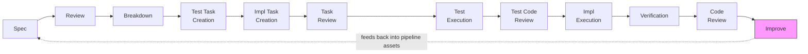

# Firebreak

[](https://github.com/firebreak-ai/firebreak/actions/workflows/ci.yml)

**Firebreak is a defense layer for AI-generated code.** Like its namesake — a cleared strip that stops a wildfire from spreading — Firebreak stops AI code quality problems from compounding across your codebase.

AI models are capable of writing clean, correct code. They fail systemically: [ambiguous context, missing intent, correlated errors between agents that share state](ai-docs/research/failure-modes.md). Studies show AI-generated code ships with [1.7x more issues](https://www.coderabbit.ai/blog/state-of-ai-vs-human-code-generation-report) and [up to 8x growth in duplicated blocks](https://www.gitclear.com/ai_assistant_code_quality_2025_research) — but these are engineering problems, addressable with structure, context engineering, and careful elimination of ambiguity. Firebreak treats them that way.

To get started immediately, jump to the [Quick Start](#quick-start). To see more detail about real results so far, check out [Results](#results).

## Layers of defense

Most approaches to AI code quality focus on better prompts or post-hoc linting. Firebreak addresses these problems systemically, at multiple points:

### Prevent problems at the source — context asset authoring

Your instructions shape agent behavior. Poorly written CLAUDE.md files, skills, hooks, and agent definitions introduce the very problems you're trying to solve — ambiguity that causes hallucination, bloated context that dilutes focus, vague triggers that cause skills to misfire. Firebreak includes [authoring guidelines](assets/fbk-docs/fbk-context-assets.md) that keep agent context clean and effective, applicable to any project immediately.

### Find what CI and linters miss — adversarial code review

Not bounded to PR review. Firebreak's code review establishes *user intent* as the review frame, then scans at whatever scale you need — full codebase, single module, specific concern. A Detector agent identifies potential issues; a [Challenger agent](assets/fbk-docs/fbk-sdl-workflow/code-review-guide.md) demands concrete code-path evidence before any issue is promoted to a finding. Findings are classified on two axes — type (behavioral, structural, test-integrity, fragile) and severity (critical, major, minor, info) — [aligned with industry standards](ai-docs/research/quality-quantification.md).

The code review finds issues [invisible to CI and static analysis](ai-docs/research/quality-quantification.md) — tests that pass without checking anything meaningful, missing deep-copies, incomplete guards. None of these have corresponding linter signals; adversarial review and static analysis find [entirely different classes of issues](ai-docs/research/quality-quantification.md).

Findings can also be classified by remediation effort — trivial fixes (bare literal replacement, stale comments, missing constants) can be resolved immediately without the full pipeline, just as post-implementation code review fixes are today. Complex findings (architectural wiring, cross-module refactoring, behavioral bugs with test implications) benefit from the structured pipeline to avoid creating new debt while fixing old debt. Effort classification is not yet automatic but is planned for the next release.

### Fix what the review finds — and build new things right — spec-driven development

Complex findings from the code review feed into the spec-driven pipeline as remediation specs — structured through the same process used for building new features. You co-author a specification that establishes intent, acceptance criteria, and testing strategy. The pipeline then handles review, breakdown, and implementation autonomously — with [context-isolated agents](assets/agents/) that never share state, [deterministic verification gates](assets/hooks/fbk-sdl-workflow/) at every stage, and a [test reviewer](assets/agents/fbk-test-reviewer.md) that locks approved tests by SHA-256 hash before implementation begins. Spec review convenes a council of specialized agents — architecture, implementation, quality, security, metrics, and user impact — each with independent context. Rather than producing parallel outputs, the council members deliberate and argue toward consensus, producing higher signal-to-noise than a single-agent review. The pipeline selects which members are relevant; most reviews use 3–4, not all 6. Human judgment goes where it has the highest leverage (spec authoring); everything after that runs as a structured pipeline.

### Get better every run — self-improvement

Structured [retrospectives](ai-docs/research/harness-patterns-analysis.md) from every pipeline run classify failures as spec gaps, compilation gaps, or implementation errors. This data drives specific, actionable revisions to the layers above. The cycle is human-approved — the pipeline produces actionable data, the human decides what to act on.

Five self-improvement cycles have shipped: [v0.3.1](CHANGELOG.md) fixed terminology that obscured friction, [v0.3.2](CHANGELOG.md) caught a routing dead-end in the pipeline's own code review skill, [v0.3.3](CHANGELOG.md) expanded detection scope from AI-specific failure modes to standard engineering concerns, [v0.3.4](CHANGELOG.md) hardened verification gates, added call-site completeness checks, and introduced rolling retrospectives across all pipeline stages, and [v0.3.5](CHANGELOG.md) made intent extraction mandatory — evaluation against a TypeScript project showed intent-sourced findings drove both critical findings and nearly tripled issue overlap with independently filed bugs.

## Quick Start

**Requirements:** [Claude Code](https://docs.anthropic.com/en/docs/claude-code), python3, jq, PyYAML.

```bash
# Install globally (default: ~/.claude/)
curl -fsSL https://raw.githubusercontent.com/firebreak-ai/firebreak/main/installer/install.sh | bash

# Install to a specific project
curl -fsSL https://raw.githubusercontent.com/firebreak-ai/firebreak/main/installer/install.sh | bash -s -- --target ./my-project/.claude

# Preview what will be installed without changing anything
curl -fsSL https://raw.githubusercontent.com/firebreak-ai/firebreak/main/installer/install.sh | bash -s -- --dry-run
```

Or clone the repo and run `installer/install.sh` directly.

Firebreak works with any language Claude Code supports. The brownfield test data in the results is Go because that's what the test project uses. Expect a code review to take around 30 minutes (measured for a full-repo test scan of a small/medium project); a full software development lifecycle (SDL) pipeline run takes around 3 hours (measured for a 26-task remediation phase). Not every finding needs the full pipeline — trivial fixes can be resolved immediately during the code review session. The pipeline is for complex findings where structured remediation prevents creating new debt. See [token usage and cost](results.md#token-usage-and-cost) for measured data and important notes on how API caching affects cost.

### Review and remediate your existing codebase

The lowest-barrier entry point. No new feature or project needed — point Firebreak at code you already have.

The code review scans against *what your code is supposed to do*, not just what it does. Firebreak will try to derive intent from design docs, READMEs, and existing code structure, but for codebases with significant AI-generated code, that existing code may not reflect the original intent. You'll get better results if you spend a few minutes describing your project's purpose and key behaviors first — Firebreak uses this as the source of truth for its review.

```
"Let's perform a code review of this project — I think there's a lot of AI-generated debt in here."
"Run a code review on the auth module for quality issues."
```

Firebreak walks you through establishing intent, then runs the adversarial review. Findings can be fed directly into the remediation pipeline.

### Build something new with the SDL pipeline

```
"I need to add rate limiting to the API. Let's spec it out."
"There's a bug where sessions expire silently. Let's investigate and start a new spec."
```

You co-author the spec, the system handles review, breakdown, and implementation autonomously, and you review the results.

### Improve your context assets (any project)

Context assets are anything the agent loads — CLAUDE.md files, skills, hooks, agents. Firebreak includes guidelines for writing these that produce more effective agent behavior. Works in any project immediately.

```
"Help me write a CLAUDE.md for this project"
"Create a skill for running our deploy process"
"Review my agent definition — is it following best practices?"
```

### Slash commands

| Command | What it does |
|---------|-------------|
| `/fbk-code-review` | Adversarial Detector/Challenger review — any scale, existing or new code |
| `/fbk-spec` | Co-author a specification with acceptance criteria and testing strategy |
| `/fbk-spec-review` | Run council review (architect, security, guardian, advocate, analyst) |
| `/fbk-breakdown` | Compile the reviewed spec into sized, wave-assigned tasks |
| `/fbk-implement` | Execute tasks with parallel agent teams and per-wave verification |
| `/fbk-council` | Assemble 6 agents (architect, builder, guardian, security, analyst, advocate) to discuss any problem |
| `/fbk-improve` | Pipeline self-improvement from retrospective observations |
| `/fbk-context-asset-authoring` | Guidance for writing effective context assets |

Natural language often triggers the appropriate skill — talking about designing features, fixing bugs, or reviewing code — but slash commands give you precise control.

## Results

Results are from the author's projects and have not been independently replicated. If you run Firebreak on your own codebase, [share what you find](https://github.com/firebreak-ai/firebreak/issues) — independent data points are the main thing this project needs. [Full results with methodology, per-phase data, and analysis](results.md).

Firebreak has been tested across greenfield development (13 features, 137 tests), brownfield feature addition (19 tasks, 43 tests), two rounds of brownfield remediation (12 phases, ~290 tasks) against a Go project chosen for its high density of AI code failure modes, and adversarial code review of a TypeScript AI agent project with 28 independently filed issues as a detection accuracy baseline. The Go project was effectively non-functional before remediation despite passing CI.

The adversarial code review catches issues that require reasoning across call graphs and intent alignment — invisible to CI and static analysis. Across all measurement points, linter findings and code review findings have [zero overlap](ai-docs/research/quality-quantification.md). Examples from the brownfield test:

- **7 tests were passing by exercising mock responses instead of actual behavior.** A deprecated mock function was wired but never called by production code. CI reported green.
- **A feature was permanently inert.** A nil parameter was passed to the scoring function, making entity-proximity boost silently non-functional. This survived one full remediation round and was caught during Round 2.
- **A "thread-safe" wrapper wasn't thread-safe.** It returned collections by reference without deep-copying — invisible without call-graph reasoning.
- **Tests passed with internally contradictory scenarios.** Scoring test fixtures had store nodes set to one kind while candidates used another. The mock didn't validate, so the tests proved nothing.
- **A single-pass scan of the same codebase [missed 53% of findings](ai-docs/research/quality-quantification.md), including every behavioral bug.** When the Detector/Challenger loop was skipped in favor of a supervisor's independent scan, 32 findings went undetected — including a bug that made the core feature silently non-functional.

After 12 phases of structured remediation across two rounds: zero detected security vulnerabilities, zero detected concurrency crashes, zero detected disconnected interfaces. The pipeline introduced [6 issues of its own](ai-docs/research/quality-quantification.md) across ~50K lines of changes (10% introduction rate), 4 of which were test-integrity issues — not production bugs. Zero regressions across ~290 tasks.

[Full results, per-phase retrospectives, and source data →](results.md)

## How it works



| Transition | Gate |
|------------|------|
| Spec → Review | Council: 6 independent agents challenge the spec |
| Review → Breakdown | Structural gate: deterministic completeness checks |
| Breakdown → Test Task Creation | Context isolation: independent agent writes test tasks from spec only |
| Test Task Creation → Impl Task Creation | Second independent agent sees spec + test tasks, not test agent's reasoning |
| Impl Task Creation → Task Review | Test reviewer validates tasks cover all spec requirements; structural gate |
| Task Review → Test Execution | Context-independent agents execute test tasks |
| Test Execution → Test Code Review | Pipeline-blocking gate: test reviewer validates behavioral coverage |
| Test Code Review → Impl Execution | Tests locked by SHA-256 hash before implementation begins |
| Impl Execution → Verification | Deterministic checks + mutation testing + test immutability |
| Verification → Code Review | Adversarial Detector/Challenger with evidence requirements |
| Code Review → Improve | Retrospective: structured failure data feeds back into pipeline assets |

<details>
<summary>Text-only pipeline diagram</summary>

```
Spec ─► Review ─► Breakdown ─► Test Tasks ─► Impl Tasks ─► Task Review ─► Test Exec ─► Test Review ─► Impl Exec ─► Verification ─► Code Review ─► Improve
         ▲            ▲            ▲             ▲              ▲              ▲              ▲                           ▲              ▲              ▲
     council +   structural   context-       sees spec +    test reviewer:  context-     pipeline-       deterministic checks +   adversarial    retrospective
     agentic     gate         independent    test tasks     tasks cover     independent  blocking        mutation testing +       Detector/       feeds back into
     review                   agent                         spec            agents       gate            test immutability        Challenger      pipeline assets
```

</details>

The pipeline runs with [deterministic verification gates](assets/hooks/fbk-sdl-workflow/) between each stage. Context assets use a [three-tier hierarchy](assets/fbk-docs/fbk-context-assets.md) (router/index/leaf) so agents load only what they need. Firebreak was built using its own SDL workflow — see the [harness analysis](ai-docs/research/harness-patterns-analysis.md) for the full bootstrapping narrative.

## Documentation

### Understanding the approach

| Topic | Document |
|-------|----------|
| Full results — greenfield, brownfield, remediation | [results.md](results.md) |
| AI failure taxonomy — 39 modes, 25+ sources | [failure-modes.md](ai-docs/research/failure-modes.md) |
| Research basis — context, instructions, agent behavior | [research.md](research.md) |
| Quality quantification methodology and lint data | [quality-quantification.md](ai-docs/research/quality-quantification.md) |
| Harness patterns and retrospective analysis | [harness-patterns-analysis.md](ai-docs/research/harness-patterns-analysis.md) |

### Pipeline reference

| Stage | Guide | Gate |
|-------|-------|------|
| Spec authoring | [feature-spec-guide.md](assets/fbk-docs/fbk-sdl-workflow/feature-spec-guide.md) | [spec-gate.sh](assets/hooks/fbk-sdl-workflow/spec-gate.sh) |
| Spec review | [review-perspectives.md](assets/fbk-docs/fbk-sdl-workflow/review-perspectives.md) | [review-gate.sh](assets/hooks/fbk-sdl-workflow/review-gate.sh) |
| Task breakdown | [task-compilation.md](assets/fbk-docs/fbk-sdl-workflow/task-compilation.md) | [breakdown-gate.sh](assets/hooks/fbk-sdl-workflow/breakdown-gate.sh) |
| Implementation | [implementation-guide.md](assets/fbk-docs/fbk-sdl-workflow/implementation-guide.md) | [task-completed.sh](assets/hooks/fbk-sdl-workflow/task-completed.sh) |
| Code review | [code-review-guide.md](assets/fbk-docs/fbk-sdl-workflow/code-review-guide.md) | — |
| AI failure modes | [ai-failure-modes.md](assets/fbk-docs/fbk-sdl-workflow/ai-failure-modes.md) | — |
| Security patterns | [security-patterns.md](assets/fbk-docs/fbk-sdl-workflow/security-patterns.md) | — |
| Detection audits | [detection-audits.md](assets/fbk-docs/fbk-sdl-workflow/detection-audits.md) | — |
| Brownfield work | [brownfield-breakdown.md](assets/fbk-docs/fbk-brownfield-breakdown.md) | — |
| Retrospective | [retrospective-guide.md](assets/fbk-docs/fbk-sdl-workflow/retrospective-guide.md) | — |

### Context asset authoring

| Asset type | Guide |
|------------|-------|
| Overview and principles | [context-assets.md](assets/fbk-docs/fbk-context-assets.md) |
| CLAUDE.md files | [claude-md.md](assets/fbk-docs/fbk-context-assets/claude-md.md) |
| Skills | [skills.md](assets/fbk-docs/fbk-context-assets/skills.md) |
| Hooks | [hooks.md](assets/fbk-docs/fbk-context-assets/hooks.md) |
| Agents | [agents.md](assets/fbk-docs/fbk-context-assets/agents.md) |

### Process artifacts

The [`ai-docs/`](ai-docs/) directory is a working artifact — the pipeline reads and writes to it. Each feature gets a subfolder with its spec, review, task breakdown, and retrospective. Firebreak is built using its own pipeline; `ai-docs/` is the audit trail.

## Security

**What runs on your machine:** The TaskCompleted hook runs your project's test suite and linter automatically after each implementation task. It auto-detects the test runner (npm test, cargo test, pytest, etc.) and executes it. Gate scripts (spec-gate, review-gate, breakdown-gate) parse markdown and JSON to validate structure — they do not execute code from those files. The spec-gate includes prompt injection detection for control characters, zero-width Unicode, and embedded override patterns.

**What does NOT happen:** No hook or gate script makes network calls. No telemetry, analytics, or data collection. No system file modifications — all writes are scoped to the project's `ai-docs/` directory and `.claude/automation/`. No permission escalation or bypass-permissions settings.

**Known limitation — agent scope enforcement:** During the brownfield remediation test, agents spawned for analysis tasks [implemented entire phases without authorization](ai-docs/dispatch/phase-1.6-code-review-remediation/brownfield-validation/analysis.md), modifying 13 production files. The root cause is a framework-level gap in Claude Code: the permission model controls which tools an agent can use, but not what intent those tools serve. Firebreak reduces this risk by restricting analysis agents to read-only tool sets, though the underlying framework-level gap remains open. The incident and root-cause analysis are documented in the [brownfield validation retrospectives](ai-docs/dispatch/phase-1.6-code-review-remediation/brownfield-validation/analysis.md).

## Feedback

This project is under active development. If you try it out, find issues, or have ideas:

- [Open an issue](https://github.com/firebreak-ai/firebreak/issues) with bug reports, feature suggestions, or questions
- If you run Firebreak on your own project, I'd like to hear how it went! Please share retrospectives in the repo issues!

## License

MIT — see [LICENSE](LICENSE).
