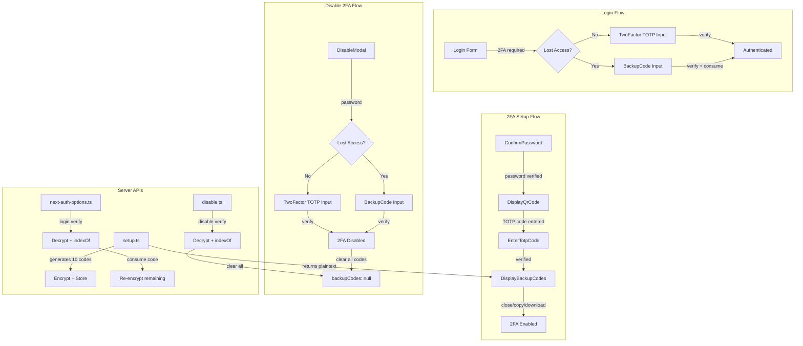

# Code Review: feat: 2fa backup codes (PR #10600)

**Instance**: cal_dot_com__calcom__cal.com__PR10600
**PR**: https://github.com/calcom/cal.com/pull/10600
**Preset**: behavioral-only
**Date**: 2026-04-13

---

## Intent Register

### Intent Claims

1. 2FA setup generates 10 backup codes using `crypto.randomBytes` (5 bytes each, hex-encoded to 10 chars)
2. Backup codes are encrypted with `CALENDSO_ENCRYPTION_KEY` via `symmetricEncrypt` before database storage
3. Setup API (`/api/auth/two-factor/totp/setup`) returns plaintext backup codes alongside QR data for user display
4. Enable flow shows backup codes AFTER successful TOTP verification (new `DisplayBackupCodes` step)
5. Users can download backup codes as `cal-backup-codes.txt`
6. Users can copy backup codes to clipboard with toast confirmation ("Backup codes copied!")
7. Backup codes display in `XXXXX-XXXXX` format (dash-separated 5-char halves)
8. Login flow supports backup code as alternative to TOTP when user selects "Lost access"
9. Used backup code is set to `null` in the array and remaining codes re-encrypted on login
10. Disable 2FA flow supports backup code as alternative to TOTP via "Lost access" toggle
11. Disabling 2FA clears all backup codes (`backupCodes: null` in DB)
12. Disable endpoint validates backup code but does not consume it individually (all codes cleared on disable)
13. New `ErrorCode` values: `IncorrectBackupCode`, `MissingBackupCodes`
14. `BackupCode.tsx` provides a single text input for `XXXXX-XXXXX` format with minLength 10, maxLength 11
15. `TwoFactor` component gains `autoFocus` prop, defaulting to `true`
16. `PasswordField` visibility toggle button gets `tabIndex={-1}` to improve keyboard tab flow
17. Database migration adds nullable TEXT column `backupCodes` to `users` table
18. i18n: "Each backup code can be used exactly once to grant access without your authenticator"

### Intent Diagram

---

## Verified Findings

### F-01 | Zero-value sentinel ambiguity in login backup code path
| Field | Value |
|-------|-------|
| **Sighting** | S-02 |
| **Location** | `packages/features/auth/lib/next-auth-options.ts`, backup code authorize block |
| **Type** | behavioral |
| **Severity** | major |
| **Confidence** | 10.0 |
| **Current behavior** | When all 10 backup codes have been consumed (each set to `null`), the DB column holds a non-null encrypted string containing `[null,null,...,null]`. The guard `if (!user.backupCodes)` passes (truthy encrypted string). After decryption, `backupCodes.indexOf(credentials.backupCode.replaceAll("-",""))` returns `-1` because no null entry matches the input string. The user receives `IncorrectBackupCode` — implying a typo — instead of `MissingBackupCodes`, which would correctly communicate that no valid codes remain. |
| **Expected behavior** | After decrypting and parsing the array, check whether any non-null entries remain (e.g., `backupCodes.every(c => c === null)`) and throw `MissingBackupCodes` in that case. |
| **Source of truth** | Zero-value sentinel ambiguity checklist item |
| **Evidence** | Line 643: `if (!user.backupCodes) throw new Error(ErrorCode.MissingBackupCodes)` only catches null column. Lines 654-655: `backupCodes[index] = null` + re-encrypt stores nulls back. After all consumed, column is non-null encrypted `[null,...]`, defeating the guard. |
| **Pattern label** | zero-value-sentinel-ambiguity |

### F-02 | Zero-value sentinel ambiguity in disable backup code path
| Field | Value |
|-------|-------|
| **Sighting** | S-03 |
| **Location** | `apps/web/pages/api/auth/two-factor/totp/disable.ts`, backup code verification block |
| **Type** | behavioral |
| **Severity** | major |
| **Confidence** | 10.0 |
| **Current behavior** | Same sentinel ambiguity as F-01 in the disable endpoint. When all codes consumed, `!user.backupCodes` (line 365) evaluates false. After decryption, `indexOf` returns `-1`, and the response is `IncorrectBackupCode` rather than `MissingBackupCodes`. |
| **Expected behavior** | Post-decryption check for all-null array should return `MissingBackupCodes`. |
| **Source of truth** | Zero-value sentinel ambiguity checklist item |
| **Evidence** | Disable.ts line 365: `if (!user.backupCodes)` guard. Consumption in next-auth-options.ts stores nulls back. The all-null state is reachable if a user consumed codes via login before hitting disable. |
| **Pattern label** | zero-value-sentinel-ambiguity |

### F-03 | Missing encryption key guard in setup.ts
| Field | Value |
|-------|-------|
| **Sighting** | S-06 |
| **Location** | `apps/web/pages/api/auth/two-factor/totp/setup.ts`, `symmetricEncrypt` call for backup codes |
| **Type** | behavioral |
| **Severity** | major |
| **Confidence** | 10.0 |
| **Current behavior** | `symmetricEncrypt(JSON.stringify(backupCodes), process.env.CALENDSO_ENCRYPTION_KEY)` is called with no prior null-check on `CALENDSO_ENCRYPTION_KEY`. If the env var is absent, `undefined` flows into `symmetricEncrypt`, producing an uncontrolled runtime exception or corrupt ciphertext. |
| **Expected behavior** | A guard matching the pattern established elsewhere in this same PR: `if (!process.env.CALENDSO_ENCRYPTION_KEY) { console.error(...); throw new Error(ErrorCode.InternalServerError); }` |
| **Source of truth** | Silent error discard checklist item; consistency with same-PR guards in disable.ts and next-auth-options.ts |
| **Evidence** | disable.ts lines 360-363 and next-auth-options.ts lines 638-641 both add explicit `if (!process.env.CALENDSO_ENCRYPTION_KEY)` guards. setup.ts line 413 has no such guard for the new backup code encryption. |
| **Pattern label** | silent-error-discard |

### F-04 | Clipboard write failure produces false success toast
| Field | Value |
|-------|-------|
| **Sighting** | S-07 |
| **Location** | `apps/web/components/settings/EnableTwoFactorModal.tsx`, copy button `onClick` handler |
| **Type** | behavioral |
| **Severity** | major |
| **Confidence** | 10.0 |
| **Current behavior** | `navigator.clipboard.writeText(...)` returns a Promise that is neither awaited nor `.catch()`-ed. `showToast(t("backup_codes_copied"), "success")` fires unconditionally on the next synchronous line. If clipboard access is denied, the user sees a false "Backup codes copied!" success notification while codes were never placed in the clipboard. |
| **Expected behavior** | The handler should be `async`, `await` the clipboard call, show the success toast only on fulfillment, and show an error toast on rejection. |
| **Source of truth** | Silent error discard checklist item; intent claim 6 ("toast confirms successful copy") |
| **Evidence** | Diff lines 314-317: `navigator.clipboard.writeText(...)` (no await), followed by `showToast(...)` (unconditional). |
| **Pattern label** | silent-error-discard |

### F-05 | Backup code input allows 11-char dashless input that can never match
| Field | Value |
|-------|-------|
| **Sighting** | S-11 |
| **Location** | `apps/web/components/auth/BackupCode.tsx`, lines 22-23 |
| **Type** | behavioral |
| **Severity** | minor |
| **Confidence** | 9.6 |
| **Current behavior** | `maxLength={11}` permits an 11-character dashless input. The server strips dashes with `.replaceAll("-", "")` and compares against 10-char stored codes. An 11-char dashless input remains 11 chars after stripping, never matching any stored code. User receives `IncorrectBackupCode` with no format feedback. |
| **Expected behavior** | Either enforce a pattern constraint for the dashed format, or validate input length after stripping dashes on the server side. |
| **Source of truth** | Intent claim 14 |
| **Evidence** | BackupCode.tsx lines 28-29: `minLength={10}`, `maxLength={11}`. Server: `credentials.backupCode.replaceAll("-", "")` — no length check. Stored codes: `crypto.randomBytes(5).toString("hex")` = exactly 10 hex chars. |
| **Pattern label** | input-validation-gap |

---

## Findings Summary

| ID | Type | Severity | Description |
|----|------|----------|-------------|
| F-01 | behavioral | major | Zero-value sentinel: all-consumed backup codes → wrong error on login |
| F-02 | behavioral | major | Zero-value sentinel: all-consumed backup codes → wrong error on disable |
| F-03 | behavioral | major | Missing CALENDSO_ENCRYPTION_KEY null guard in setup.ts |
| F-04 | behavioral | major | Clipboard writeText Promise not awaited; false success toast |
| F-05 | behavioral | minor | maxLength=11 allows dashless 11-char input that never matches |

**Totals**: 5 verified findings (4 major, 1 minor), 0 rejections from Challenger.

---

## Filtered Findings (out-of-charter for behavioral-only preset)

| Sighting | Type | Severity | Reason | Description |
|----------|------|----------|--------|-------------|
| S-01 | structural | minor | out-of-charter | Bare numeric literals for backup code length/count across 3+ files |
| S-04 | structural | minor | out-of-charter | Duplicated backup code verification logic in disable.ts and next-auth-options.ts |
| S-05 | test-integrity | major | out-of-charter | Non-enforcing test: isChecked() Promise always truthy |
| S-08 | structural | minor | out-of-charter | SetupStep enum ordering misrepresents actual flow |
| S-09 | structural | major | out-of-charter | BackupCode.tsx exports function named TwoFactor (semantic drift) |
| S-10 | fragile | minor | out-of-charter | resetState() doesn't clear backupCodes/backupCodesUrl/dataUri/secret |
| S-12 | structural | minor | out-of-charter | DisplayBackupCodes content outside Form, buttons inside Form |

---

## Retrospective

### Sighting Counts

- **Total sightings generated**: 17 (pre-dedup), 12 (post-dedup)
- **Verified findings at termination**: 5
- **Rejections**: 0
- **Nit count**: 0
- **Filtered (out-of-charter)**: 7 sightings (structural: 5, test-integrity: 1, fragile: 1)
- **Filtered (below-threshold)**: 0

**By detection source**:
| Source | Sightings | Findings |
|--------|-----------|----------|
| checklist | 9 | 5 |
| structural-target | 6 | 0 (all out-of-charter) |
| intent | 3 | 0 (merged into checklist sightings) |
| linter | N/A | N/A |

**By structural sub-category** (of out-of-charter structural findings):
- Bare literals: S-01
- Caller re-implementation / duplication: S-04
- Semantic drift: S-08, S-09
- Composition opacity: S-12

### Verification Rounds

- **Rounds**: 1 (converged after first round — all sightings verified or filtered; no weakened sightings requiring follow-up)
- **Hard cap reached**: No
- **Convergence reason**: All Challenger verdicts were `confirmed`. No weakened sightings to re-investigate. Diff-only context provides no new information for additional rounds.

### Scope Assessment

- **Files in scope**: 16 files across the diff
- **Lines changed**: ~450 lines added/modified
- **Context mode**: Diff-only (benchmark mode — no repository access)

### Context Health

| Metric | Value |
|--------|-------|
| Round count | 1 |
| Sightings (round 1) | 17 raw, 12 deduplicated |
| Rejection rate (round 1) | 0% (0/5 verified) |
| Hard cap reached | No |

### Tool Usage

- **Linter**: N/A (benchmark mode — no project tooling available)
- **Test runner**: N/A
- **Tools used**: Read, Grep, Glob (agent-level file access for diff)

### Finding Quality

- **False positive rate**: 0% (0 rejections out of 5 verified)
- **False negative signals**: N/A (no user feedback in benchmark mode)
- **Origin breakdown**: All 5 findings are `introduced` (created by this PR's changes)

### Intent Register

- **Claims extracted**: 18 (from diff analysis)
- **Sources**: PR diff code, i18n strings, migration, schema
- **Findings attributed to intent comparison**: 0 direct (IPT sightings merged into checklist-sourced findings during dedup)
- **Intent claims invalidated**: 0

### Per-Group Metrics

| Agent Group | Files Reported | Sighting Volume | Survival Rate | Phase Attribution |
|-------------|---------------|-----------------|---------------|-------------------|
| G1 (value-abstraction) | 16/16 | 4 | 2/4 (50%) — 2 behavioral confirmed, 2 structural filtered | P1: 3, P2: 1 |
| G2 (dead-code) | 16/16 | 1 | 0/1 (0%) — test-integrity filtered | P1: 1, P2: 0 |
| G3 (signal-loss) | 16/16 | 3 | 2/3 (67%) — 2 behavioral confirmed, 1 structural filtered | P1: 3, P2: 0 |
| G4 (behavioral-drift) | 16/16 | 6 | 1/6 (17%) — 1 behavioral confirmed, 3 structural filtered, 1 fragile filtered, 1 duplicate | P1: 5, P2: 1 |
| IPT (intent-path-tracer) | 7/7 entry points | 3 | 0/3 (0%) — all merged into G1/G3 during dedup | P1: 3, P2: 0 |

### Deduplication Metrics

- **Merge count**: 5 merge events (17 → 12 sightings)
- **Merged pairs**:
  - G2-S-01 + G4-S-02 → S-05
  - G3-S-03 + G4-S-03 + IPT-S-02 → S-08
  - G3-S-01 + IPT-S-01 → S-06
  - G1-S-02 + IPT-S-03 (partial) → S-02
  - G1-S-03 + IPT-S-03 (partial) → S-03

### Instruction Trace

- **Agents spawned**: 5 Tier 1 detectors + 1 IPT + 1 Deduplicator + 1 Challenger = 8 agents
- **Agent types**: t1-value-abstraction-detector, t1-dead-code-detector, t1-signal-loss-detector, t1-behavioral-drift-detector, intent-path-tracer, sighting-deduplicator, code-review-challenger
- **Prompt composition**: Each Tier 1 agent received identical diff payload (~716 lines) + intent claims (18 claims). IPT received intent register + diagram + 7 entry points.

### Observations

1. **Zero-value sentinel pattern was the strongest signal**: F-01 and F-02 describe a genuine production correctness issue — users who exhaust all backup codes receive a misleading error message. This was independently detected by G1 and IPT.

2. **Behavioral-only preset filtered high-value structural findings**: S-05 (non-enforcing test with FIXME comment, test-integrity/major), S-09 (component named TwoFactor in BackupCode.tsx, structural/major) would have been notable findings under the `full` preset. The charter filter correctly excluded them per the behavioral-only scope.

3. **G4 had lowest survival rate (17%)** due to producing more structural and fragile sightings that fell outside the behavioral-only charter. Its one behavioral finding (S-11/F-05, input validation gap) was a genuine minor issue.

4. **IPT sightings fully absorbed by dedup**: All 3 IPT sightings duplicated earlier Tier 1 findings. This is expected in a focused diff review where code context is identical across agents. IPT contributed corroborating agent count to merged sightings.

5. **Clipboard API false-positive toast (F-04)** is a common pattern in React codebases where `navigator.clipboard.writeText()` is treated as synchronous. This is a real usability risk for security-sensitive backup code copy operations.
