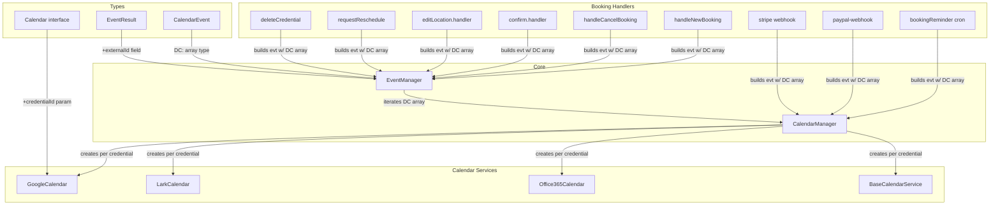

# Code Review: cal.com PR #10967 — fix: handle collective multiple host on destinationCalendar

## Intent Register

### Intent Claims

1. `destinationCalendar` changes from a single object (`DestinationCalendar | null`) to an array (`DestinationCalendar[] | null`) across the CalendarEvent type and all consumers.
2. For collective scheduling with multiple hosts, each host's destination calendar is included in the array so events are created on each host's calendar.
3. Calendar services (Google, Lark, Office365, CalDAV) extract the first element of the destination calendar array as the "main host" calendar for organizer email and calendar selection.
4. Google Calendar's `createEvent` receives `credentialId` to select the correct destination calendar from the array via `.find()`.
5. `EventManager.createAllCalendarEvents` iterates over each destination calendar, creating events on each host's calendar individually.
6. When a credential is not found in the in-memory `calendarCredentials` list, the code falls back to fetching it from the database via Prisma.
7. `EventManager.updateCalendarEvents` changes from single calendar reference to iterating over multiple calendar references.
8. Booking handlers across the codebase wrap single `destinationCalendar` values in arrays at event construction sites.
9. The webhook test expectation changes from `null` to `[]` for empty destination calendars.
10. The `CalendarEvent` type adds a `schedulingType` field to support conditional logic for collective scheduling.
11. For collective event types, team member destination calendars are collected and pushed onto the event's destination calendar array.
12. The `createEvent` Calendar interface signature changes to accept a `credentialId` parameter.
13. `EventResult` gains an `externalId` field to track which calendar the event was created on.
14. A typo fix corrects `orginalBookingDuration` to `originalBookingDuration`.
15. The `loadUsers` function is refactored with explicit error handling and validation.
16. Organization create handler changes spread conditions for `slug` and `requestedSlug`.
17. A duplicated `if (!calendarReference)` guard in `updateOtherCalendars` is fixed to a single guard.
18. Google Calendar `updateEvent` and `deleteEvent` use `.find()` on the destination calendar array to locate the calendar matching an `externalCalendarId`.

### Intent Diagram



---

## Verified Findings

### F-01 (critical, behavioral) — Tautological `.find()` in Google Calendar updateEvent/deleteEvent

**Sighting:** D-01 (merged from G1-S-01, G2-S-01, G2-S-02, G3-S-02, G4-S-01, G4-S-02, IPT-S-02)
**Location:** `packages/app-store/googlecalendar/lib/CalendarService.ts`, `updateEvent` (~line 253) and `deleteEvent` (~line 312)
**Current behavior:** Both methods have a fallback expression:
```ts
const selectedCalendar = externalCalendarId
  ? externalCalendarId
  : event.destinationCalendar?.find((cal) => cal.externalId === externalCalendarId)?.externalId;
```
The fallback branch only executes when `externalCalendarId` is falsy. The `.find()` predicate then compares `cal.externalId === externalCalendarId` against the same falsy value, which never matches any real calendar entry. The result is always `undefined`.
**Expected behavior:** When `externalCalendarId` is absent, fall back to the first/main host destination calendar's `externalId` (as the original code did with `event.destinationCalendar?.externalId`), or use a `credentialId`-based lookup as in `createEvent`.
**Source of truth:** Intent claim 18
**Evidence:** The ternary guard ensures `.find()` only runs when its search key is falsy. Calendar updates and deletes without an explicit external calendar ID will target an undefined calendar, causing Google Calendar API failures or silent no-ops.
**Confidence:** 10.0 pass

---

### F-02 (critical, behavioral) — Null-safety regression on `mainHostDestinationCalendar.integration`

**Sighting:** D-02 (merged from G1-S-04, G2-S-03, G4-S-03, IPT-S-01)
**Location:** `packages/core/EventManager.ts`, `create` method (~line 277)
**Current behavior:**
```ts
const [mainHostDestinationCalendar] = evt.destinationCalendar ?? [];
if (evt.location === MeetLocationType && mainHostDestinationCalendar.integration !== "google_calendar") {
```
When `evt.destinationCalendar` is `null`, `undefined`, or `[]`, `mainHostDestinationCalendar` is `undefined`. Accessing `.integration` without optional chaining throws `TypeError`.
**Expected behavior:** `mainHostDestinationCalendar?.integration !== "google_calendar"` — the original code used `evt.destinationCalendar?.integration` which was null-safe.
**Source of truth:** Intent claim 3
**Evidence:** `handleNewBooking.ts` sets `destinationCalendar: null` when both `eventType.destinationCalendar` and `organizerUser.destinationCalendar` are absent (diff line 865). This null flows into `EventManager.create`, triggering the crash for any booking without a configured destination calendar.
**Confidence:** 10.0 pass

---

### F-03 (major, behavioral) — `null` vs `[]` in handleNewBooking silently drops team calendars

**Sighting:** D-03 (merged from G1-S-05, G3-S-01, G4-S-05, IPT-S-04)
**Location:** `packages/features/bookings/lib/handleNewBooking.ts` (~lines 861-877)
**Current behavior:**
```ts
destinationCalendar: eventType.destinationCalendar
  ? [eventType.destinationCalendar]
  : organizerUser.destinationCalendar
  ? [organizerUser.destinationCalendar]
  : null,  // <-- null, not []
```
Then: `evt.destinationCalendar?.push(...teamDestinationCalendars);` — optional chaining on `null` is a no-op.
**Expected behavior:** The fallback should be `[]` (empty array), consistent with all other booking handlers in this PR, so that `push` succeeds and team member calendars are captured for collective events.
**Source of truth:** Intent claim 11
**Evidence:** When neither event type nor organizer has a destination calendar, team member calendars are silently discarded. Additionally, `createAllCalendarEvents` checks `event.destinationCalendar && event.destinationCalendar.length > 0` — `null` evaluates falsy, so the entire calendar event creation path is skipped.
**Confidence:** 10.0 pass

---

### F-04 (major, behavioral) — Organization handler boolean condition inversion for slug

**Sighting:** IPT-S-07
**Location:** `packages/trpc/server/routers/viewer/organizations/create.handler.ts` (~lines 1069-1073)
**Current behavior:**
```ts
// Before: ...(!IS_TEAM_BILLING_ENABLED && { slug })  → slug set when billing OFF
// After:  ...(IS_TEAM_BILLING_ENABLED ? { slug } : {})  → slug set when billing ON
```
The `slug` condition is inverted. Before: `slug` was set when billing was DISABLED, `requestedSlug` when billing was ENABLED. After: both `slug` and `requestedSlug` are set when billing is ENABLED; neither is set when billing is DISABLED.
**Expected behavior:** Preserve the original complementary logic: `slug` when billing is off, `requestedSlug` when billing is on.
**Source of truth:** Intent claim 16
**Evidence:** Organizations created on non-billing deployments will no longer receive a `slug`, breaking slug-dependent routing and lookup.
**Confidence:** 8.4 pass

---

### F-05 (major, behavioral) — Silent credential skip in createAllCalendarEvents

**Sighting:** G3-S-03
**Location:** `packages/core/EventManager.ts`, `createAllCalendarEvents` (~lines 339-352)
**Current behavior:** When `credentialFromDB` exists but `credentialFromDB.app?.slug` is falsy (app deleted), credential construction is silently skipped. The outer `if (credential)` guard then skips event creation for that destination calendar with no log or error.
**Expected behavior:** Log a warning when a credential's associated app cannot be resolved, so that dropped calendar events are observable.
**Source of truth:** Intent claim 6
**Evidence:** The destination calendar is silently not processed. No diagnostic signal is emitted for operators monitoring calendar event creation.
**Confidence:** 10.0 pass

---

### F-06 (minor, behavioral) — Missing externalId in no-credentialId branch

**Sighting:** D-05 (merged from G4-S-07, IPT-S-05)
**Location:** `packages/core/EventManager.ts`, `createAllCalendarEvents` (~line 363)
**Current behavior:** The no-credentialId branch calls `createEvent(c, event)` without passing `destination.externalId`. The credentialId-present branch passes it: `createEvent(credential, event, destination.externalId)`.
**Expected behavior:** Pass `destination.externalId` in both branches so `EventResult.externalId` is populated for downstream reference tracking.
**Source of truth:** Intent claim 13
**Evidence:** `EventManager` stores `result.externalId` as `externalCalendarId` on booking references (diff line 288). Without it, future update/delete operations for those references will lack the external calendar ID.
**Confidence:** 10.0 pass

---

### F-07 (minor, behavioral) — Silent credential skip in handleCancelBooking

**Sighting:** G3-S-04
**Location:** `packages/features/bookings/lib/handleCancelBooking.ts` (~lines 628-638)
**Current behavior:** When neither in-memory credentials nor DB lookup finds the credential, execution falls through `if (calendarCredential)` silently. The calendar delete is skipped with no log.
**Expected behavior:** Emit a log warning when a credential cannot be found, so that failed calendar deletes are observable.
**Source of truth:** AI failure mode checklist: silent error discard
**Evidence:** The booking cancellation proceeds as if the calendar event was deleted when it was not. The dangling calendar event is a data-consistency issue.
**Confidence:** 9.6 pass

---

### F-08 (minor, behavioral) — Removed console.error in updateCalendarEvents catch block

**Sighting:** G4-S-04
**Location:** `packages/core/EventManager.ts`, `updateCalendarEvents` catch block (~lines 497-524)
**Current behavior:** The old code called `console.error(message)` before returning failure objects. The new code constructs the `message` variable but never logs it — the error is silently discarded.
**Expected behavior:** Retain `console.error(message)` or equivalent logging so calendar update failures are observable.
**Source of truth:** Structural detection target: silent error discard
**Evidence:** The `message` variable is assigned and formatted but never used.
**Confidence:** 10.0 pass

---

### F-09 (minor, behavioral) — requestReschedule missing user-level destinationCalendar fallback

**Sighting:** IPT-S-06
**Location:** `packages/trpc/server/routers/viewer/bookings/requestReschedule.handler.ts` (~lines 1054-1057)
**Current behavior:** `destinationCalendar: bookingToReschedule?.destinationCalendar ? [bookingToReschedule?.destinationCalendar] : []` — only one level of fallback.
**Expected behavior:** Every other booking handler in this PR uses a two-level fallback: `booking.destinationCalendar ? [...] : user.destinationCalendar ? [...] : []`. The reschedule handler omits the user-level fallback.
**Source of truth:** Intent claim 8
**Evidence:** Confirmed by comparison with `handleCancelBooking.ts`, `confirm.handler.ts`, `editLocation.handler.ts`, and `deleteCredential.handler.ts` which all include the user-level fallback.
**Confidence:** 10.0 pass

---

## Findings Summary

| Finding | Type | Severity | Description |
|---------|------|----------|-------------|
| F-01 | behavioral | critical | Tautological `.find()` in Google Calendar updateEvent/deleteEvent — fallback always undefined |
| F-02 | behavioral | critical | Missing optional chaining on `mainHostDestinationCalendar.integration` — TypeError on null/empty |
| F-03 | behavioral | major | `null` instead of `[]` in handleNewBooking drops team calendars for collective events |
| F-04 | behavioral | major | Organization handler inverts `slug` condition — orgs without billing lose slug |
| F-05 | behavioral | major | Silent credential skip when DB credential app slug is null |
| F-06 | behavioral | minor | Missing `externalId` arg in no-credentialId branch of createAllCalendarEvents |
| F-07 | behavioral | minor | Silent credential skip in handleCancelBooking — no log on missing credential |
| F-08 | behavioral | minor | Removed `console.error` in updateCalendarEvents catch block |
| F-09 | behavioral | minor | requestReschedule handler missing user-level destinationCalendar fallback |

**Totals:** 9 verified findings (2 critical, 3 major, 4 minor), 2 rejections, 0 nits

---

## Filtered Findings

| Sighting | Type | Severity | Reason | Score |
|----------|------|----------|--------|-------|
| D-04 | structural | major | Out-of-charter (behavioral-only preset) | N/A |
| G1-S-02 | fragile | minor | Out-of-charter (behavioral-only preset) | N/A |

---

## Retrospective

### Sighting counts
- **Total sightings generated:** 27 (G1: 5, G2: 4, G3: 4, G4: 7, IPT: 7)
- **After deduplication:** 13 (14 merges in 5 clusters)
- **Verified findings at termination:** 11 (9 passed both filters, 2 filtered by charter)
- **Rejections:** 2 (G2-S-04: optional chaining is legitimate; G4-S-06: speculative without full codebase)
- **Nit count:** 0
- **Detection source breakdown:** intent: 7, checklist: 2, structural-target: 2 (note: many sightings were detected by multiple sources via dedup merges)

### Verification rounds
- **Rounds:** 1 (convergence after first round — thorough coverage of diff-only scope)
- **Hard cap reached:** No

### Scope assessment
- **Files in diff:** 21
- **Diff size:** ~1127 lines
- **Context:** Diff-only review, no project files available

### Context health
- **Round count:** 1
- **Sightings-per-round:** 27 raw / 13 deduplicated
- **Rejection rate:** 2/13 (15.4%)

### Tool usage
- **Linter output:** N/A (diff-only benchmark, no project tooling)
- **Project-native tools:** N/A

### Finding quality
- **False positive rate:** Not yet determined (pending user feedback)
- **Origin breakdown:** All findings marked `introduced` (changes under review)

### Intent register
- **Claims extracted:** 18 (from PR title, diff structure, and code behavior)
- **Findings attributed to intent comparison:** F-01, F-02, F-03, F-04, F-06, F-09 (6 findings)
- **Intent claims invalidated during verification:** None

### Per-group metrics

| Agent | Files reported | Sighting volume | Survival rate | Phase |
|-------|---------------|-----------------|---------------|-------|
| G1 (value-abstraction) | 21/21 | 5 | 3/5 (60%) — 2 filtered by charter | Phase 1 |
| G2 (dead-code) | 21/21 | 4 | 3/4 (75%) — 1 rejected | Phase 1 |
| G3 (signal-loss) | 21/21 | 4 | 4/4 (100%) | Phase 1 |
| G4 (behavioral-drift) | 21/21 | 7 | 5/7 (71%) — 1 rejected, 1 merged only | Phase 1 |
| IPT (intent-path-tracer) | 6 entry points | 7 | 6/7 (86%) — 1 info reclassified to major | Phase 1 |

### Deduplication metrics
- **Merge count:** 14 sightings merged into 5 clusters
- **Merged pairs:** D-01 (7→1), D-02 (4→1), D-03 (4→1), D-04 (2→1), D-05 (2→1)

### Instruction trace
- **Per-agent instruction files:** Agent-type-specific system prompts (loaded at spawn)
- **Prompt composition:** ~2000 tokens instruction + ~1200 tokens intent claims per agent; diff read from file by each agent (~15000 tokens code payload)
