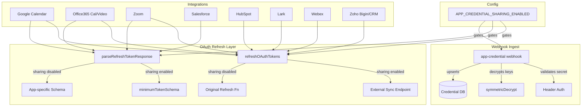

# Code Review: OAuth Credential Sync and App Integration Enhancements

**PR**: [cal.com#11059](https://github.com/calcom/cal.com/pull/11059)
**Instance**: cal_dot_com__calcom__cal.com__PR11059
**Preset**: behavioral-only (Groups 1-4 + Intent Path Tracer)

---

## Intent Register

### Intent Claims

1. Self-hosted Cal.com instances can receive OAuth credentials from a parent application via a webhook endpoint at `/api/webhook/app-credential`
2. The webhook validates a shared secret via a configurable HTTP header name before processing credential sync requests
3. Credential keys arrive AES256-encrypted and are decrypted server-side using `CALCOM_APP_CREDENTIAL_ENCRYPTION_KEY`
4. The webhook upserts credentials per userId + appSlug combination — updates existing or creates new
5. OAuth token refresh across all integrations can be delegated to an external sync endpoint when credential sharing is enabled
6. `refreshOAuthTokens` wraps each integration's refresh logic: when sharing is enabled and a sync endpoint is configured, it POSTs to the external endpoint; otherwise it calls the original refresh function
7. `parseRefreshTokenResponse` validates token responses: uses a relaxed `minimumTokenResponseSchema` (requiring access_token + numeric expiry) when sharing is enabled, or the app-specific schema otherwise
8. If a refreshed token response lacks a `refresh_token`, `parseRefreshTokenResponse` injects the literal placeholder string `"refresh_token"`
9. `APP_CREDENTIAL_SHARING_ENABLED` is truthy when both `CALCOM_WEBHOOK_SECRET` and `CALCOM_APP_CREDENTIAL_ENCRYPTION_KEY` environment variables are set
10. OAuth utility files are reorganized from `_utils/` to `_utils/oauth/` subdirectory with updated import paths across all integrations
11. Google Calendar, HubSpot, Lark, Office365 Calendar/Video, Salesforce, Webex, Zoho Bigin, Zoho CRM, and Zoom integrations are updated to use the centralized refresh and parse utilities
12. The Salesforce integration adds explicit token refresh logic with credential persistence

### Intent Diagram

---

## Verified Findings

### F-01 | minimumTokenResponseSchema computed keys are non-functional
- **Sighting**: DS-01 (merged from G1-S-01, G2-S-01, G3-S-01, G4-S-01, IPT-S-02)
- **Location**: `packages/app-store/_utils/oauth/parseRefreshTokenResponse.ts`, lines 5-9
- **Type**: behavioral | **Severity**: major
- **Current behavior**: `minimumTokenResponseSchema` uses computed property keys `[z.string().toString()]` which evaluate to the static string `"[object Object]"` at runtime. Both computed keys resolve to the same string (second overwrites first). The schema only enforces `access_token: z.string()`. The inline comment "Assume that any property with a number is the expiry" has no corresponding implementation — no numeric expiry field is validated.
- **Expected behavior**: The schema should explicitly declare required fields (e.g., `expires_in: z.number()`) or use `.passthrough()` to preserve unknown fields. The comment should match reality.
- **Source of truth**: Intent claim 7 — "uses a relaxed minimumTokenResponseSchema (requiring access_token + numeric expiry)"
- **Evidence**: `z.string()` produces a ZodString instance; `Object.prototype.toString()` returns `"[object Object]"`. Both computed keys collapse to the same literal key. Verified by all 5 detection agents.
- **Pattern label**: schema-key-evaluation-failure
- **Confidence**: 10.0

### F-02 | Placeholder refresh_token injection corrupts credentials
- **Sighting**: DS-02 (merged from G1-S-07, G2-S-02, G4-S-05)
- **Location**: `packages/app-store/_utils/oauth/parseRefreshTokenResponse.ts`, lines 22-25
- **Type**: behavioral | **Severity**: major
- **Current behavior**: When `refreshTokenResponse.data.refresh_token` is falsy, the literal string `"refresh_token"` is injected as its value. No sentinel marker distinguishes this from a real token. Integrations that store the parsed result (e.g., Zoom) persist this placeholder to the database. If credential sharing is later disabled, subsequent local refresh attempts send the literal string `"refresh_token"` to the OAuth provider.
- **Expected behavior**: Either preserve the existing refresh_token from the current credential or use a named sentinel constant that downstream code can detect and skip.
- **Source of truth**: Intent claim 8
- **Evidence**: The Salesforce caller separately preserves the original token, but Zoom and others do not. The placeholder is indistinguishable from a real token at call sites.
- **Pattern label**: placeholder-sentinel-gap
- **Confidence**: 10.0

### F-03 | Gate condition mismatch between refreshOAuthTokens and parseRefreshTokenResponse
- **Sighting**: DS-03 (from IPT-S-06)
- **Location**: `packages/app-store/_utils/oauth/parseRefreshTokenResponse.ts` and `refreshOAuthTokens.ts`
- **Type**: behavioral | **Severity**: major
- **Current behavior**: `refreshOAuthTokens` checks `APP_CREDENTIAL_SHARING_ENABLED && CALCOM_CREDENTIAL_SYNC_ENDPOINT && userId`. `parseRefreshTokenResponse` checks only `APP_CREDENTIAL_SHARING_ENABLED && CALCOM_CREDENTIAL_SYNC_ENDPOINT`. When `userId` is null (team credentials), the refresh uses the local function but `parseRefreshTokenResponse` still applies the relaxed `minimumTokenResponseSchema`, bypassing the app-specific schema validation.
- **Expected behavior**: Both functions should use the same gate condition to ensure schema selection matches the refresh path taken.
- **Source of truth**: Intent claims 6, 7
- **Evidence**: Team credentials have `userId: null` in the cal.com data model. The local refresh produces an integration-specific response that may not match the relaxed schema.
- **Pattern label**: gate-condition-mismatch
- **Confidence**: 9.0

### F-04 | refreshOAuthTokens dual-path return type causes runtime crashes
- **Sighting**: DS-04 (merged from G4-S-02, G2-S-09, IPT-S-01)
- **Location**: `packages/app-store/_utils/oauth/refreshOAuthTokens.ts`, lines 3-17
- **Type**: behavioral | **Severity**: critical
- **Current behavior**: When credential sharing is enabled, `refreshOAuthTokens` returns a raw Fetch API `Response` object. When disabled, it returns the integration-specific type (e.g., Google SDK response with `.data` property, axios response, HubSpot SDK object). The function's return type is implicitly `Promise<any>`, suppressing TypeScript type checking. All callers treat the result as their integration-specific type, causing crashes on the sharing path.
- **Expected behavior**: The function should return a consistent type across both paths, or callers must explicitly handle both return shapes.
- **Source of truth**: Intent claim 6
- **Evidence**: Google Calendar accesses `res?.data` which is `undefined` on `Response`, throwing `TypeError`. This is confirmed as a reachable crash when sharing is active.
- **Pattern label**: dual-path-type-divergence
- **Confidence**: 10.0

### F-05 | Google Calendar stores SafeParseReturnType wrapper in database
- **Sighting**: DS-06 (merged from G2-S-03, G3-S-02)
- **Location**: `packages/app-store/googlecalendar/lib/CalendarService.ts`, line 304 (diff)
- **Type**: behavioral | **Severity**: critical
- **Current behavior**: `const key = parseRefreshTokenResponse(googleCredentials, googleCredentialSchema)` assigns the full `SafeParseReturnType` wrapper `{ success: true, data: { access_token, ... } }` to `key`. This is stored via `prisma.credential.update({ data: { key } })`. The original code used `googleCredentialSchema.parse()` which returned the data directly. The database now receives the wrapper object, and all subsequent reads of `credential.key.access_token` return `undefined`.
- **Expected behavior**: Store `parseRefreshTokenResponse(...).data` to match the original `.parse()` behavior.
- **Source of truth**: Intent claim 7
- **Evidence**: `safeParse()` returns `{ success, data, error }`, not the data directly. The caller does not access `.data` before persisting.
- **Pattern label**: return-value-shape-mismatch
- **Confidence**: 10.0

### F-06 | Google Calendar crashes on sharing path due to Response.data access
- **Sighting**: DS-07 (merged from G2-S-09, IPT-S-01)
- **Location**: `packages/app-store/googlecalendar/lib/CalendarService.ts`, lines 300-301 (diff)
- **Type**: behavioral | **Severity**: critical
- **Current behavior**: When credential sharing is enabled, `refreshOAuthTokens` returns a Fetch API `Response`. The caller accesses `res?.data` — `Response` has no `.data` property — so `token` is `undefined`. `googleCredentials.access_token = token.access_token` throws `TypeError: Cannot read properties of undefined`.
- **Expected behavior**: When sharing is enabled, call `await res.json()` to extract the response body before accessing token fields.
- **Source of truth**: Intent claim 6
- **Evidence**: Fetch API `Response` exposes `.json()`, `.text()`, `.body`, not `.data`. The crash is reachable whenever `APP_CREDENTIAL_SHARING_ENABLED && CALCOM_CREDENTIAL_SYNC_ENDPOINT && credential.userId` are truthy.
- **Pattern label**: dual-path-type-divergence
- **Confidence**: 10.0

### F-07 | Zoho Bigin passes credentialId instead of userId to refreshOAuthTokens
- **Sighting**: DS-08 (merged from G1-S-02, G2-S-07, G3-S-03, G4-S-03, IPT-S-03)
- **Location**: `packages/app-store/zoho-bigin/lib/CalendarService.ts`, line 875 (diff)
- **Type**: behavioral | **Severity**: critical
- **Current behavior**: `refreshOAuthTokens(..., "zoho-bigin", credentialId)` passes the credential's database row ID as the `userId` parameter. When sharing is enabled, the sync endpoint receives `calcomUserId: credentialId.toString()`, causing it to look up the wrong user or return 404.
- **Expected behavior**: Pass `credential.userId` consistent with all other integrations (Google Calendar, HubSpot, Zoom, Webex, Zoho CRM, Lark, Office365).
- **Source of truth**: Intent claims 5, 6
- **Evidence**: Every other integration in this PR passes `credential.userId`. The `refreshOAuthTokens` parameter is named `userId` and sends it as `calcomUserId`. Verified by all 5 detection agents.
- **Pattern label**: argument-semantic-mismatch
- **Confidence**: 10.0

### F-08 | HubSpot casts raw Response to HubspotToken on sharing path
- **Sighting**: DS-09 (merged from G1-S-03, G2-S-08, G3-S-04, G4-S-09)
- **Location**: `packages/app-store/hubspot/lib/CalendarService.ts`, lines 362-374 (diff)
- **Type**: behavioral | **Severity**: critical
- **Current behavior**: `const hubspotRefreshToken: HubspotToken = await refreshOAuthTokens(...)` — when sharing is enabled, returns a raw `Response` object, not a `HubspotToken`. TypeScript accepts this because `refreshOAuthTokens` returns `Promise<any>`. Downstream field accesses (`.access_token`, `.refresh_token`, `.expires_in`) all return `undefined`, silently corrupting token state.
- **Expected behavior**: The caller must handle the `Response` type explicitly when sharing is enabled, or `refreshOAuthTokens` should normalize its return value.
- **Source of truth**: Intent claim 6
- **Evidence**: `refreshOAuthTokens` returns `fetch(...)` which is `Response`. `HubspotToken` expects named properties. Verified by 4 detection agents.
- **Pattern label**: dual-path-type-divergence
- **Confidence**: 10.0

### F-09 | Zoho integrations crash accessing .data on Response
- **Sighting**: DS-10 (from G3-S-05)
- **Location**: `packages/app-store/zohocrm/lib/CalendarService.ts`, line 948 (diff); `packages/app-store/zoho-bigin/lib/CalendarService.ts`, line 878 (diff)
- **Type**: behavioral | **Severity**: major
- **Current behavior**: After `refreshOAuthTokens`, both Zoho integrations access `tokenInfo.data.error`. When sharing is enabled, `tokenInfo` is a Fetch API `Response` (no `.data` property). `tokenInfo.data` is `undefined`, and `.error` access throws `TypeError`.
- **Expected behavior**: Either `refreshOAuthTokens` should return a normalized type, or callers should extract the response body via `.json()` when sharing is enabled.
- **Source of truth**: Intent claim 6
- **Evidence**: Axios responses have `.data`; Fetch API `Response` does not. Both Zoho integrations use the axios `.data` access pattern.
- **Pattern label**: dual-path-type-divergence
- **Confidence**: 9.0

### F-10 | Salesforce uses unreliable statusText comparison
- **Sighting**: DS-11 (from G1-S-04)
- **Location**: `packages/app-store/salesforce/lib/CalendarService.ts`, line 697 (diff)
- **Type**: behavioral | **Severity**: major
- **Current behavior**: `if (response.statusText !== "OK") throw new HttpError(...)` compares against HTTP status text, which is not guaranteed by spec. Under HTTP/2, `statusText` is always an empty string, causing every Salesforce token refresh over HTTP/2 to throw spuriously.
- **Expected behavior**: Use `response.ok` (boolean, true for 200-299) or `response.status === 200`.
- **Source of truth**: Intent claim 12
- **Evidence**: Fetch API spec states `statusText` is the reason phrase from HTTP/1.1; HTTP/2 does not send reason phrases, defaulting to `""`.
- **Pattern label**: string-based-status-check
- **Confidence**: 10.0

### F-11 | Office365 error logging removed, diagnostic context lost
- **Sighting**: DS-14 (merged from G1-S-10, G2-S-06, G4-S-08)
- **Location**: `packages/app-store/office365calendar/lib/CalendarService.ts` (diff lines 528-535 removed)
- **Type**: behavioral | **Severity**: major
- **Current behavior**: Original code logged `console.error("Outlook error grabbing new tokens ~ zodError:", tokenResponse.error, "MS response:", responseJson)` with full Zod error details and raw Microsoft response. The replacement throws only `new Error("Invalid refreshed tokens were returned")` — a generic message with no diagnostic context. Operators cannot diagnose Microsoft token endpoint failures.
- **Expected behavior**: Preserve error context by including the Zod error and raw response in the thrown exception or logging before the throw.
- **Source of truth**: Behavioral change from safeParse+log to throw-on-failure
- **Evidence**: The `console.error` block was removed entirely. The thrown error message is hardcoded with no variable interpolation.
- **Pattern label**: diagnostic-context-loss
- **Confidence**: 10.0

---

## Findings Summary

| Finding | Type | Severity | One-line description |
|---------|------|----------|---------------------|
| F-01 | behavioral | major | minimumTokenResponseSchema computed keys evaluate to `"[object Object]"`, expiry never validated |
| F-02 | behavioral | major | Literal `"refresh_token"` placeholder injected as credential, indistinguishable from real token |
| F-03 | behavioral | major | Gate condition mismatch: parseRefreshTokenResponse uses relaxed schema even when local refresh used |
| F-04 | behavioral | critical | refreshOAuthTokens returns Response vs integration type, causing crashes across integrations |
| F-05 | behavioral | critical | Google Calendar stores SafeParseReturnType wrapper `{success,data}` in DB instead of data |
| F-06 | behavioral | critical | Google Calendar crashes on sharing path: Response has no .data property |
| F-07 | behavioral | critical | Zoho Bigin passes credentialId instead of userId to sync endpoint |
| F-08 | behavioral | critical | HubSpot casts raw Response to HubspotToken, field accesses return undefined |
| F-09 | behavioral | major | Zoho CRM/Bigin crash accessing .data on Response object |
| F-10 | behavioral | major | Salesforce statusText comparison fails under HTTP/2 |
| F-11 | behavioral | major | Office365 error logging removed, diagnostic context lost |

**Totals**: 11 verified findings (4 critical, 7 major), 2 rejected, 5 filtered (out-of-charter), 1 nit

---

## Filtered Findings

| Finding | Type | Severity | Reason | Score |
|---------|------|----------|--------|-------|
| DS-12 (Salesforce dead success check) | structural | minor | out-of-charter | N/A |
| DS-13 (Office365 dead success guard) | structural | minor | out-of-charter | N/A |
| DS-15 (Empty string encryption key fallback) | structural | minor | out-of-charter | N/A |
| DS-16 (Bare string literal webhook header) | fragile | minor | out-of-charter | N/A |
| DS-17 (Non-boolean APP_CREDENTIAL_SHARING_ENABLED) | structural | minor | out-of-charter | N/A |

---

## Retrospective

### Sighting counts
- **Total sightings generated**: 37 (across 5 agents)
- **After deduplication**: 18 deduplicated sightings (29 merged away)
- **Verified findings**: 11
- **Rejections**: 2 (DS-05 userId=0 impossible in schema; DS-18 hardcoded slug is a nit)
- **Nits**: 1 (DS-18)
- **Filtered**: 5 (out-of-charter for behavioral-only preset)
- **Breakdown by detection source**: intent: 15, checklist: 18, structural-target: 4
- **Structural sub-categorization of filtered findings**: dead code (3), bare literals (1), type semantics (1)

### Verification rounds
- **Rounds**: 1 (converged after first round — no weakened-but-unrejected sightings requiring respawn)

### Scope assessment
- **Files in scope**: 40 files in diff (3 new, 37 modified)
- **Files with logic changes**: 15 (remaining 25 are import-path-only updates)
- **New code**: ~147 lines across 3 new files

### Context health
- Round count: 1
- Sightings-per-round: 37 (round 1)
- Rejection rate: 2/18 = 11.1%
- Hard cap reached: No

### Tool usage
- Linter output: N/A (diff-only review, no project tooling available)
- Grep/Glob: used by detection agents for cross-instance pattern search within provided code

### Finding quality
- False positive rate: 2/18 = 11.1% (DS-05 and DS-18)
- False negative signals: None identified (no user feedback in benchmark mode)
- Origin breakdown: All findings marked `introduced` (PR introduces the changes)

### Intent register
- Claims extracted: 12 (from diff content, env config, and inline documentation)
- Findings attributed to intent comparison: F-02, F-03, F-07 (detection source: intent)
- Intent claims invalidated: None

### Per-group metrics

| Agent | Files reported | Sightings | Survival rate | Notes |
|-------|---------------|-----------|---------------|-------|
| G1 (value-abstraction) | 10/15 | 10 | 7/10 (70%) | Strong on bare literals and type mismatches |
| G2 (dead-code) | 12/15 | 9 | 7/9 (78%) | Strongest on SafeParseReturnType and dead guards |
| G3 (signal-loss) | 10/15 | 8 | 6/8 (75%) | Unique gate-condition-mismatch not found by others |
| G4 (behavioral-drift) | 11/15 | 9 | 7/9 (78%) | Unique dual-path return type and comment-code drift |
| IPT (intent-path-tracer) | 5/5 entry pts | 6 | 5/6 (83%) | Highest precision; unique gate-condition-mismatch finding |

### Deduplication metrics
- Merge count: 29 sightings merged into 18 deduplicated sightings
- Key merge clusters: minimumTokenResponseSchema (5→1), Zoho Bigin credentialId (5→1), Salesforce dead check (5→1), HubSpot Response cast (4→1), Office365 error logging (3→1)

### Instruction trace
- Per-agent instruction files: ai-failure-modes.md, quality-detection.md, code-review-guide.md (loaded at orchestrator level, injected as intent claims and detection targets)
- Prompt composition: ~60% code payload, ~30% intent claims + detection targets, ~10% instructions

### Cross-cutting patterns
- **dual-path-type-divergence** (F-04, F-06, F-08, F-09): Root cause is `refreshOAuthTokens` returning `Response` vs integration-specific type. Affects Google Calendar, HubSpot, Zoho Bigin, Zoho CRM. 4 findings share this pattern.
- **dead-conditional-guards** (filtered DS-12, DS-13): Both Salesforce and Office365 retain `.success` checks that are unreachable after `parseRefreshTokenResponse` changed from safeParse to throw-on-failure. 2 findings share this pattern.

