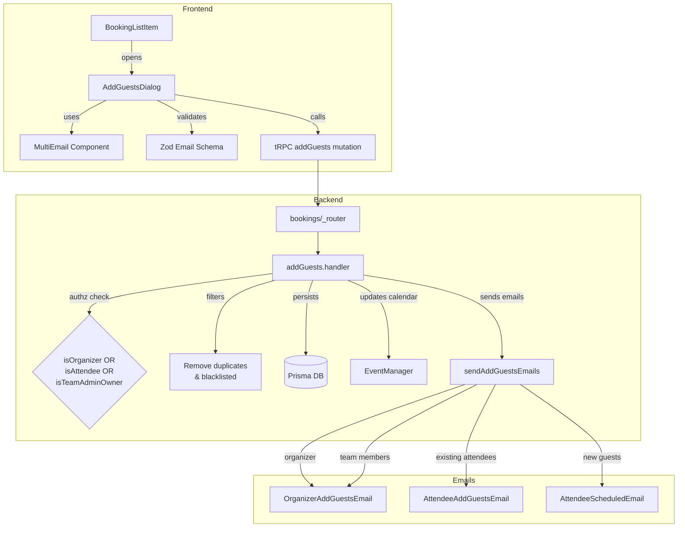

# Code Review: cal.com PR #14740 — Add guest management functionality to existing bookings

**Instance**: cal_dot_com__calcom__cal.com__PR14740
**PR**: https://github.com/calcom/cal.com/pull/14740
**Preset**: behavioral-only (Groups 1–4 + Intent Path Tracer)
**Source of truth**: AI failure mode checklist + structural detection targets (no spec)

---

## Intent Register

### Intent Claims

1. Users can add additional guests to existing bookings via a dialog accessible from the booking list actions menu.
2. Guest email input uses a multi-email component supporting add/remove of individual email fields.
3. Client-side validation rejects duplicate and invalid email addresses before submission (Zod schema).
4. Server-side tRPC mutation (`addGuests`) receives bookingId and guest email array.
5. Authorization enforces that only the organizer, a booking attendee, or a team admin/owner can add guests.
6. Server filters out guests already present as attendees and blacklisted emails before persisting.
7. New guest attendee records are created in the database via Prisma `createMany`.
8. Calendar events are updated with new attendees via `EventManager.updateCalendarAttendees`.
9. Email notifications are sent: organizer and team members receive "guests added" emails; existing attendees receive "guests added" notifications; new guests receive booking confirmation ("scheduled") emails.
10. ICS calendar attachments are generated and included in all notification emails.
11. The MultiEmail UI component is lazy-loaded to reduce bundle size (~40kb).
12. Locale strings support the new feature (guests_added, unable_to_add_guests, emails_must_be_unique_valid, add_emails, etc.).

### Intent Diagram

---

## Verified Findings

### F-01 — Authorization gate uses AND instead of OR (major)

| Field | Value |
|-------|-------|
| Sighting | A (G1-S-01, G2-S-01, G3-S-01, G4-S-01, IPT-S-01) |
| Location | `packages/trpc/server/routers/viewer/bookings/addGuests.handler.ts`, lines 470–472 |
| Type | behavioral |
| Severity | major |
| Origin | introduced |
| Confidence | 10.0 |

**Current behavior**: `isTeamAdminOrOwner` is computed as `(await isTeamAdmin(...)) && (await isTeamOwner(...))` using logical AND. A user must hold both admin AND owner roles simultaneously to pass the authorization check. A team admin who is not also an owner — or an owner who is not also an admin — is denied access.

**Expected behavior**: Either admin or owner role independently grants access (OR semantics), per the variable name `isTeamAdminOrOwner` and standard access-control convention.

**Evidence**: Lines 470–472 show `&&` operator. Line 478 uses `!isTeamAdminOrOwner` in the FORBIDDEN throw guard. All 5 detection agents independently reported this issue.

---

### F-02 — Email routing uses unfiltered guest list (major)

| Field | Value |
|-------|-------|
| Sighting | B (G1-S-03, G2-S-03, G3-S-03, G4-S-02, IPT-S-02) |
| Location | `addGuests.handler.ts:592`; `email-manager.ts:233–239` |
| Type | behavioral |
| Severity | major |
| Origin | introduced |
| Confidence | 10.0 |

**Current behavior**: `sendAddGuestsEmails(evt, guests)` passes the raw input `guests` array instead of the filtered `uniqueGuests`. Inside `sendAddGuestsEmails`, `newGuests.includes(attendee.email)` routes email type: match → `AttendeeScheduledEmail` (booking confirmation), no match → `AttendeeAddGuestsEmail` (guests-added notification). Pre-existing attendees whose email appeared in the raw input match `newGuests` and receive a duplicate booking confirmation instead of a guests-added notification.

**Expected behavior**: Existing attendees receive "guests added" notifications; only genuinely new guests receive booking confirmation. The `newGuests` argument should be `uniqueGuests`.

**Evidence**: Line 592 passes `guests` (raw input from line 448), not `uniqueGuests` (filtered on lines 498–502). `evt.attendees` includes all post-update attendees. All 5 detection agents independently reported this issue.

---

### F-03 — Blacklist filter bypassed by mixed-case emails (major)

| Field | Value |
|-------|-------|
| Sighting | K (IPT-S-03) |
| Location | `addGuests.handler.ts`, lines 494–502 |
| Type | behavioral |
| Severity | major (adjusted up from minor — defeats a security control) |
| Origin | introduced |
| Confidence | 9.0 |

**Current behavior**: `blacklistedGuestEmails` normalizes entries to lowercase via `.map((email) => email.toLowerCase())`, but the comparison `!blacklistedGuestEmails.includes(guest)` passes `guest` without normalization. A guest email submitted as `BLOCKED@EXAMPLE.COM` does not match the blacklisted entry `blocked@example.com`, bypassing the blacklist entirely.

**Expected behavior**: Case-insensitive matching for email comparison; `guest` should be lowercased before the includes check.

**Evidence**: Lines 494–496 lowercase the blocklist; line 501 compares without lowercasing `guest`. The Zod schema does not normalize email case. Challenger confirmed severity upgrade: this defeats the purpose of the blacklist.

---

### F-04 — Email send error silently discarded (minor)

| Field | Value |
|-------|-------|
| Sighting | D (G3-S-02, IPT-S-07) |
| Location | `addGuests.handler.ts`, lines 591–595 |
| Type | behavioral |
| Severity | minor |
| Origin | introduced |
| Confidence | 10.0 |

**Current behavior**: `catch (err)` logs `console.log("Error sending AddGuestsEmails")` without including the `err` object. The error's message, type, and stack trace are silently discarded. The handler returns `{ message: "Guests added" }` regardless, giving the client a false success response when email delivery fails.

**Expected behavior**: Error object should be included in the log (`console.error(err)`) for diagnosability.

**Evidence**: Lines 591–595 show the catch block with no reference to `err`. The return at line 597 executes unconditionally.

---

### F-05 — Dead guard with misleading error on empty input (minor)

| Field | Value |
|-------|-------|
| Sighting | E (G1-S-06, G4-S-05, IPT-S-04) |
| Location | `AddGuestsDialog.tsx`, lines 85, 101–104 |
| Type | behavioral |
| Severity | minor |
| Origin | introduced |
| Confidence | 10.0 |

**Current behavior**: `multiEmailValue` is initialized as `[""]` (length 1). The guard `if (multiEmailValue.length === 0) return` never fires because length is always >= 1. When the user clicks "Add" without entering an email, `ZAddGuestsInputSchema.safeParse([""])` fails (empty string fails `z.string().email()`), displaying `"emails_must_be_unique_valid"` — misleading for a missing-input case.

**Expected behavior**: Either initialize with `[]` so the guard functions, or add an explicit guard against blank strings with a distinct error message.

**Evidence**: Line 85: `useState<string[]>([""])`. Lines 101–103: length check against 0. Zod rejects `""` but shows uniqueness error.

---

### F-06 — Unreachable error toast fallback (minor)

| Field | Value |
|-------|-------|
| Sighting | J (G3-S-04) |
| Location | `AddGuestsDialog.tsx`, lines 96–97 |
| Type | behavioral |
| Severity | minor |
| Origin | introduced |
| Confidence | 9.0 |

**Current behavior**: `` const message = `${err.data?.code}: ${t(err.message)}` `` always produces a non-empty string — when `err.data?.code` is undefined, the result is `"undefined: ..."`. The `||` fallback `t("unable_to_add_guests")` is never reachable. Users on a code-less error path see `"undefined: <translated-message>"` instead of the intended fallback.

**Expected behavior**: The fallback should be reachable when `err.data?.code` is absent.

**Evidence**: Template literal always produces a truthy string. The `||` operator's right side is dead code. tRPC can return errors without `data.code` for network-level failures.

---

## Filtered Findings

| Finding | Type | Reason | Score |
|---------|------|--------|-------|
| Sighting C (zero-value sentinel `?? 0` / `\|\| 0`) | fragile | out-of-charter for behavioral-only preset | N/A |
| Sighting F (`add_members` semantic drift) | structural | out-of-charter for behavioral-only preset | N/A |
| Sighting H (bare string tooltip) | structural | out-of-charter for behavioral-only preset | N/A |
| Sighting M (unconditional dialog mount) | structural | out-of-charter for behavioral-only preset | N/A |

## Rejections

| Sighting | Reason |
|----------|--------|
| G (_router.tsx dead conditional guard) | Intentional TypeScript narrowing pattern used by every handler in the router; comment explicitly acknowledges it |
| I (Zod schema in component body) | Factually incorrect: the component schema includes a uniqueness refinement not present in the server schema; they are not equivalent |
| L (40kb comment in MultiEmailLazy) | Nit — comment inaccuracy with no behavioral impact |
| N (collapsed validation error message) | Nit — UX preference; validation correctly rejects invalid input; per-field browser feedback supplements the form-level error |

---

## Findings Summary

| ID | Type | Severity | Description |
|----|------|----------|-------------|
| F-01 | behavioral | major | Authorization gate uses `&&` (AND) instead of `||` (OR), blocking team admins/owners who don't hold both roles |
| F-02 | behavioral | major | `sendAddGuestsEmails` receives raw `guests` not `uniqueGuests`, misrouting emails for already-present attendees |
| F-03 | behavioral | major | Blacklist filter bypassed by mixed-case email input due to missing normalization |
| F-04 | behavioral | minor | Email send error silently discarded — `err` object not logged, client receives false success |
| F-05 | behavioral | minor | Dead length guard + misleading "unique and valid" error on empty input |
| F-06 | behavioral | minor | Template literal makes error toast fallback `t("unable_to_add_guests")` unreachable |

**Totals**: 6 verified findings (3 major, 3 minor), 4 rejections, 4 filtered (out-of-charter), 2 nits

---

## Retrospective

### Sighting Counts

- **Total raw sightings**: 25 (across 5 agents)
- **After deduplication**: 14
- **Verified findings**: 10 (pre-filter)
- **Post-charter-filter findings**: 6
- **Rejections**: 4
- **Nits**: 2 (L, N)

**By detection source**:
- `intent`: 18 raw sightings (most from the auth AND/OR and guests/uniqueGuests issues, each reported by all 5 agents)
- `checklist`: 7 raw sightings
- `structural-target`: 3 raw sightings

**By type (post-filter)**:
- behavioral: 6
- structural: 0 (filtered out-of-charter)
- fragile: 0 (filtered out-of-charter)

### Verification Rounds

- **Rounds**: 1 (converged — no weakened-but-unrejected sightings warranting a second round)
- **Hard cap reached**: No

### Scope Assessment

- **Files in diff**: 15 (5 modified, 10 new)
- **Key modules reviewed**: addGuests.handler.ts, email-manager.ts, AddGuestsDialog.tsx, MultiEmail.tsx, _router.tsx, email templates, schema
- **Linter output**: N/A (isolated diff review, no project tooling)

### Context Health

- **Round 1**: 25 raw sightings → 14 deduplicated → 10 verified → 6 post-filter
- **Rejection rate**: 4/14 = 28.6%
- **Convergence**: Round 1 (clean termination — high-signal findings, no ambiguous sightings remaining)

### Tool Usage

- Project-native linters: N/A (benchmark mode)
- Grep/Glob: Used by detection agents to read diff

### Finding Quality

- **False positive rate**: 0% (benchmark — no user dismissal data)
- **All findings origin**: introduced (new feature PR)

### Intent Register

- **Claims extracted**: 12 (from diff structure and code semantics)
- **Sources**: code structure, function names, locale strings, component hierarchy
- **Findings attributed to intent comparison**: F-01 (claim 5), F-02 (claim 9), F-03 (claim 6), F-05 (claim 3)
- **Intent claims invalidated**: None

### Per-Group Metrics

| Agent | Files Reported | Sightings | Survival Rate |
|-------|---------------|-----------|---------------|
| G1 (value-abstraction) | 4/15 | 6 | 3/6 (50%) — 3 merged into surviving sightings |
| G2 (dead-code) | 2/15 | 3 | 1/3 (33%) — 1 rejected (G), 2 merged |
| G3 (signal-loss) | 3/15 | 5 | 3/5 (60%) — D, J verified; others merged |
| G4 (behavioral-drift) | 4/15 | 5 | 1/5 (20%) — F verified but filtered; others merged |
| IPT (intent-path-tracer) | 5/15 | 7 | 2/7 (29%) — K verified; M weakened/filtered; N rejected as nit |

### Deduplication Metrics

- **Merge count**: 5 merges
- **Merged pairs**: A←(G1-S-01,G2-S-01,G3-S-01,G4-S-01,IPT-S-01), B←(G1-S-03,G2-S-03,G3-S-03,G4-S-02,IPT-S-02), C←(G1-S-02,G3-S-05), D←(G3-S-02,IPT-S-07), E←(G1-S-06,G4-S-05,IPT-S-04)
- **Pre-dedup**: 25 raw sightings
- **Post-dedup**: 14 unique sightings

### Instruction Trace

- Detection agents: T1 Groups 1–4 + Intent Path Tracer (behavioral-only preset)
- Challenger batches: 3 (T1 batch 1: A–E, T1 batch 2: F–L, IPT: K–N)
- Deduplicator: 1 pass
- Agent instruction files: agent definitions loaded at spawn; diff file read by each agent

