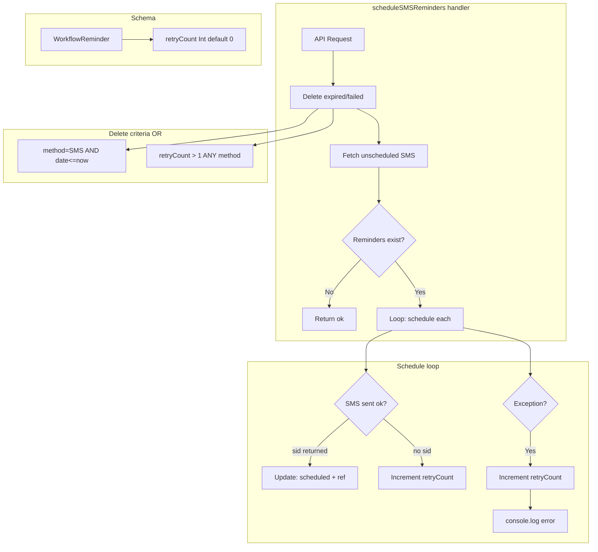

# Code Review: SMS Workflow Reminder Retry Count Tracking

**PR**: cal.com PR #14943
**Instance**: cal_dot_com__calcom__cal.com__PR14943
**Preset**: behavioral-only
**Date**: 2026-04-13

## Intent Register

### Intent Claims

1. The handler deletes expired SMS reminders (method=SMS AND scheduledDate <= now) before scheduling new ones
2. The handler now also deletes reminders with retryCount > 1 via an OR condition in the deletion query
3. The OR branch for retryCount > 1 applies to all WorkflowReminder rows regardless of method type
4. The handler fetches unscheduled SMS reminders due within 7 days, now including retryCount in the select
5. When SMS scheduling succeeds (Twilio returns a sid), the reminder is updated with scheduled status and reference ID
6. When SMS scheduling does not return a sid (else branch), the retryCount is incremented by 1
7. When an exception occurs during SMS scheduling (catch block), the retryCount is incremented by 1
8. The retryCount increment logic is duplicated identically in the else branch and the catch block
9. WorkflowReminder gains a retryCount integer column with default 0 via Prisma migration
10. The migration uses ALTER TABLE ADD COLUMN without idempotency guards (standard Prisma pattern)

### Intent Diagram

## Verified Findings

### F-01 — Missing method filter on deleteMany OR arm (critical)

| Field | Value |
|-------|-------|
| Sighting | M-01 (merged: G1-S-02, G2-S-01, G3-S-03, G4-S-01, IPT-S-01) |
| Location | `scheduleSMSReminders.ts`, deleteMany OR clause, second arm |
| Type | behavioral |
| Severity | critical |
| Current behavior | The second OR arm `{ retryCount: { gt: 1 } }` has no `method: WorkflowMethods.SMS` constraint. Prisma executes `WHERE (method='SMS' AND scheduledDate<=now) OR (retryCount > 1)`, deleting every `WorkflowReminder` row for any method type (EMAIL, WHATSAPP, etc.) with retryCount > 1. The `retryCount` column is global on the shared `WorkflowReminder` table. |
| Expected behavior | The second OR arm should include `method: WorkflowMethods.SMS` to restrict deletion scope to SMS reminders only, matching the first OR arm and the handler's stated purpose. |
| Source of truth | Intent register claim 3 |
| Evidence | First OR arm contains `method: WorkflowMethods.SMS`; second OR arm does not. Migration SQL adds `retryCount` to the shared `WorkflowReminder` table with no method partitioning. Every cron invocation runs this `deleteMany` unconditionally. |
| Pattern label | missing-method-filter |
| Confidence | 10.0 (pass) |

### F-02 — Unhandled DB update in catch block discards original error and aborts batch (major)

| Field | Value |
|-------|-------|
| Sighting | M-02 (merged: G3-S-01, G4-S-03, IPT-S-04) |
| Location | `scheduleSMSReminders.ts`, catch block |
| Type | behavioral |
| Severity | major |
| Current behavior | Inside the `catch (error)` block, `await prisma.workflowReminder.update(...)` executes before `console.log(...)`. If the Prisma update throws (DB connectivity failure, row deleted between fetch and update), the new exception propagates unhandled out of the catch block. The original scheduling `error` is permanently discarded without being logged, and the unhandled exception terminates the `for` loop — all remaining reminders in the batch go unprocessed. |
| Expected behavior | Log the original error before attempting the DB update, or wrap the DB update in a nested try/catch to ensure the original error is always recorded and the loop continues processing remaining reminders. |
| Source of truth | Intent register claims 7, 8; AI failure mode checklist (silent error discard) |
| Evidence | Diff shows `await prisma.workflowReminder.update(...)` placed before `console.log(...)` in the catch block. No inner try/catch wraps the update. A throwing update propagates out of the catch handler. |
| Pattern label | silent-error-discard |
| Confidence | 10.0 (pass) |

### F-03 — Else-branch DB error misattributed as SMS scheduling failure (minor)

| Field | Value |
|-------|-------|
| Sighting | G3-S-02 |
| Location | `scheduleSMSReminders.ts`, else branch (no-SID path) |
| Type | behavioral |
| Severity | minor |
| Current behavior | The else-branch `prisma.workflowReminder.update()` is inside the same `try` block as the Twilio SMS send call. If the DB update throws, the catch block logs `"Error scheduling SMS with error ${error}"` — a database failure is misreported as an SMS scheduling failure. The catch block then attempts a second DB update (F-02's blast radius), compounding the failure. |
| Expected behavior | The else-branch DB update should have independent error handling or be outside the SMS-send try block, so DB errors and SMS API errors produce distinct log messages. |
| Source of truth | Intent register claim 6; AI failure mode checklist (silent error discard — error cause conflation) |
| Evidence | The else-branch `await prisma.workflowReminder.update(...)` is syntactically inside the try block that wraps the Twilio dispatch. The catch block's log message text ("Error scheduling SMS") is factually false when the caught error is a DB exception from the else branch. |
| Pattern label | silent-error-discard |
| Confidence | 9.6 (pass) |

### F-04 — Non-atomic retryCount increment allows lost updates under concurrency (major)

| Field | Value |
|-------|-------|
| Sighting | IPT-S-03 |
| Location | `scheduleSMSReminders.ts`, else block and catch block |
| Type | behavioral |
| Severity | major |
| Current behavior | Both the else branch and catch block compute `retryCount: reminder.retryCount + 1` using the value fetched at query time. This is a client-side read-modify-write, not an atomic database operation. Under concurrent handler invocations (serverless cron overlap), two instances can read `retryCount=0`, both write `retryCount=1`, and one failure event is silently lost. The retry budget (`gt: 1` deletion threshold) becomes unreliable. |
| Expected behavior | Use Prisma's atomic increment: `data: { retryCount: { increment: 1 } }` in both the else branch and catch block. |
| Source of truth | Intent register claims 6, 7, 8 |
| Evidence | Select (Change 2) fetches `retryCount: true` as a query-time value. Both update calls use `reminder.retryCount + 1` — a stale in-memory value, not a database-side expression. Prisma supports `{ increment: 1 }` for atomic updates. The handler is cron-triggered (serverless); overlapping invocations are a documented failure mode. |
| Pattern label | lost-update |
| Confidence | 8.4 (pass) |

## Findings Summary

| Finding | Type | Severity | One-line description |
|---------|------|----------|---------------------|
| F-01 | behavioral | critical | Missing method filter on deleteMany OR arm deletes non-SMS reminders |
| F-02 | behavioral | major | Unhandled DB update in catch block discards original error and aborts batch |
| F-03 | behavioral | minor | Else-branch DB error misattributed as SMS scheduling failure |
| F-04 | behavioral | major | Non-atomic retryCount increment allows lost updates under concurrency |

**Totals**: 4 verified findings (1 critical, 2 major, 1 minor) | 2 rejections (nits) | 2 filtered

## Filtered Findings

| Sighting | Reason | Score | Details |
|----------|--------|-------|---------|
| G2-S-02 (duplicated increment logic) | Out-of-charter | N/A | Type `structural` not in `behavioral-only` preset charter |
| IPT-S-02 (off-by-one threshold naming) | Below threshold | 6.4 | Confidence below 8.0; weakened by Challenger (ambiguous intent) |

## Retrospective

### Sighting Counts

- **Total raw sightings**: 14
- **After deduplication**: 8 (2 merge groups)
- **Verified findings at termination**: 6 (before filtering)
- **Findings after filtering**: 4
- **Rejections**: 0 (all sightings either verified or rejected as nit)
- **Nit count**: 2 (G1-S-01 bare literal threshold, G4-S-02 comment-code drift)
- **By detection source**: intent: 8, checklist: 6
- **Structural sub-categorization**: N/A (no structural findings survived charter filter)

### Verification Rounds

- **Rounds**: 1
- **Convergence reason**: No weakened-but-unrejected sightings remaining after round 1. Small diff (90 lines, 3 files) thoroughly covered by 5 agents producing 14 sightings.

### Scope Assessment

- **Files in scope**: 3 (1 TypeScript handler, 1 SQL migration, 1 Prisma schema)
- **Lines changed**: ~50 additions, ~5 deletions
- **Context**: Diff-only review — no full codebase access

### Context Health

- **Round count**: 1
- **Sightings-per-round trend**: 14 (round 1 only)
- **Rejection rate**: 0% (round 1) — all sightings either verified or classified as nit
- **Hard cap reached**: No

### Tool Usage

- **Linter output**: N/A (benchmark mode — linter discovery skipped)
- **Project tools**: N/A (diff-only review)

### Finding Quality

- **False positive rate**: TBD (pending user review)
- **Origin breakdown**: All findings tagged `introduced` (all changes are new in this PR)

### Intent Register

- **Claims extracted**: 10 (from diff analysis — no external documentation)
- **Findings attributed to intent comparison**: 3 (F-01 from intent, F-03 from intent+checklist, F-04 from intent)
- **Intent claims invalidated**: None

### Per-Group Metrics

| Agent | Files reported | Sighting volume | Survival rate | Phase attribution |
|-------|---------------|-----------------|---------------|-------------------|
| G1 (value-abstraction) | 3/3 | 2 | 50% (1 verified via merge, 1 nit) | 2 enumeration |
| G2 (dead-code) | 3/3 | 2 | 50% (1 verified via merge, 1 filtered) | 2 enumeration |
| G3 (signal-loss) | 3/3 | 3 | 100% (all verified or merged) | 3 enumeration |
| G4 (behavioral-drift) | 3/3 | 3 | 33% (1 verified via merge, 1 nit, 1 merged) | 3 enumeration |
| IPT (intent-path-tracer) | 1/1 | 4 | 50% (2 verified, 1 filtered, 1 merged) | 4 enumeration |

### Deduplication Metrics

- **Merge count**: 2
- **Merged pairs**:
  - M-01: G1-S-02 + G2-S-01 + G3-S-03 + G4-S-01 + IPT-S-01 (5 → 1, agent_count=5)
  - M-02: G3-S-01 + G4-S-03 + IPT-S-04 (3 → 1, agent_count=3)

### Instruction Trace

- **Agents spawned**: 5 detectors + 1 deduplicator + 2 challengers = 8 total
- **Detection preset**: behavioral-only (Groups 1-4 + IPT)
- **Payload**: Identical diff content injected into all Tier 1 agents for cache optimization
