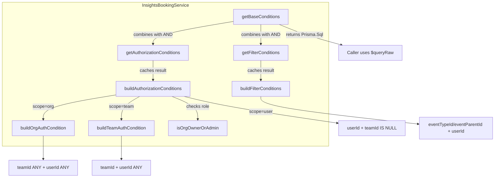

# Code Review: PR22345 — Convert InsightsBookingService to Prisma.sql raw queries

## Intent Register

### Intent Claims

1. `InsightsBookingService` converts from Prisma query builder objects (`BookingTimeStatusDenormalizedWhereInput`) to raw SQL via `Prisma.sql` tagged template literals
2. `getAuthorizationConditions()` returns `Prisma.Sql` instead of `Prisma.BookingTimeStatusDenormalizedWhereInput`
3. `getFilterConditions()` returns `Prisma.Sql | null` instead of the Prisma where-input type
4. `findMany()` is replaced by `getBaseConditions()` which returns composed SQL conditions for callers to use in their own `$queryRaw` calls
5. `NOTHING` sentinel (`{ id: -1 }`) is replaced by `NOTHING_CONDITION` (`Prisma.sql\`1=0\``)
6. Authorization flow: non-owner/admin users get `NOTHING_CONDITION`; owner/admin users get scope-specific SQL conditions
7. Org scope builds OR conditions across team bookings (by teamId) and user bookings (by userId, non-team)
8. Team scope builds OR conditions for the specific team and its member users
9. User scope returns conditions filtering by userId with `teamId IS NULL`
10. Filter conditions combine `eventTypeId`/`eventParentId` and `memberUserId` with AND logic
11. Caching is retained in production code for both auth and filter conditions via `cachedAuthConditions` and `cachedFilterConditions`
12. `InsightsBookingServicePublicOptions` type replaces `InsightsBookingServiceOptions` at the constructor boundary — a looser type than the zod discriminated union
13. Integration tests verify the raw SQL output structure matches expected `Prisma.sql` template objects

### Intent Diagram

---

## Verified Findings

### F-01

| Field | Value |
|-------|-------|
| Sighting | S-02 (merged from G1-S-02, G2-S-02) |
| Location | `packages/lib/server/service/insightsBooking.ts`, `buildOrgAuthorizationCondition()` |
| Type | behavioral |
| Severity | major |
| Origin | introduced |
| Detection source | intent |
| Pattern label | behavioral-gap-conditional-guard |

**Current behavior**: When an org has no child teams (`teamsFromOrg.length === 0`), `userIdsFromOrg` is hardcoded to `[]` instead of querying org-level membership. The personal-bookings condition (`isTeamBooking = false`) is never added. Personal bookings by org members are silently absent from results.

**Expected behavior**: Org-level members should be queried regardless of whether child teams exist, so personal bookings are included in org-scope insights.

**Evidence**: `const userIdsFromOrg = teamsFromOrg.length > 0 ? await MembershipRepository.findAllByTeamIds(...) : []` — the ternary skips the membership lookup entirely when there are no child teams, leaving `userIdsFromOrg = []` and bypassing the personal-bookings filter clause. `teamIds` includes `options.orgId`, so the membership query could still return org-level members even with no child teams.

**Source of truth**: Intent claim 7 — "Org scope builds OR conditions across team bookings (by teamId) and user bookings (by userId, non-team)"

---

### F-02

| Field | Value |
|-------|-------|
| Sighting | S-03 (merged from G1-S-03, G4-S-05, IPT-S-06) |
| Location | `packages/lib/server/service/insightsBooking.ts`, `InsightsBookingServicePublicOptions` type and constructor |
| Type | behavioral |
| Severity | major |
| Origin | introduced |
| Detection source | structural-target |
| Pattern label | type-runtime-contract-mismatch |

**Current behavior**: `InsightsBookingServicePublicOptions` declares `teamId?: number` (optional for all scopes). When a caller passes `scope: "team"` without `teamId`, the zod discriminated union's `team` variant fails validation, `safeParse` returns `success: false`, `this.options` is set to `null`, and all queries return `NOTHING_CONDITION` (empty results) with no error surfaced to the caller.

**Expected behavior**: The TypeScript public type should use a discriminated union matching the zod schema, making `teamId` required when `scope === "team"`. Missing `teamId` should be a compile-time error at call sites, not a silent runtime empty-result.

**Evidence**: The public type uses a flat structure with `teamId?: number`, while the zod schema requires `teamId` for the `team` variant. The constructor stores `parsed.success ? parsed.data : null`, producing silent `null` on validation failure. `buildAuthorizationConditions` returns `NOTHING_CONDITION` on `!this.options` with no diagnostic.

**Source of truth**: Intent claim 12 — "InsightsBookingServicePublicOptions replaces InsightsBookingServiceOptions at the constructor boundary — a looser type than the zod discriminated union"

---

## Findings Summary

| Finding | Type | Severity | Description |
|---------|------|----------|-------------|
| F-01 | behavioral | major | Org members' personal bookings excluded when org has no child teams |
| F-02 | behavioral | major | Type widening at constructor boundary silently produces empty results for invalid team-scope options |

- Verified findings: 2
- Total verified (pre-filter): 7
- Rejections: 2
- False positive rate: 2/9 deduplicated sightings rejected (22.2%)

---

## Filtered

Findings that passed Challenger verification but were excluded by charter or confidence gates.

| Finding | Sighting | Type | Severity | Reason | Score |
|---------|----------|------|----------|--------|-------|
| (F-01-filtered) | S-01 | structural | minor | out-of-charter (structural in behavioral-only) | 10.0 |
| (F-04-filtered) | S-04 | test-integrity | major | out-of-charter (test-integrity in behavioral-only) | 10.0 |
| (F-05-filtered) | S-05 | fragile | minor | out-of-charter (fragile in behavioral-only) | 8.0 |
| (F-06-filtered) | S-06 | behavioral | minor | below confidence threshold (7.0 < 8.0) | 7.0 |
| (F-07-filtered) | S-07 | fragile | major | out-of-charter (fragile in behavioral-only) | 9.6 |

Notable filtered findings:
- **S-04** (test-integrity, major): Entire "Caching" test block removed while production caching logic is retained. 4 of 5 agents flagged this independently.
- **S-07** (fragile, major): `Prisma.sql` `ANY(${array})` interpolation — plain JS arrays may not serialize correctly as PostgreSQL array parameters, risking runtime query errors.
- **S-01** (structural, minor): Two unreachable branches in `getBaseConditions()` — `authConditions` is always truthy (`Prisma.Sql` object), making `else if (filterConditions)` and `else` dead code. All 5 agents flagged this.

---

## Retrospective

### Sighting Counts

| Metric | Value |
|--------|-------|
| Total raw sightings | 21 |
| After deduplication | 9 |
| Verified findings (pre-filter) | 7 |
| Verified findings (post-filter) | 2 |
| Rejections | 2 |
| Nits | 0 |
| Filtered (out-of-charter) | 4 |
| Filtered (below threshold) | 1 |

**By detection source**: intent: 5, structural-target: 2, checklist: 2

**Structural sub-categorization** (pre-filter): dead code (1 — dead conditional guards in `getBaseConditions`)

### Verification Rounds

- **Rounds**: 1
- **Convergence**: Round 1 terminated — no weakened-but-unrejected sightings. The diff scope (2 files, ~150 lines of change) was fully covered by 5 agents in a single pass.

### Scope Assessment

- **Files reviewed**: 2 (1 production, 1 test)
- **Lines changed**: ~250 (diff lines)
- **Detection agents**: 5 (Groups 1-4 + Intent Path Tracer)

### Context Health

- Round count: 1
- Sightings in round 1: 21 raw → 9 deduplicated → 7 verified → 2 post-filter
- Rejection rate: 22.2% (2 of 9 deduplicated sightings)
- Hard cap (5 rounds) not reached
- High inter-agent agreement: S-01 flagged by 5/5 agents, S-04 flagged by 4/5

### Tool Usage

- Linter output: N/A (isolated diff review, no project tooling)
- Test runner: N/A
- File navigation: N/A (diff-only context)

### Finding Quality

- False positive rate: 22.2% (2 rejected of 9 deduplicated)
- S-08 rejected: observation conceded functional equivalence
- S-09 rejected: misreading of control flow (admin check is unconditional, precedes all scope branches)
- Origin breakdown: 6 introduced, 2 pre-existing, 1 unknown

### Intent Register

- Claims extracted: 13 (from diff context)
- Findings attributed to intent comparison: 5 of 9 deduplicated sightings (detection source: intent)
- Intent claims invalidated: Claim 6 partially inaccurate (describes admin guard as universal, but implementation shows it applies unconditionally before scope branches — the intent claim wording was ambiguous, not the code)

### Per-Group Metrics

| Agent | Files | Sightings | Survival Rate | Phase |
|-------|-------|-----------|---------------|-------|
| G1 (value-abstraction) | 2/2 | 5 | 5/5 (100%) | Phase 1 |
| G2 (dead-code) | 2/2 | 2 | 2/2 (100%) | Phase 1 |
| G3 (signal-loss) | 2/2 | 5 | 4/5 (80%) | Phase 1 |
| G4 (behavioral-drift) | 2/2 | 5 | 4/5 (80%) | Phase 1 |
| IPT (intent-path-tracer) | 2/2 | 6 | 4/6 (67%) | Phase 1 |

### Deduplication Metrics

- Raw sightings: 21
- Deduplicated sightings: 9
- Merge count: 6 clusters (12 sightings merged into existing clusters)
- Merge pairs: S-01 (6→1), S-02 (2→1), S-03 (3→1), S-04 (4→1), S-07 (2→1), S-08 (3→1)

### Instruction Trace

- Agents spawned: 5 detectors + 1 deduplicator + 2 challengers = 8 total
- Preset: behavioral-only (Groups 1-4 + IPT)
- Charter filter excluded 4 findings (structural, test-integrity, fragile types)
- Confidence filter excluded 1 finding (pre-existing zero-value sentinel, score 7.0)
