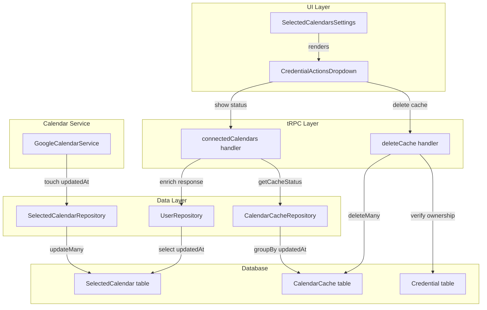

# Code Review: feat: add calendar cache status and actions (#22532)

**PR**: https://github.com/calcom/cal.com/pull/22532
**Review date**: 2026-04-13
**Preset**: behavioral-only (default)
**Source of truth**: AI failure mode checklist + structural detection targets (no spec available)

---

## Intent Register

### Intent Claims

1. Users can view the cache status (last updated timestamp) for Google Calendar credentials via a dropdown menu in calendar settings.
2. Users can delete cached calendar data through a confirmation dialog, which calls the `deleteCache` tRPC mutation.
3. The `deleteCache` handler verifies credential ownership (userId match) before deleting cache entries.
4. Cache status is derived by grouping `CalendarCache` entries by `credentialId` and selecting the max `updatedAt` value.
5. The `connectedCalendars` handler enriches its response with cache status for each credential.
6. `CredentialActionsDropdown` replaces the old `DisconnectIntegration` component, consolidating disconnect and cache management actions into a single dropdown.
7. The dropdown conditionally renders: cache actions appear only for Google Calendar with existing cache; disconnect appears only when not a delegation credential and connection modification is allowed.
8. The `CalendarCache` table gains an `updatedAt` column with `@default(now()) @updatedAt` in Prisma schema, auto-updated on writes.
9. The migration adds the `updatedAt` column with `DEFAULT NOW()` to handle existing rows.
10. After refreshing the availability cache, `GoogleCalendarService` touches `SelectedCalendar.updatedAt` for all calendars under the credential via `updateManyByCredentialId`.
11. `SelectedCalendarRepository.updateManyByCredentialId` updates all selected calendars matching a `credentialId`.
12. The `UserRepository` and `getConnectedDestinationCalendars` types now include `updatedAt` and `googleChannelId` fields for selected calendars.
13. A new `test-gcal-webhooks.sh` script manages Tunnelmole tunnel lifecycle for Google Calendar webhook testing.
14. The `dev:cron` script is changed from `ts-node` to `npx tsx`.

### Intent Diagram

---

## Verified Findings

### F-01 — Hardcoded locale in date formatting

| Field | Value |
|-------|-------|
| Sighting | M-06 |
| Location | `packages/features/apps/components/CredentialActionsDropdown.tsx`, line 139 |
| Type | behavioral |
| Severity | major |
| Confidence | 9.0 |
| Current behavior | `new Intl.DateTimeFormat("en-US", { dateStyle: "short", timeStyle: "short" })` hardcodes the `"en-US"` locale. The component imports and calls `useLocale()` (line 87) to obtain the active locale for translations, but never forwards the locale to `Intl.DateTimeFormat`. All users see US-formatted dates regardless of their locale setting. |
| Expected behavior | The user's active locale (available from `useLocale()`) should be passed as the first argument to `Intl.DateTimeFormat`, consistent with how `t()` is used for translated strings in the same component. |
| Source of truth | AI failure mode checklist — bare literals; component's own locale-aware pattern via `useLocale()` |
| Evidence | The component destructures `{ t }` from `useLocale()` at line 87, establishing locale awareness. Line 139 constructs `Intl.DateTimeFormat` with hardcoded `"en-US"` instead of the runtime locale. Both `ConnectedCalendarList` render sites in `SelectedCalendarsSettingsWebWrapper.tsx` pass `cacheUpdatedAt` to this component, making this a production render path for all Google Calendar users with cache data. |
| Pattern label | bare-literal / hardcoded-coupling |

### F-02 — Stale UI after cache deletion (missing query invalidation)

| Field | Value |
|-------|-------|
| Sighting | M-12 |
| Location | `packages/features/apps/components/CredentialActionsDropdown.tsx`, lines 92–100 |
| Type | behavioral |
| Severity | major |
| Confidence | 9.0 |
| Current behavior | `deleteCacheMutation.onSuccess` calls `showToast` and `onSuccess?.()` but performs no tRPC query invalidation. After cache deletion, the cached `connectedCalendars` query data retains the stale `cacheUpdatedAt` value, so the UI continues to display the old cache timestamp. The wrapper also uses `refetchOnWindowFocus: false`, suppressing automatic refetch. |
| Expected behavior | `deleteCacheMutation` should invalidate `viewer.calendars.connectedCalendars` in `onSettled`, mirroring the pattern used by `disconnectMutation` (lines 111–114) which explicitly calls `utils.viewer.calendars.connectedCalendars.invalidate()`. |
| Source of truth | Structural detection target — dual-path verification; same-component consistency with `disconnectMutation` |
| Evidence | `deleteCacheMutation` (lines 92–100) has no `utils` invalidation call. `disconnectMutation` (lines 103–115) includes `utils.viewer.calendars.connectedCalendars.invalidate()` in `onSettled`. Both mutations operate on the same credential lifecycle within the same component. After delete-cache succeeds, the dropdown would still show the old "Last updated" timestamp until full page navigation. |
| Pattern label | dual-path-verification |

### F-03 — Shell script uses macOS-only sed syntax

| Field | Value |
|-------|-------|
| Sighting | M-03 |
| Location | `scripts/test-gcal-webhooks.sh`, line 601 (line 68 of new file) |
| Type | behavioral |
| Severity | major |
| Confidence | 10.0 |
| Current behavior | `sed -i '' -E "s|^GOOGLE_WEBHOOK_URL=.*|GOOGLE_WEBHOOK_URL=$TUNNEL_URL|" "$ENV_FILE"` uses BSD sed syntax. On Linux with GNU sed, the space between `-i` and `''` causes `''` to be interpreted as a positional argument, not as the in-place backup suffix. The `GOOGLE_WEBHOOK_URL` substitution fails on Linux. |
| Expected behavior | GNU sed requires `-i` without a trailing empty string argument (`sed -i -E`), or the script should detect the platform and select the appropriate form. |
| Source of truth | GNU sed documentation — `-i[SUFFIX]` requires the suffix to be directly attached; BSD sed requires `-i ''` with a space. These are mutually incompatible forms. |
| Evidence | Line 601 shows `sed -i '' -E` with a `#!/bin/bash` shebang. No OS guard or compatibility shim is present. The script's purpose (updating GOOGLE_WEBHOOK_URL in `.env`) silently fails on Linux developer machines. |
| Pattern label | platform-incompatibility |

---

## Findings Summary

| Finding | Type | Severity | Description |
|---------|------|----------|-------------|
| F-01 | behavioral | major | Hardcoded "en-US" locale in `Intl.DateTimeFormat` ignores user's locale setting |
| F-02 | behavioral | major | `deleteCacheMutation` missing `connectedCalendars` query invalidation causes stale UI |
| F-03 | behavioral | major | BSD `sed -i ''` syntax in shell script fails on Linux |

**Totals**: 3 verified findings, 4 rejections, 7 filtered (out-of-charter). False positive rate: 4/14 deduplicated sightings rejected (28.6%).

---

## Filtered Findings

Findings that passed Challenger verification but were excluded by charter or confidence gates.

| Sighting | Type | Severity | Reason | Description |
|----------|------|----------|--------|-------------|
| M-07 | structural | major | out-of-charter | `new CalendarCacheRepository()` bypasses DI in connectedCalendars handler |
| M-04 | structural | minor | out-of-charter | `deleteCache` handler calls `prisma` directly, bypassing `CalendarCacheRepository` |
| M-13 | structural | minor | out-of-charter | `throw new Error()` instead of `TRPCError` in deleteCache handler |
| M-09 | structural | minor | out-of-charter | `updatedAt` and `googleChannelId` selected but never consumed |
| M-10 | structural | minor | out-of-charter | Unconditional wrapper div emitted when `CredentialActionsDropdown` returns null |
| M-08 | structural | minor | out-of-charter | Bare numeric literals (retry count, sleep interval) in shell script |
| M-05 | structural | info | out-of-charter | Migration comment contradicts actual SQL (`DEFAULT NOW()` present) |

---

## Retrospective

### Sighting Counts

| Metric | Count |
|--------|-------|
| Raw sightings (pre-dedup) | 21 |
| Deduplicated sightings | 14 |
| Verified findings | 10 |
| Rejections | 4 |
| Nit count | 3 (M-02, M-11, M-14) |
| Charter-filtered | 7 (all structural, out-of-charter for behavioral-only) |
| Confidence-filtered | 0 |
| Final findings | 3 |

**By detection source:**
| Source | Sightings | Findings |
|--------|-----------|----------|
| structural-target | 11 | 7 (all filtered out-of-charter) |
| checklist | 3 | 1 |
| intent | 7 | 2 |

**Structural finding sub-categorization (filtered):**
- Hardcoded coupling / abstraction bypass: 2 (M-07, M-04)
- Dead infrastructure / dead fields: 2 (M-09, M-10)
- Bare literals: 1 (M-08)
- Comment-code drift: 1 (M-05)
- Error type mismatch: 1 (M-13)

### Verification Rounds

1 round to convergence. All 3 surviving findings were high-confidence first-round detections corroborated by multiple agents or confirmed with strong evidence. No weakened-but-unrejected sightings remained after Round 1.

### Scope Assessment

- **Files in diff**: 15 files modified/added
- **New files**: 4 (`CredentialActionsDropdown.tsx`, `deleteCache.handler.ts`, migration SQL, `test-gcal-webhooks.sh`)
- **Modified files**: 11
- **Languages**: TypeScript (13), SQL (1), Bash (1)

### Context Health

| Metric | Value |
|--------|-------|
| Detection rounds | 1 |
| Sightings Round 1 | 21 raw → 14 deduplicated |
| Rejection rate Round 1 | 4/14 (28.6%) |
| Hard cap reached | No |

### Tool Usage

- **Linter output**: N/A (isolated diff review, no project tooling available)
- **Project-native tools**: None available
- **Agent tools used**: Read, Grep, Glob (diff-only fallback)

### Finding Quality

- **False positive rate**: 4/14 (28.6%) — M-01 rejected on factual error about Prisma behavior, M-02/M-11/M-14 rejected as nits
- **False negative signals**: None identified (no user feedback in benchmark mode)
- **Origin breakdown**: All findings marked `introduced` (PR-scoped review)
- **Notable rejection**: M-01 (empty data no-op) was corroborated by 3 agents but rejected by Challenger — all 3 agents incorrectly claimed Prisma `@updatedAt` requires non-empty data. This is a systematic knowledge gap about Prisma's `updateMany` behavior.

### Intent Register

- **Claims extracted**: 14 (from diff analysis — commit message, code comments, type changes, new files)
- **Sources**: diff structure, code comments, function signatures, Prisma schema
- **Findings attributed to intent comparison**: 2 (F-02 via dual-path target, F-03 via claim 13)
- **Intent claims invalidated**: None

### Per-Group Metrics

| Agent | Files Reported | Sightings | Survival Rate | Phase |
|-------|---------------|-----------|---------------|-------|
| T1 Group 1 (value-abstraction) | 15/15 | 5 | 1/5 (20%) | Phase 1: 5, Phase 2: 0 |
| T1 Group 2 (dead-code) | 15/15 | 3 | 0/3 (0%) — all filtered | Phase 1: 3, Phase 2: 0 |
| T1 Group 3 (signal-loss) | 15/15 | 3 | 1/3 (33%) | Phase 1: 3, Phase 2: 0 |
| T1 Group 4 (behavioral-drift) | 15/15 | 4 | 1/4 (25%) | Phase 1: 4, Phase 2: 0 |
| Intent Path Tracer | 6/6 entry points | 6 | 1/6 (17%) | Phase 1: 6, Phase 2: 0 |

### Deduplication Metrics

- **Merge count**: 5 merges reducing 21 → 14 sightings
- **Merged pairs**:
  - M-01: G2-S-01 + G4-S-02 + IPT-S-01 (3-way merge)
  - M-02: G1-S-04 + G3-S-01
  - M-03: G3-S-02 + G4-S-04 + IPT-S-04 (3-way merge)
  - M-04: G1-S-03 + IPT-S-03
  - M-05: G4-S-01 + IPT-S-05

### Instruction Trace

- **Agents spawned**: 5 detectors + 1 deduplicator + 3 challengers = 9 total
- **Detection preset**: behavioral-only (Groups 1-4 + Intent Path Tracer)
- **Payload composition**: Diff file contents (~613 lines) + intent register (14 claims + Mermaid diagram)
- **Linter context**: N/A

### Observations

1. **High structural-to-behavioral ratio**: 10 of 14 deduplicated sightings were structural type, but only behavioral findings survive the charter filter in behavioral-only preset. The PR's main issues are behavioral (locale, cache invalidation, platform compat) rather than structural.

2. **M-01 systematic false positive**: All 3 agents that detected the "empty data no-op" issue shared the same incorrect assumption about Prisma's `@updatedAt` behavior with `updateMany`. This represents a systematic LLM knowledge gap about Prisma ORM internals. The Challenger correctly identified the factual error.

3. **Shell script findings**: 2 of 3 final findings (F-01 locale, F-03 sed) are arguably lower-priority since one is a utility script and the other is a formatting concern. F-02 (missing cache invalidation) is the highest-impact finding affecting production UX.
