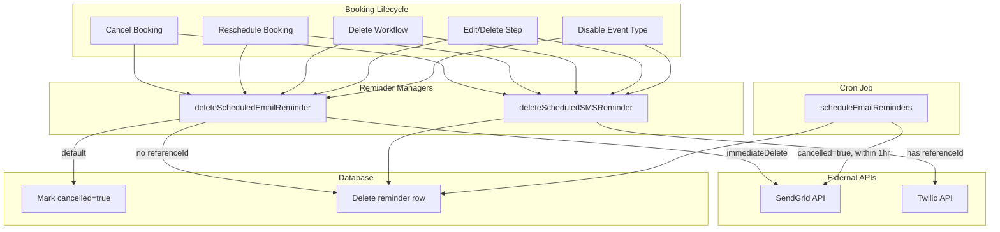

# Code Review: cal_dot_com__calcom__cal.com__PR7232

**PR**: Comprehensive workflow reminder management for booking lifecycle events
**URL**: https://github.com/calcom/cal.com/pull/7232
**Preset**: behavioral-only (Groups 1-4 + Intent Path Tracer)
**Linter output**: N/A (benchmark mode, no project tooling)

## Intent Register

### Intent Claims

1. Booking cancellation soft-deletes workflow reminders by marking `cancelled: true` in DB, deferring actual SendGrid/Twilio cancellation to a scheduled cron job.
2. A cron job in `scheduleEmailReminders.ts` processes email reminders where `cancelled: true` AND `scheduledDate <= now + 1 hour`, cancels them via SendGrid, then deletes the DB record.
3. `deleteScheduledEmailReminder` has three code paths: (a) null referenceId -> immediate DB delete, (b) `immediateDelete` flag -> immediate SendGrid cancel only, (c) default -> mark `cancelled: true` in DB.
4. `deleteScheduledSMSReminder` cancels via Twilio if referenceId exists, then always deletes the DB record immediately.
5. The `reminder.scheduled && reminder.referenceId` pre-check is removed from all callsites; cancellation now branches only on `reminder.method`.
6. Rescheduled bookings cancel previous booking's workflow reminders — email uses `immediateDelete: true`, SMS uses standard path.
7. `WorkflowReminder` Prisma model gains a nullable `cancelled: Boolean?` column via migration.
8. UI simplifies `WorkflowStepContainer` to only check `isPhoneNumberNeeded`, removing the `isSenderIdNeeded` wrapper condition.
9. Reminders with null `referenceId` skip external API cancellation and are cleaned up from DB directly.
10. Manual `PrismaPromise` reminder deletion batching removed from `handleCancelBooking.ts` and `bookings.tsx` — responsibility moved into `deleteScheduled*Reminder` functions.

### Intent Diagram



## Verified Findings

### F-01: `immediateDelete` path permanently orphans DB records

```
Finding ID: F-01
Sighting: M-01 (merged from G1-S-01, G2-S-01, G3-S-01, G4-S-01, IPT-S-01)
Location: packages/features/ee/workflows/lib/reminders/emailReminderManager.ts, immediateDelete branch
Type: behavioral
Severity: major
Current behavior: When immediateDelete is true and referenceId is non-null,
  deleteScheduledEmailReminder calls SendGrid cancel and returns immediately.
  No prisma.workflowReminder.delete call is made. No cancelled: true update
  is applied. The WorkflowReminder row persists in the DB permanently — the
  cron job queries exclusively for cancelled: true records, so this orphaned
  record is invisible to the cron and never cleaned up.
Expected behavior: The WorkflowReminder DB record should be deleted or marked
  cancelled: true after the SendGrid cancellation.
Source of truth: Intent claims 2, 3
Evidence: The immediateDelete branch ends with a bare return after the SendGrid
  POST. The cron's findMany query is gated on cancelled: true. No other cleanup
  path exists for records that are neither deleted nor marked cancelled.
Pattern label: orphaned-record-on-immediate-delete
Confidence: 10.0
```

### F-02: Inconsistent reschedule cancellation between handleNewBooking and bookings router

```
Finding ID: F-02
Sighting: M-02 (merged from G2-S-02, G4-S-03, IPT-S-04)
Location: packages/trpc/server/routers/viewer/bookings.tsx (lines 441-444)
  vs packages/features/bookings/lib/handleNewBooking.ts (lines 95-99)
Type: behavioral
Severity: major
Current behavior: handleNewBooking.ts calls deleteScheduledEmailReminder with
  immediateDelete: true (SendGrid cancel, but orphans DB record per F-01).
  bookings.tsx calls without the flag (soft-delete, marks cancelled: true,
  defers to cron). The cron only processes reminders within 1 hour of
  scheduledDate, so reminders scheduled further out persist in SendGrid
  and may fire for the now-rescheduled booking.
Expected behavior: Both reschedule paths should use consistent cancellation
  strategy that reliably cancels SendGrid and cleans up the DB record.
Source of truth: Intent claim 6
Evidence: handleNewBooking.ts passes true as third argument; bookings.tsx
  passes only two arguments. The cron's scheduledDate lte now+1hour filter
  means far-future reminders marked cancelled: true are not acted upon
  until near their fire time.
Pattern label: inconsistent-reschedule-cancellation
Confidence: 10.0
```

### F-03: Cron cancellation loop has partial-failure atomicity gap

```
Finding ID: F-03
Sighting: M-03 (merged from G3-S-02, G4-S-04, IPT-S-08)
Location: packages/features/ee/workflows/api/scheduleEmailReminders.ts, lines 134-158
Type: behavioral
Severity: major
Current behavior: The cron loop awaits each SendGrid cancel individually,
  accumulates Prisma delete promises, then calls Promise.all after the loop.
  If SendGrid throws on iteration N, the catch fires before Promise.all
  executes. Iterations 0..N-1 had their SendGrid batches cancelled but their
  Prisma deletes were never awaited. Those records remain cancelled: true in
  the DB and the next cron run attempts SendGrid cancellation again — resulting
  in duplicate cancel attempts for already-cancelled sends.
Expected behavior: SendGrid cancellation and DB deletion should be atomic per
  record, or DB cleanup must complete even when a later iteration fails.
Source of truth: Intent claim 2
Evidence: Sequential await client.request() inside loop followed by push to
  delete array, with await Promise.all only at end. A throw at any iteration
  after the first exits to catch without executing Promise.all.
Pattern label: partial-failure-atomicity
Confidence: 10.0
```

### F-04: Workflow deletion and step deletion propagate the immediateDelete orphan defect

```
Finding ID: F-04
Sighting: M-04 (merged from G4-S-06, IPT-S-03)
Location: packages/trpc/server/routers/viewer/workflows.tsx, delete-workflow
  handler (lines 498-501) and deleted-step handler (lines 554-557)
Type: behavioral
Severity: major
Current behavior: Both the delete-workflow and delete-step paths call
  deleteScheduledEmailReminder(reminder.id, reminder.referenceId, true).
  Per F-01, the immediateDelete path cancels on SendGrid but never deletes
  the DB record or sets cancelled: true — leaving rows permanently in the
  WorkflowReminder table, invisible to the cron.
Expected behavior: The DB record should be deleted after SendGrid cancellation.
Source of truth: Intent claims 3, 10
Evidence: Both call sites pass literal true as third argument. The function's
  immediateDelete branch does not clean up the DB record.
Pattern label: orphaned-record-on-immediate-delete
Confidence: 10.0
```

### F-05: forEach(async) discards promises in workflow step update path

```
Finding ID: F-05
Sighting: G1-S-05
Location: packages/trpc/server/routers/viewer/workflows.tsx,
  remindersToUpdate.forEach block (line 566)
Type: behavioral
Severity: major
Current behavior: remindersToUpdate.forEach(async (reminder) => {...}) passes
  an async callback to forEach. forEach discards returned Promises.
  deleteScheduledEmailReminder and deleteScheduledSMSReminder are async
  functions whose Promises are never awaited. All external cancellation calls
  execute fire-and-forget. The prior code had the same forEach(async) shape
  but included an awaited ctx.prisma.workflowReminder.deleteMany inside;
  the PR removes even that, leaving only fire-and-forget external API calls.
Expected behavior: Promises should be awaited (e.g., via for...of with await
  or Promise.all) before the enclosing handler proceeds.
Source of truth: Intent claim 10
Evidence: forEach does not await async callbacks. No await keyword inside
  the callback body. The pre-existing code at least had a nominally awaited
  deleteMany.
Pattern label: fire-and-forget-async
Confidence: 9.6
```

### F-06: Deferred cleanup gap for edited workflow steps

```
Finding ID: F-06
Sighting: IPT-S-05
Location: packages/trpc/server/routers/viewer/workflows.tsx, remindersToUpdate
  path (lines 573-576); packages/features/ee/workflows/lib/reminders/
  emailReminderManager.ts (lines 357-364)
Type: behavioral
Severity: major
Current behavior: When a workflow step is edited, deleteScheduledEmailReminder
  is called without immediateDelete. For reminders with referenceId, this
  marks cancelled: true. The old explicit ctx.prisma.workflowReminder.deleteMany
  is removed. The row stays in the database as cancelled: true until the cron
  processes it. The cron's scheduledDate lte now+1hour filter means reminders
  scheduled further than one hour out are not cleaned up until the cron window
  arrives — they persist as cancelled DB rows indefinitely until then.
Expected behavior: Cleanup of cancelled reminders should be reliable and not
  dependent on a narrow cron window. Either immediately delete the DB record
  or ensure the cron's processing window is broad enough.
Source of truth: Intent claims 2, 10
Evidence: emailReminderManager.ts shows the cancelled: true update path.
  scheduleEmailReminders.ts shows the cron query with lte now+1hour.
  workflows.tsx confirms immediateDelete is not passed.
Pattern label: deferred-cleanup-gap
Confidence: 10.0
```

### F-07: Cron query has no lower bound — unbounded retry for failed cancellations

```
Finding ID: F-07
Sighting: IPT-S-07
Location: packages/features/ee/workflows/api/scheduleEmailReminders.ts,
  remindersToCancel query (lines 125-132)
Type: behavioral
Severity: minor
Current behavior: The cron query matches all cancelled: true reminders with
  scheduledDate <= now + 1 hour and no lower bound. Past-due cancelled
  reminders whose SendGrid API call previously failed remain in the DB as
  cancelled: true and are matched on every subsequent cron run. The try/catch
  catches errors and logs without deleting the offending row, so failed
  cancellations are retried on every cron invocation indefinitely.
Expected behavior: A bounded retry window or retry-state tracking to prevent
  indefinite retries of past-due failed cancellations.
Source of truth: Intent claim 2
Evidence: Query has only an upper bound (lte). Failed client.request throws,
  exits the for-loop via catch, leaving the DB record intact for the next run.
Pattern label: unbounded-retry
Confidence: 9.6
```

### F-08: Fire-and-forget async calls across multiple booking lifecycle handlers

```
Finding ID: F-08
Sighting: G3-S-03
Location: packages/features/bookings/lib/handleCancelBooking.ts (lines 29-32),
  packages/trpc/server/routers/viewer/bookings.tsx (lines 441-444),
  packages/features/bookings/lib/handleNewBooking.ts (lines 95-99)
Type: behavioral
Severity: minor
Current behavior: All three call sites invoke deleteScheduledEmailReminder
  and deleteScheduledSMSReminder inside forEach loops without await. Both
  functions are async, so their returned promises are silently dropped.
  In handleNewBooking.ts, the enclosing try/catch captures only synchronous
  errors — not from the unawaited async operations.
Expected behavior: Either await each call inside the loop (requiring for...of),
  or collect promises and await Promise.all.
Source of truth: Intent claim 10
Evidence: Both functions are declared async. All call sites use bare function
  invocation without await inside forEach.
Pattern label: fire-and-forget-async
Confidence: 9.6
```

## Findings Summary

| ID | Type | Severity | Description | Confidence |
|----|------|----------|-------------|------------|
| F-01 | behavioral | major | `immediateDelete` path orphans DB records permanently | 10.0 |
| F-02 | behavioral | major | Inconsistent reschedule cancellation between two handlers | 10.0 |
| F-03 | behavioral | major | Cron loop partial-failure leaves records stranded for retry | 10.0 |
| F-04 | behavioral | major | Workflow/step deletion propagates F-01 orphan defect | 10.0 |
| F-05 | behavioral | major | forEach(async) discards promises in step update path | 9.6 |
| F-06 | behavioral | major | Edited step cleanup depends on narrow cron window | 10.0 |
| F-07 | behavioral | minor | No lower bound on cron query — unbounded retry | 9.6 |
| F-08 | behavioral | minor | Fire-and-forget async across 3 booking handlers | 9.6 |

**Totals**: 8 findings (6 major, 2 minor), 2 rejections, 1 nit

## Filtered Findings

| Sighting | Reason | Score/Detail |
|----------|--------|------|
| G3-S-04 | out-of-charter | structural type, behavioral-only preset |
| G3-S-05 | out-of-charter | structural type, behavioral-only preset |
| G4-S-02 | out-of-charter | structural type, behavioral-only preset |
| G4-S-05 | out-of-charter | structural type, behavioral-only preset |
| G1-S-03 | out-of-charter | structural type, behavioral-only preset |
| G1-S-04 | out-of-charter | structural type, behavioral-only preset |
| G2-S-03 | out-of-charter | structural type, behavioral-only preset |
| IPT-S-02 | below-threshold | confidence 7.2 (weakened, single agent) |

## Retrospective

### Sighting Counts

- **Total sightings generated**: 27 (pre-dedup), 18 (post-dedup)
- **Verified findings at termination**: 8
- **Rejections**: 2 (G1-S-02 as nit, IPT-S-06 as unsubstantiated)
- **Nit count**: 1
- **Charter-filtered**: 7 (structural findings in behavioral-only preset)
- **Confidence-filtered**: 1 (IPT-S-02 at 7.2)

**By detection source**:
- intent: 14 sightings (pre-dedup)
- checklist: 8 sightings (pre-dedup)
- structural-target: 4 sightings (pre-dedup)
- cross-instance: 1 sighting (pre-dedup)

**Structural sub-categorization** (of charter-filtered structural findings):
- Silent error discard: 3 (G3-S-04, G3-S-05, G3-S-03 reclassified behavioral)
- Semantic drift: 1 (G4-S-02)
- Comment-code drift: 1 (G4-S-05)
- Bare literals: 1 (G1-S-03)
- Hardcoded coupling: 1 (G1-S-04)
- Dead code: 1 (G2-S-03)

### Verification Rounds

- **Rounds**: 1
- **Convergence**: Round 1 produced 8 verified findings. Terminated because the diff is static (diff-only benchmark context) — re-scanning the same diff would not yield new sightings.

### Scope Assessment

- **Files in scope**: 10 files changed in the diff
- **Lines changed**: ~350 lines of meaningful diff (excluding whitespace-only changes)
- **Context**: Diff-only review, no full codebase access

### Context Health

- **Round count**: 1
- **Sightings-per-round trend**: 27 (round 1 only)
- **Rejection rate**: 2/18 = 11.1% (post-dedup)
- **Hard cap reached**: No

### Tool Usage

- **Project-native tools**: N/A (benchmark mode, no project tooling)
- **Linter output**: N/A
- **Grep/Glob fallback**: Agents used Read to inspect the diff file

### Finding Quality

- **False positive rate**: TBD (user review pending)
- **False negative signals**: TBD
- **Origin breakdown**: All findings marked `introduced` (PR changes created them)

### Intent Register

- **Claims extracted**: 10 (from diff analysis — no external documentation)
- **Findings attributed to intent comparison**: 6 of 8 findings cite intent claims as source of truth
- **Intent claims invalidated during verification**: None; claim 6 was partially unsatisfied by the code (bookings.tsx reschedule path)

### Per-Group Metrics

| Agent | Files Reported | Sighting Volume | Survival Rate | Phase |
|-------|---------------|-----------------|---------------|-------|
| G1 value-abstraction | 5/10 | 5 | 1/5 (20%) | enumeration |
| G2 dead-code | 5/10 | 3 | 2/3 (67%) | enumeration |
| G3 signal-loss | 5/10 | 5 | 2/5 (40%) | enumeration |
| G4 behavioral-drift | 6/10 | 6 | 4/6 (67%) | enumeration |
| IPT intent-path-tracer | 7/10 | 8 | 3/8 (38%) | enumeration |

Note: Survival rate counts merged sightings — an agent credited in a merged sighting that survives counts as a survival.

### Deduplication Metrics

- **Merges performed**: 4
- **Sightings absorbed**: 13
- **Merged pairs**:
  - M-01: G1-S-01 + G2-S-01 + G3-S-01 + G4-S-01 + IPT-S-01 (5 agents)
  - M-02: G2-S-02 + G4-S-03 + IPT-S-04 (3 agents)
  - M-03: G3-S-02 + G4-S-04 + IPT-S-08 (3 agents)
  - M-04: G4-S-06 + IPT-S-03 (2 agents)

### Instruction Trace

- **Detection agents**: 5 (T1 Groups 1-4 + Intent Path Tracer)
- **Challenger agents**: 4 (batched 5/4/5/4 sightings)
- **Deduplicator agents**: 1
- **Total agent spawns**: 10
- **Preset**: behavioral-only (default)
