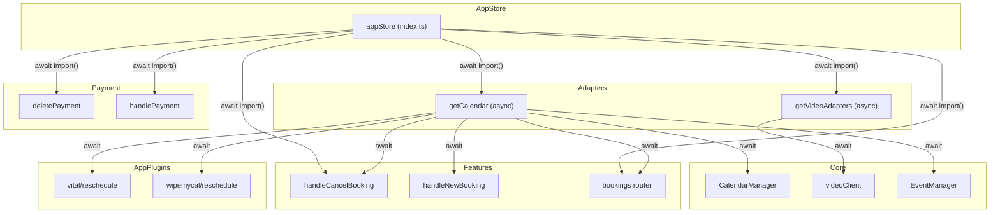

# Code Review: Async import of the appStore packages

**Instance**: cal_dot_com__calcom__cal.com__PR8087
**PR**: [calcom/cal.com#8087](https://github.com/calcom/cal.com/pull/8087)
**Date**: 2026-04-13
**Preset**: behavioral-only

## Intent Register

### Intent Claims

1. Convert appStore from eagerly-loaded static imports to lazily-loaded dynamic `import()` expressions for code-splitting and bundle size reduction
2. Each appStore entry becomes a `Promise` that resolves to the module on first access
3. `getCalendar` becomes async to `await` the appStore Promise before accessing the module's `CalendarService`
4. `getVideoAdapters` becomes async to `await` the appStore Promise before accessing `VideoApiAdapter`
5. All direct consumers of `getCalendar` are updated to `await` its result
6. All direct consumers of `getVideoAdapters` are updated to `await` its result
7. Payment-related appStore lookups (`deletePayment`, `handlePayment`, `handleCancelBooking`) are updated to `await` the Promise
8. Existing null-check patterns (e.g., checking for `"lib"` and `"CalendarService"` in the resolved app) are preserved after the await
9. `getCalendarCredentials` stores the unresolved Promise in the `calendar` field; consumers (`getConnectedCalendars`) await it later
10. Error handling and logging patterns remain unchanged across the async conversion

### Intent Diagram

## Verified Findings

### F-01: forEach(async) fire-and-forget in vital/reschedule.ts

| Field | Value |
|-------|-------|
| Sighting | M-01 (G1-S-01, G2-S-01, G3-S-01, G4-S-01, IPT-S-01) |
| Location | `packages/app-store/vital/lib/reschedule.ts`, lines ~122-134 |
| Type | behavioral |
| Severity | critical |
| Origin | introduced |
| Pattern | async-in-forEach |

**Current behavior**: `bookingRefsFiltered.forEach(async (bookingRef) => { ... const calendar = await getCalendar(...); return calendar?.deleteEvent(...); })` — the async callback returns a Promise that `forEach` discards. The surrounding `try/catch` cannot observe rejections. Calendar event deletions execute fire-and-forget with no error propagation and no guarantee of completion before the function returns.

**Expected behavior**: Replace `forEach` with `for...of` so `await` works correctly and rejections propagate to the enclosing `try/catch`, matching the pattern correctly applied elsewhere in this same PR (e.g., `handleCancelBooking.ts` lines ~474-479).

**Evidence**: The diff adds `async` to the `forEach` callback and `await` inside it. JavaScript's `forEach` specification ignores callback return values. The PR itself uses `for...of` correctly at `handleCancelBooking.ts` lines ~474-479, confirming the correct pattern was known but not consistently applied.

---

### F-02: forEach(async) fire-and-forget in wipemycalother/reschedule.ts

| Field | Value |
|-------|-------|
| Sighting | M-02 (G1-S-02, G2-S-02, G3-S-02, G4-S-02, IPT-S-02) |
| Location | `packages/app-store/wipemycalother/lib/reschedule.ts`, lines ~122-134 |
| Type | behavioral |
| Severity | critical |
| Origin | introduced |
| Pattern | async-in-forEach |

**Current behavior**: Identical `forEach(async)` defect to F-01. The async callback's returned Promise is discarded by `forEach`. Errors from `getCalendar` or `deleteEvent` are silently swallowed.

**Expected behavior**: Replace `forEach` with `for...of` so rejections propagate to the surrounding `try/catch`.

**Evidence**: The diff is a character-for-character duplicate of the `vital/reschedule.ts` change — same `forEach(async)` transformation, same `await getCalendar` inside.

---

### F-03: forEach(async) fire-and-forget in bookings router

| Field | Value |
|-------|-------|
| Sighting | M-03 (G1-S-03, G2-S-03, G3-S-03, G4-S-03, IPT-S-03) |
| Location | `packages/trpc/server/routers/viewer/bookings.tsx`, lines ~550-560 |
| Type | behavioral |
| Severity | critical |
| Origin | introduced |
| Pattern | async-in-forEach |

**Current behavior**: `bookingRefsFiltered.forEach(async (bookingRef) => { ... const calendar = await getCalendar(...); return calendar?.deleteEvent(...); })` — the tRPC handler proceeds without waiting for calendar deletions to complete. Rejections from `getCalendar` or `deleteEvent` become unhandled Promise rejections.

**Expected behavior**: Replace `forEach` with `for...of` or use `Promise.all` over mapped operations so rejections surface to the handler.

**Evidence**: The diff explicitly shows `forEach(async (bookingRef) =>` replacing the synchronous `forEach`, with `await getCalendar` inside. No `Promise.all` or `for...of` wrapper is present.

---

### F-04: forEach(async) fire-and-forget in handleCancelBooking

| Field | Value |
|-------|-------|
| Sighting | M-04 (G1-S-04, G2-S-04, G3-S-04, G4-S-04, IPT-S-04) |
| Location | `packages/features/bookings/lib/handleCancelBooking.ts`, lines ~458-466 |
| Type | behavioral |
| Severity | critical |
| Origin | introduced |
| Pattern | async-in-forEach |

**Current behavior**: The existing `.forEach(async (credential) =>` block gains `await getCalendar(credential)` inside it. The `forEach` discards the returned Promise, so errors from `getCalendar` or the subsequent calendar operations are silently swallowed.

**Expected behavior**: Convert to `for...of`, consistent with the sibling block at lines ~474-479 which the same PR correctly refactors to `for...of`.

**Evidence**: The diff adds `await getCalendar(credential)` into an existing `forEach(async)` callback. The same PR at lines ~474-479 replaces a synchronous `forEach` with `for (const credential of calendarCredentials) { const calendar = await getCalendar(credential); ... }`, demonstrating the author applied the correct pattern in one location but not the other.

---

### F-05: Untyped Promise field in getCalendarCredentials

| Field | Value |
|-------|-------|
| Sighting | M-05 (G1-S-07, IPT-S-05) |
| Location | `packages/core/CalendarManager.ts`, `getCalendarCredentials` function |
| Type | fragile |
| Severity | major |
| Origin | introduced |
| Pattern | untyped-async-field |

**Current behavior**: `getCalendarCredentials` stores the result of `getCalendar(credential)` — now a `Promise<Calendar|null>` — directly in the `calendar` field without awaiting it. The type annotation is not updated. The only consumer shown in the diff (`getConnectedCalendars`) does `await item.calendar` correctly. However, any other consumer that reads `.calendar` without awaiting receives a truthy Promise object instead of null, defeating null-guard checks like `if (!calendar)`.

**Expected behavior**: Either update the type annotation to reflect `Promise<Calendar|null>` so TypeScript enforces awaiting at call sites, or rename the field to `calendarPromise` to signal deferred resolution.

**Evidence**: The diff removes `const { calendar, ... } = item` and replaces it with `const calendar = await item.calendar` in `getConnectedCalendars`, confirming the field is now an unresolved Promise at storage time.

## Findings Summary

| ID | Type | Severity | Pattern | Location |
|----|------|----------|---------|----------|
| F-01 | behavioral | critical | async-in-forEach | vital/reschedule.ts |
| F-02 | behavioral | critical | async-in-forEach | wipemycalother/reschedule.ts |
| F-03 | behavioral | critical | async-in-forEach | bookings.tsx |
| F-04 | behavioral | critical | async-in-forEach | handleCancelBooking.ts |
| F-05 | fragile | major | untyped-async-field | CalendarManager.ts |

- Verified findings: 5
- Rejected sightings: 2 (M-06, M-07 — pre-existing patterns not introduced by this PR)
- Filtered findings: 2 (M-08 out-of-charter, M-09 below confidence threshold)
- False positive rate: 0% (no user dismissals)

## Retrospective

### Sighting Counts

- **Total sightings generated**: 23
- **Verified findings at termination**: 5
- **Rejections**: 2 (M-06, M-07 — pre-existing patterns out of scope for diff review)
- **Nit count**: 0
- **Filtered**: 2 (M-08: out-of-charter for behavioral-only preset, structural type; M-09: confidence 4.8 < 8.0 threshold)

**By detection source**:
- `intent`: 16 sightings (from G2, G4, IPT primarily)
- `checklist`: 7 sightings (from G1, G3)
- `structural-target`: 2 sightings (G1-S-05, G1-S-06 — both rejected as pre-existing)

**Structural sub-categorization**: N/A (no structural-type findings survived filtering)

### Verification Rounds

- **Rounds**: 1
- **Convergence**: Immediate — all agents converged on the same `forEach(async)` pattern across all 4 affected locations. No weakened-but-unrejected sightings remained to drive a second round.

### Scope Assessment

- **Files in scope**: 12 files modified in the diff
- **Lines changed**: ~200 (additions + deletions)
- **Context**: Diff-only review, no codebase access

### Context Health

- **Round count**: 1
- **Sightings-per-round**: 23 (Round 1)
- **Rejection rate**: 2/9 deduplicated sightings (22%)
- **Hard cap reached**: No

### Tool Usage

- **Linter output**: N/A (isolated diff review, no project tooling available)
- **Project tools**: N/A
- **Fallback**: Grep/Glob not needed (diff-only context)

### Finding Quality

- **False positive rate**: 0% (pending user feedback)
- **Origin breakdown**: 5 introduced findings, 0 pre-existing findings (2 pre-existing sightings rejected)
- **Cross-cutting pattern**: The `async-in-forEach` pattern accounts for 4 of 5 findings (80%), all critical severity. This is a single underlying mistake applied inconsistently across 4 call sites while the correct `for...of` pattern was applied at a 5th site in the same PR.

### Intent Register

- **Claims extracted**: 10 (from PR title, diff structure, and behavioral analysis)
- **Sources**: PR diff only (no specs, no documentation)
- **Findings attributed to intent comparison**: 5 (all findings reference intent claims 5 and/or 10)
- **Intent claims invalidated**: Claim 5 partially invalidated (4 of ~12 consumers use `forEach(async)` instead of properly awaiting)

### Per-Group Metrics

| Agent | Files Reported | Sightings | Survival Rate |
|-------|---------------|-----------|---------------|
| G1 (value-abstraction) | 12/12 | 7 | 5/7 (71%) |
| G2 (dead-code) | 12/12 | 4 | 4/4 (100%) |
| G3 (signal-loss) | 12/12 | 4 | 4/4 (100%) |
| G4 (behavioral-drift) | 12/12 | 4 | 4/4 (100%) |
| IPT (intent-path-tracer) | 8/12 | 7 | 5/7 (71%) |

### Deduplication Metrics

- **Input sightings**: 23
- **Output (deduplicated)**: 9
- **Merge count**: 14
- **Merged pairs**: G1-S-01/G2-S-01/G3-S-01/G4-S-01/IPT-S-01 → M-01; G1-S-02/G2-S-02/G3-S-02/G4-S-02/IPT-S-02 → M-02; G1-S-03/G2-S-03/G3-S-03/G4-S-03/IPT-S-03 → M-03; G1-S-04/G2-S-04/G3-S-04/G4-S-04/IPT-S-04 → M-04; G1-S-07/IPT-S-05 → M-05

### Instruction Trace

- **Agents spawned**: 5 Tier 1 detectors + 1 IPT + 1 Deduplicator + 2 Challengers = 9 total
- **Prompt composition**: Code payload (~460 lines of diff) + intent register (10 claims + Mermaid diagram) + detection targets per group

### Filtered Findings

| Sighting | Reason | Score |
|----------|--------|-------|
| M-08 (index.ts eager imports) | Out-of-charter: structural finding in behavioral-only preset | N/A |
| M-09 (videoClient sequential for...of) | Below confidence threshold | 4.8 |

