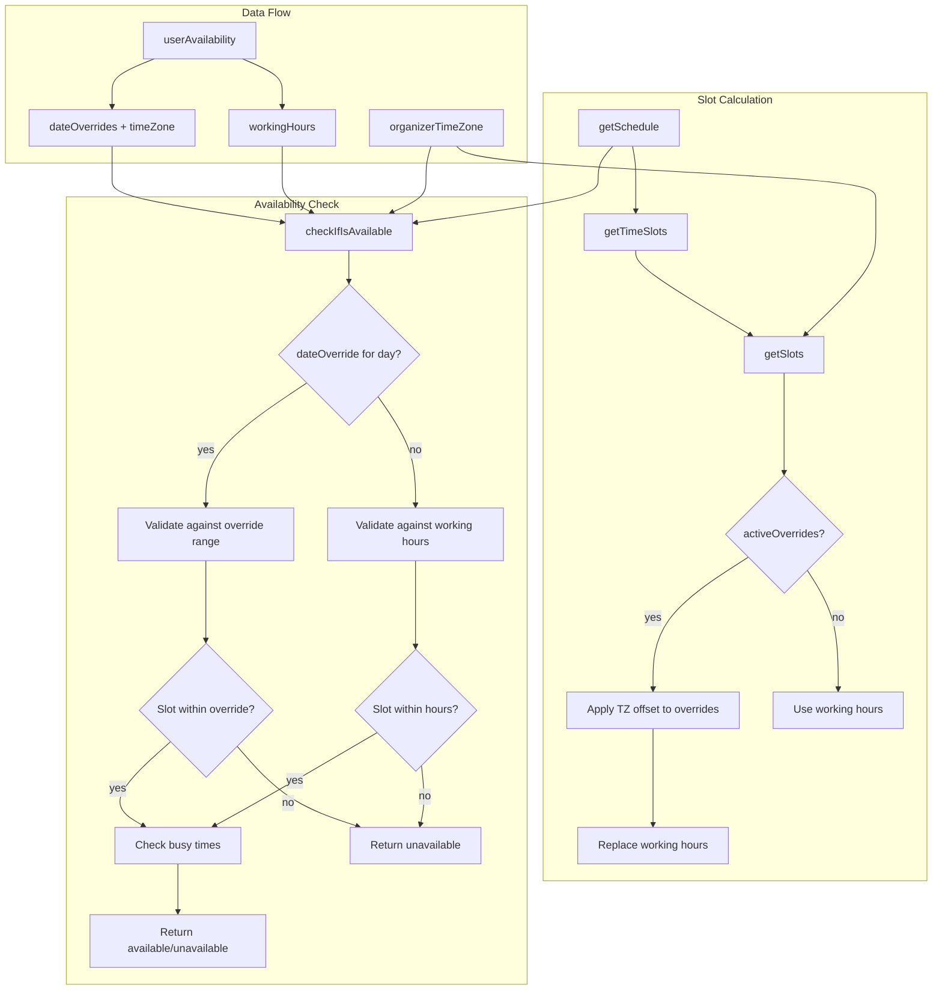

# Code Review: cal.com PR #8330 — Advanced date override handling and timezone compatibility improvements

## Intent Register

### Intent Claims

1. Date overrides should respect the organizer's timezone when calculating available slots for invitees in different timezones.
2. When an invitee views slots from a different timezone, date override slots should remain correct in UTC terms.
3. `checkIfIsAvailable` validates slot availability against busy times, date overrides, and working hours (in that priority order).
4. If a date override exists for a given day, slots are validated against the override's time range — not regular working hours.
5. If no date override exists for a slot's day, the slot is validated against normal working hours.
6. The slot calculation in `getSlots` applies a timezone offset (`inviteeUtcOffset - organizerUtcOffset`) to override start/end times to produce correct minute-of-day values.
7. Date overrides carry the organizer's timezone (`timeZone` field on `TimeRange`) for proper UTC conversion.
8. `organizerTimeZone` is resolved via fallback chain: `eventType.timeZone || eventType.schedule.timeZone || userAvailability[0].timeZone`.
9. The `TimeRange` type now includes an optional `timeZone` field.
10. The test verifies that querying with a +6:00 timezone returns the same UTC slots as querying from the organizer's timezone.

### Intent Diagram

## Verified Findings

### F-01: dateOverrides parameter never wired to checkIfIsAvailable (critical)

**Finding ID:** F-01
**Sighting:** G2-S-01
**Location:** `packages/trpc/server/routers/viewer/slots.ts`, `checkIfIsAvailable` parameter + all 3 call sites in `getSchedule`
**Type:** behavioral
**Severity:** critical
**Current behavior:** The `dateOverrides` parameter in `checkIfIsAvailable` defaults to `[]` and is never supplied at any of the three call sites. All call sites spread `...availabilityCheckProps` (which does not include `dateOverrides`) and individually add only `organizerTimeZone`. The local `dateOverrides` variable in `getSchedule` is passed to `getTimeSlots` but never to `checkIfIsAvailable`. The entire date-override guard block (lines +104 through +133) always processes an empty array — its logic is permanently bypassed.
**Expected behavior:** Per intent claims 3 and 4, `checkIfIsAvailable` should validate slots against date override time ranges when a date override exists for the slot's day.
**Source of truth:** Intent claims 3, 4
**Evidence:** The diff shows `availabilityCheckProps` defined without `dateOverrides`. All three `checkIfIsAvailable` call sites spread `...availabilityCheckProps` plus `organizerTimeZone` — none passes `dateOverrides`.
**Pattern label:** Dead infrastructure

### F-02: workingHours parameter never wired to checkIfIsAvailable (critical)

**Finding ID:** F-02
**Sighting:** G2-S-02
**Location:** `packages/trpc/server/routers/viewer/slots.ts`, `checkIfIsAvailable` parameter + all 3 call sites in `getSchedule`
**Type:** behavioral
**Severity:** critical
**Current behavior:** The `workingHours` parameter defaults to `[]` and is never supplied at any call site. The `workingHours` variable computed via `getAggregateWorkingHours` is never forwarded to `checkIfIsAvailable`. The working-hours fallback guard block (lines +136 through +149) always receives an empty array, so `workingHours.find(...)` always returns `undefined` and the guard never fires.
**Expected behavior:** Per intent claim 5, if no date override exists for a slot's day, the slot should be validated against normal working hours.
**Source of truth:** Intent claim 5
**Evidence:** Same structural analysis as F-01 — `availabilityCheckProps` does not include `workingHours`, and no call site passes it explicitly.
**Pattern label:** Dead infrastructure

### F-03: UTC offset sign inversion in date override day-matching (critical)

**Finding ID:** F-03
**Sighting:** M-01 (merged from G1-S-01, G3-S-03, G4-S-02, IPT-S-01)
**Location:** `packages/trpc/server/routers/viewer/slots.ts`, `checkIfIsAvailable` ~line 105
**Type:** behavioral
**Severity:** critical
**Current behavior:** `dayjs.tz(date.start, organizerTimeZone).utcOffset() * -1` inverts the UTC offset sign. For an organizer at UTC+6, `utcOffset()` returns +360; the negation produces -360. `dayjs(date.start).add(-360, "minutes")` shifts the date 6 hours backward instead of forward, producing the wrong calendar day for the `format("YYYY MM DD")` comparison. All boundary comparisons inherit the same corrupted times.
**Expected behavior:** The conversion should produce the organizer's local date from the UTC-stored override start time. The `* -1` negation is incorrect for positive-offset timezones.
**Source of truth:** Intent claims 1, 2, 4
**Evidence:** `utcOffset()` returns positive minutes for east-of-UTC zones. Negating shifts the wrong direction. Confirmed by 4 independent agents.
**Pattern label:** sign-inversion

### F-04: dayjs object reference comparison always false (major)

**Finding ID:** F-04
**Sighting:** M-02 (merged from G1-S-02, G2-S-03, G3-S-01, G4-S-03, IPT-S-02)
**Location:** `packages/trpc/server/routers/viewer/slots.ts`, `checkIfIsAvailable` ~line 112
**Type:** behavioral
**Severity:** major
**Current behavior:** `dayjs(date.start).add(utcOffset, "minutes") === dayjs(date.end).add(utcOffset, "minutes")` compares two separately constructed dayjs object instances with JavaScript `===`, which tests reference identity. Two distinct dayjs instances are never `===` regardless of their time values. This condition is always `false`, making the zero-duration (all-day blocked/available) override branch permanently unreachable.
**Expected behavior:** Should use `.isSame()` to compare dayjs values by time equality.
**Source of truth:** Intent claim 4
**Evidence:** JavaScript `===` on distinct objects always returns `false`. Confirmed by all 5 agents.
**Pattern label:** object-reference-vs-value-comparison

### F-05: Working hours end-time uses wrong variable (copy-paste error) (major)

**Finding ID:** F-05
**Sighting:** M-03 (merged from G1-S-03, G2-S-04, G3-S-02, G4-S-01, IPT-S-03)
**Location:** `packages/trpc/server/routers/viewer/slots.ts`, `checkIfIsAvailable` ~lines 139-140
**Type:** behavioral
**Severity:** major
**Current behavior:** Both `start` and `end` are computed as `slotStartTime.hour() * 60 + slotStartTime.minute()`. The `end` variable should use `slotEndTime` to represent the slot's actual end time. The guard `end > workingHour.endTime` tests the slot's start-time against the working-hour end boundary, not the slot's end-time. Slots starting before but ending after working hours are never rejected.
**Expected behavior:** `end` should be `slotEndTime.hour() * 60 + slotEndTime.minute()` to correctly detect slots overflowing past working hours.
**Source of truth:** Intent claim 5
**Evidence:** Both lines reference `slotStartTime` — confirmed as copy-paste error by all 5 agents.
**Pattern label:** copy-paste-error

### F-06: Undefined timeZone silently falls back to server local timezone (major)

**Finding ID:** F-06
**Sighting:** M-04 (merged from G1-S-04, G3-S-05, IPT-S-05)
**Location:** `packages/lib/slots.ts`, `getSlots` ~line 214
**Type:** behavioral
**Severity:** major
**Current behavior:** `dayjs(override.start.toString()).tz(override.timeZone).utcOffset()` — when `override.timeZone` is `undefined` (the field is optional on `TimeRange`), dayjs `.tz(undefined)` silently falls back to the process's local timezone. On servers not co-located with the organizer, `organizerUtcOffset` picks up the server's offset, producing incorrect slot boundaries.
**Expected behavior:** A guard should handle the absent `timeZone` case — falling back to UTC or the resolved `organizerTimeZone` rather than inheriting the server's local timezone.
**Source of truth:** Intent claim 7
**Evidence:** `TimeRange.timeZone` is typed as `string | undefined`. No guard exists for the `undefined` case. Confirmed by 3 agents.
**Pattern label:** missing-fallback-guard

### F-07: Date override availability bypasses busy-time check (major)

**Finding ID:** F-07
**Sighting:** M-05 (merged from G3-S-06, G4-S-04)
**Location:** `packages/trpc/server/routers/viewer/slots.ts`, `checkIfIsAvailable` ~lines 130-133
**Type:** behavioral
**Severity:** major
**Current behavior:** When a date override covers the slot's day and the slot falls within the override window, `dateOverrideExist` is `true` and `dateOverrides.find()` returns `undefined`. The function then hits `if (dateOverrideExist) { return true; }`, returning the slot as available immediately — without reaching the `busy.every(...)` check below. A slot within a date override window is reported as available even if there is a conflicting booking.
**Expected behavior:** Per intent claim 3, busy-time validation must run even when a date override grants availability. The priority order is: date overrides determine the availability window, then busy times are checked within that window.
**Source of truth:** Intent claim 3
**Evidence:** The `return true` at the `dateOverrideExist` check precedes the `busy.every(...)` block. Confirmed by 2 agents.
**Pattern label:** busy-time-bypass

## Findings Summary

| ID | Type | Severity | Description |
|----|------|----------|-------------|
| F-01 | behavioral | critical | `dateOverrides` never passed to `checkIfIsAvailable` — date override logic is dead |
| F-02 | behavioral | critical | `workingHours` never passed to `checkIfIsAvailable` — working hours logic is dead |
| F-03 | behavioral | critical | UTC offset sign inversion (`* -1`) corrupts date override day-matching |
| F-04 | behavioral | major | dayjs `===` reference comparison always false — zero-duration override branch unreachable |
| F-05 | behavioral | major | `end` computed from `slotStartTime` instead of `slotEndTime` — working hours overflow uncaught |
| F-06 | behavioral | major | `override.timeZone` undefined silently falls back to server local timezone |
| F-07 | behavioral | major | `dateOverrideExist` returns available before checking busy times |

**Total: 7 verified findings (3 critical, 4 major)**

## Filtered

| Sighting | Type | Severity | Reason | Score |
|----------|------|----------|--------|-------|
| G3-S-04 | structural | minor | Out-of-charter (structural in behavioral-only preset) | N/A |
| G1-S-05 | structural | minor | Out-of-charter (structural in behavioral-only preset) | N/A |
| IPT-S-07 | test-integrity | minor | Out-of-charter (test-integrity in behavioral-only preset) | N/A |

## Retrospective

### Sighting Counts

- **Total sightings generated:** 27
- **After deduplication:** 15 (5 merged groups + 10 unique)
- **Verified findings at termination:** 10 (7 pass charter+confidence, 3 filtered)
- **Rejections:** 5 (G1-S-06 nit, G4-S-05, G4-S-06 nit, IPT-S-04, IPT-S-06 subsumed)
- **Nit count:** 2 (G1-S-06, G4-S-06)
- **Breakdown by detection source:**
  - intent: 14 sightings
  - checklist: 5 sightings
  - structural-target: 8 sightings
- **Structural sub-categorization:** dead infrastructure (F-01, F-02), dead conditional guards (F-04)

### Verification Rounds

- **Rounds:** 1 (converged in first round — no weakened-but-unrejected sightings requiring additional rounds)

### Scope Assessment

- **Files reviewed:** 4 (slots.ts x2, getSchedule.test.ts, schedule.d.ts)
- **Lines changed:** ~150 (additions + modifications)
- **Diff-only context** (no full codebase access)

### Context Health

- **Round count:** 1
- **Sightings-per-round trend:** 27 → 0 (converged)
- **Rejection rate:** 5/15 = 33%
- **Hard cap reached:** No

### Tool Usage

- **Linter output:** N/A (benchmark mode, no project tooling available)
- **Test runner:** N/A
- **Grep/Glob:** Used by agents for cross-instance search within benchmark diffs

### Finding Quality

- **False positive rate:** TBD (pending user review)
- **Breakdown by origin:** All findings are `introduced` (new code in the PR)
- **High-confidence findings:** F-01 through F-07 all scored 10.0 after confidence scaling

### Intent Register

- **Claims extracted:** 10 (from diff analysis — no external documentation)
- **Findings attributed to intent comparison:** All 7 findings reference intent claims
- **Intent claims invalidated during verification:** None

### Per-Group Metrics

| Agent Group | Files Reported | Sighting Volume | Survival Rate | Phase |
|-------------|---------------|-----------------|---------------|-------|
| T1-G1 value-abstraction | 4/4 | 6 | 3/6 (50%) | enumeration |
| T1-G2 dead-code | 4/4 | 4 | 2/4 (50%) | enumeration |
| T1-G3 signal-loss | 4/4 | 6 | 2/6 (33%) | enumeration |
| T1-G4 behavioral-drift | 4/4 | 6 | 1/6 (17%) | enumeration |
| Intent Path Tracer | 4/4 | 7 | 0/7 (0%) — all merged into other agents' findings | enumeration |

Note: IPT sightings were all merged into multi-agent findings or filtered/rejected. Its unique contribution (IPT-S-07) was filtered out-of-charter.

### Deduplication Metrics

- **Merge count:** 5 merged groups
- **Merged pairs:**
  - M-01: G1-S-01 + G3-S-03 + G4-S-02 + IPT-S-01
  - M-02: G1-S-02 + G2-S-03 + G3-S-01 + G4-S-03 + IPT-S-02
  - M-03: G1-S-03 + G2-S-04 + G3-S-02 + G4-S-01 + IPT-S-03
  - M-04: G1-S-04 + G3-S-05 + IPT-S-05
  - M-05: G3-S-06 + G4-S-04

### Instruction Trace

- **Detection preset:** behavioral-only (Groups 1-4 + Intent Path Tracer)
- **Agents spawned:** 5 detectors + 1 deduplicator + 3 challengers = 9 total
- **Prompt composition:** Diff payload (~250 lines) + intent register (10 claims) + checklist/targets per group
