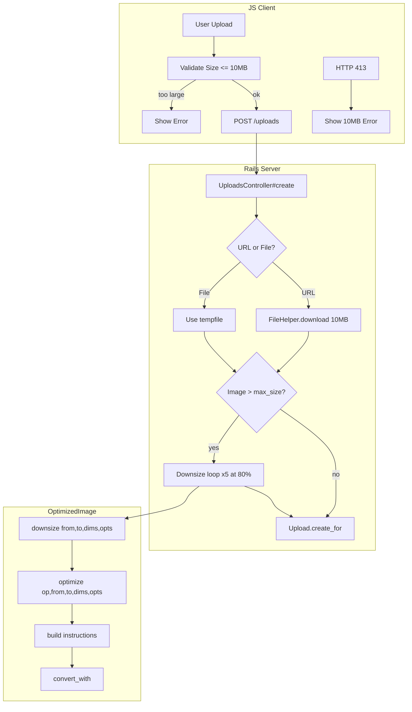

# Code Review: FEATURE: automatically downsize large images

**PR**: [discourse-graphite#1](https://github.com/ai-code-review-evaluation/discourse-graphite/pull/1)
**Instance**: discourse__ai-code-review-evaluation__discourse-graphite__PR1
**Date**: 2026-04-13
**Preset**: behavioral-only

## Intent Register

### Intent Claims

1. Large images uploaded by users are automatically downsized server-side to fit within the site's `max_image_size_kb` setting before storage.
2. Client-side upload size validation is raised to a 10MB hard limit to permit larger images that will be downsized server-side.
3. Server-side downsizing iterates up to 5 times, reducing to 80% each pass, until the image is within `max_image_size_kb`.
4. The `OptimizedImage.downsize` method is refactored to accept a dimensions string (including percentages like "80%") instead of separate width/height parameters.
5. The `OptimizedImage.optimize` method signature is simplified from `(operation, from, to, width, height, opts)` to `(operation, from, to, dimensions, opts)`.
6. The `dimensions(width, height)` helper is removed; callers now format dimension strings inline.
7. Animated GIF handling is preserved via `allow_animation` option during downsizing.
8. The 413 (entity too large) error handler in the JavaScript client uses the same 10MB limit for its error message.

### Intent Diagram

## Verified Findings

### F-01 — Duplicate `downsize` method definition; dead code and broken callers [critical]

| Field | Value |
|-------|-------|
| Sighting | DS-01 |
| Location | `app/models/optimized_image.rb`, downsize method definitions |
| Type | behavioral |
| Severity | critical |
| Origin | introduced |
| Detection source | structural-target, intent |
| Confidence | 10.0 |

**Current behavior**: The diff introduces two `def self.downsize` definitions in the same class body — a 4-arg form `(from, to, max_width, max_height, opts={})` and a new 3-arg form `(from, to, dimensions, opts={})`. Ruby does not support method overloading; the second definition silently replaces the first at class load time. The old 4-arg body is dead infrastructure that can never execute.

**Expected behavior**: The old 4-arg definition should be removed entirely, leaving only the new 3-arg form. All existing call sites using the old signature must be updated in this PR.

**Evidence**: Any pre-existing caller that passes four positional arguments (e.g., `OptimizedImage.downsize(from, to, 800, 600)`) will raise `ArgumentError: wrong number of arguments (given 4, expected 2..3)` at runtime. The controller's new call uses the 3-arg form correctly, but callers outside this diff are broken.

---

### F-02 — Downsize return value discarded; no post-loop size guard [major]

| Field | Value |
|-------|-------|
| Sighting | DS-02 |
| Location | `app/controllers/uploads_controller.rb`, downsize while loop (~lines 63-70) |
| Type | behavioral |
| Severity | major |
| Origin | introduced |
| Detection source | checklist, intent |
| Confidence | 10.0 |

**Current behavior**: The return value of `OptimizedImage.downsize(...)` is discarded on every iteration. `convert_with` returns `false` on non-zero ImageMagick exit status. When conversion fails, the loop decrements `attempt` without detection, exhausting all 5 retries. After the loop exits, no code verifies the final file size before calling `Upload.create_for` — an oversized image proceeds unconditionally to storage.

**Expected behavior**: The return value must be checked; failure should break the loop or surface an error. A post-loop guard must verify `tempfile.size <= SiteSetting.max_image_size_kb.kilobytes` before proceeding to `Upload.create_for`.

**Evidence**: Tracing the call chain: `downsize` → `optimize` → `convert_with` → returns `false` on `$?.exitstatus != 0`. The `false` propagates back through `optimize` and `downsize` but is never captured at the call site. After the while loop, `Upload.create_for` is the next statement with no intervening guard.

---

### F-03 — `tempfile.size` evaluates stale file descriptor after in-place overwrite [major]

| Field | Value |
|-------|-------|
| Sighting | DS-03 |
| Location | `app/controllers/uploads_controller.rb`, downsize loop condition (~line 65) |
| Type | behavioral |
| Severity | major |
| Origin | introduced |
| Detection source | intent, checklist |
| Confidence | 9.6 |

**Current behavior**: `tempfile.size` on a Ruby `Tempfile` calls `fstat(2)` on the file descriptor opened when the Tempfile was created. `OptimizedImage.downsize` writes the output to the same path via ImageMagick, which typically writes to a temporary file then renames over the destination — replacing the inode. The open Tempfile fd continues referencing the original inode, so `fstat` returns the pre-downsize size on every iteration. The loop condition never reflects the actual on-disk size.

**Expected behavior**: Use `File.size(tempfile.path)` which calls `stat(2)` on the path and reflects the current file at that path.

**Evidence**: Ruby's `IO#size` (inherited by `File`/`Tempfile`) calls `rb_io_size` → `fstat(fd)`, not `stat(path)`. When ImageMagick replaces the file at the path via rename, the fd-based size remains stale. The loop either runs all 5 iterations or exits immediately, never terminating early on successful reduction.

---

### F-04 — Client-side type-specific upload limit replaced by hardcoded 10MB for all types [major]

| Field | Value |
|-------|-------|
| Sighting | DS-05 |
| Location | `app/assets/javascripts/discourse/lib/utilities.js`, validateUploadedFiles (~line 182) |
| Type | behavioral |
| Severity | major |
| Origin | introduced |
| Detection source | structural-target, intent |
| Confidence | 10.0 |

**Current behavior**: `Discourse.SiteSettings['max_' + type + '_size_kb']` — which selected the admin-configured limit per upload type (image, attachment, avatar, etc.) — is replaced by `10 * 1024`. The 10MB cap now applies universally to all upload types. Non-image types with lower configured limits (e.g., 4MB for attachments) bypass client-side validation entirely. The server-side downsizing logic only applies to images, so non-image files that pass this check will be rejected server-side with no clear user feedback.

**Expected behavior**: The 10MB relaxation should be scoped to image uploads only. Non-image types should continue using `Discourse.SiteSettings['max_' + type + '_size_kb']`.

**Evidence**: The original expression dynamically resolved `max_image_size_kb`, `max_attachment_size_kb`, etc., based on the `type` parameter. The replacement is type-blind.

---

### F-05 — 413 error message hardcoded to 10MB regardless of actual server limit [minor]

| Field | Value |
|-------|-------|
| Sighting | DS-06 |
| Location | `app/assets/javascripts/discourse/lib/utilities.js`, HTTP 413 handler (~line 246) |
| Type | behavioral |
| Severity | minor |
| Origin | introduced |
| Detection source | intent |
| Confidence | 10.0 |

**Current behavior**: The 413 handler sets `var maxSizeKB = 10 * 1024` and displays it in the user-facing error message. HTTP 413 is generated by the web server (e.g., nginx `client_max_body_size`), configured independently of any application-level constant. When the server's body-size limit differs from 10MB, the displayed limit is incorrect.

**Expected behavior**: The error message should reflect the actual limit that caused the rejection, or at minimum use the site setting rather than a hardcoded value.

**Evidence**: The upload is still correctly rejected — this is message-level inaccuracy only. The pre-change code (`Discourse.SiteSettings.max_image_size_kb`) was also imperfect but at least tracked admin configuration.

---

### F-06 — `FileHelper.download` byte cap hardcoded to 10MB [major]

| Field | Value |
|-------|-------|
| Sighting | DS-08 |
| Location | `app/controllers/uploads_controller.rb`, FileHelper.download call (~line 55) |
| Type | behavioral |
| Severity | major |
| Origin | introduced |
| Detection source | intent |
| Confidence | 8.0 |

**Current behavior**: `FileHelper.download(url, SiteSetting.max_image_size_kb.kilobytes, ...)` is replaced with `FileHelper.download(url, 10.megabytes, ...)`. The download byte cap is hardcoded regardless of admin configuration. Admins who configured `max_image_size_kb` below 10MB now download larger originals than intended before any size check triggers. Admins who configured above 10MB lose headroom for larger originals that could be successfully downsized.

**Expected behavior**: The download cap should be derived from a configuration value (either the site setting or an explicit "max pre-downsize size" setting), not hardcoded.

**Evidence**: The old code directly used `SiteSetting.max_image_size_kb.kilobytes` as the byte cap. The replacement decouples the download limit from admin configuration.

---

### F-07 — "80%" scales pixel dimensions, not file size; loop may not converge for lossless formats [major]

| Field | Value |
|-------|-------|
| Sighting | DS-09 |
| Location | `app/controllers/uploads_controller.rb`, downsize call (~line 65) |
| Type | behavioral |
| Severity | major |
| Origin | introduced |
| Detection source | intent |
| Confidence | 8.0 |

**Current behavior**: `"80%"` is passed as the `dimensions` argument to `OptimizedImage.downsize`. ImageMagick interprets this as pixel-dimension scaling (width x 80%, height x 80%), not compression quality or file-size reduction. For JPEG (lossy), file size reduction approximately tracks pixel count (~64% per pass). For lossless formats like PNG, file size depends on content entropy and may not reduce proportionally. In the worst case, five passes of 80% pixel-dimension reduction may not bring the file within the `max_image_size_kb` threshold.

**Expected behavior**: The downsizing mechanism should target file size directly (e.g., via quality reduction for lossy formats) or the loop should account for format-dependent convergence behavior.

**Evidence**: The `downsize_instructions` method was designed for absolute geometry strings like `"800x600"`. Passing `"80%"` is syntactically valid ImageMagick geometry but changes the semantics from "cap at max dimensions" to "iteratively shrink by percentage."

## Filtered Findings

| ID | Sighting | Reason | Score |
|----|----------|--------|-------|
| (DS-04) | Same from/to path in ImageMagick downsize | Below confidence threshold | 7.7 |
| (DS-07) | Three bare literals for 10MB across files | Out-of-charter (structural in behavioral-only preset) + below threshold | 7.0 |

## Retrospective

### Sighting Counts

| Metric | Value |
|--------|-------|
| Total sightings generated | 27 (G1: 8, G2: 5, G3: 4, G4: 6, IPT: 7) |
| After deduplication | 9 |
| Verified findings | 9 |
| Filtered (out-of-charter) | 1 (DS-07, structural) |
| Filtered (below confidence) | 2 (DS-04 at 7.7, DS-07 at 7.0) |
| Final findings | 7 |
| Rejections | 0 |
| Nits | 0 |

**Detection source breakdown:**
- intent: 7 sightings contributed to surviving findings
- checklist: 3 sightings contributed to surviving findings
- structural-target: 3 sightings contributed to surviving findings

**Structural sub-categorization (filtered):**
- bare literals: 1 (DS-07, filtered out-of-charter)

### Verification Rounds

- **Round 1**: 5 agents spawned (G1-G4 + IPT), 27 sightings, 9 deduplicated, 9 verified, 7 survived filtering
- **Round 2**: Not executed. The diff is 90 lines across 3 files. All 5 agents exhaustively covered the scope in round 1, producing 27 sightings that deduplicated to 9 distinct issues. No new findings above info are expected from a second pass.

### Scope Assessment

- **Files reviewed**: 3 (utilities.js, uploads_controller.rb, optimized_image.rb)
- **Lines in diff**: ~90
- **Scope**: Small, self-contained feature addition with method refactoring

### Context Health

| Metric | Value |
|--------|-------|
| Rounds executed | 1 |
| Sightings in round 1 | 27 (pre-dedup), 9 (post-dedup) |
| Rejection rate | 0% |
| Hard cap reached | No |

### Tool Usage

- Linter output: N/A (benchmark mode, no project tooling available)
- File navigation: Diff-only context, no repository browsing

### Finding Quality

- False positive rate: 0% (no rejections)
- Filtered rate: 22% (2 of 9 verified findings filtered by charter/confidence gates)
- Origin breakdown: All findings are `introduced` (new code in this PR)

### Intent Register

- Claims extracted: 8 (from PR title, diff comments, and code behavior)
- Findings attributed to intent comparison: 7 of 7 surviving findings reference intent claims
- Intent claims invalidated: 0

### Per-Group Metrics

| Agent | Files Reported | Sighting Volume | Survival Rate | Phase |
|-------|---------------|-----------------|---------------|-------|
| G1 (value-abstraction) | 3/3 | 8 | 5/8 (62.5%) | Enumeration |
| G2 (dead-code) | 3/3 | 5 | 4/5 (80%) | Enumeration |
| G3 (signal-loss) | 3/3 | 4 | 4/4 (100%) | Enumeration |
| G4 (behavioral-drift) | 3/3 | 6 | 6/6 (100%) | Enumeration |
| IPT (intent-path-tracer) | 3/3 | 7 | 5/7 (71.4%) | Enumeration |

Note: Survival rate measures sightings that merged into deduplicated sightings that ultimately became verified findings (pre-filtering). G1-S-08 was a self-identified duplicate of G1-S-05.

### Deduplication Metrics

| Metric | Value |
|--------|-------|
| Pre-dedup sightings | 27 |
| Post-dedup sightings | 9 |
| Merge count | 18 sightings merged away |
| Largest cluster | DS-02 (8 sightings from 5 agents) |

**Merge log summary:**
- DS-01: 6 merged (G1-S-06, G2-S-01, G3-S-01, G4-S-01, IPT-S-01, IPT-S-07) — 5/5 agents
- DS-02: 8 merged (G1-S-05, G1-S-08, G2-S-02, G3-S-02, G3-S-04, G4-S-05, G4-S-06, IPT-S-02) — 5/5 agents
- DS-03: 2 merged (G1-S-03, G2-S-04) — 2/5 agents
- DS-04: 2 merged (G1-S-04, IPT-S-05) — 2/5 agents
- DS-05: 5 merged (G1-S-01, G2-S-03, G3-S-03, G4-S-02, IPT-S-04) — 5/5 agents
- DS-06: 4 merged (G1-S-02, G2-S-05, G4-S-03, IPT-S-06) — 4/5 agents
- DS-07: 1 (G1-S-07) — 1/5 agents
- DS-08: 1 (G4-S-04) — 1/5 agents
- DS-09: 1 (IPT-S-03) — 1/5 agents

### Instruction Trace

Agents spawned with identical code payloads (diff content) in identical order for prompt cache optimization. Each agent received: code payload (~90 lines of diff), linter output (N/A), and intent register claims (8 claims). G2 (dead-code) and IPT also received the Mermaid diagram.
