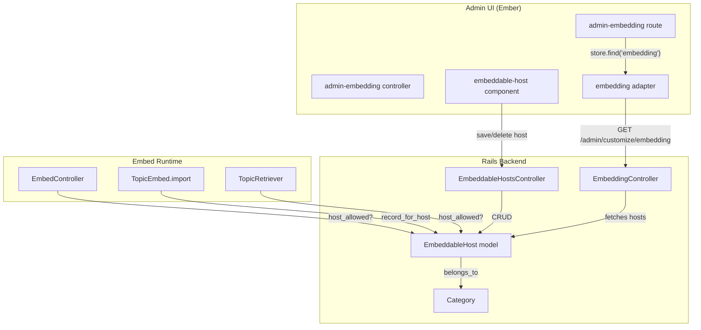

# Code Review: FEATURE: Can edit category/host relationships for embedding

**PR**: discourse-graphite PR #10
**Instance**: discourse__ai-code-review-evaluation__discourse-graphite__PR10
**Preset**: behavioral-only
**Date**: 2026-04-13

## Intent Register

### Intent Claims

1. Embeddable host/category relationships are managed via a dedicated database model (`EmbeddableHost`) instead of a site setting string
2. Admins can create, edit, and delete embeddable hosts through a CRUD UI at `/admin/customize/embedding`
3. Each embeddable host maps to a category for topic creation
4. When a host has no explicit category, the uncategorized category is used as default
5. The migration transfers existing `embeddable_hosts` and `embed_category` site settings to the new model
6. Host validation strips protocol prefixes and trailing paths before saving
7. Host validation ensures the host matches a domain name format regex
8. `EmbeddableHost.host_allowed?` replaces `SiteSetting.allows_embeddable_host?` for embed permission checks
9. Topic embedding uses per-host category assignment instead of a global `embed_category` setting
10. `expandable_first_post?` no longer gates on embeddable host existence
11. The Ember store's `_hydrateEmbedded` supports plural `_ids` associations (e.g., `color_ids` -> `colors`)
12. The REST adapter recognizes `embeddable-host` as an admin model for URL prefix routing
13. The embedding controller wraps hosts in an OpenStruct for the serializer
14. Admin embedding endpoints require both `logged_in` and `staff` authentication via `before_filter`

### Intent Diagram

## Verified Findings

### F-01: SQL injection in migration INSERT (critical)

**Sighting**: M-02 (from G1-S-04, G3-S-02, G4-S-04, IPT-S-03)
**Location**: `db/migrate/20150818190757_create_embeddable_hosts.rb`, line 558
**Type**: behavioral | **Severity**: critical | **Origin**: introduced
**Detection source**: checklist

**Current behavior**: The migration builds INSERT statements using raw string interpolation: `execute "INSERT INTO embeddable_hosts ... VALUES ('#{h}', ..."`. The value `h` comes from splitting the `embeddable_hosts` site setting on newlines with no sanitization. A stored host value containing a single quote produces broken SQL; a crafted value achieves SQL injection during migration with full database privileges.

**Expected behavior**: Parameterized query or `ActiveRecord::Base.connection.quote(h)` to sanitize the interpolated value.

**Source of truth**: Intent claim 5 — migration must safely transfer existing host data.

**Evidence**: Direct string interpolation confirmed at diff line 558. The input `h` originates from user-editable site setting content split on `\n` (line 556). No escaping or quoting is applied anywhere in the code path.

---

### F-02: Migration nil dereference on missing embed_category setting (critical)

**Sighting**: M-03 (from G1-S-02, G1-S-03, G3-S-01, IPT-S-07)
**Location**: `db/migrate/20150818190757_create_embeddable_hosts.rb`, lines 542-548
**Type**: behavioral | **Severity**: critical | **Origin**: introduced
**Detection source**: checklist

**Current behavior**: The migration queries for the `embed_category` setting and immediately accesses `[0]['id'].to_i` without checking for an empty result set. When `embed_category` doesn't exist (likely the majority of installations), `[0]` returns nil and `nil['id']` raises `TypeError`, aborting the migration. The fallback query for `uncategorized_category_id` at lines 547-548 has the same defect — if that setting is not persisted in the `site_settings` table, the same nil dereference crashes the migration.

**Expected behavior**: Guard against empty result sets (e.g., check `.cmd_tuples > 0` as done for the `embeddable_hosts` query below at line 552).

**Source of truth**: Intent claim 5 — migration must transfer existing settings without crashing.

**Evidence**: The `embeddable_hosts` query at line 552 correctly guards with `if embeddable_hosts && embeddable_hosts.cmd_tuples > 0`, but the `embed_category` and `uncategorized_category_id` queries at lines 542-548 lack equivalent guards.

---

### F-03: NoMethodError on nil host in before_validation (major)

**Sighting**: M-07 (from G1-S-01, G4-S-03)
**Location**: `app/models/embeddable_host.rb`, before_validation block (lines 335-338)
**Type**: behavioral | **Severity**: major | **Origin**: introduced
**Detection source**: intent

**Current behavior**: The `before_validation` block calls `self.host.sub!(/^https?:\/\//, '')` unconditionally. If `host` is nil (blank form submission), `nil.sub!` raises `NoMethodError`. The controller sets `host.host = params[:embeddable_host][:host]` directly from params with no nil guard. The callback fires before `validates_format_of` can reject the record.

**Expected behavior**: A nil guard before the `sub!` calls (e.g., `return unless self.host`).

**Source of truth**: Intent claim 6 — host validation strips protocol prefixes and trailing paths before saving.

**Evidence**: Call path: `POST /admin/embeddable_hosts` -> `create` -> `save_host(EmbeddableHost.new)` -> `host.save` -> `before_validation` -> `self.host.sub!` -> `NoMethodError`.

---

### F-04: Missing uncategorized fallback in TopicEmbed.import (major)

**Sighting**: U-03 (from G1-S-09)
**Location**: `app/models/topic_embed.rb`, line 409
**Type**: behavioral | **Severity**: major | **Origin**: introduced
**Detection source**: intent

**Current behavior**: `eh.try(:category_id)` returns nil when no `EmbeddableHost` record matches the URL. The old code used `SiteSetting.embed_category` as a global fallback; this PR removes that setting with no equivalent fallback in `topic_embed.rb`. Topics created via embedding from unrecognized hosts receive `category: nil`, which is a data-integrity issue — miscategorization or creation failure depending on Discourse's internal PostCreator behavior.

**Expected behavior**: Explicit fallback: `category: eh.try(:category_id) || SiteSetting.uncategorized_category_id`.

**Source of truth**: Intent claim 4 — when a host has no explicit category, uncategorized is used as default.

**Evidence**: The controller's `save_host` applies `SiteSetting.uncategorized_category_id` fallback, but `topic_embed.rb` does not. Severity raised from minor to major by Challenger.

---

### F-05: Silent error discard on destroyRecord (major)

**Sighting**: U-04 (from G3-S-03)
**Location**: `app/assets/javascripts/admin/components/embeddable-host.js.es6`, lines 62-69
**Type**: behavioral | **Severity**: major | **Origin**: introduced
**Detection source**: checklist

**Current behavior**: The `delete` action calls `this.get('host').destroyRecord().then(...)` with no `.catch()` handler. If the DELETE request fails (network error, server 500, authorization rejection), the rejected Promise is silently swallowed — no error feedback reaches the user.

**Expected behavior**: Append `.catch(popupAjaxError)` consistent with the `save` action at line 59 of the same file, which already uses this pattern.

**Source of truth**: AI failure mode checklist — silent error discard.

**Evidence**: Direct asymmetry in same file: `save` at line 59 uses `.catch(popupAjaxError)`; `delete` at line 64 has no `.catch()`.

---

### F-06: Uncategorized default enforced only in controller, not model (major)

**Sighting**: U-05 (from G4-S-07)
**Location**: `app/controllers/admin/embeddable_hosts_controller.rb`, save_host method (lines 271-281)
**Type**: behavioral | **Severity**: major | **Origin**: introduced
**Detection source**: intent

**Current behavior**: The uncategorized default (`host.category_id = SiteSetting.uncategorized_category_id if host.category_id.blank?`) is applied only inside the controller's `save_host` method. The `EmbeddableHost` model has no such default. The DB schema declares `category_id null: false`. Any code path creating an `EmbeddableHost` without going through this controller (migration, rake tasks, console) will hit the database constraint and raise `ActiveRecord::StatementInvalid` rather than applying a graceful default.

**Expected behavior**: Move the default to a `before_validation` or `before_save` callback in the `EmbeddableHost` model.

**Source of truth**: Intent claim 4 — when a host has no explicit category, uncategorized is used as default.

**Evidence**: The migration handles its own category resolution via raw SQL but the model itself has no default mechanism.

---

## Findings Summary

| ID | Type | Severity | Description |
|----|------|----------|-------------|
| F-01 | behavioral | critical | SQL injection in migration INSERT via raw string interpolation |
| F-02 | behavioral | critical | Migration nil dereference on missing embed_category/uncategorized settings |
| F-03 | behavioral | major | NoMethodError on nil host in before_validation callback |
| F-04 | behavioral | major | Missing uncategorized category fallback in TopicEmbed.import |
| F-05 | behavioral | major | Silent error discard on destroyRecord in delete action |
| F-06 | behavioral | major | Uncategorized default enforced only in controller, not model |

**Totals**: 6 verified findings (2 critical, 4 major). 1 rejection (U-01, nit). 8 filtered (7 out-of-charter, 1 below confidence threshold).

## Filtered Findings

| ID | Type | Severity | Reason | Score |
|----|------|----------|--------|-------|
| M-01 | test-integrity | major | out-of-charter | N/A |
| M-04 | fragile | minor | out-of-charter | N/A |
| M-05 | structural | minor | out-of-charter | N/A |
| M-06 | structural | minor | out-of-charter | N/A |
| M-08 | test-integrity | minor | out-of-charter | N/A |
| U-02 | structural | minor | out-of-charter | N/A |
| U-06 | test-integrity | minor | out-of-charter | N/A |
| U-07 | behavioral | minor | below-threshold | 7.0 |

## Retrospective

### Sighting Counts

- **Total raw sightings**: 28 (across 5 agents)
- **After deduplication**: 15
- **Verified findings**: 14
- **Rejected**: 1 (U-01 as nit)
- **Filtered (out-of-charter)**: 7
- **Filtered (below confidence threshold)**: 1
- **Final findings**: 6
- **Nit count**: 1

**By detection source**:
- checklist: 3 findings (F-01, F-02, F-05)
- intent: 3 findings (F-03, F-04, F-06)
- structural-target: 0 (all filtered as out-of-charter)
- linter: N/A

### Verification Rounds

- **Rounds**: 1
- **Convergence**: Round 1 produced 6 verified behavioral findings. All 5 agents earned respawn credit, but second round declined — diff-only review with thorough first-round coverage makes new sightings unlikely.
- **Hard cap reached**: No

### Scope Assessment

- **Files in diff**: ~30 files (new models, controllers, serializers, routes, templates, migration, tests)
- **Lines changed**: ~600+ (additions and deletions)
- **Languages**: Ruby (Rails), JavaScript (Ember.js), Handlebars, YAML

### Context Health

- **Round count**: 1
- **Sightings-per-round**: 28 raw → 15 deduplicated → 6 final
- **Rejection rate**: 1/15 (6.7%)
- **Hard cap reached**: No

### Tool Usage

- **Linters**: N/A (benchmark mode, no project tooling)
- **Test runners**: N/A
- **Fallback**: Grep/Glob/Read on diff file

### Finding Quality

- **False positive rate**: TBD (pending user review)
- **Origin breakdown**: All 6 findings are `introduced`

### Intent Register

- **Claims extracted**: 14 (from diff analysis)
- **Findings attributed to intent comparison**: 3 (F-03, F-04, F-06)
- **Intent claims invalidated**: 0

### Per-Group Metrics

| Agent | Files Reported | Sighting Volume | Survival Rate | Phase |
|-------|---------------|-----------------|---------------|-------|
| G1 (value-abstraction) | All diff files | 9 | 4/9 (44%) pre-filter | Phase 1+2 |
| G2 (dead-code) | All diff files | 3 | 0/3 (0%) post-filter | Phase 1+2 |
| G3 (signal-loss) | All diff files | 4 | 2/4 (50%) pre-filter | Phase 1+2 |
| G4 (behavioral-drift) | All diff files | 8 | 3/8 (38%) pre-filter | Phase 1+2 |
| IPT (intent-path-tracer) | All diff files | 7 | 2/7 (29%) pre-filter | Phase 1+2 |

### Deduplication Metrics

- **Merge count**: 8 merge groups
- **Merged pairs**: G1-S-08/G2-S-01/G4-S-01/IPT-S-01 (fabricator swap), G1-S-04/G3-S-02/G4-S-04/IPT-S-03 (SQL injection), G1-S-02/G1-S-03/G3-S-01/IPT-S-07 (migration nil deref), G1-S-05/G3-S-04/G4-S-05/IPT-S-02 (replace first only), G2-S-03/IPT-S-04 (no-op update), G2-S-02/G4-S-06 (dead fallback), G1-S-01/G4-S-03 (nil guard), G4-S-02/IPT-S-06 (misleading test)
- **Reduction**: 28 → 15 (46% reduction)

### Instruction Trace

- Agents spawned with diff file path as code payload
- Intent register injected as claims list (all Tier 1 groups + IPT)
- Mermaid diagram injected to G2 (dead-code) and IPT only
- Linter output: N/A

