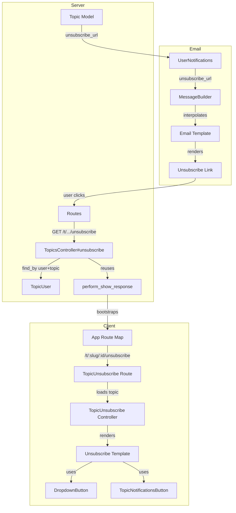

# Code Review: FEATURE: per-topic unsubscribe option in emails

**PR**: discourse-graphite/pull/2
**Preset**: behavioral-only
**Linter output**: N/A (benchmark mode — no project tooling)

## Intent Register

### Intent Claims

1. Users receive a per-topic unsubscribe link in notification emails that links to `/t/:slug/:topic_id/unsubscribe`
2. Clicking the unsubscribe link loads a page showing the topic title and a notification-state dropdown
3. The unsubscribe action reduces the user's notification level: if above regular, set to regular; if at or below regular, set to muted
4. The unsubscribe action persists the new notification level via `TopicUser#save!`
5. The unsubscribe route is accessible as both `/t/:slug/:topic_id/unsubscribe` and `/t/:topic_id/unsubscribe`
6. The unsubscribe action requires authentication (`ensure_logged_in` before filter)
7. The unsubscribe action reuses `perform_show_response` to render the topic view (server-side bootstrap for Ember client routing)
8. The email template includes both a user-preferences unsubscribe link and a per-topic unsubscribe link
9. The `unsubscribe_link` locale string now contains both a general preferences link and a topic-specific "click here" link
10. The dropdown-button component conditionally renders the title header (only when title is present)
11. The unsubscribe page uses triple-stache `{{{stopNotificiationsText}}}` to render HTML containing `<strong>` around the topic title
12. The `topic-from-params.js.es6` refactoring converts `var` to `const` and function syntax to ES6 shorthand with no behavioral change
13. The `topic_user.rb` changes are formatting-only (whitespace, brace style) with no behavioral change
14. The email notification template (`notification.html.erb`) reformats indentation and maintains existing `respond_instructions` and `unsubscribe_link` placeholders
15. The `message_builder.rb` passes `unsubscribe_url` through `template_args` to the locale string interpolation

### Intent Diagram

## Verified Findings

### F-01 — Nil dereference crashes unsubscribe for users without TopicUser record [critical]

| Field | Value |
|-------|-------|
| Sighting | M-01 (merged from G3-S-01, G4-S-01, IPT-S-01) |
| Location | `app/controllers/topics_controller.rb`, lines 204-212 |
| Type | behavioral |
| Severity | critical |
| Origin | introduced |
| Detection sources | signal-loss (checklist), behavioral-drift (intent), intent-path-tracer (intent) |
| Confidence | 10.0 |
| Pattern label | nil-dereference |

**Current behavior**: `TopicUser.find_by(user_id: current_user.id, topic_id: params[:topic_id])` returns `nil` when no TopicUser record exists. The immediately following `tu.notification_level` call raises `NoMethodError: undefined method 'notification_level' for nil:NilClass`, crashing the unsubscribe action with a 500 error.

**Expected behavior**: Guard against nil before dereferencing `tu` — use `find_or_initialize_by` or an explicit nil check — so the action handles the common case of a user with no prior TopicUser record.

**Source of truth**: Intent claims 3 and 4

**Evidence**: `find_by` returns nil on no match (Rails documented behavior). The canonical trigger is a user clicking the unsubscribe link from a notification email for a topic they received notifications about but never directly visited — the primary intended use case for this feature. Production call path: email unsubscribe link click -> GET `/t/:slug/:topic_id/unsubscribe` -> `topics#unsubscribe` -> nil dereference crash.

---

### F-02 — Locale key change breaks existing MessageBuilder callers [major]

| Field | Value |
|-------|-------|
| Sighting | M-02 (merged from G3-S-02, IPT-S-02) |
| Location | `lib/email/message_builder.rb` (html_part method); `config/locales/server.en.yml` (unsubscribe_link key) |
| Type | behavioral |
| Severity | major |
| Origin | introduced |
| Detection sources | signal-loss (checklist), intent-path-tracer (intent) |
| Confidence | 10.0 |
| Pattern label | incomplete-caller-update |

**Current behavior**: The `unsubscribe_link` locale string now requires `%{unsubscribe_url}` in addition to `%{user_preferences_url}`. The `html_part` method renders this key for any caller with `add_unsubscribe_link: true`, passing `template_args` built from `@opts`. Only `send_notification_email` was updated in this diff to supply `unsubscribe_url:`. Any other caller that sets `add_unsubscribe_link: true` without `unsubscribe_url:` will raise `I18n::MissingInterpolationArgument` at email render time.

**Expected behavior**: Either provide a default value for `%{unsubscribe_url}` in the locale string or the message builder, or audit and update all callers of `Email::MessageBuilder.new` with `add_unsubscribe_link: true`.

**Source of truth**: Intent claims 9 and 15

**Evidence**: Diff shows locale key change (`server.en.yml`) adding `%{unsubscribe_url}` requirement. Only `send_notification_email` (`user_notifications.rb:236`) and the test fixture (`message_builder_spec.rb:513`) were updated. The `html_part` method (`message_builder.rb:497`) calls `I18n.t('unsubscribe_link', template_args)` unconditionally for any caller with `add_unsubscribe_link: true`, with no default for the new key.

---

### F-03 — GET request performs state mutation, vulnerable to email pre-fetchers [major]

| Field | Value |
|-------|-------|
| Sighting | IPT-S-03 |
| Location | `config/routes.rb`, lines 444-445; `app/controllers/topics_controller.rb`, unsubscribe action |
| Type | behavioral |
| Severity | major |
| Origin | introduced |
| Detection sources | intent-path-tracer (intent) |
| Confidence | 10.0 |
| Pattern label | get-mutates-state |

**Current behavior**: The unsubscribe action is registered as a GET route and performs state mutation: it reads the current `notification_level`, toggles it (above-regular -> regular, or regular/below -> muted), and calls `tu.save!` — all within a single GET request. The unsubscribe URL is embedded as a clickable link in notification emails.

**Expected behavior**: Per RFC 7231 section 4.2.1, GET requests should be safe (no state mutation). The mutation should be triggered by POST or DELETE, with the GET route rendering a confirmation page the user must submit.

**Source of truth**: Intent claim 3

**Evidence**: Full caller path confirmed: `user_notifications.rb` passes `unsubscribe_url` into email -> `server.en.yml` renders as `[click here](%{unsubscribe_url})` -> `routes.rb:444` maps GET to `topics#unsubscribe` -> controller calls `tu.save!`. Email pre-fetchers (Gmail, Apple Mail, corporate link scanners) routinely follow links in email bodies, which would silently change a user's notification level without intent. Non-idempotent: first click with level above regular sets to regular; second click sets to muted (different result).

---

## Findings Summary

| ID | Type | Severity | Description |
|----|------|----------|-------------|
| F-01 | behavioral | critical | Nil dereference on `TopicUser.find_by` crashes unsubscribe for users without prior topic interaction |
| F-02 | behavioral | major | Locale key `%{unsubscribe_url}` added without updating all `MessageBuilder` callers |
| F-03 | behavioral | major | GET request performs state mutation, vulnerable to email pre-fetchers and non-idempotent |

**Totals**: 3 verified findings (1 critical, 2 major), 7 rejections (3 nits, 2 out-of-charter, 2 rejected on evidence)

## Filtered Findings

| Sighting | Type | Severity | Reason | Score |
|----------|------|----------|--------|-------|
| M-03 | structural | minor | out-of-charter (behavioral-only preset) | N/A |
| M-05 | structural | info | out-of-charter (behavioral-only preset) | N/A |

## Retrospective

### Sighting Counts

| Metric | Count |
|--------|-------|
| Total sightings (pre-dedup) | 16 |
| Post-dedup sightings | 10 |
| Verified findings | 5 (3 behavioral, 2 structural) |
| Findings after charter filter | 3 |
| Findings after confidence filter | 3 |
| Rejections | 5 |
| Nits | 3 |

**By detection source**:
- checklist: 4 sightings (G3-S-01, G3-S-02, G1-S-03, G4-S-04)
- intent: 8 sightings (G1-S-01, G4-S-01, G4-S-02, IPT-S-01, IPT-S-02, IPT-S-03, IPT-S-04, IPT-S-05)
- structural-target: 4 sightings (G2-S-01, G4-S-03, G1-S-02, G1-S-04)

### Verification Rounds

- **Round 1**: 16 sightings from 5 agents -> 10 after dedup -> 5 verified, 5 rejected -> 3 after charter filter -> 3 after confidence filter
- **Round 2**: Not executed (no weakened sightings remaining)
- **Convergence**: 1 round. No weakened-but-unrejected sightings to pursue.

### Scope Assessment

- **Files in diff**: 17 files modified/added
- **Files with findings**: 4 (`topics_controller.rb`, `message_builder.rb`, `server.en.yml`, `routes.rb`)
- **Diff-only context**: No repository browsing available (benchmark mode)

### Context Health

- Round count: 1
- Sightings-per-round: 16 (round 1 only)
- Rejection rate: 50% (5/10 deduplicated sightings rejected)
- Hard cap (5 rounds): not reached

### Tool Usage

- Linter output: N/A (benchmark mode)
- Project-native tools: N/A (benchmark mode)

### Finding Quality

- False positive rate: TBD (pending user review)
- Breakdown by origin: 3/3 findings are `introduced`
- Charter-filtered: 2 findings (both structural, out-of-charter for behavioral-only preset)

### Intent Register

- Claims extracted: 15 (from diff analysis — no external documentation available)
- Findings attributed to intent comparison: F-01 (intent claims 3, 4), F-02 (intent claims 9, 15), F-03 (intent claim 3)
- Intent claims invalidated: none

### Per-Group Metrics

| Agent | Files reported | Sighting volume | Survival rate | Respawn eligible |
|-------|---------------|-----------------|---------------|------------------|
| G1 value-abstraction | 14/17 | 4 | 0/4 (0%) | No |
| G2 dead-code | 16/17 | 1 | 1/1 (100%) — charter-filtered | No |
| G3 signal-loss | 14/17 | 2 | 2/2 (100%) | Yes |
| G4 behavioral-drift | 5/17 | 4 | 1/4 (25%) — charter-filtered | Yes |
| Intent Path Tracer | 5/5 entry points | 5 | 3/5 (60%) | Yes |

### Deduplication Metrics

- Merge count: 5
- Merged pairs: (G3-S-01, G4-S-01, IPT-S-01) -> M-01; (G3-S-02, IPT-S-02) -> M-02; (G2-S-01, IPT-S-04) -> M-03; (G1-S-01, G4-S-02) -> M-04; (G4-S-03, IPT-S-05) -> M-05
- Reduction: 16 -> 10 (37.5% reduction)

### Instruction Trace

- Per-agent instruction files: agent type definitions (loaded by runtime)
- Prompt composition: diff payload (~517 lines) + intent register (15 claims) + detection targets per group
- Linter context: none (N/A)
