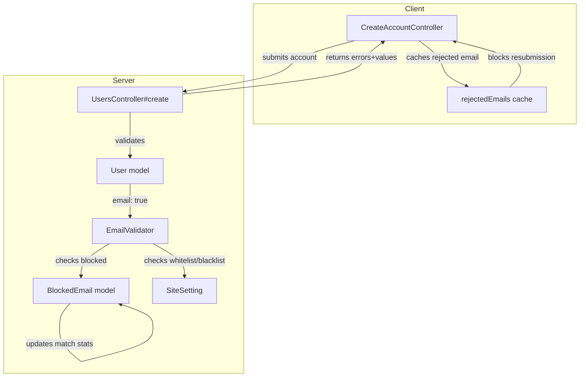

# Code Review: Add comprehensive email validation for blocked users

**PR**: discourse/ai-code-review-evaluation/discourse-graphite#3
**Preset**: behavioral-only
**Date**: 2026-04-13

## Intent Register

### Intent Claims

1. The system maintains a `blocked_emails` table to track emails that should be prevented from registering.
2. `BlockedEmail.should_block?(email)` checks if an email is in the blocked list and tracks match statistics (count, timestamp).
3. The `EmailValidator` validates emails against domain whitelists, domain blacklists, and the blocked email list.
4. Email domain whitelist/blacklist validation logic was extracted from the User model into a reusable `EmailValidator`.
5. The client-side controller caches server-rejected emails in `rejectedEmails` to prevent re-submission without round-tripping.
6. The server returns structured error data (`errors` hash and `values` hash) on account creation failure.
7. Each blocked email record has an `action_type` — either `:block` or `:do_nothing`.
8. Match statistics are updated whenever a blocked email is looked up, regardless of action type.
9. The `emailValidation` computed property reactively updates when `rejectedEmails` changes.
10. BlockedEmail records default to `:block` action type via `before_validation` callback.

### Intent Diagram

## Verified Findings

### F-01 — Guard prevents blocked email lookup when prior validation errors exist

| Field | Value |
|-------|-------|
| Sighting | MERGED-01 (G2-S-01 + IPT-S-01) |
| Location | `lib/validators/email_validator.rb`, `validate_each` method |
| Type | behavioral |
| Severity | major |
| Detection sources | t1-dead-code, intent-path-tracer |
| Confidence | 10.0 |

**Current behavior:** `BlockedEmail.should_block?(value)` is guarded by `record.errors[attribute].blank?`. When a whitelist or blacklist rule has already added an error to the attribute, `should_block?` is never called. Because `should_block?` performs its match statistics side effects (`match_count += 1`, `last_match_at` update, `save`) inside its own body, those database writes are silently skipped for any email that also fails domain restriction rules.

**Expected behavior:** Match statistics should be updated whenever a blocked email is looked up, regardless of other validation outcomes. The intent diagram shows `EV --> BE --> BE (updates match stats)` as an unconditional path.

**Source of truth:** Intent claim 8 — "Match statistics are updated whenever a blocked email is looked up, regardless of action type."

---

### F-02 — Silent discard of `record.save` return value in `should_block?`

| Field | Value |
|-------|-------|
| Sighting | G3-S-01 |
| Location | `app/models/blocked_email.rb`, `should_block?` method |
| Type | behavioral |
| Severity | major |
| Detection source | t1-signal-loss |
| Confidence | 9.6 |

**Current behavior:** `record.save` is called to persist match statistics but its return value is discarded. In Rails, `save` returns `false` on validation failure rather than raising. If the save fails (e.g., uniqueness race, validation error), the statistics update is silently lost with no logging or error propagation.

**Expected behavior:** Statistics updates should either use `save!` (to raise on failure) or check the return value, so that failures are observable.

**Source of truth:** Intent claim 2 — "`BlockedEmail.should_block?(email)` checks if an email is in the blocked list and tracks match statistics."

---

### F-03 — No case normalization in blocked email lookup

| Field | Value |
|-------|-------|
| Sighting | IPT-S-04 |
| Location | `app/models/blocked_email.rb`, `should_block?` method |
| Type | behavioral |
| Severity | major |
| Detection source | intent-path-tracer |
| Confidence | 10.0 |

**Current behavior:** `BlockedEmail.where(email: email).first` performs an exact-match query with no case normalization (`downcase`, `LOWER()`). On PostgreSQL (Discourse's default database), string comparison is case-sensitive. An email stored as `user@example.com` in the blocked list will not match a registration attempt with `User@Example.com`.

**Expected behavior:** The blocked email lookup should be case-insensitive, since email addresses are case-insensitive per RFC 5321. Without normalization, the block list can be trivially circumvented by varying the case of the email address.

**Source of truth:** Intent claim 1 — "The system maintains a `blocked_emails` table to track emails that should be prevented from registering."

---

### F-04 — Unsafe regex construction in domain restriction checker

| Field | Value |
|-------|-------|
| Sighting | IPT-S-06 |
| Location | `lib/validators/email_validator.rb`, `email_in_restriction_setting?` method |
| Type | behavioral |
| Severity | major |
| Detection source | intent-path-tracer |
| Confidence | 8.4 |

**Current behavior:** `email_in_restriction_setting?` builds a regex from the domain setting string by only escaping `.` characters via `setting.gsub('.', '\.')`, then interpolating the result directly into `Regexp.new("@(#{domains})", true)`. Other regex metacharacters (`+`, `*`, `(`, `)`, `[`, `]`, `?`, `^`, `$`) in the domain setting are passed raw to the regex engine. If a domain entry contains these characters, the regex could break or produce unintended matches.

**Expected behavior:** The domain setting should be properly escaped using `Regexp.escape` on individual domain entries before constructing the regex pattern, or the logic should use string comparison instead of regex.

**Source of truth:** Intent claim 3 — "The `EmailValidator` validates emails against domain whitelists, domain blacklists, and the blocked email list."

---

### F-05 — Wrong Ember observer key for primitive array membership changes

| Field | Value |
|-------|-------|
| Sighting | MERGED-02 (G1-S-04 + IPT-S-02) |
| Location | `app/assets/javascripts/discourse/controllers/create_account_controller.js`, `emailValidation` computed property |
| Type | behavioral |
| Severity | minor |
| Detection sources | t1-value-abstraction, intent-path-tracer |
| Confidence | 8.6 |

**Current behavior:** The computed property depends on `'rejectedEmails.@each'`. In Ember.js, `@each` is designed for observing changes to properties of array *items* (objects), not for observing array membership changes on arrays of primitives (strings). The correct observer key for detecting `pushObject`/`removeObject` on a primitive array is `rejectedEmails.[]` or `rejectedEmails.length`.

**Expected behavior:** The computed property should use `'rejectedEmails.[]'` to reliably trigger recomputation when rejected emails are added to the array.

**Source of truth:** Intent claim 9 — "The `emailValidation` computed property reactively updates when `rejectedEmails` changes."

---

### F-06 — No null guard on cached rejected email value

| Field | Value |
|-------|-------|
| Sighting | G3-S-02 |
| Location | `app/assets/javascripts/discourse/controllers/create_account_controller.js`, failure handler |
| Type | behavioral |
| Severity | minor |
| Detection source | t1-signal-loss |
| Confidence | 8.4 |

**Current behavior:** The failure handler pushes `result.values.email` into `rejectedEmails` without checking for null, undefined, or empty string. If the server returns `values: { email: "" }` or `values: { email: null }`, a zero-value sentinel is cached. Subsequently, when the email field is blank, `rejectedEmails.contains("")` returns true and the computed property shows an "invalid" error instead of the expected "required" error.

**Expected behavior:** The handler should validate that `result.values.email` is a non-empty string before caching it in `rejectedEmails`.

**Source of truth:** Intent claim 5 — "The client-side controller caches server-rejected emails in `rejectedEmails` to prevent re-submission without round-tripping."

---

### F-07 — Lost-update race condition on match statistics

| Field | Value |
|-------|-------|
| Sighting | IPT-S-07 |
| Location | `app/models/blocked_email.rb`, `should_block?` method |
| Type | behavioral |
| Severity | minor |
| Detection source | intent-path-tracer |
| Confidence | 8.4 |

**Current behavior:** The `should_block?` method reads `match_count` into Ruby memory, increments it (`record.match_count += 1`), and calls `record.save`. Under concurrent requests for the same blocked email, two processes both read the same `match_count` value, both increment to `N+1`, and both save — the second save overwrites the first, losing one count. An atomic SQL update (`UPDATE blocked_emails SET match_count = match_count + 1`) would avoid this.

**Expected behavior:** Match statistics should be accurately tracked under concurrent load.

**Source of truth:** Intent claim 2 — "`BlockedEmail.should_block?(email)` checks if an email is in the blocked list and tracks match statistics."

---

## Findings Summary

| Finding | Type | Severity | One-line description |
|---------|------|----------|---------------------|
| F-01 | behavioral | major | Guard skips blocked email lookup when prior validation errors exist |
| F-02 | behavioral | major | `record.save` return value silently discarded in `should_block?` |
| F-03 | behavioral | major | Case-sensitive blocked email lookup bypassable via case variation |
| F-04 | behavioral | major | Regex metacharacters unescaped in domain restriction checker |
| F-05 | behavioral | minor | Wrong Ember observer key (`@each` vs `[]`) for primitive array |
| F-06 | behavioral | minor | No null guard on cached rejected email value |
| F-07 | behavioral | minor | Lost-update race on `match_count` under concurrent requests |

**Totals:** 7 verified findings (4 major, 3 minor), 2 rejected sightings (false positives from prompt error), 5 out-of-charter filtered findings

## Filtered Findings

| Sighting | Type | Severity | Reason | Score |
|----------|------|----------|--------|-------|
| G1-S-03 | structural | minor | out-of-charter (behavioral-only preset) | N/A |
| G4-S-01 | structural | minor | out-of-charter (behavioral-only preset) | N/A |
| G4-S-02 | test-integrity | major | out-of-charter (behavioral-only preset) | N/A |
| IPT-S-03 | fragile | minor | out-of-charter (behavioral-only preset) | N/A |
| IPT-S-05 | fragile | minor | out-of-charter (behavioral-only preset) | N/A |

## Retrospective

### Sighting Counts

- **Total sightings generated:** 16 (before dedup)
- **After deduplication:** 14
- **Verified findings at termination:** 12
- **Rejected by Challenger:** 2 (G1-S-01, G1-S-02 — both false positives from erroneous prompt construction)
- **Findings passing charter filter:** 7 (all behavioral)
- **Findings passing confidence filter:** 7 (all scored >= 8.0)
- **Final findings:** 7
- **Out-of-charter filtered:** 5 (2 structural, 1 test-integrity, 2 fragile)
- **Nits:** 0

**By detection source:**
- checklist: 3 (G3-S-01, G3-S-02, G1-S-01/G1-S-02 rejected)
- structural-target: 2 (G1-S-03, G4-S-01 — out-of-charter)
- intent: 9 (MERGED-01, MERGED-02, IPT-S-03 through IPT-S-07, G4-S-02)

### Verification Rounds

- **Rounds to convergence:** 1
- **Hard cap reached:** No
- **Reason for termination:** All verified sightings either confirmed or rejected in Round 1. No weakened charter-passing sightings requiring follow-up.

### Scope Assessment

- **Files in scope:** 10 (4 modified, 6 new)
- **Languages:** Ruby (server), JavaScript (client), YAML (locale), Ruby (migration, specs)
- **Diff size:** ~290 lines across 10 files

### Context Health

- **Round count:** 1
- **Sightings in round 1:** 16 (before dedup), 14 (after dedup)
- **Rejection rate round 1:** 2/14 = 14.3%

### Tool Usage

- **Linter output:** N/A (benchmark mode — no project tooling available)
- **Tools used:** Read (diff file), Bash (filter scripts)

### Finding Quality

- **False positive rate (Challenger rejections):** 2/16 = 12.5%
- **False positive root cause:** Orchestrator introduced a typo in the code payload sent to T1 Group 1 agents — the migration's `match_count` column was incorrectly presented as a duplicate `action_type` column with `default: 0`. Both false positives originated from this single prompt construction error.
- **Breakdown by origin:** All findings are `introduced` (part of the PR changes)

### Intent Register

- **Claims extracted:** 10 (from diff analysis)
- **Sources:** PR diff (code structure, naming, comments)
- **Findings attributed to intent comparison:** 5 (F-01, F-03, F-05, F-06, F-07)
- **Intent claims invalidated:** None

### Per-Group Metrics

| Agent | Files reported / in scope | Sightings | Survival rate | Phase |
|-------|--------------------------|-----------|---------------|-------|
| t1-value-abstraction (G1) | 10/10 | 4 | 1/4 (25%) — 2 rejected, 1 out-of-charter | Enum |
| t1-dead-code (G2) | 10/10 | 1 | 1/1 (100%) — merged into MERGED-01 | Enum |
| t1-signal-loss (G3) | 10/10 | 2 | 2/2 (100%) | Enum |
| t1-behavioral-drift (G4) | 10/10 | 2 | 2/2 (100%) — both out-of-charter | Enum |
| intent-path-tracer | 5/5 entry points | 7 | 5/7 (71%) — 2 weakened then out-of-charter | Enum |

### Deduplication Metrics

- **Merge count:** 2
- **Merged pairs:** (G2-S-01, IPT-S-01) → MERGED-01; (G1-S-04, IPT-S-02) → MERGED-02

### Instruction Trace

- Agents spawned with inline code payloads and intent register claims
- No instruction files loaded (benchmark mode — agents receive full context via spawn prompt)
- **Prompt construction error noted:** File 6 (migration) was incorrectly transcribed in the T1 Group 1 spawn prompt, duplicating the `action_type` column line. This caused 2 false positive sightings (G1-S-01, G1-S-02) that were correctly caught and rejected by Challenger 1.
