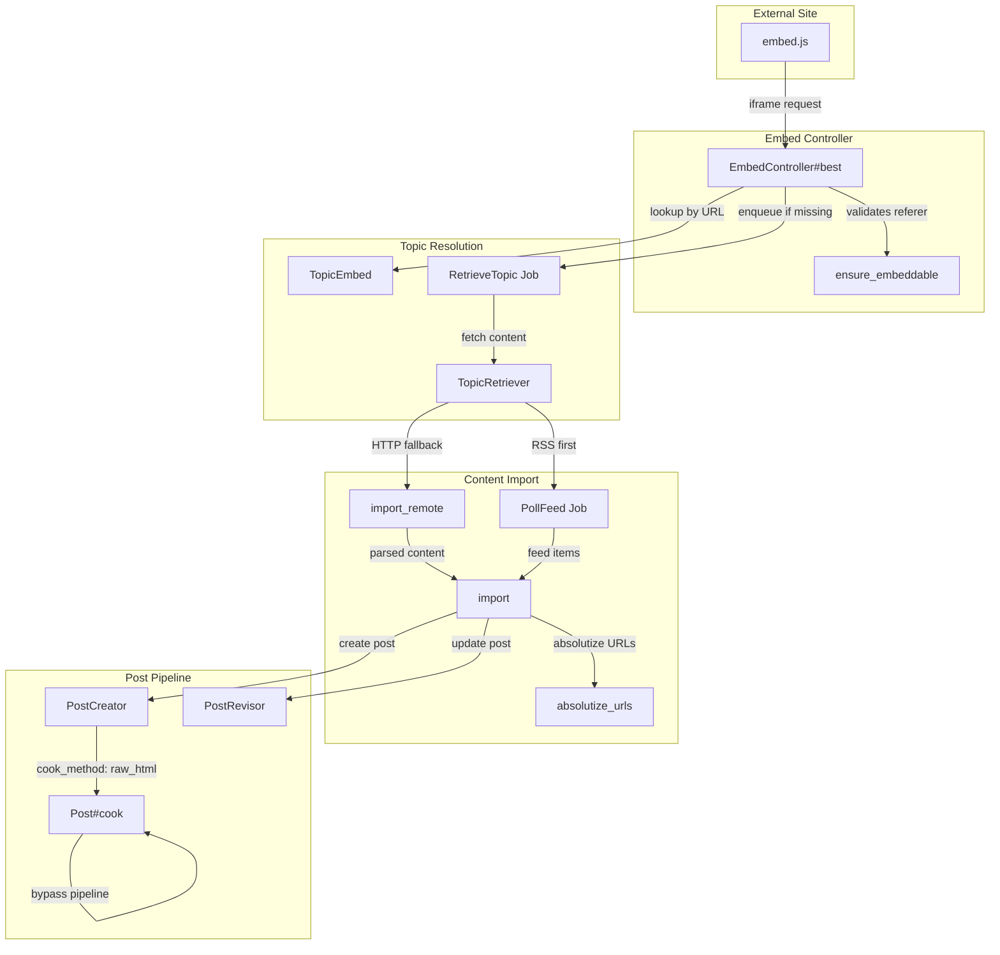

# Code Review: Enhance embed URL handling and validation system

**Instance**: discourse__ai-code-review-evaluation__discourse-graphite__PR4
**PR**: [Enhance embed URL handling and validation system](https://github.com/ai-code-review-evaluation/discourse-graphite/pull/4)
**Preset**: behavioral-only (Groups 1-4 + Intent Path Tracer)
**Linter output**: N/A (benchmark mode)

---

## Intent Register

### Intent Claims

1. External sites embed Discourse comments via an iframe; `embed.js` constructs the iframe URL and listens for resize postMessages
2. `EmbedController#best` looks up an existing `TopicEmbed` by URL; if found, renders the topic view with the top 5 posts; if not, enqueues a `RetrieveTopic` job and renders a loading page
3. `EmbedController#ensure_embeddable` validates that `embeddable_host` is configured and that the request referer matches the configured host
4. Embed responses set `X-Frame-Options: ALLOWALL` to permit iframe embedding
5. `TopicEmbed.import` creates or updates topics from external content, using `raw_html` cook method to bypass the rendering pipeline
6. `TopicEmbed.import` appends a source attribution link to imported content before storage
7. `TopicEmbed.absolutize_urls` converts relative `href` and `src` attributes to absolute URLs using the source URL's scheme/host/port
8. `TopicEmbed.import_remote` fetches remote HTML via `open(url)` and parses it with `ruby-readability`
9. `TopicRetriever` validates the embed URL host matches `embeddable_host` before retrieval
10. `TopicRetriever` throttles retrieval to once per 60 seconds per URL via Redis, bypassable for staff users
11. `TopicRetriever#perform_retrieve` checks RSS feed first (if enabled), then falls back to HTTP fetch
12. `PollFeed` scheduled job runs hourly, importing RSS/ATOM feed items as topics via `TopicEmbed.import`
13. `PollFeed` requires `feed_polling_enabled`, `feed_polling_url`, and `embed_by_username` settings to execute
14. `Post#cook` returns raw content unchanged when `cook_method` is `raw_html`, bypassing the rendering pipeline
15. `PostCreator` accepts and forwards `cook_method` option to the post
16. `PostRevisor#revise!` now supports `skip_validations` option, passing it to `post.save`
17. The loading view auto-refreshes via `document.location.reload()` after 30 seconds
18. The embed layout sends a `discourse-resize` postMessage to the parent window with the document body height on load
19. The Disqus Thor importer is refactored to use `TopicEmbed.import_remote` instead of direct `PostCreator`
20. Database migration creates `topic_embeds` table with unique index on `embed_url`
21. Database migration adds `cook_method` integer column to `posts` table with default 1

### Intent Diagram



---

## Verified Findings

### F-01 — Migration defaults all posts to raw_html, bypassing rendering pipeline

```
Finding ID: F-01
Sighting: M-01 (merged from G3-S-02, G4-S-01, IPT-S-02)
Location: db/migrate/20131219203905_add_cook_method_to_posts.rb:4, app/models/post.rb:296-311
Type: behavioral
Severity: critical
Current behavior: add_column :posts, :cook_method, :integer, default: 1, null: false sets
  every existing and new post's cook_method to 1. Post.cook_methods is Enum.new(:regular,
  :raw_html), assigning :regular=0 and :raw_html=1. Post#cook returns raw content unchanged
  when cook_method==1, bypassing the rendering pipeline for ALL posts in the database.
Expected behavior: raw_html should be a special mode for imported/embedded posts only. The
  default should be 0 (:regular) so ordinary posts continue through the normal rendering
  pipeline. The inline comment "# Default is to cook posts" confirms this intent.
Source of truth: Intent claims 14, 21; inline comment at post.rb:311
Evidence: Migration sets default: 1. Enum maps :raw_html to 1. Post#cook early-returns raw
  when cook_method matches :raw_html. Every pre-existing row receives cook_method=1 after
  migration. The comment "Default is to cook posts" directly contradicts the DB default.
Pattern label: zero-value-sentinel-ambiguity
```

### F-02 — postMessage origin check uses inverted substring match

```
Finding ID: F-02
Sighting: M-02 (merged from G4-S-02, IPT-S-01)
Location: app/assets/javascripts/embed.js:83-84
Type: behavioral
Severity: major
Current behavior: discourseUrl.indexOf(e.origin) === -1 checks whether e.origin appears
  as a substring inside discourseUrl. An attacker whose origin string is a substring of
  discourseUrl passes the guard. The check is semantically inverted — it should verify
  the message origin matches the Discourse URL, not that the origin is contained within it.
Expected behavior: Origin validation should use exact match (e.origin === expectedOrigin)
  or a properly bounded prefix check, not substring containment in the wrong direction.
Source of truth: Intent claim 1; standard postMessage origin validation
Evidence: discourseUrl includes path and query parameters (constructed as
  discourseUrl + "embed/best?embed_url=..."). An attacker controlling an embed_url parameter
  could inject their origin into discourseUrl, passing the indexOf check.
Pattern label: semantic-drift
```

### F-03 — PostRevisor discards save return value, causing silent data divergence

```
Finding ID: F-03
Sighting: S-06 (from G3-S-01)
Location: lib/post_revisor.rb:648, app/models/topic_embed.rb:355-357
Type: behavioral
Severity: major
Current behavior: @post.save(validate: !@opts[:skip_validations]) discards its return value.
  ActiveRecord#save returns false on validation failure without raising. The caller in
  TopicEmbed.import then unconditionally executes embed.update_column(:content_sha1,
  content_sha1), recording the new SHA even though the post was never actually updated.
Expected behavior: Save failures should be detected and propagated. The content_sha1 should
  only be updated when the post save succeeds, otherwise the hash and post content diverge
  permanently.
Source of truth: Intent claim 16; silent error discard checklist item
Evidence: PostRevisor#update_post does not check @post.save return. TopicEmbed.import calls
  revisor.revise! then unconditionally updates content_sha1 on the next line. On subsequent
  poll cycles, the SHA1 match prevents re-import, creating permanent data divergence.
Pattern label: silent-error-discard
```

### F-04 — PollFeed crashes on RSS items without content field

```
Finding ID: F-04
Sighting: M-04 (merged from G3-S-03, IPT-S-04)
Location: app/jobs/scheduled/poll_feed.rb:281-282
Type: behavioral
Severity: major
Current behavior: CGI.unescapeHTML(i.content.scrub) calls .scrub on i.content without a nil
  guard. RSS 2.0 items that use <description> rather than <content:encoded> have i.content==nil,
  causing NoMethodError: undefined method 'scrub' for nil:NilClass. This aborts processing of
  the entire remaining feed.
Expected behavior: Feed items that lack a content field should be handled gracefully, either
  by falling back to i.description or by skipping with a logged warning.
Source of truth: Intent claim 12; silent error discard checklist item
Evidence: simple-rss maps <content:encoded> to .content. Standard RSS 2.0 feeds commonly use
  only <description>. The nil case is unguarded and crashes the hourly scheduled job.
Pattern label: silent-error-discard
```

### F-05 — Disqus importer silently drops --category CLI option

```
Finding ID: F-05
Sighting: S-15 (from IPT-S-06)
Location: lib/tasks/disqus.thor:661-681
Type: behavioral
Severity: major
Current behavior: The refactoring removes method_option :category and replaces PostCreator.new
  (which accepted category: category_id) with TopicEmbed.import_remote (which has no category
  parameter). Topics are imported into the default/uncategorized category regardless of
  operator intent.
Expected behavior: The refactoring should preserve category assignment functionality, either
  by adding a category parameter to import_remote/import or by documenting the intentional
  removal of the feature.
Source of truth: Intent claim 19
Evidence: method_option :category deleted at line 661. category_id resolution block deleted at
  lines 669-672. PostCreator.new call with category: replaced by TopicEmbed.import_remote with
  no category support. No migration path or deprecation warning.
Pattern label: (none)
```

### F-06 — absolutize_urls port check is not scheme-aware

```
Finding ID: F-06
Sighting: S-09 (from G4-S-04)
Location: app/models/topic_embed.rb:376-385
Type: behavioral
Severity: minor
Current behavior: prefix << ":#{uri.port}" if uri.port != 80 && uri.port != 443 suppresses
  port 443 regardless of scheme (HTTP on port 443 loses port) and port 80 regardless of
  scheme (HTTPS on port 80 loses port).
Expected behavior: Port omission should be scheme-aware: omit only when the port matches
  the scheme's default (80 for HTTP, 443 for HTTPS). Use uri.port != uri.default_port or
  equivalent conditional.
Source of truth: Intent claim 7
Evidence: The conditional hardcodes both 80 and 443 as "always standard" regardless of scheme.
  HTTP URLs served on port 443 produce incorrect absolute URLs missing the port.
Pattern label: (none)
```

### F-07 — absolutize_urls skips non-root-relative URLs

```
Finding ID: F-07
Sighting: S-10 (from IPT-S-05)
Location: app/models/topic_embed.rb:376-396
Type: behavioral
Severity: minor
Current behavior: The href.start_with?('/') guard in both the <a> and  loops excludes
  any relative URL without a leading slash. URLs like href="images/photo.jpg" or
  href="../page.html" are silently left unmodified.
Expected behavior: The function comment states "Convert any relative URLs to absolute. RSS is
  annoying for this." RSS content frequently contains path-relative URLs that should be
  converted. The implementation should handle non-root-relative URLs as well.
Source of truth: Intent claim 7; function comment at line 375
Evidence: The start_with?('/') condition at lines 383 and 389 excludes all non-slash-prefixed
  relative URLs. Production call path: PollFeed -> TopicEmbed.import -> absolutize_urls.
Pattern label: (none)
```

---

## Filtered Findings

| ID | Type | Severity | Reason | Score |
|---|---|---|---|---|
| M-03 | test-integrity | major | Out-of-charter (test-integrity not in behavioral-only preset) | 10.0 |
| S-07 | fragile | minor | Out-of-charter (fragile not in behavioral-only preset) + below-threshold (7.0) | 7.0 |

---

## Findings Summary

| Finding | Type | Severity | Description |
|---|---|---|---|
| F-01 | behavioral | critical | Migration defaults all posts to raw_html cook_method, bypassing rendering pipeline |
| F-02 | behavioral | major | postMessage origin check uses inverted substring match allowing spoofed origins |
| F-03 | behavioral | major | PostRevisor discards save return value, causing silent SHA1/content divergence |
| F-04 | behavioral | major | PollFeed crashes on RSS items without content field (nil.scrub) |
| F-05 | behavioral | major | Disqus importer silently drops --category CLI option in refactoring |
| F-06 | behavioral | minor | absolutize_urls port check is not scheme-aware |
| F-07 | behavioral | minor | absolutize_urls skips non-root-relative URLs |

**Totals**: 7 verified findings (1 critical, 4 major, 2 minor). 6 rejections. 2 filtered. 4 nits.

---

## Retrospective

### Sighting counts

- **Total sightings generated**: 17 (raw from 5 agents)
- **After deduplication**: 15 (4 merge events eliminated 2 sightings)
- **Verified findings at termination**: 9 (after Challenger)
- **Findings after filtering**: 7 (2 filtered: 1 charter, 1 charter+confidence)
- **Rejections**: 6 (S-05: insufficient diff evidence; S-08: incorrect behavioral claim; S-11: nit; S-12: nit; S-13: nit; S-14: nit)
- **Nit count**: 4 (S-11 comment-code drift derivative of F-01; S-12 bare literal 30000; S-13 bare literal 5; S-14 bare literal 60)

**By detection source**:
- checklist: 4 (F-01, F-03, F-04 via signal-loss; F-02 via behavioral-drift)
- intent: 5 (F-02, F-04, F-05, F-06, F-07 via intent-path-tracer)
- structural-target: 0

**Structural sub-categorization**: N/A (no structural-type findings survived filtering)

### Verification rounds

- **Round 1**: 17 sightings → 15 deduplicated → 9 verified → 7 after filtering
- **Round 2**: Not executed. Diff-only context provides no additional code for agents to discover; all 962 lines were read by all agents in round 1. Eligible agents: G1, G3, G4, IPT (G2 ineligible — S-05 rejected). Termination rationale: re-examining identical code would not produce new sightings.

### Scope assessment

- **Files in scope**: 22 files across the diff (controllers, models, jobs, views, migrations, specs, config)
- **Lines of diff**: 962
- **Context**: diff-only benchmark review, no surrounding repository

### Context health

- **Round count**: 1 (terminated due to diff-only saturation)
- **Sightings-per-round trend**: 17 (round 1 only)
- **Rejection rate**: 6/15 = 40% (round 1)
- **Hard cap reached**: No

### Tool usage

- **Project-native tools**: N/A (benchmark mode, no linters available)
- **Grep/Glob fallback**: Agents used Read on the diff file

### Finding quality

- **False positive rate**: TBD (pending user review)
- **False negative signals**: TBD (pending user review)
- **Origin breakdown**: All findings marked as `introduced` (new code in PR)

### Intent register

- **Claims extracted**: 21 (from diff code structure, comments, function names)
- **Sources**: code inspection only (no specs, no documentation beyond inline comments)
- **Findings attributed to intent comparison**: F-02, F-04, F-05, F-06, F-07 (5 findings from intent-path-tracer)
- **Intent claims invalidated**: Claim 21 partially — states "default 1" which is technically accurate but behaviorally wrong (should be 0)

### Per-group metrics

| Agent | Files Reported | Sighting Volume | Survival Rate | Notes |
|---|---|---|---|---|
| t1-value-abstraction (G1) | 22/22 | 5 | 2/5 (40%) | 2 survived Challenger but both filtered (charter/confidence) |
| t1-dead-code (G2) | 22/22 | 1 | 0/1 (0%) | S-05 rejected for insufficient diff evidence |
| t1-signal-loss (G3) | 22/22 | 3 | 3/3 (100%) | All sightings verified; 2 merged with other agents |
| t1-behavioral-drift (G4) | 22/22 | 5 | 4/5 (80%) | S-11 rejected as nit (derivative of F-01) |
| intent-path-tracer (IPT) | 10/10 entry points | 6 | 5/6 (83%) | S-08 rejected (incorrect postMessage spec claim) |

### Deduplication metrics

- **Merge count**: 4
- **Merged pairs**: G3-S-02 + G4-S-01 + IPT-S-02 → M-01; G4-S-02 + IPT-S-01 → M-02; G1-S-01 + G4-S-03 → M-03; G3-S-03 + IPT-S-04 → M-04

### Instruction trace

- Per-agent instruction files: agent definition files loaded at spawn
- Prompt composition: ~500 tokens instructions + ~200 tokens intent claims + diff file path (agents read diff via Read tool)

