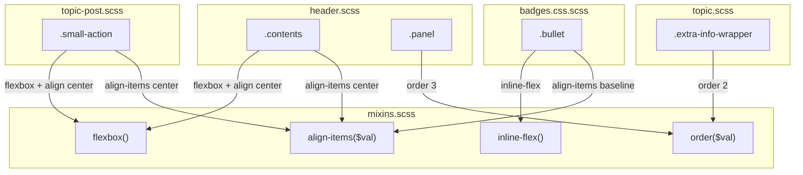

# Code Review: Optimize header layout performance with flexbox mixins

**PR**: [discourse-graphite#5](https://github.com/ai-code-review-evaluation/discourse-graphite/pull/5)
**Preset**: behavioral-only (Groups 1-4 + Intent Path Tracer)
**Source of truth**: AI failure mode checklist + structural detection targets (no spec available)

---

## Intent Register

### Intent Claims

1. The PR replaces float-based header layout with flexbox for improved performance and alignment control
2. New SCSS mixins (`flexbox`, `inline-flex`, `align-items`, `order`) provide vendor-prefixed cross-browser flexbox support targeting webkit, moz, ms, and standard properties
3. `.contents` in the header switches from containing floated children to being a flex container with center-aligned items
4. `.title` no longer needs `float: left` because the parent flex container handles child positioning
5. `.panel` replaces `float: right` with `margin-left: auto` and `order(3)` for flex-based right-alignment
6. `.extra-info-wrapper` receives `order(2)` for explicit flex ordering and removes bullet badge margin-top compensation
7. `.small-action` becomes a flex container with center-aligned items, replacing margin/padding-based vertical alignment
8. `.small-action-desc` padding simplifies from `0.5em 0 0.5em 4em` to `0 1.5%` since flex layout handles element spacing
9. Badge `.bullet` style replaces direct `display: inline-flex` and `align-items: baseline` with the new vendor-prefixed mixins
10. The `align-items` mixin translates a single value parameter to five vendor-prefixed variants
11. The `order` mixin translates a single value parameter to five vendor-prefixed variants including `-webkit-box-ordinal-group` and `-moz-box-ordinal-group`

### Intent Diagram

---

## Verified Findings

### F-01 — Invalid vendor-prefixed property in `align-items` mixin

| Field | Value |
|-------|-------|
| Sighting | M-01 (merged from G1-S-01, G2-S-01, G3-S-01, G4-S-01, IPT-S-03) |
| Location | `app/assets/stylesheets/common/foundation/mixins.scss`, `@mixin align-items` |
| Type | behavioral |
| Severity | minor |
| Current behavior | The `align-items()` mixin emits `-ms-align-items: $alignment` as one of five vendor-prefixed declarations. This property does not exist in any version of the IE/MS flexbox specification and is silently ignored by all browsers. |
| Expected behavior | Only valid vendor-prefixed properties should be emitted. The correct IE10/IE11 property is `-ms-flex-align`, which is already present in the mixin on the preceding line. |
| Source of truth | AI failure mode checklist (dead infrastructure); CSS Flexbox specification — IE10 implemented the March 2012 draft which defines `-ms-flex-align`, not `-ms-align-items` |
| Evidence | The mixin contains both `-ms-flex-align: $alignment` (correct) and `-ms-align-items: $alignment` (fabricated) on consecutive lines. The dead declaration is emitted at every `align-items()` call site: header.scss (`.contents`), topic-post.scss (`.small-action`), and badges.css.scss (`.bullet`). Confirmed by all 5 detection agents independently. |
| Pattern label | invalid-vendor-prefix |
| Confidence | 10.0 (pass) |

---

## Filtered Findings

| Sighting | Type | Severity | Filter | Reason | Score |
|----------|------|----------|--------|--------|-------|
| M-02 | structural (reclassified from behavioral) | minor | charter | Out-of-charter: `align-items` value keyword translation gap (flex-start/flex-end not mapped to start/end for legacy properties). Weakened: latent defect only — current call sites use safe values (center, baseline). | 8.6 |
| M-03 | structural (reclassified from behavioral) | minor | charter | Out-of-charter: `order()` mixin off-by-one between 0-based CSS3 order and 1-based legacy ordinal-group. Weakened: latent defect — current call sites use 2 and 3, not 0. | 10.0 |
| M-04 | structural (reclassified from behavioral) | major | charter | Out-of-charter: `float: right` removed from `.panel` without fallback for non-flex rendering paths. Weakened: noscript/non-Ember path existence unconfirmed from CSS diff alone. | 8.6 |
| G2-S-03 | structural (reclassified from behavioral) | info | charter + confidence | `order(2)` on `.extra-info-wrapper` may be ineffective if element is not a direct flex child. DOM ancestry unconfirmed from CSS diff. | 6.4 |
| IPT-S-04 | behavioral | minor | confidence | `.small-action-desc` padding unit change from `em` to `%`. Weakened: overlap claim invalid under flex layout — flex siblings cannot overlap. Residual concern: tight gutter at narrow viewports. | 5.6 |
| G1-S-03 | structural | minor | charter | Bare order integer literals (2, 3) across two files without named SCSS variables. | N/A |
| G4-S-03 | structural | minor | charter | `float: left` on `.badge-wrapper` is dead code in flex context. | N/A |
| G4-S-05 | structural | info | charter | Section comment `//Flexbox` understates mixin scope. | N/A |
| IPT-S-05 | structural | minor | charter | Inconsistent vendor-prefix declaration ordering between `flexbox()` and `inline-flex()` mixins. | N/A |
| IPT-S-06 | structural | info | charter | Undocumented `line-height: 1.5` addition to `.extra-info-wrapper`. | N/A |
| IPT-S-07 | structural | info | charter | Diff hunk brace ambiguity between `.contents` and `.title` blocks. | 4.8 |

---

## Findings Summary

- **Verified findings**: 1
- **Rejections**: 0
- **Filtered (out-of-charter)**: 8
- **Filtered (below confidence threshold)**: 2 (1 also out-of-charter)
- **False positive rate**: 0% (0 rejected by Challenger)

---

## Retrospective

### Sighting Counts

| Metric | Count |
|--------|-------|
| Total sightings generated | 18 |
| After deduplication | 12 |
| Passed charter filter (behavioral-only) | 6 |
| Sent to Challenger | 6 |
| Challenger confirmed | 1 |
| Challenger weakened | 5 |
| Challenger rejected | 0 |
| Verified findings (post-filter) | 1 |
| Nits | 1 (trailing space in mixin) |

**By detection source:**
- checklist: 3 sightings
- structural-target: 9 sightings
- intent: 6 sightings

**Structural sub-categorization (all filtered):**
- Dead code/infrastructure: 3 (G2-S-03, G4-S-03, `-ms-align-items` overlap with F-01)
- Bare literals: 1 (G1-S-03)
- Composition opacity: 0

### Verification Rounds

- **Round 1**: 18 sightings from 5 agents → 12 after dedup → 6 passed charter → 1 survived both gates
- **Round 2**: Not executed. All weakened sightings were reclassified to structural (out-of-charter) or failed confidence. CSS-only diff surface exhausted.
- **Hard cap reached**: No (terminated after 1 round)

### Scope Assessment

- **Files reviewed**: 5 SCSS files (diff-only, no repo access)
- **Lines changed**: ~50 lines across 5 files
- **Context**: Diff-only benchmark run, no repository browsing available

### Context Health

- **Rounds**: 1
- **Sightings-per-round trend**: 18 (round 1 only)
- **Rejection rate**: 0% (0 rejected, 5 weakened)
- **Charter filter impact**: 66% of sightings filtered as structural in behavioral-only preset — expected for a CSS refactoring PR where most issues are structural/fragile rather than behavioral

### Tool Usage

- **Linter**: N/A (benchmark mode, no project tooling)
- **Project tools**: N/A

### Finding Quality

- **False positive rate**: 0% (no findings rejected by user — benchmark mode)
- **Origin breakdown**: All findings `introduced` (PR diff is the change set)
- **Behavioral-only preset limitation**: The preset correctly surfaced the `-ms-align-items` fabricated property (F-01). However, the most architecturally significant issues — the `order()` value translation gap (M-03), the missing float fallback (M-04), and the `align-items` keyword translation gap (M-02) — were all weakened to structural/fragile by the Challenger and filtered by the behavioral-only charter. A `full` preset would have retained M-02, M-03, and M-04 as findings.

### Intent Register

- **Claims extracted**: 11 (from PR title and diff content)
- **Findings attributed to intent**: IPT-S-03 (merged into M-01), IPT-S-01 (merged into M-02), IPT-S-02 (merged into M-03)
- **Intent claims invalidated**: None

### Per-Group Metrics

| Agent | Files Reported | Sightings | Survival Rate | Phase |
|-------|---------------|-----------|---------------|-------|
| G1 (value-abstraction) | 3/5 | 3 | 1/3 (33%) | P1: 3, P2: 0 |
| G2 (dead-code) | 4/5 | 4 | 1/4 (25%) | P1: 4, P2: 0 |
| G3 (signal-loss) | 1/5 | 2 | 1/2 (50%) | P1: 2, P2: 0 |
| G4 (behavioral-drift) | 4/5 | 5 | 1/5 (20%) | P1: 5, P2: 0 |
| IPT (intent-path-tracer) | 5/5 | 7 | 1/7 (14%) | P1: 7, P2: 0 |

### Deduplication Metrics

| Merge | Surviving ID | Merged IDs | Agent Count |
|-------|-------------|------------|-------------|
| 1 | M-01 | G1-S-01, G2-S-01, G3-S-01, G4-S-01, IPT-S-03 | 5 |
| 2 | M-02 | IPT-S-01, G3-S-02 | 2 |
| 3 | M-03 | IPT-S-02, G1-S-02, G2-S-04, G4-S-04 | 4 |
| 4 | M-04 | G2-S-02, G4-S-02 | 2 |

**Total merges**: 4 (reduced 18 → 12 sightings, 33% reduction)

### Instruction Trace

- Agents spawned: 5 Tier 1 detectors + 1 Intent Path Tracer + 1 Sighting Deduplicator + 2 Challengers = 9 total
- Instruction files: code-review-guide.md, ai-failure-modes.md, quality-detection.md
- Payload: identical diff content across all T1 agents (cache-optimized ordering)

### Observations

1. **CSS-only diffs compress the behavioral detection surface.** Most genuine issues in CSS refactoring are structural (dead code, missing fallbacks, vendor prefix errors). The behavioral-only preset correctly identified the one pure behavioral issue (fabricated property name) but filtered several architecturally important findings that the Challenger reclassified to structural.

2. **High agent convergence on `-ms-align-items`.** All 5 agents independently flagged the invalid vendor prefix — the highest convergence in this review. This validates the detection target's effectiveness for CSS-specific dead code patterns.

3. **Challenger reclassification as a filtering mechanism.** The Challenger's reclassification of M-02, M-03, and M-04 from behavioral to structural was technically correct (latent defects, not currently exercised). But this interacts with the charter filter to suppress findings that would be valuable under a `full` preset. In CSS reviews, a wider preset may be more appropriate.

