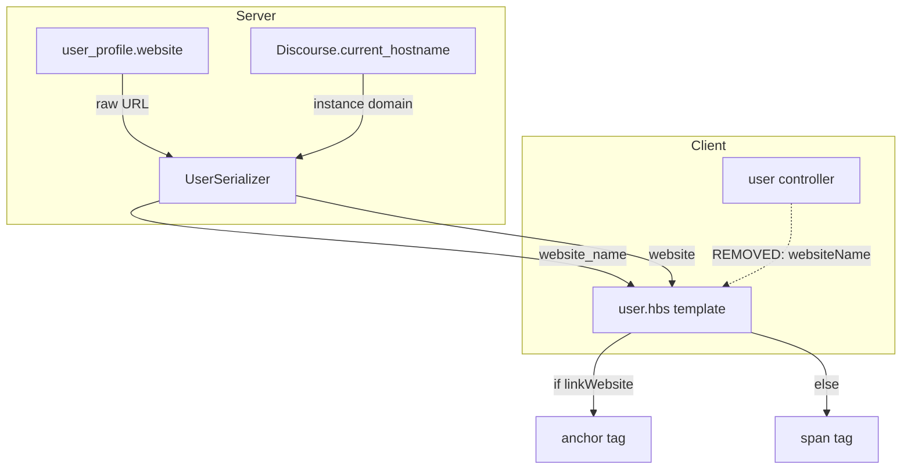

# Code Review: UX: show complete URL path if website domain is same as instance domain

**Instance**: discourse__ai-code-review-evaluation__discourse-graphite__PR6
**PR**: [#6](https://github.com/ai-code-review-evaluation/discourse-graphite/pull/6)
**Preset**: behavioral-only
**Date**: 2026-04-13

## Intent Register

### Intent Claims

1. When a user's website URL domain matches the Discourse instance domain exactly, the profile displays the full URL path (e.g., `example.com/user`) instead of just the domain
2. When the website domain differs from the instance domain, only the domain name is displayed (e.g., `example.com`)
3. Subdomain matching: when website and instance share the same parent domain but differ in subdomain (e.g., `www.example.com` vs `forum.example.com`), the full path is shown
4. Parent domain matching: when the instance domain is a subdomain of the website domain (e.g., `forums.example.com` hosting, user profile links to `example.com/user`), the full path is shown
5. The `websiteName` computed property is moved from client-side controller to server-side serializer as `website_name`
6. The `website_name` attribute is conditionally included — only serialized when the user has a website set
7. A pre-existing JSDoc comment misattributing `profileBackground` as `websiteName` is corrected

### Intent Diagram



## Verified Findings

**Finding count**: 4 verified | **Rejections**: 3 (nits) | **Filtered**: 5 (4 out-of-charter, 1 below-threshold)

### F-01: `include_website_name` missing required `?` suffix (G2-S-01)

```
Finding ID: F-01
Sighting: G2-S-01
Location: app/serializers/user_serializer.rb, include_website_name method
Type: behavioral
Severity: major
Current behavior: The method is named `include_website_name` without a trailing `?`. ActiveModelSerializers 0.8.x (the version in use, evidenced by ObjectController references) resolves conditional attribute inclusion by calling `include_<attribute>?`. The method without `?` is never called by the framework. As a result, `website_name` is unconditionally serialized for every user, including those without a website set, emitting `website_name: null` in every user payload.
Expected behavior: `website_name` should only be serialized when the user has a website set (intent claim 6). The method must be named `include_website_name?`.
Source of truth: Intent claim 6
Evidence: AMS 0.8.x convention requires the `?` suffix. The method body `website.present?` is correct but never invoked.
Confidence: 10.0
```

### F-02: Website-is-subdomain-of-instance case not handled (G1-S-03)

```
Finding ID: F-02
Sighting: G1-S-03
Location: app/serializers/user_serializer.rb, website_name method, branch logic
Type: behavioral
Severity: major
Current behavior: When discourse_host is `example.com` (2 segments) and website_host is `www.example.com` (3 segments): Branch 1 fails (not equal), Branch 2 fails (segment counts differ: 3 != 2), Branch 3 checks `"example.com".ends_with?(".www.example.com")` which is false. Returns only hostname `www.example.com` without path. The website IS a subdomain of the instance domain, but no branch handles this direction of the relationship.
Expected behavior: When the user's website is on a subdomain of the Discourse instance domain (e.g., website at `www.example.com`, instance at `example.com`), the full path should be shown.
Source of truth: Intent claim 3 (subdomain matching)
Evidence: Traced all three branches with concrete inputs. The code handles instance-is-subdomain-of-website (Branch 3) but not the reverse.
Confidence: 10.0
```

### F-03: ccTLD domains produce false positive "same parent domain" match (IPT-S-01)

```
Finding ID: F-03
Sighting: IPT-S-01
Location: app/serializers/user_serializer.rb, website_name method, elsif branch
Type: behavioral
Severity: major
Current behavior: For ccTLD domains like `example.co.uk` (website) and `forum.co.uk` (instance), both have 3 segments. The elsif branch strips the first segment: `co.uk == co.uk` matches, so the method returns the full path. These are entirely distinct registered domains that share only a public suffix (`co.uk`), not a meaningful parent domain.
Expected behavior: The elsif branch should only match when website and instance share the same registrable parent domain (e.g., `www.example.com` vs `forum.example.com`), not when they merely share a TLD/ccTLD suffix.
Source of truth: Intent claim 3
Evidence: Traced elsif with website_host="example.co.uk", discourse_host="forum.co.uk": lengths both 3, both > 2, `[1..-1]` yields `co.uk == co.uk` → true. Extends to all multi-segment public suffixes (.com.au, .co.jp, .org.uk).
Confidence: 10.0
```

### F-04: Path distinction collapses for URLs without a path component (IPT-S-04)

```
Finding ID: F-04
Sighting: IPT-S-04
Location: app/serializers/user_serializer.rb, website_name method, all matching branches
Type: behavioral
Severity: minor
Current behavior: When a website URL has no path (e.g., `http://example.com`), `URI().path` returns `""`. The matching branch returns `"example.com" + ""` = `"example.com"` — byte-for-byte identical to the non-matching fallback. A consumer cannot distinguish "same domain, no path to show" from "different domain, showing only host."
Expected behavior: The "show full path" intent (claim 1) is vacuously satisfied when no path exists. The output is functionally correct but the semantic distinction between match and non-match is lost.
Source of truth: Intent claim 1
Evidence: Ruby `URI("http://example.com").path` returns `""`. Concatenation produces identical output to the domain-only fallback.
Confidence: 9.6
```

## Filtered Findings

| Sighting | Type | Severity | Reason | Score |
|----------|------|----------|--------|-------|
| G1-S-02 | structural | minor | out-of-charter (behavioral-only preset) | N/A |
| G1-S-04 | structural | minor | out-of-charter (behavioral-only preset) | N/A |
| G4-S-01 | structural | minor | out-of-charter (behavioral-only preset) | N/A |
| IPT-S-02 | test-integrity | major | out-of-charter (behavioral-only preset) | N/A |
| G1-S-05 | behavioral | major | below-threshold (confidence: 5.6) | 5.6 |

## Retrospective

### Sighting Counts

- **Total sightings generated**: 14 (pre-dedup), 11 (post-dedup)
- **Verified findings at termination**: 9
- **Findings surviving filters**: 4
- **Rejections**: 3 (all nits)
- **Nit count**: 3 (G1-S-01: bare literal, G3-S-02: asymmetric rescue, G4-S-02: test context naming)

**Breakdown by detection source**:
- checklist: 6 sightings (G1-S-01, G1-S-04/G3-S-01 merged, G1-S-05, G3-S-02/IPT-S-03 merged, G4-S-01, G4-S-02)
- structural-target: 2 sightings (G1-S-02, G2-S-01)
- intent: 5 sightings (G1-S-03, IPT-S-01, IPT-S-02, IPT-S-04)

**Structural sub-categorization**: redundant computation (G1-S-02), silent error discard (G1-S-04)

### Verification Rounds

- **Rounds**: 1
- **Convergence**: Round 1 produced confirmed findings; no weakened-but-unrejected sightings survived filters, so no Round 2 needed
- **Hard cap reached**: No

### Scope Assessment

- **Files reviewed**: 5 (user controller, user model, user template, user serializer, serializer spec)
- **Lines of diff**: ~125
- **Primary focus**: `user_serializer.rb` (all 4 surviving findings target this file)

### Context Health

- **Round count**: 1
- **Sightings-per-round**: 14 (pre-dedup)
- **Rejection rate**: 3/11 = 27% (post-dedup nit rejections)
- **Hard cap reached**: No

### Tool Usage

- **Linter output**: N/A (diff-only review, no project tooling available)
- **Tools used**: Read (diff file), Grep/Glob (reference doc discovery)

### Finding Quality

- **False positive rate**: TBD (pending user review)
- **Breakdown by origin**: All findings are `introduced` (new code in this PR)

### Intent Register

- **Claims extracted**: 7 (from PR title, diff structure, code comments, test descriptions)
- **Findings attributed to intent**: 3 (F-02: claim 3, F-03: claim 3, F-04: claim 1)
- **Claims invalidated**: None

### Per-Group Metrics

| Agent | Files Reported | Sightings | Survival Rate | Verified Above Info |
|-------|---------------|-----------|---------------|---------------------|
| T1-G1 (value-abstraction) | 5/5 | 5 | 2/5 (40%) | Yes (G1-S-03) |
| T1-G2 (dead-code) | 5/5 | 1 | 1/1 (100%) | Yes (G2-S-01) |
| T1-G3 (signal-loss) | 5/5 | 2 | 0/2 (0%*) | No (merged into others) |
| T1-G4 (behavioral-drift) | 5/5 | 2 | 1/2 (50%) | No (charter-filtered) |
| Intent Path Tracer | 3/3 | 4 | 3/4 (75%) | Yes (IPT-S-01) |

*G3's sightings were merged with sightings from other agents; the merged survivors were credited to the original sighting owners.

### Deduplication Metrics

- **Merge count**: 2
- **Merged pairs**: (G1-S-04, G3-S-01) → G1-S-04; (G3-S-02, IPT-S-03) → G3-S-02

### Instruction Trace

- **Per-agent instruction files**: code-review-guide.md, ai-failure-modes.md, quality-detection.md
- **Prompt composition**: ~70% code payload, ~20% intent register + instructions, ~10% detection targets
