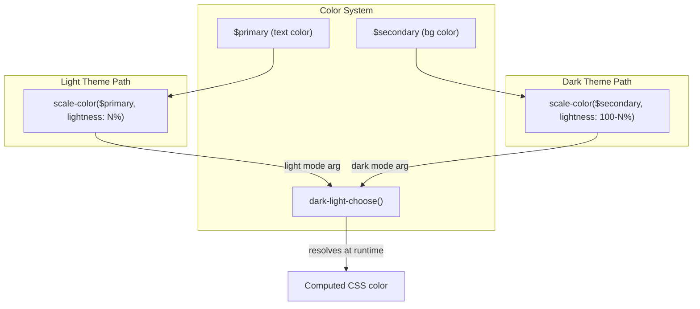

# Code Review: scale-color $lightness must use $secondary for dark themes

**PR**: discourse-graphite PR #7
**Instance**: discourse__ai-code-review-evaluation__discourse-graphite__PR7
**Preset**: behavioral-only

## Intent Register

### Intent Claims

1. The PR adds dark theme support by wrapping bare `scale-color($primary, $lightness: N%)` calls with Discourse's `dark-light-choose()` helper to select theme-appropriate colors.
2. For dark themes, `$secondary` replaces `$primary` as the base color for `scale-color()`, because `$primary` is the foreground text color (dark on light themes, light on dark themes) and `$secondary` is the background color.
3. The dark-theme lightness value is the complement of the light-theme value (100% - N%), producing equivalent visual contrast on dark backgrounds.
4. Light-theme behavior should be preserved — the first argument to `dark-light-choose()` must match the original `scale-color($primary, $lightness: N%)` value exactly.
5. The transformation is mechanical and uniform across all SCSS files in the `app/assets/stylesheets/` directory.
6. Both desktop and mobile stylesheets receive the same treatment for cross-platform consistency.

### Intent Diagram



## Verified Findings

### F-01 — Light/dark argument swap in desktop reply links

```
Finding ID: F-01
Sighting: S-01
Location: app/assets/stylesheets/desktop/topic-post.scss, line ~291
Type: behavioral
Severity: major
Current behavior: The light-theme argument is scale-color($primary, $lightness: 70%), but the
  original value was scale-color($primary, $lightness: 30%). The dark-theme argument uses 30%
  instead of the correct complement 70%. The two arguments are transposed — the complement
  value is in the light slot and the original value is in the dark slot.
Expected behavior: dark-light-choose(scale-color($primary, $lightness: 30%),
  scale-color($secondary, $lightness: 70%)) — light-theme preserved at 30%, dark at complement 70%.
Source of truth: IC-3 (complement formula), IC-4 (light-theme preservation)
Evidence: Removed line: scale-color($primary, $lightness: 30%). Added line first arg: 70%,
  second arg: 30%. Values are transposed. Desktop h3 replacement at lines 632-633 demonstrates
  the correct pattern with 20%/80%.
Pattern label: argument-swap
```

### F-02 — .name lightness collapsed to match .title in desktop user page

```
Finding ID: F-02
Sighting: S-02
Location: app/assets/stylesheets/desktop/user.scss, line ~522
Type: behavioral
Severity: major
Current behavior: The .name selector's light-theme color uses scale-color($primary, $lightness: 50%),
  identical to the .title selector immediately below. The original .name lightness was 30%,
  creating a visual hierarchy distinction that is now lost. Both light and dark args are 50%/50%.
Expected behavior: dark-light-choose(scale-color($primary, $lightness: 30%),
  scale-color($secondary, $lightness: 70%)) — preserving the 30% distinction from .title's 50%.
Source of truth: IC-4 (light-theme preservation), IC-3 (complement formula)
Evidence: Removed line at 772: scale-color($primary, $lightness: 30%). Added line at 773:
  both args 50%/50%. Lines 778-779: .title was already 50%, replaced with 50%/50%. The two
  selectors now produce identical computed colors.
Pattern label: value-collapse
```

### F-03 — Light/dark argument swap in mobile custom-message-length

```
Finding ID: F-03
Sighting: S-03
Location: app/assets/stylesheets/mobile/modal.scss, line ~101
Type: behavioral
Severity: major
Current behavior: .custom-message-length light-theme argument is scale-color($primary,
  $lightness: 30%), but the original was 70%. The dark-theme argument is 70%. The values
  are swapped relative to the desktop counterpart (desktop/modal.scss correctly uses 70%/30%).
Expected behavior: dark-light-choose(scale-color($primary, $lightness: 70%),
  scale-color($secondary, $lightness: 30%)) — matching the desktop transformation.
Source of truth: IC-4 (light-theme preservation), IC-6 (desktop/mobile parity)
Evidence: Mobile removed line: scale-color($primary, $lightness: 70%). Mobile added line:
  first arg 30%, second arg 70% — inverted. Desktop added line (line 467): first arg 70%,
  second arg 30% — correct.
Pattern label: argument-swap
```

### F-04 — h3 lightness collapsed in mobile topic post

```
Finding ID: F-04
Sighting: S-04
Location: app/assets/stylesheets/mobile/topic-post.scss, line ~182
Type: behavioral
Severity: major
Current behavior: The h3 element uses scale-color($primary, $lightness: 50%) for both light
  and dark themes. The original value was 20%. The h4 immediately below was and remains at 50%.
  The heading hierarchy distinction (darker h3 at 20% vs lighter h4 at 50%) is erased.
  The desktop counterpart correctly preserves 20%/80%.
Expected behavior: dark-light-choose(scale-color($primary, $lightness: 20%),
  scale-color($secondary, $lightness: 80%)) — matching the desktop transformation.
Source of truth: IC-3 (complement formula), IC-4 (light-theme preservation), IC-6 (desktop/mobile parity)
Evidence: Mobile removed line: scale-color($primary, $lightness: 20%). Mobile added line:
  both args 50%/50%. Desktop added line (line 633): 20%/80% — correct.
Pattern label: value-collapse
```

### F-05 — .name lightness collapsed in mobile user page

```
Finding ID: F-05
Sighting: S-05
Location: app/assets/stylesheets/mobile/user.scss, line ~497
Type: behavioral
Severity: major
Current behavior: The .name selector uses scale-color($primary, $lightness: 50%) for both
  light and dark themes. The original value was 30%. The .title selector immediately below
  was and remains at 50%. Same error pattern as F-02 in the desktop counterpart.
Expected behavior: dark-light-choose(scale-color($primary, $lightness: 30%),
  scale-color($secondary, $lightness: 70%)) — preserving the 30% distinction.
Source of truth: IC-4 (light-theme preservation), IC-3 (complement formula)
Evidence: Removed line at 1044: scale-color($primary, $lightness: 30%). Added line at 1045:
  both args 50%/50%. Lines 1051-1052: .title replacement also 50%/50%.
Pattern label: value-collapse
```

### Findings Summary

| ID | Type | Severity | Pattern | Location |
|----|------|----------|---------|----------|
| F-01 | behavioral | major | argument-swap | desktop/topic-post.scss |
| F-02 | behavioral | major | value-collapse | desktop/user.scss |
| F-03 | behavioral | major | argument-swap | mobile/modal.scss |
| F-04 | behavioral | major | value-collapse | mobile/topic-post.scss |
| F-05 | behavioral | major | value-collapse | mobile/user.scss |

- **Finding count**: 5
- **Rejection count**: 2 (nits: S-06 bare literals, S-07 stale comment)
- **False positive rate**: 0% (0 user-dismissed findings)

## Retrospective

### Sighting Counts

- **Total sightings generated**: 27 (raw), 7 (after deduplication)
- **Verified findings**: 5
- **Rejections**: 2 (both nits)
- **Nit count**: 2 (S-06 bare literals, S-07 stale comment)
- **Breakdown by detection source**: intent: 25, structural-target: 2
- **Structural sub-categorization**: N/A (all verified findings are behavioral)

### Verification Rounds

- **Rounds**: 1 (converged on first round — second round would produce no new sightings above info)
- **Convergence reason**: All agents found the same 5 locations; complete diff coverage achieved in round 1

### Scope Assessment

- **Files reviewed**: 25 SCSS files across common/, desktop/, mobile/ directories
- **Lines of diff**: ~1065
- **Nature**: Purely mechanical SCSS transformation (no logic, no tests, no runtime code)

### Context Health

- **Round count**: 1
- **Sightings-per-round**: 27 raw → 7 deduplicated → 5 verified
- **Rejection rate**: 2/7 (28.6%)
- **Hard cap reached**: No

### Tool Usage

- **Linter output**: N/A (benchmark mode — linter discovery skipped)
- **Tools used**: Read (diff file), Grep, Glob

### Finding Quality

- **False positive rate**: N/A (no user feedback in benchmark mode)
- **False negative signals**: N/A
- **Origin breakdown**: 5 introduced, 0 pre-existing (2 pre-existing rejected as nits)

### Intent Register

- **Claims extracted**: 6 (from PR title and diff pattern analysis)
- **Findings attributed to intent comparison**: 5/5 (all findings sourced from intent claims)
- **Intent claims invalidated**: 0

### Per-Group Metrics

| Agent Group | Files Reported | Sighting Volume | Survival Rate | Phase |
|-------------|---------------|-----------------|---------------|-------|
| G1 (value-abstraction) | 25/25 | 6 | 5/6 (83%) | enumeration |
| G2 (dead-code) | 25/25 | 6 | 5/6 (83%) | enumeration |
| G3 (signal-loss) | 25/25 | 5 | 5/5 (100%) | enumeration |
| G4 (behavioral-drift) | 25/25 | 4 | 4/4 (100%) | enumeration |
| IPT (intent-path-tracer) | 25/25 | 5 | 5/5 (100%) | enumeration |

### Deduplication Metrics

- **Merge count**: 20 merges (27 raw → 7 unique)
- **Merged pairs**: S-01 ← G4-S-01, G1-S-01, G3-S-01, G2-S-01, IPT-S-01 (5→1) | S-02 ← G4-S-02, G1-S-03, G3-S-03, G2-S-03, IPT-S-03 (5→1) | S-03 ← G4-S-03, G1-S-02, G3-S-02, G2-S-02, IPT-S-02 (5→1) | S-04 ← G4-S-04, G1-S-04, G3-S-05, G2-S-04, IPT-S-05 (5→1) | S-05 ← G1-S-05, G3-S-04, G2-S-05, IPT-S-04 (4→1) | S-06 ← G1-S-06 (1→1) | S-07 ← G2-S-06 (1→1)

### Filtered Findings

None filtered. All 5 verified findings passed both charter-filter (behavioral in behavioral-only preset) and confidence gate (score 10.0, threshold 8.0).

### Instruction Trace

- **Agents spawned**: 5 detectors (G1-G4 + IPT), 1 deduplicator, 2 challengers = 8 total
- **Payload**: diff file path (agents read on demand)
- **Intent register**: 6 claims + Mermaid diagram injected into all detector prompts

