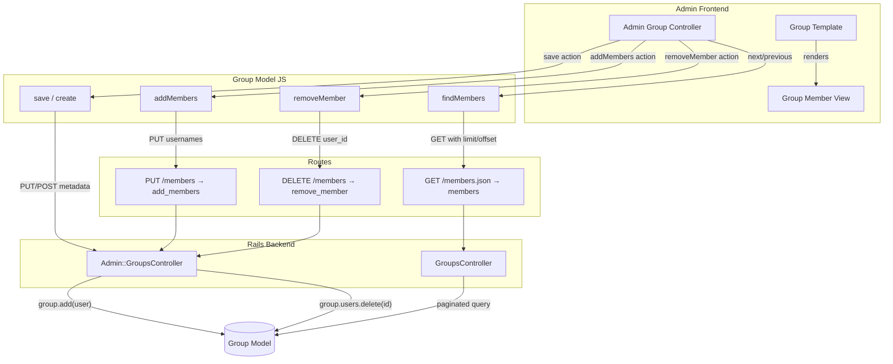

# Code Review: FIX: proper handling of group memberships

**Instance**: discourse__ai-code-review-evaluation__discourse-graphite__PR8
**PR**: [FIX: proper handling of group memberships](https://github.com/ai-code-review-evaluation/discourse-graphite/pull/8)
**Preset**: behavioral-only
**Date**: 2026-04-13

## Intent Register

### Intent Claims

1. Group membership management migrates from bulk-username assignment to individual add/remove operations
2. Member list supports server-side pagination with configurable limit and offset
3. Automatic groups reject membership modifications (add/remove) with 422 status
4. Group create no longer accepts initial member usernames — members are added after group creation
5. Group save/update transmits only group metadata (name, alias_level, visible), not member list
6. Admin UI displays paginated member list with next/previous navigation controls
7. Individual members can be removed via confirmation dialog and dedicated DELETE endpoint
8. New members are added via username input field and dedicated PUT endpoint
9. Members API endpoint returns pagination metadata (total, limit, offset) alongside member data
10. Frontend pagination computes currentPage and totalPages from offset, limit, and user_count
11. Pagination applies to all groups (automatic and custom), removing the old 200-member cap for automatic groups only
12. The `removeMember` backend action directly deletes the user association by user_id
13. Routes replace the old `get "users"` with `delete "members"` and `put "members"` on the groups resource

### Intent Diagram

## Verified Findings

### F-01 — Save action permanently locks save button
| Field | Value |
|-------|-------|
| Sighting | M-01 (G1-S-08, G2-S-01, G3-S-01, G4-S-02, IPT-S-03) |
| Location | `app/assets/javascripts/admin/controllers/admin-group.js.es6`, save action |
| Type | behavioral |
| Severity | major |
| Confidence | 10.0 |
| Current behavior | `self.set('disableSave', true)` is called at the start of the save action. The promise from `group.save()` or `group.create().then(...)` is assigned to a local `promise` variable but never chained with `.then()`, `.catch()`, or `.finally()`. No code path resets `disableSave` to `false`. After the first save attempt — success or failure — the save button is permanently disabled. |
| Expected behavior | `disableSave` should be reset to `false` in a `.finally()` handler so the button re-enables after any outcome. |
| Source of truth | Intent claims 4, 5 |
| Evidence | The save action terminates after assigning `promise` with no further chaining. No other location in the diff resets `disableSave`. 5/5 detection agents independently identified this. |
| Pattern label | incomplete-cleanup |

### F-02 — Redundant group.save after association delete in remove_member
| Field | Value |
|-------|-------|
| Sighting | M-03 (G1-S-07, G2-S-03) |
| Location | `app/controllers/admin/groups_controller.rb`, remove_member action |
| Type | behavioral |
| Severity | minor |
| Confidence | 10.0 |
| Current behavior | `group.users.delete(user_id)` on an ActiveRecord collection proxy commits the join-table DELETE immediately. The subsequent `group.save` operates only on group-level attributes (none modified in this action), making it a semantic no-op. The `else` branch rendering `render_json_error(group)` is reachable only if unrelated group-level validations fail — producing an error response even though the member was already removed. |
| Expected behavior | The `group.save` call should be removed, or the action restructured so the response accurately reflects the membership operation's outcome. |
| Source of truth | Intent claim 12; ActiveRecord CollectionProxy#delete semantics |
| Evidence | Rails `CollectionProxy#delete` executes SQL DELETE immediately against the join table. No group attributes are modified, so `group.save` returns true trivially. |
| Pattern label | dead-save-after-association-delete |

### F-03 — Pagination totalPages off-by-one
| Field | Value |
|-------|-------|
| Sighting | M-05 (G4-S-01, IPT-S-02) |
| Location | `app/assets/javascripts/admin/controllers/admin-group.js.es6`, totalPages computed property |
| Type | behavioral |
| Severity | major |
| Confidence | 10.0 |
| Current behavior | `Math.floor(user_count / limit) + 1` overcounts by 1 when `user_count` is exactly divisible by `limit`. With 50 users and limit=50: `Math.floor(50/50)+1 = 2`, but 50 users fill exactly 1 page. The `showingLast` guard allows navigation to a phantom empty page. |
| Expected behavior | `Math.ceil(user_count / limit)` produces the correct page count for all cases. |
| Source of truth | Intent claim 10 |
| Evidence | Direct arithmetic: `Math.floor(50/50)+1 = 2`. The `next` action then sets offset=50, `findMembers` fetches with offset=50, server returns 0 members. |
| Pattern label | off-by-one |

### F-04 — Silent success for unknown usernames in add_members
| Field | Value |
|-------|-------|
| Sighting | M-07 (G3-S-04, IPT-S-06) |
| Location | `app/controllers/admin/groups_controller.rb`, add_members action |
| Type | behavioral |
| Severity | major |
| Confidence | 10.0 |
| Current behavior | `add_members` iterates comma-separated usernames. Any username where `User.find_by_username` returns nil is silently skipped. The action returns `success_json` even when zero usernames matched, giving no signal to the caller that the operation was a complete no-op. |
| Expected behavior | The endpoint should indicate which usernames were not found, or return an error when zero users were successfully added. |
| Source of truth | Intent claim 8; AI failure mode checklist item 5 (surface-level fixes bypassing core mechanisms) |
| Evidence | The `if user = User.find_by_username(username)` guard silently skips nil. No counter, error accumulation, or conditional on whether any users were added. |
| Pattern label | silent-error-discard |

### F-05 — No upper bound on pagination limit parameter
| Field | Value |
|-------|-------|
| Sighting | S-06 (G1-S-06) |
| Location | `app/controllers/groups_controller.rb`, members action |
| Type | behavioral |
| Severity | minor |
| Confidence | 10.0 |
| Current behavior | `limit = (params[:limit] || 50).to_i` applies no upper-bound cap. A caller can supply an arbitrarily large limit, causing an unbounded database query. |
| Expected behavior | An upper-bound cap should be applied (e.g., `[limit, 200].min`) to prevent arbitrarily large queries. |
| Source of truth | Intent claim 2; the old code capped at 200 for automatic groups |
| Evidence | The new code drops the old 200 cap and replaces it with uncapped `limit`. The endpoint is reachable from the JavaScript client via AJAX. |
| Pattern label | missing-input-bound |

### F-06 — Non-numeric user_id silently coerced to 0
| Field | Value |
|-------|-------|
| Sighting | S-09 (G3-S-05) |
| Location | `app/controllers/admin/groups_controller.rb`, remove_member action |
| Type | behavioral |
| Severity | minor |
| Confidence | 10.0 |
| Current behavior | `params.require(:user_id).to_i` coerces non-numeric input to 0 via Ruby's `String#to_i`. `group.users.delete(0)` silently does nothing (no user with id=0). The action returns `success_json` despite no removal occurring. |
| Expected behavior | Non-numeric or zero `user_id` should be rejected with an error response. |
| Source of truth | AI failure mode checklist item 9 (zero-value sentinel ambiguity) |
| Evidence | Ruby `String#to_i` returns 0 for non-numeric strings. No guard validates `user_id > 0`. |
| Pattern label | zero-value-sentinel-ambiguity |

### F-07 — Username input not cleared after submission
| Field | Value |
|-------|-------|
| Sighting | M-02 (G1-S-09, G2-S-02, G4-S-03) |
| Location | `app/assets/javascripts/admin/controllers/admin-group.js.es6`, addMembers action |
| Type | behavioral |
| Severity | minor |
| Confidence | 10.0 |
| Current behavior | The `addMembers` action calls `model.addMembers(this.get("usernames"))` but never resets the `usernames` property. A TODO comment acknowledges this: `// TODO: should clear the input`. After submission, the input retains previously entered usernames. |
| Expected behavior | The `usernames` property should be cleared after successful submission. |
| Source of truth | Intent claim 8; inline TODO comment |
| Evidence | No `this.set("usernames", null)` or equivalent follows the `addMembers` call. The TODO comment is direct authorial acknowledgment. |
| Pattern label | missing-post-action-reset |

### F-08 — Offset boundary allows navigation to empty page
| Field | Value |
|-------|-------|
| Sighting | M-08 (G4-S-07, IPT-S-07) |
| Location | `admin-group.js.es6` next action + `group.js` findMembers |
| Type | behavioral |
| Severity | minor |
| Confidence | 10.0 |
| Current behavior | When `user_count=50` and `limit=50`, the next action sets offset=50 (`Math.min(0+50, 50)`). `findMembers` clamps to `Math.min(50, 50)=50`. The server receives offset=50, returns 0 members. This is a downstream consequence of the F-03 totalPages off-by-one. |
| Expected behavior | Navigation past the last page with data should be prevented. |
| Source of truth | Intent claims 2, 6 |
| Evidence | Call path confirmed: user_count=50 → totalPages=2 (overcounted) → showingLast false → next passes → offset=50 → empty page. |
| Pattern label | pagination-boundary-error |

### F-09 — Limit=0 returns empty result set silently
| Field | Value |
|-------|-------|
| Sighting | S-11 (G3-S-08) |
| Location | `app/controllers/groups_controller.rb`, members action |
| Type | behavioral |
| Severity | minor |
| Confidence | 8.0 |
| Current behavior | `(params[:limit] || 50).to_i` — Ruby's `"0"` is truthy, so `"0" || 50` yields `"0"`, `.to_i` yields 0. `.limit(0)` returns an empty result set. The response is HTTP 200 with `members: []` and `meta: {total: N, limit: 0}`, giving no indication the parameter was invalid. |
| Expected behavior | A `limit` of 0 should be clamped to a sensible minimum or rejected. |
| Source of truth | AI failure mode checklist item 9 (zero-value sentinel ambiguity) |
| Evidence | Ruby truthiness: `"0"` is truthy → `"0" || 50` = `"0"` → `.to_i` = 0 → `.limit(0)` = empty. |
| Pattern label | parameter-validation-gap |

## Findings Summary

| ID | Type | Severity | Description |
|----|------|----------|-------------|
| F-01 | behavioral | major | Save action permanently locks save button — disableSave never reset |
| F-02 | behavioral | minor | Redundant group.save after association delete in remove_member |
| F-03 | behavioral | major | Pagination totalPages off-by-one on exact multiples of limit |
| F-04 | behavioral | major | Silent success for unknown usernames in add_members |
| F-05 | behavioral | minor | No upper bound on pagination limit parameter |
| F-06 | behavioral | minor | Non-numeric user_id silently coerced to 0 in remove_member |
| F-07 | behavioral | minor | Username input not cleared after submission (acknowledged TODO) |
| F-08 | behavioral | minor | Offset boundary allows navigation to empty page (downstream of F-03) |
| F-09 | behavioral | minor | Limit=0 returns empty result set silently |

**Totals**: 9 verified findings (3 major, 6 minor), 7 rejections, 4 filtered out-of-charter, 3 nits excluded.

## Filtered Findings (out-of-charter for behavioral-only preset)

| Sighting | Type | Severity | Description | Reason |
|----------|------|----------|-------------|--------|
| M-04 | test-integrity | major | Wrong HTTP verb in remove_member test (xhr :put instead of :delete) | out-of-charter |
| M-06 | structural | minor | Asymmetric add/remove paths — group.add(user) vs group.users.delete(id) | out-of-charter |
| S-08 | structural | minor | Detached promise in removeMember/addMembers callbacks | out-of-charter |
| S-04 | fragile | minor | Bare string "true" comparison duplicated in create and update | out-of-charter |

## Retrospective

### Sighting Counts
- **Total sightings generated**: 37 (raw from 5 agents)
- **After deduplication**: 20 (8 merged groups, 12 singletons)
- **Verified findings at termination**: 13
- **Findings passing charter + confidence gates**: 9
- **Rejections**: 7 (S-12 factual error, S-07 unreachable behavioral claim, S-10 duplicate, S-01 architecturally inherent, S-02/S-03/S-05 nits)
- **Filtered out-of-charter**: 4 (M-04, M-06, S-08, S-04)
- **Nit count**: 3 (S-02, S-03, S-05)

**By detection source**:
- intent: 9 sightings
- checklist: 12 sightings
- structural-target: 16 sightings

**By severity (final verified)**:
- major: 3 (F-01, F-03, F-04)
- minor: 6 (F-02, F-05, F-06, F-07, F-08, F-09)

### Verification Rounds
- **Rounds**: 1 (all sightings resolved — verified or rejected — no weakened sightings remaining)
- **Hard cap reached**: No

### Scope Assessment
- **Files reviewed**: 10 files across frontend (JS/Handlebars), backend (Ruby), routes, tests, styles, locales
- **Lines of diff**: ~970 lines
- **Context**: Diff-only review, no repository access

### Context Health
- **Round count**: 1
- **Sightings-per-round**: 37 raw → 20 deduplicated → 13 verified → 9 after gates
- **Rejection rate**: 7/20 = 35%
- **False positive rate**: N/A (no user feedback)

### Tool Usage
- **Linter**: N/A (isolated diff review)
- **Project-native tools**: N/A

### Finding Quality
- **Origin**: All findings marked `introduced` (changes under review)
- **False positive signals**: None available (benchmark mode)
- **False negative signals**: Challenger 2 noted an adjacent observation about a `:id` vs `:group_id` route param name mismatch that was not captured as a verified finding (S-12 was rejected for incorrect reasoning despite circling a real issue)

### Intent Register
- **Claims extracted**: 13 (from diff analysis — no project documentation available)
- **Findings attributed to intent**: F-01, F-02, F-03, F-05, F-07, F-08 (6 findings)
- **Claims invalidated**: None

### Per-Group Metrics

| Agent | Files Reported | Sightings | Survival Rate | Respawn Eligible |
|-------|---------------|-----------|---------------|-----------------|
| G1 (value-abstraction) | 6/10 | 10 | 4/10 (40%) | Yes |
| G2 (dead-code) | 4/10 | 4 | 4/4 (100%) | Yes |
| G3 (signal-loss) | 6/10 | 8 | 4/8 (50%) | Yes |
| G4 (behavioral-drift) | 5/10 | 7 | 5/7 (71%) | Yes |
| IPT (intent-path-tracer) | 8/10 | 7 | 5/7 (71%) | Yes |

### Deduplication Metrics
- **Merge count**: 8 merged groups from 25 raw sightings
- **Merged pairs**:
  - M-01: G1-S-08, G2-S-01, G3-S-01, G4-S-02, IPT-S-03 (5→1)
  - M-02: G1-S-09, G2-S-02, G4-S-03 (3→1)
  - M-03: G1-S-07, G2-S-03 (2→1)
  - M-04: G1-S-10, G2-S-04, G3-S-07, G4-S-06, IPT-S-04 (5→1)
  - M-05: G4-S-01, IPT-S-02 (2→1)
  - M-06: G4-S-04, G4-S-05, IPT-S-01 (3→1)
  - M-07: G3-S-04, IPT-S-06 (2→1)
  - M-08: G4-S-07, IPT-S-07 (2→1)

### Instruction Trace
- **Agents spawned**: 5 detectors + 1 deduplicator + 4 challengers = 10 total
- **Preset**: behavioral-only (Groups 1-4 + Intent Path Tracer)
