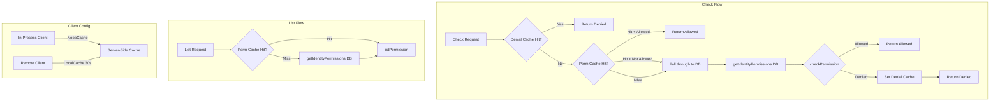

# Code Review: grafana__grafana__grafana__PR103633

**PR**: AuthZService: improve authz caching
**Instance**: grafana__grafana__grafana__PR103633
**Date**: 2026-04-08

## Intent Register

### Intent Claims

1. Check operations use a three-tier cache strategy: denial cache → permission cache → database
2. Denial cache entries are keyed by (namespace, user, action, resource, folder) and store explicit denials
3. Denial cache takes priority over permission cache — if a denial is cached, permission cache is not consulted
4. Permission cache can only prove "allowed"; absent resource in cached set falls through to database
5. In-process gRPC client uses NoopCache to disable client-side caching (server handles caching)
6. Remote gRPC client retains local cache with 30s expiry and 5-minute cleanup
7. Cache checks are hoisted from individual permission-fetching methods (getUserPermissions, getAnonymousPermissions) to Check/List entry points
8. List operations try cached permissions first, fall back to database on cache miss
9. getCachedIdentityPermissions handles anonymous, render service, user, and service account identity types
10. RenderService type always bypasses cache (returns cache miss)
11. After a database-confirmed denial, the result is stored in the denial cache
12. The newRBACClient helper is removed; logic inlined at each call site with different cache strategies

### Intent Diagram

## Verified Findings

### F-01 — Non-enforcing test fixture for denial cache precedence (S-01)

| Field | Value |
|---|---|
| **Finding ID** | F-01 |
| **Sighting** | S-01 |
| **Location** | `pkg/services/authz/rbac/service_test.go`, "Should deny on explicit cache deny entry" |
| **Type** | test-integrity |
| **Severity** | major |
| **Origin** | introduced |
| **Detection source** | checklist |

**Current behavior**: The test sets `map[string]bool{"dashboards:uid:dash1": false}` in the permission cache with comment "Allow access to the dashboard to prove this is not checked." The value `false` means NOT allowed. If the denial cache were bypassed and the permission cache path executed instead, `checkPermission` would also return not-allowed, so `assert.False(t, resp.Allowed)` passes regardless of whether the denial cache works correctly. The test cannot distinguish "denial cache correctly short-circuited" from "denial cache bypassed, permission cache also denied."

**Expected behavior**: The permission cache entry should be `map[string]bool{"dashboards:uid:dash1": true}` to create a genuine conflict. If the denial cache is bypassed, the permission cache would return allowed, causing the assertion to fail — proving the denial cache must be exercised for the test to pass.

**Evidence**: The denial cache check returns at line 111 before the permission cache is consulted. With `false` in both caches, the test's assertion holds under both working and broken denial-cache code paths.

**Pattern label**: non-enforcing-fixture

---

### F-02 — Denial cache key collision via underscore delimiter (S-02)

| Field | Value |
|---|---|
| **Finding ID** | F-02 |
| **Sighting** | S-02 |
| **Location** | `pkg/services/authz/rbac/cache.go`, `userPermDenialCacheKey` |
| **Type** | behavioral |
| **Severity** | minor |
| **Origin** | introduced |
| **Detection source** | structural-target |

**Current behavior**: `userPermDenialCacheKey` concatenates all fields with `_` separators: `namespace + ".perm_" + userUID + "_" + action + "_" + name + "_" + parent`. If `name` or `parent` contains underscores, different `(name, parent)` pairs produce identical keys. E.g., `name="dash_1", parent="fold"` collides with `name="dash", parent="1_fold"`.

**Expected behavior**: Use a delimiter that cannot appear in valid Grafana UIDs, or use structured encoding (length-prefixing, percent-encoding). A false collision causes a user to be incorrectly denied access to a resource they are permitted to access.

**Evidence**: The same underscore-delimiter pattern exists in other cache key functions (`userPermCacheKey`, `userBasicRoleCacheKey`), making this a pre-existing convention — but the denial cache introduces additional concatenation points and the consequence of collision is a false denial (security-relevant), not just a stale lookup. Severity downgraded from major to minor given the pre-existing convention.

**Pattern label**: key-collision-via-delimiter-reuse

---

### F-03 — Missing permissionCacheUsage metric on checkPermission error path (S-03)

| Field | Value |
|---|---|
| **Finding ID** | F-03 |
| **Sighting** | S-03 |
| **Location** | `pkg/services/authz/rbac/service.go`, Check method, cached-perms error path |
| **Type** | behavioral |
| **Severity** | minor |
| **Origin** | introduced |
| **Detection source** | intent |

**Current behavior**: When `getCachedIdentityPermissions` succeeds but `checkPermission` returns an error, the code returns `deny, err` without emitting `permissionCacheUsage`. Every other terminal path in the Check method emits this metric.

**Expected behavior**: `s.metrics.permissionCacheUsage.WithLabelValues("true", checkReq.Action).Inc()` should be emitted before the error return, consistent with all other terminal paths.

**Evidence**: Traced all 5 terminal paths in Check: denial cache hit (emits), cached+allowed (emits), cached+error (MISSING), cache-miss+DB (emits at fallthrough), DB error (emits at fallthrough). One path missing out of five.

**Pattern label**: missing-metric-on-error-path

---

### F-04 — Denial cache key uses raw UID, permission cache uses resolved UID (S-06)

| Field | Value |
|---|---|
| **Finding ID** | F-04 |
| **Sighting** | S-06 |
| **Location** | `pkg/services/authz/rbac/service.go`, Check method |
| **Type** | fragile |
| **Severity** | minor |
| **Origin** | introduced |
| **Detection source** | intent |

**Current behavior**: The denial cache key is built using `checkReq.UserUID` (raw UID from the request subject) before identity resolution. The permission cache key inside `getCachedIdentityPermissions` uses `userIdentifiers.UID` returned by `GetUserIdentifiers`. If `GetUserIdentifiers` normalizes or remaps the incoming UID, the two caches reference different identifiers for the same user.

**Expected behavior**: Both cache keys should use the same resolved identifier — either both use `checkReq.UserUID` or both use `userIdentifiers.UID` after resolution.

**Evidence**: `permDenialKey` is constructed at the top of Check before `getCachedIdentityPermissions` is called; `userPermKey` is constructed inside `getCachedIdentityPermissions` after `GetUserIdentifiers` resolves the identifier. The asymmetry is structural and verifiable from the diff alone. Impact cannot be confirmed without `GetUserIdentifiers` implementation, but the fragility is real.

**Pattern label**: identifier-resolution-asymmetry

---

### F-05 — "Outdated cache" test exercises same path as cache miss (S-08)

| Field | Value |
|---|---|
| **Finding ID** | F-05 |
| **Sighting** | S-08 |
| **Location** | `pkg/services/authz/rbac/service_test.go`, "Fallback to the database on outdated cache" |
| **Type** | test-integrity |
| **Severity** | minor |
| **Origin** | introduced |
| **Detection source** | checklist |

**Current behavior**: The test sets `permCache` with `{"dashboards:uid:dash1": true}` and requests `dash2`. The cache returns the map, `checkPermission` returns false (dash2 absent), and execution falls through to DB. This is the same code path taken when the permCache has no entry at all (the "Fallback to the database on cache miss" subtest). The Check method's fallthrough logic unifies both cases: any non-`allowed=true` result from the cached path proceeds to DB. No assertion distinguishes the "partial/stale cache" from "no cache entry."

**Expected behavior**: A test named "outdated cache" should exercise a scenario demonstrably distinct from a plain cache miss — or be renamed to accurately reflect that it covers "cache contains permissions for other resources but not the requested one."

**Evidence**: Both "cache miss" and "outdated cache" subtests hit the same Check method fallthrough (lines 114-130 in the diff). The only difference is how `getCachedIdentityPermissions` resolves — one returns ErrNotFound, the other returns a map without the resource — but downstream behavior is identical.

**Pattern label**: misleading-test-name

## Findings Summary

| ID | Type | Severity | Description |
|---|---|---|---|
| F-01 | test-integrity | major | "Should deny on explicit cache deny entry" uses `false` in permCache — non-enforcing fixture |
| F-02 | behavioral | minor | Denial cache key collision via underscore delimiter in name/parent fields |
| F-03 | behavioral | minor | Missing `permissionCacheUsage` metric on checkPermission error path |
| F-04 | fragile | minor | Denial cache key uses raw UserUID, permission cache uses resolved UID |
| F-05 | test-integrity | minor | "Outdated cache" test exercises same code path as cache miss test |

**Totals**: 5 verified findings (1 major, 4 minor), 9 rejections, 4 nits

## Retrospective

### Sighting counts

- **Total sightings generated**: 11 (R1: 6, R2: 3, R3: 2)
- **Verified findings at termination**: 5
- **Rejections**: 6 (S-04 nit, S-05 nit, S-07 duplicate of S-04, S-09 nit, S-10 false premise, S-11 false premise)
- **Nit count**: 4 (S-04, S-05, S-07, S-09)
- **Detection source breakdown**:
  - checklist: 3 sightings (S-01, S-08 → F-01, F-05)
  - structural-target: 2 sightings (S-02, S-09 → F-02)
  - intent: 3 sightings (S-03, S-06, S-10 → F-03, F-04)
  - linter: 0 (N/A)
  - spec-ac: 0 (no spec available)
- **Structural sub-categorization**: F-02 key collision (composition issue), no dead code/dead infrastructure/duplication findings
- **Origin**: All findings are `introduced` (new code in this PR)

### Verification rounds

- **Rounds**: 3 (converged on Round 3 — no valid new sightings above info)
- **Sightings per round**: R1=6, R2=3 (1 duplicate), R3=2 (both rejected)
- **Rejection rate per round**: R1=2/6 (33%), R2=2/3 (67%), R3=2/2 (100%)
- **Hard cap reached**: No

### Scope assessment

- **Files reviewed**: 4 files in `pkg/services/authz/` (rbac.go, rbac/cache.go, rbac/service.go, rbac/service_test.go)
- **Diff size**: ~400 lines (additions + deletions)
- **Scope**: Authorization caching layer — denial cache addition, permission cache hoisting, client cache configuration

### Context health

- Round count: 3
- Sightings-per-round trend: 6 → 3 → 2 (declining, converging)
- Rejection rate trend: 33% → 67% → 100% (increasing, confirming convergence)
- Hard cap not reached

### Tool usage

- Linter: N/A (diff-only benchmark review, no project tooling available)
- All analysis performed from diff text

### Finding quality

- False positive rate: Unknown (no user feedback in benchmark mode)
- False negative signals: None available
- Origin breakdown: 5/5 introduced (all findings are in new code)
- **Round 3 quality note**: The Round 3 Detector was given a compressed diff summary to save context, which caused it to produce a false sighting (S-11) about anonymous type handling that the full diff contradicts. This suggests compressed diffs should preserve switch/case bodies to avoid phantom findings.

### Intent register

- Claims extracted: 12 (derived from diff structure and PR title — no specs, no project docs)
- Findings attributed to intent comparison: 2 (F-03, F-04 — detection source: intent)
- Intent claims invalidated during verification: 0
