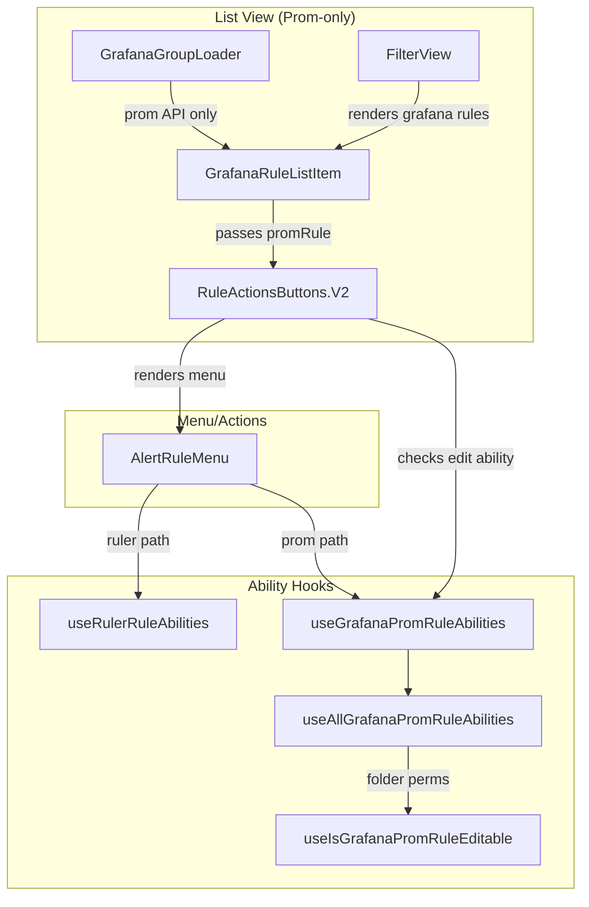

# Code Review: grafana__grafana__grafana__PR106778

**PR**: [Notification Rule Processing Engine](https://github.com/grafana/grafana/pull/106778)
**Instance**: grafana__grafana__grafana__PR106778
**Date**: 2026-04-08
**Scope**: Refactor Grafana alerting rule list view to remove Ruler API dependencies

## Intent Register

### Intent Claims

1. The alert list view removes all requests to the Ruler API, relying solely on the Prometheus API for rule data
2. Rule abilities/permissions are checkable via either Ruler rule (`useRulerRuleAbilities`) or Grafana Prometheus rule (`useGrafanaPromRuleAbilities`), with results OR'd together
3. `skipToken` sentinel allows callers to skip ability evaluation for non-applicable rule types
4. `GrafanaRuleListItem` renders entirely from `GrafanaPromRuleDTO` without needing ruler data
5. The `matchRules` reconciliation between Ruler and Prometheus rules is removed as unnecessary
6. Transitional "Creating" and "Deleting" states are removed from the list view (no longer needed with Prometheus-only data)
7. Rule provisioning status is derivable from `GrafanaPromRuleDTO.provenance` field (new DTO field)
8. `useAllGrafanaPromRuleAbilities` checks folder permissions via a new `useIsGrafanaPromRuleEditable` hook
9. Grafana-managed rules use `AlwaysSupported` (no loading state for ruler availability) in the prom abilities path
10. Editable rule identifiers are constructable from either Ruler rule or Grafana Prom rule; graceful null return when neither available
11. `useAllAlertRuleAbilities` (CombinedRule-based) is deprecated in favor of `useAllRulerRuleAbilities`
12. `RuleActionsButtons` uses `RequireAtLeastOne` type to enforce at least one of `rule` or `promRule`
13. Ruler API prefetch in `prometheusGroupsGenerator` is removed since Ruler data is no longer needed for list view
14. `isProvisionedPromRule` utility enables provenance checking directly on Prometheus rule DTOs

### Intent Diagram

## Verified Findings

### F-01 | major | fragile | unstable-memo-dependency
**Sighting**: S-01
**Location**: `useAbilities.ts` — `useGrafanaPromRuleAbilities` and `useRulerRuleAbilities`; `AlertRuleMenu.tsx` call sites
**Current behavior**: `useGrafanaPromRuleAbilities` and `useRulerRuleAbilities` both memoize with `[abilities, actions]` as dependency. Both call sites in `AlertRuleMenu` pass inline array literals, producing a new reference every render and invalidating the memo on every render cycle.
**Expected behavior**: The `actions` dependency should be stable — defined outside the component, memoized, or compared structurally.
**Source of truth**: structural-target (parallel collection coupling)
**Evidence**: `useGrafanaPromRuleAbilities` has `}, [abilities, actions]);`. AlertRuleMenu passes `[AlertRuleAction.Pause, AlertRuleAction.Delete, ...]` as inline literals at both hook call sites.

### F-02 | minor | structural | comment-code-drift
**Sighting**: S-02
**Location**: `useAbilities.ts` — `useAllGrafanaPromRuleAbilities`, line with `useIsGrafanaPromRuleEditable`
**Current behavior**: The call is followed by `// duplicate` — an unexplained leftover developer annotation with no informational value.
**Expected behavior**: Comments should describe behavior or be removed.
**Source of truth**: checklist item 8 (comment-code drift)
**Evidence**: `const { isEditable, isRemovable, loading } = useIsGrafanaPromRuleEditable(rule); // duplicate`

### F-03 | major | structural | dead-conditional-guard
**Sighting**: S-03
**Location**: `useAbilities.ts` — `useAllRulerRuleAbilities`, `isFederated` assignment
**Current behavior**: `isFederated` hardcoded to `false` with a TODO comment. The old implementation called `isFederatedRuleGroup(rule.group)`, enforcing that federated rules are immutable (preventing edit/delete). This enforcement is silently removed.
**Expected behavior**: Federated rule immutability should be preserved or the regression explicitly documented.
**Source of truth**: checklist item 14 (dead conditional guards)
**Evidence**: `const isFederated = false;` with `// TODO: Add support for federated rules`. Old code: `const isFederated = isFederatedRuleGroup(rule.group);`. `immutableRule = isProvisioned || isFederated || isPluginProvided` now always has `isFederated = false`.

### F-04 | minor | structural | redundant-narrowing
**Sighting**: S-04
**Location**: `GrafanaRuleListItem.tsx`, inside `alertingRule` guard
**Current behavior**: After `prometheusRuleType.grafana.alertingRule(rule)` establishes the rule is alerting, the code re-narrows with `rule && rule.type === PromRuleType.Alerting ? rule : undefined`. The inner check is always true inside the outer guard.
**Expected behavior**: Remove redundant re-narrowing; set `promAlertingRule = rule` directly.
**Source of truth**: structural-target (caller re-implementation)
**Evidence**: `if (prometheusRuleType.grafana.alertingRule(rule)) { const promAlertingRule = rule && rule.type === PromRuleType.Alerting ? rule : undefined; }`

### F-05 | minor | behavioral | returnTo-dropped
**Sighting**: S-05
**Location**: `GrafanaRuleListItem.tsx` — `href` construction
**Current behavior**: New component builds `href` as `createRelativeUrl('/alerting/grafana/${uid}/view')` without `returnTo`. The deleted `GrafanaRuleLoader.tsx` used `createReturnTo()` and passed it to `createRelativeUrl`, enabling back-navigation.
**Expected behavior**: `returnTo` behavior should be preserved or explicitly dropped with justification.
**Source of truth**: structural-target (semantic drift)
**Evidence**: Deleted file: `const returnTo = createReturnTo(); href: createRelativeUrl(..., { returnTo })`. New file: `href: createRelativeUrl(...)` — no `returnTo`.

### F-06 | info | test-integrity | non-enforcing-count-assertion
**Sighting**: S-07 (weakened from minor)
**Location**: `GrafanaGroupLoader.test.tsx` — "should render correct menu actions" test
**Current behavior**: Test checks 4 individual menu items by identity (silence, copyLink, duplicate, export) then asserts `menuItems.length === 4`. The count assertion is redundant given individual checks. Does not assert `delete` menu item is absent.
**Expected behavior**: Either remove redundant count check, or add explicit absence assertion for `delete`.
**Source of truth**: checklist item 4

### F-07 | major | behavioral | semantic-drift-delegation
**Sighting**: S-09
**Location**: `useAbilities.ts` — `useAllAlertRuleAbilities` (deprecated)
**Current behavior**: Delegates to `useAllRulerRuleAbilities` using `groupIdentifier.fromCombinedRule(rule)` + `getGroupOriginName`, replacing the old direct `getRulesSourceName(rule.namespace.rulesSource)`. If these produce different source name strings, permission lookups in `useIsRuleEditable` change silently for all callers.
**Expected behavior**: Delegation should produce identical `rulesSourceName` values, or the behavioral change should be documented.
**Source of truth**: intent 11
**Evidence**: Old: `getRulesSourceName(rule.namespace.rulesSource)`. New: `groupIdentifier.fromCombinedRule(rule)` → `getGroupOriginName()`. Hook is `@deprecated` but not removed — callers still active.

### F-08 | info | structural | dead-infrastructure
**Sighting**: S-11
**Location**: `GrafanaRuleListItem.tsx` — `RuleOperation` import and `operation` prop
**Current behavior**: `RuleOperation` is imported and `operation?: RuleOperation` is declared in props, but no caller in the diff passes the `operation` prop.
**Expected behavior**: Dead infrastructure should be removed.
**Source of truth**: intent 6 / structural-target (dead infrastructure)
**Evidence**: No caller (`GrafanaGroupLoader`, `FilterView`) passes `operation` to `GrafanaRuleListItem`.

### F-09 | major | behavioral | ability-tuple-dimension-mismatch
**Sighting**: S-12
**Location**: `useAbilities.ts` — `useAllGrafanaPromRuleAbilities`, `Silence` ability
**Current behavior**: `[AlertRuleAction.Silence]: [silenceSupported, canSilenceInFolder && isAlertingRule]`. The `isAlertingRule` capability check is in the `allowed` dimension (slot 2) instead of `supported` (slot 1). All other abilities (`ModifyExport`, `Pause`, `Restore`, `DeletePermanently`) place `isAlertingRule` in the `supported` slot.
**Expected behavior**: `[silenceSupported && isAlertingRule, canSilenceInFolder]` — matching the pattern used for all other alerting-gated abilities.
**Source of truth**: intent 8, checklist item 9
**Evidence**: Line: `[AlertRuleAction.Silence]: [silenceSupported, canSilenceInFolder && isAlertingRule]`. Compare: `[AlertRuleAction.ModifyExport]: [isAlertingRule, exportAllowed]`, `[AlertRuleAction.Pause]: [MaybeSupportedUnlessImmutable && isAlertingRule, isEditable ?? false]`.

### F-10 | major | test-integrity | non-enforcing-tests
**Sighting**: S-14
**Location**: `GrafanaGroupLoader.test.tsx` — "should render correct menu actions when More button is clicked"
**Current behavior**: Test grants `AlertingRuleDelete:true` in `beforeEach` (both `grantUserPermissions` and `setFolderAccessControl`), opens the More menu, and asserts `menuItems.length === 4` (silence, copyLink, duplicate, export). `ui.menuItems.delete` is defined but never asserted — neither for presence nor absence. If Delete renders (as permissions suggest it should), the count fails. If it doesn't render, the test masks a permission-enforcement regression.
**Expected behavior**: Test should explicitly assert whether Delete menu item appears, and count should match actual expected items under given permissions.
**Source of truth**: checklist items 4 and 12
**Evidence**: `beforeEach` grants `AlertingRuleDelete:true`. `useIsGrafanaPromRuleEditable` would return `isRemovable:true`. `canDelete` in `AlertRuleMenu` would be true. But test expects only 4 items. `ui.menuItems.delete` defined at line 657 but unused in test.

### F-11 | major | behavioral | silent-behavioral-regression
**Sighting**: S-15
**Location**: `GrafanaGroupLoader.tsx` — new render block
**Current behavior**: New `GrafanaGroupLoader` iterates only `promResponse.data.groups.at(0)?.rules`. Rules that exist in the Ruler but haven't propagated to Prometheus (in-flight creates) are silently absent from the list. Rules deleted from Ruler but still in Prometheus (in-flight deletes) also have no special indicator. The `logWarning` for prom-only rules is also deleted, removing observability signal.
**Expected behavior**: Transitional states should remain visible or their removal explicitly documented. Old code comment acknowledged the consistency assumption: "Grafana Prometheus rules should be strongly consistent now... If not, log it as a warning."
**Source of truth**: Old `GrafanaGroupLoader` behavior
**Evidence**: Diff shows complete removal of: ruler query, `matchRules` call, Creating indicator, Deleting indicator, and `logWarning`. New render maps only prom rules.

### F-12 | minor | behavioral | inconsistent-ability-combination
**Sighting**: S-16
**Location**: `AlertRuleMenu.tsx` — ability combination logic (lines 79-98)
**Current behavior**: For Grafana rules where both `rulerRule` and `promRule` are non-null (non-list-view contexts), both `useRulerRuleAbilities` and `useGrafanaPromRuleAbilities` execute and results are OR'd. Prom path uses `AlwaysSupported`; ruler path uses `isRulerAvailable`. If Ruler is unavailable, OR semantics grant prom-based abilities for operations that require the Ruler to execute.
**Expected behavior**: Per PR comment, prom ability path should activate only when ruler data is absent. OR logic should be guarded so simultaneous presence doesn't produce additive permissions.
**Source of truth**: PR comment: "we need to use promRule to check abilities because we have removed all requests to the ruler API in the list view"
**Evidence**: Guard at line 71-77 passes `skipToken` only for non-Grafana rules, not when `rulerRule` is present. `useAllGrafanaPromRuleAbilities` sets `MaybeSupported = AlwaysSupported`, never consulting `isRulerAvailable`. OR at lines 81-98 means prom's `AlwaysSupported` overrides ruler's `NotSupported`.

### Rejected Sightings

| Sighting | Reason |
|----------|--------|
| S-06 | Documented graceful fallback with `logWarning`; no production caller exercises the problematic path |
| S-08 | Tests correctly removed along with intentionally removed feature (Creating/Deleting states) |
| S-10 | Factually inaccurate — the prom-path IS tested; `useGrafanaPromRuleAbility` is overridden in Grafana rule tests |
| S-13 | Duplicate of F-01 (same unstable memo pattern, other call site already covered) |
| S-17 | Duplicate of F-02 (same `// duplicate` comment) |
| S-18 | Duplicate of F-10 (same test file, same permission/assertion mismatch) |
| S-20 | Duplicate of rejected S-06 (same graceful fallback path) |
| S-21 | Overlap with rejected S-08 (matchRules tests deleted because matchRules function deleted) |
| S-22 | Empty state for empty prom group is expected behavior — no rules = nothing to render |

### F-13 | minor | fragile | inconsistent-null-guard
**Sighting**: S-19
**Location**: `useAbilities.ts` — `useAllGrafanaPromRuleAbilities` useMemo callback
**Current behavior**: `isProvisionedPromRule(rule)` is explicitly null-guarded (`rule ? ... : false`), but `prometheusRuleType.grafana.alertingRule(rule)` and `isPluginProvidedRule(rule)` in the same closure receive `rule` (which may be `undefined`) without any guard. Inconsistent null-safety within the same code block.
**Expected behavior**: Uniform null handling — either all calls are guarded or all are documented as safely accepting `undefined`.
**Source of truth**: structural consistency
**Evidence**: Line ~465: `const isProvisioned = rule ? isProvisionedPromRule(rule) : false;`. Lines ~472-473: `const isAlertingRule = prometheusRuleType.grafana.alertingRule(rule);` and `const isPluginProvided = isPluginProvidedRule(rule);` — no guard.

---

## Findings Summary

| ID | Type | Severity | Description |
|----|------|----------|-------------|
| F-01 | fragile | major | Unstable memo dependency — inline array literals defeat useMemo in ability hooks |
| F-02 | structural | minor | Leftover `// duplicate` comment in useAllGrafanaPromRuleAbilities |
| F-03 | structural | major | isFederated hardcoded to false — dead conditional guard removes federated rule immutability |
| F-04 | structural | minor | Redundant type narrowing inside alertingRule guard |
| F-05 | behavioral | minor | returnTo query param dropped from GrafanaRuleListItem href |
| F-06 | test-integrity | info | Count-only assertion without Delete absence check |
| F-07 | behavioral | major | Semantic drift in deprecated useAllAlertRuleAbilities delegation path |
| F-08 | structural | info | Dead operation prop/import in GrafanaRuleListItem |
| F-09 | behavioral | major | isAlertingRule in wrong ability tuple dimension for Silence |
| F-10 | test-integrity | major | Test grants AlertingRuleDelete but doesn't assert Delete presence/absence |
| F-11 | behavioral | major | Silent removal of Creating/Deleting transitional states and logWarning |
| F-12 | behavioral | minor | OR semantics when both ruler and prom present — inconsistent ability combination |
| F-13 | fragile | minor | Inconsistent null-guarding in useAllGrafanaPromRuleAbilities |

**Totals**: 13 findings (5 major, 5 minor, 2 info, 1 info)

---

## Retrospective

### Sighting Counts

- **Total sightings generated**: 23 (S-01 through S-23, excluding S-23 which was self-identified as duplicate by detector)
- **Verified findings at termination**: 13
- **Rejections**: 4 (S-06, S-08, S-10, S-22)
- **Duplicates**: 5 (S-13, S-17, S-18, S-20, S-21)
- **Nit count**: 0

**Breakdown by detection source**:
- `checklist`: 5 sightings (S-02, S-03, S-07, S-14, S-18)
- `structural-target`: 6 sightings (S-01, S-04, S-05, S-11, S-19, S-21)
- `intent`: 8 sightings (S-06, S-09, S-12, S-15, S-16, S-20, S-22, S-05)
- `linter`: N/A (no linters available)

**Structural sub-categorization**:
- Dead infrastructure: F-08 (dead prop/import)
- Dead conditional guards: F-03 (isFederated)
- Composition opacity: none
- Bare literals: none (PromRuleType.Alerting flagged but is an enum, not a bare literal)
- Duplication: F-04 (redundant narrowing)

### Verification Rounds

- **Round 1**: 12 sightings → 9 verified, 3 rejected
- **Round 2**: 5 sightings → 3 verified, 2 duplicates
- **Round 3**: 5 sightings → 1 verified, 1 rejected, 3 duplicates (convergence reached)
- **Total rounds**: 3 (did not hit 5-round cap)

### Scope Assessment

- **Files reviewed**: 10 files in diff (1 new, 1 deleted, 8 modified)
- **Primary modules**: useAbilities.ts (ability hooks), AlertRuleMenu.tsx (menu component), GrafanaGroupLoader.tsx (list loader), GrafanaRuleListItem.tsx (new list item), RuleActionsButtons.V2.tsx (action buttons)
- **Lines of diff**: ~1440

### Context Health

- **Round count**: 3
- **Sightings-per-round trend**: 12 → 5 → 5 (round 3 mostly duplicates, effective new = 1)
- **Rejection rate per round**: R1: 3/12 (25%), R2: 0/3 (0%), R3: 1/2 genuinely new (50%)
- **Hard cap reached**: No

### Tool Usage

- **Linter output**: N/A (benchmark mode — no project tooling available)
- **Tools used**: Read (diff file), Grep/Glob (not needed — diff-only review)

### Finding Quality

- **False positive rate**: Unknown (no user feedback in benchmark mode)
- **Origin breakdown**: All 13 findings are `introduced` (created by this PR's changes)
- **Finding distribution**: 5 behavioral, 4 structural, 2 test-integrity, 2 fragile

### Intent Register

- **Claims extracted**: 14 (from PR diff comments, code structure, and commit context)
- **Findings attributed to intent comparison**: 6 (F-05, F-07, F-09, F-11, F-12, F-13)
- **Intent claims invalidated during verification**: 0
