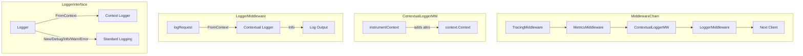

# Code Review: grafana__grafana__grafana__PR76186

**PR**: Plugins: Chore: Renamed instrumentation middleware to metrics middleware
**Instance**: grafana__grafana__grafana__PR76186
**Date**: 2026-04-08

## Intent Register

### Intent Claims

1. `InstrumentationMiddleware` is renamed to `MetricsMiddleware` to clarify its single responsibility: Prometheus metrics collection.
2. Contextual logging is extracted from `InstrumentationMiddleware` into a new `ContextualLoggerMiddleware` for separation of concerns.
3. `ContextualLoggerMiddleware.instrumentContext` enriches the request context with plugin/endpoint attributes (`endpoint`, `pluginId`, `dsName`, `dsUID`, `uname`) via `log.WithContextualAttributes`.
4. `LoggerMiddleware.logRequest` no longer receives `pluginCtx` and `endpoint` directly — it reads contextual attributes from the context via `m.logger.FromContext(ctx)`.
5. The `Logger` interface gains a `FromContext(ctx context.Context) Logger` method that returns a logger enriched with contextual attributes from the context.
6. `grafanaInfraLogWrapper` implements `FromContext` via type assertion to `*log.ConcreteLogger`, falling back to `d.New()` on failure.
7. `TestLogger.FromContext` returns a new `TestLogger` instance.
8. The middleware chain ordering is: Tracing → Metrics → ContextualLogger → Logger → remaining middlewares.
9. Stream methods (`SubscribeStream`, `PublishStream`, `RunStream`) pass through without contextual logging in both old and new code.
10. `interface{}` is updated to `any` across `Logger` and `PrettyLogger` interfaces.

### Intent Diagram

## Findings

### Summary

| ID | Type | Severity | Location | Description |
|----|------|----------|----------|-------------|
| F-01 | behavioral | major | logger_middleware.go | traceID field silently removed from log output |
| F-02 | test-integrity | major | fake.go | TestLogger.FromContext returns zero-state logger, ignoring context |
| F-03 | fragile | major | logger.go | grafanaInfraLogWrapper.FromContext silent type assertion fallback |
| F-04 | behavioral | major | logger_middleware.go + pluginsintegration.go | pluginId/endpoint depend on implicit middleware ordering |
| F-05 | structural | minor | contextual_logger_middleware.go | Stream methods pass through without context enrichment (pre-existing) |
| F-06 | test-integrity | minor | metrics_middleware_test.go | Test function name not updated after type rename |
| F-07 | test-integrity | major | contextual_logger_middleware.go | No test coverage for new ContextualLoggerMiddleware |

**Findings**: 7 | **Rejections**: 0 | **False positive rate**: 0%

---

### F-01: traceID silently removed from log output

- **Sighting**: S-01
- **Location**: `pkg/services/pluginsintegration/clientmiddleware/logger_middleware.go` (removed lines ~228-231)
- **Type**: behavioral | **Severity**: major
- **Current behavior**: `logRequest` no longer extracts `traceID` via `tracing.TraceIDFromContext(ctx, false)`. The `tracing` import was removed. The new `instrumentContext` in `ContextualLoggerMiddleware` adds `endpoint`, `pluginId`, `dsName`, `dsUID`, `uname` — but not `traceID`. The new log path `m.logger.FromContext(ctx).Info(...)` may or may not carry traceID depending on the infra logger's `FromContext` implementation, which is not visible in this diff.
- **Expected behavior**: "Plugin Request Completed" log lines should carry `traceID` when a trace is active, as they did prior to this PR.
- **Source of truth**: Old `logRequest` in logger_middleware.go; tracing package import removed.
- **Evidence**: Diff removes `tracing` import and the `tracing.TraceIDFromContext(ctx, false)` block. New `instrumentContext` does not include any tracing field. Whether `d.l.FromContext(ctx)` in `grafanaInfraLogWrapper` auto-injects traceID is opaque from the diff.
- **Pattern label**: silent-field-loss

### F-02: TestLogger.FromContext returns zero-state logger, ignoring context

- **Sighting**: S-02
- **Location**: `pkg/plugins/log/fake.go` lines 17-19
- **Type**: test-integrity | **Severity**: major
- **Current behavior**: `TestLogger.FromContext(_ context.Context) Logger` discards the context parameter (`_`) and returns `NewTestLogger()` — a fresh zero-state logger. Log calls on the returned logger write to a separate `Logs` struct not accessible to the test holding the original `TestLogger`.
- **Expected behavior**: The test double should return a logger whose output can be inspected by the test, so tests can verify contextual attribute flow end-to-end.
- **Source of truth**: AI failure mode checklist item 13 (mock permissiveness masking constraints).
- **Evidence**: `func (f *TestLogger) FromContext(_ context.Context) Logger { return NewTestLogger() }` — context discarded, return is a brand-new instance.
- **Pattern label**: mock-permissiveness

### F-03: grafanaInfraLogWrapper.FromContext has silent type assertion fallback

- **Sighting**: S-03
- **Location**: `pkg/plugins/log/logger.go` lines 103-111
- **Type**: fragile | **Severity**: major
- **Current behavior**: `FromContext` performs `d.l.FromContext(ctx).(*log.ConcreteLogger)`. If the type assertion fails, it returns `d.New()` — a logger with none of the contextual attributes. No error is logged, no metric incremented, no warning surfaced. Contextual enrichment silently disappears.
- **Expected behavior**: The fallback should be eliminated by returning an interface type, or the failure should be surfaced (at minimum logged).
- **Source of truth**: AI failure mode checklist item 2 (hardcoded coupling); structural target (semantic drift / silent error discard).
- **Evidence**: Lines 104-107: `if !ok { return d.New() }` — `d.New()` produces a context-free logger with no indication of failure.
- **Pattern label**: silent-type-assertion-fallback

### F-04: pluginId/endpoint depend on implicit middleware ordering

- **Sighting**: S-04
- **Location**: `pkg/services/pluginsintegration/clientmiddleware/logger_middleware.go` (removed logParams) + `pluginsintegration.go` lines 156-478
- **Type**: behavioral | **Severity**: major
- **Current behavior**: `pluginId` and `endpoint` are absent from `logParams` in `logRequest`. These fields appear in "Plugin Request Completed" lines only if `ContextualLoggerMiddleware` ran before `LoggerMiddleware` and enriched the context. No compile-time or runtime enforcement of this ordering.
- **Expected behavior**: `pluginId` and `endpoint` should be present in log lines regardless of middleware ordering, as they were when passed as direct parameters.
- **Source of truth**: Old `logRequest` signature and `logParams` construction; structural target (composition opacity).
- **Evidence**: Diff removes `"pluginId", pluginCtx.PluginID` and `"endpoint", endpoint` from logParams. Chain in pluginsintegration.go: `NewMetricsMiddleware` → `NewContextualLoggerMiddleware()` → `NewLoggerMiddleware(...)` — correct today, fragile to reordering.
- **Pattern label**: implicit-ordering-dependency

### F-05: Stream methods pass through without context enrichment

- **Sighting**: S-05
- **Location**: `pkg/services/pluginsintegration/clientmiddleware/contextual_logger_middleware.go` lines 176-186
- **Type**: structural | **Severity**: minor
- **Current behavior**: `SubscribeStream`, `PublishStream`, `RunStream` pass through without calling `instrumentContext`. Stream requests carry no contextual logging attributes.
- **Expected behavior**: Consistent with pre-existing behavior — old `InstrumentationMiddleware` also bypassed stream methods. No regression.
- **Source of truth**: Old `InstrumentationMiddleware` stream methods (now `MetricsMiddleware`).
- **Evidence**: Both old and new stream methods return `m.next.*` directly with no `instrumentContext` call.
- **Pattern label**: pre-existing-stream-gap

### F-06: Test function name not updated after type rename

- **Sighting**: S-06
- **Location**: `pkg/services/pluginsintegration/clientmiddleware/metrics_middleware_test.go` line 75
- **Type**: test-integrity | **Severity**: minor
- **Current behavior**: Test function is named `TestInstrumentationMiddleware`. File was renamed to `metrics_middleware_test.go` and constructor call updated to `newMetricsMiddleware`, but the function name was not updated.
- **Expected behavior**: Test function should be `TestMetricsMiddleware` to match the renamed type.
- **Source of truth**: Structural target (semantic drift).
- **Evidence**: Diff shows `similarity index 98%` with only constructor call changed. Line 75 `func TestInstrumentationMiddleware(t *testing.T)` unchanged.
- **Pattern label**: rename-incomplete

### F-07: No test coverage for new ContextualLoggerMiddleware

- **Sighting**: S-07
- **Location**: `pkg/services/pluginsintegration/clientmiddleware/contextual_logger_middleware.go` lines 1-69
- **Type**: test-integrity | **Severity**: major
- **Current behavior**: `ContextualLoggerMiddleware` is the sole provider of contextual log attributes that `LoggerMiddleware` depends on via `m.logger.FromContext(ctx)`. No test file is introduced in the diff. The middleware ordering dependency is unverified by any test. Since this is a new type, no pre-existing test can cover it.
- **Expected behavior**: A test should verify that the composed stack produces log lines containing `pluginId`, `endpoint`, and other enriched fields.
- **Source of truth**: AI failure mode checklist item 4 (non-enforcing tests); structural target (composition opacity).
- **Evidence**: No `contextual_logger_middleware_test.go` in the diff. `TestLogger.FromContext` returns a fresh logger ignoring context, so even existing LoggerMiddleware tests cannot detect regressions in the attribute-propagation path.
- **Pattern label**: untested-new-middleware

---

## Retrospective

### Sighting Counts

- **Total sightings generated**: 8 (S-01 through S-08; S-08 self-rejected by R3 Detector)
- **Verified findings at termination**: 7
- **Rejections**: 0
- **Nit count**: 0
- **Self-rejected by Detector**: 1 (S-08 — speculative without test file content)

**By detection source**:
- checklist: 3 (S-01, S-02, S-03)
- structural-target: 3 (S-06, S-07, S-08)
- intent: 2 (S-04, S-05)

**Structural sub-categorization**:
- Composition opacity: 2 (F-04, F-07)
- Semantic drift: 1 (F-06)
- Pre-existing gap: 1 (F-05)

**By type**:
- behavioral: 2 (F-01, F-04)
- test-integrity: 3 (F-02, F-06, F-07)
- fragile: 1 (F-03)
- structural: 1 (F-05)

**By severity**:
- major: 5 (F-01, F-02, F-03, F-04, F-07)
- minor: 2 (F-05, F-06)

### Verification Rounds

- **Rounds to convergence**: 3
- Round 1: 5 sightings → 5 verified (F-01 through F-05)
- Round 2: 2 sightings → 2 verified (F-06, F-07)
- Round 3: 1 sighting self-rejected by Detector → 0 new findings → convergence

### Scope Assessment

- **Files in diff**: 8 (fake.go, ifaces.go, logger.go, contextual_logger_middleware.go, logger_middleware.go, metrics_middleware.go, metrics_middleware_test.go, pluginsintegration.go)
- **Diff size**: ~481 lines
- **Nature**: Middleware decomposition refactor with interface extension

### Context Health

- **Round count**: 3
- **Sightings-per-round trend**: 5 → 2 → 0 (clean convergence)
- **Rejection rate per round**: 0% → 0% → N/A
- **Hard cap reached**: No

### Tool Usage

- **Linter output**: N/A (diff-only benchmark review, no project tooling)
- **Tools used**: Read (diff file), Grep/Glob (not needed — single diff file)

### Finding Quality

- **False positive rate**: 0% (no user dismissals — benchmark mode)
- **Origin breakdown**: 6 introduced, 1 pre-existing (F-05)
- **Key theme**: The decomposition from one middleware to two cooperating middlewares introduced implicit runtime dependencies (middleware ordering, context attribute flow, type assertion coupling) without test coverage for the composition contract. The most impactful finding (F-01, traceID loss) is a concrete behavioral regression visible in the diff.

### Intent Register

- **Claims extracted**: 10 (from PR title, diff structure, code comments)
- **Findings attributed to intent comparison**: 2 (F-04 from claim 4, F-05 from claim 9)
- **Intent claims invalidated**: 0
