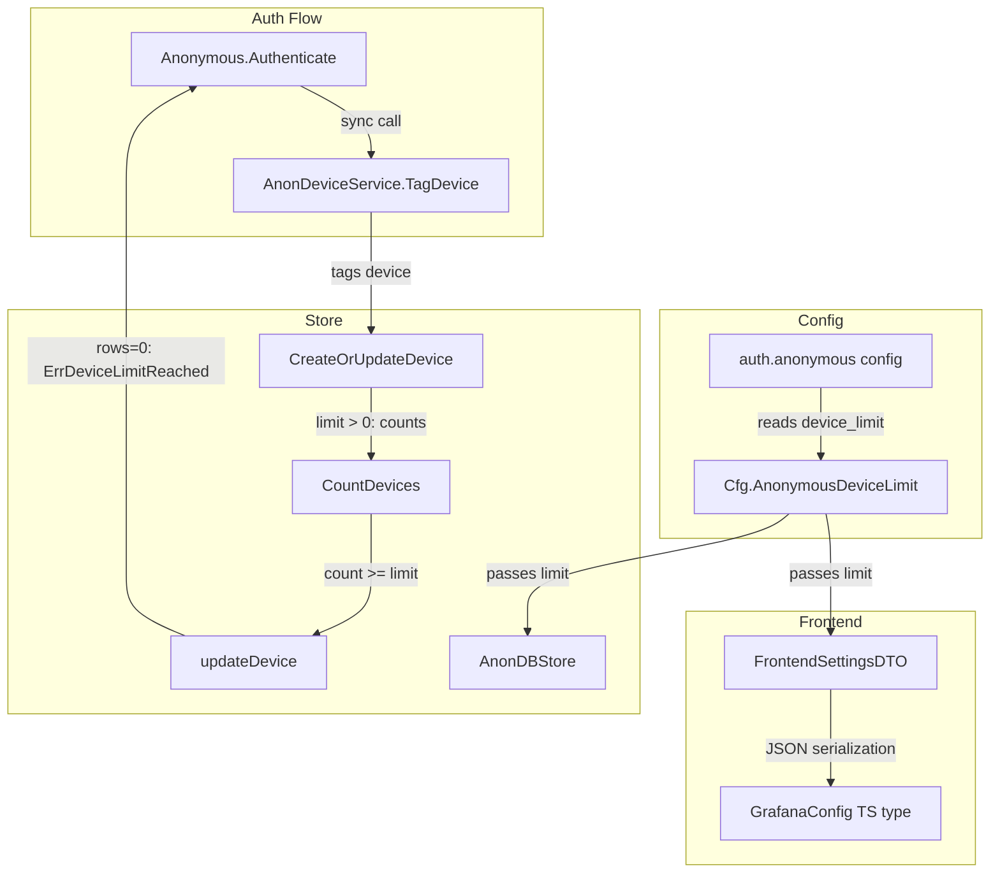

# Code Review: grafana__grafana__grafana__PR79265

**PR**: Add configurable device limit for anonymous access
**Instance**: grafana__grafana__grafana__PR79265
**Date**: 2026-04-08

## Intent Register

### Intent Claims

1. The PR adds a configurable `device_limit` setting under `[auth.anonymous]` that caps the number of active anonymous devices.
2. When the device limit is reached, existing anonymous devices can still be updated (IP, user agent, timestamp) but no new devices can be created.
3. When a new device attempts to register and the limit is reached, `ErrDeviceLimitReached` is returned.
4. A device limit value of `0` means no limit is enforced (unlimited devices).
5. Device limit is checked by counting devices active within the last 30 days before each create operation.
6. The `anonymousDeviceExpiration` constant (30 days) defines the time window for both device counting and device update eligibility.
7. The anonymous authentication flow changes from asynchronous (goroutine with background context) to synchronous (using request context).
8. When `ErrDeviceLimitReached` occurs during authentication, the error propagates to the caller, potentially blocking anonymous access for new devices.
9. The device limit configuration is exposed to the frontend via `FrontendSettingsDTO`.
10. The `ProvideAnonymousDeviceService` constructor changes from accepting an `AnonStore` interface to accepting a `db.DB`, creating the store internally with the configured device limit.

### Intent Diagram

## Verified Findings

### Findings Summary

| ID | Type | Severity | Description |
|---|---|---|---|
| F-01 | behavioral | major | Zero-value sentinel ambiguity: Go int64 always sends `0`, TS type expects `undefined` for "no limit" |
| F-02 | structural | minor | Duplicate `anonymousDeviceExpiration` constant in `database.go` and `api.go` |
| F-03 | behavioral | major | TOCTOU race: count-then-insert device limit check is not atomic |
| F-04 | behavioral | major | `updateDevice` WHERE clause anchors time window on `device.UpdatedAt` instead of `time.Now()` |
| F-05 | behavioral | major | `ErrDeviceLimitReached` blocks anonymous auth entirely — fire-and-forget converted to sync auth gate |
| F-06 | behavioral | major | Debug-level log before hard auth failure — log severity doesn't match operational impact |
| F-07 | behavioral | major | Panic recovery removed when goroutine was replaced with synchronous call |
| F-08 | structural | major | Interface-to-concrete coupling: constructor no longer accepts `AnonStore` interface |
| F-09 | fragile | minor | Request context passed with no timeout — removed 2-minute timeout constant |
| F-10 | behavioral | minor | `TagDevice` now propagates all `tagDeviceUI` errors, not just `ErrDeviceLimitReached` |
| F-11 | test-integrity | minor | Test covers rejection path only; update success path for existing device at limit is untested |
| F-12 | fragile | major | Closure captures and mutates outer `args` variable — corrupts argument list on retry |

**Totals**: 12 verified findings (7 major, 5 minor), 3 rejections, 1 nit

### F-01: Zero-value sentinel ambiguity between Go and TypeScript types

- **Sighting**: S-02
- **Location**: `pkg/api/dtos/frontend_settings.go` (AnonymousDeviceLimit), `packages/grafana-data/src/types/config.ts`, `packages/grafana-runtime/src/config.ts`
- **Type**: behavioral | **Severity**: major
- **Current behavior**: Go DTO field `AnonymousDeviceLimit int64` always serializes to a JSON number (0 when no limit configured). TypeScript interface declares `anonymousDeviceLimit: number | undefined`, initialized to `undefined`. After settings load, the field is `0`, never `undefined`. Any consumer checking `=== undefined` for "no limit" will never match.
- **Expected behavior**: Use `*int64` in Go (nullable, serializes as `null`) to align with TypeScript `undefined`, or change TS type to `number` with `0` as the documented "no limit" sentinel.
- **Source of truth**: AI failure mode checklist item 9 (zero-value sentinel ambiguity)
- **Evidence**: Go DTO always emits numeric JSON. TS default is `undefined`. Wire value after load is `0`. The `undefined` branch of the union type is unreachable after settings load.

### F-02: Duplicate anonymousDeviceExpiration constant

- **Sighting**: S-03
- **Location**: `pkg/services/anonymous/anonimpl/anonstore/database.go`, `pkg/services/anonymous/anonimpl/api/api.go`
- **Type**: structural | **Severity**: minor
- **Current behavior**: `const anonymousDeviceExpiration = 30 * 24 * time.Hour` defined independently in two packages. No shared reference.
- **Expected behavior**: Single canonical constant in one location, imported by both.
- **Source of truth**: Structural target (parallel collection coupling)
- **Evidence**: Both definitions resolve to 720 hours but are in separate packages with no enforcement.

### F-03: TOCTOU race in device limit enforcement

- **Sighting**: S-04
- **Location**: `pkg/services/anonymous/anonimpl/anonstore/database.go`, `CreateOrUpdateDevice`
- **Type**: behavioral | **Severity**: major
- **Current behavior**: `CountDevices` is called outside a transaction, result compared to `deviceLimit`, then upsert executes separately. Concurrent requests can all pass the count check and exceed the limit.
- **Expected behavior**: Count-and-insert wrapped in a single transaction with appropriate isolation, or database-level constraint enforcing the limit.
- **Source of truth**: Intent claim 2 (limit enforcement invariant)
- **Evidence**: No `WithTransaction` wrapper around the count + insert sequence. Classic TOCTOU pattern.

### F-04: updateDevice time window anchored on caller-supplied timestamp

- **Sighting**: S-05
- **Location**: `pkg/services/anonymous/anonimpl/anonstore/database.go`, `updateDevice` WHERE clause
- **Type**: behavioral | **Severity**: major
- **Current behavior**: WHERE clause uses `device.UpdatedAt.UTC().Add(-anonymousDeviceExpiration)` to `device.UpdatedAt.UTC().Add(time.Minute)` as BETWEEN bounds. Window is caller-controlled, not store-controlled. `CountDevices` uses `time.Now()` as anchor — creating asymmetry.
- **Expected behavior**: Window anchored on `time.Now()`, consistent with `CountDevices`.
- **Source of truth**: Intent claim 6
- **Evidence**: Diff shows `CountDevices` using `time.Now().UTC()` but `updateDevice` using `device.UpdatedAt.UTC()` for the same 30-day window concept.

### F-05: ErrDeviceLimitReached blocks anonymous authentication

- **Sighting**: S-06
- **Location**: `pkg/services/anonymous/anonimpl/client.go`, `Authenticate`
- **Type**: behavioral | **Severity**: major
- **Current behavior**: When `TagDevice` returns `ErrDeviceLimitReached`, `Authenticate` returns `(nil, err)` — hard auth failure. Previous code ran `TagDevice` in a fire-and-forget goroutine that never blocked auth. New behavior means device limit enforcement also blocks anonymous access, not just tracking.
- **Expected behavior**: Product decision needed — if intent is to block access, this is correct; if intent is only to cap tracking, auth should succeed with degraded tracking. Combined with F-04's window-anchor bug, known devices can be incorrectly blocked.
- **Source of truth**: Intent claim 8
- **Evidence**: Diff shows `return nil, err` for `ErrDeviceLimitReached`. Previous code returned identity regardless of `TagDevice` outcome.

### F-06: Debug-level log masks hard auth failure

- **Sighting**: S-07
- **Location**: `pkg/services/anonymous/anonimpl/impl.go`, `TagDevice`
- **Type**: behavioral | **Severity**: major
- **Current behavior**: Error from `tagDeviceUI` is logged at `Debug` level, then returned as a hard failure. In production configs (Info/Warn level), the log line is invisible while the error blocks authentication.
- **Expected behavior**: Log at `Warn` or `Error` level when the error will cause auth denial.
- **Source of truth**: Structural target (silent error discard)
- **Evidence**: `a.log.Debug(...)` followed by `return err`. Debug is typically suppressed in production. The log severity was set when the error was non-fatal; it was not updated when `return err` was added.

### F-07: Panic recovery removed without replacement

- **Sighting**: S-09
- **Location**: `pkg/services/anonymous/anonimpl/client.go`, `Authenticate`
- **Type**: behavioral | **Severity**: major
- **Current behavior**: The goroutine's `defer recover()` that caught panics in `TagDevice` was removed. Panics now propagate unguarded to the HTTP handler layer.
- **Expected behavior**: Retain panic recovery around the synchronous call, or establish that `TagDevice` and callees cannot panic.
- **Source of truth**: Removed `recover()` in diff was explicitly written to protect this code path.
- **Evidence**: Diff shows `defer func() { if err := recover()... }` removed entirely. No replacement recovery added.

### F-08: Interface-to-concrete coupling in constructor

- **Sighting**: S-11
- **Location**: `pkg/services/anonymous/anonimpl/impl.go`, `ProvideAnonymousDeviceService`
- **Type**: structural | **Severity**: major
- **Current behavior**: Constructor parameter changed from `anonStore anonstore.AnonStore` (interface) to `sqlStore db.DB` (concrete). Store is constructed internally. The `AnonStore` interface still exists but is no longer injectable through this constructor.
- **Expected behavior**: Retain the `AnonStore` interface parameter for testability and abstraction preservation.
- **Source of truth**: Structural target (hardcoded coupling where abstraction was specified)
- **Evidence**: Original signature accepted `anonstore.AnonStore`. Tests changed from injecting mock-capable stores to passing `db.DB` and using `anonService.anonStore` (internal field access).

### F-09: Timeout protection removed

- **Sighting**: S-12
- **Location**: `pkg/services/anonymous/anonimpl/client.go`, `Authenticate`
- **Type**: fragile | **Severity**: minor
- **Current behavior**: `TagDevice` is called with the HTTP request context, which has no dedicated timeout. The removed code used `context.WithTimeout(context.Background(), 2*time.Minute)`.
- **Expected behavior**: A timeout should bound the device-tagging operation independently of the HTTP request lifecycle.
- **Source of truth**: Removed `timeoutTag = 2 * time.Minute` constant and `context.WithTimeout` call.
- **Evidence**: `timeoutTag` and `context.WithTimeout` removed. Replacement passes `ctx` with no added deadline.

### F-10: TagDevice error propagation broadened

- **Sighting**: S-13
- **Location**: `pkg/services/anonymous/anonimpl/impl.go`, `TagDevice`
- **Type**: behavioral | **Severity**: minor
- **Current behavior**: `return err` after `tagDeviceUI` propagates any error (including transient DB errors), not just `ErrDeviceLimitReached`. Changes the public contract of `TagDevice` — it previously always returned `nil` for `tagDeviceUI` failures.
- **Expected behavior**: If only `ErrDeviceLimitReached` should propagate, filter before returning. Otherwise, document the contract change.
- **Source of truth**: Intent claim 3 (only `ErrDeviceLimitReached` should propagate as blocking)
- **Evidence**: `return err` is unconditional. `client.go` handles `ErrDeviceLimitReached` specifically but logs other errors. Other callers of `TagDevice` may not expect non-nil returns.

### F-11: Missing test coverage for update success path

- **Sighting**: S-14
- **Location**: `pkg/services/anonymous/anonimpl/anonstore/database_test.go`, `TestIntegrationBeyondDeviceLimit`
- **Type**: test-integrity | **Severity**: minor
- **Current behavior**: Test creates one device (limit=1), then attempts a second with a different `DeviceID` and asserts `ErrDeviceLimitReached`. The success path — existing device updated when limit is full — has no test coverage.
- **Expected behavior**: Test that calls `CreateOrUpdateDevice` with the same `DeviceID` after limit is reached, asserting no error and verifying fields were updated.
- **Source of truth**: Intent claim 2 ("existing devices can still be updated")
- **Evidence**: Second call in test uses `DeviceID = "keep"` (new), not the original `DeviceID`.

### F-12: Closure variable mutation corrupts args on retry

- **Sighting**: S-15
- **Location**: `pkg/services/anonymous/anonimpl/anonstore/database.go`, `updateDevice` closure
- **Type**: fragile | **Severity**: major
- **Current behavior**: `args` is declared in the outer scope. Inside the `WithDbSession` closure, `args = append([]interface{}{query}, args...)` reassigns the outer variable. On retry, `args` already contains `[query, ClientIP, ...]`, so prepend produces `[query, query, ClientIP, ...]` — corrupted argument list.
- **Expected behavior**: Use a local variable inside the closure: `localArgs := append([]interface{}{query}, args...)`.
- **Source of truth**: Closure-captures-mutable-variable correctness
- **Evidence**: `args` assigned before closure, mutated inside closure via `args = append(...)`. Each subsequent invocation operates on the already-mutated slice.

## Retrospective

### Sighting Counts

- **Total sightings generated**: 16
- **Verified findings**: 12
- **Rejections**: 3 (S-01: error naming subsumed by F-04; S-08: valid xorm Exec pattern; S-10: duplicate of S-01)
- **Nits**: 1 (S-16: `time.Minute` bare literal — stdlib constant, not a magic number)

**By detection source**:
- `checklist`: 5 (S-01, S-02, S-04, S-15, S-16)
- `structural-target`: 5 (S-03, S-07, S-09, S-11, S-13)
- `intent`: 3 (S-05, S-06, S-14)
- `linter`: 0 (N/A — no linters available)

**Structural finding sub-categorization**:
- Duplication: F-02 (parallel constant definitions)
- Composition opacity: none
- Dead code / dead infrastructure: none
- Bare literals: none promoted (1 nit rejected)
- Hardcoded coupling: F-08 (interface bypass)

### Verification Rounds

- **Round 1**: 7 sightings → 6 verified (F-01 through F-06), 1 rejected (S-01)
- **Round 2**: 7 sightings → 5 verified (F-07 through F-11), 2 rejected (S-08, S-10)
- **Round 3**: 2 sightings → 1 verified (F-12), 1 nit (S-16). Convergence reached — S-15 was promotion of Round 2 adjacent observation.
- **Hard cap (5 rounds)**: Not reached. Terminated at Round 3 on effective convergence.

### Scope Assessment

- **Files reviewed**: 9 files across the diff (config types, frontend settings, database store, API, auth client, service implementation, service tests, settings)
- **Lines of diff**: ~250 lines of meaningful changes
- **Languages**: Go (backend), TypeScript (frontend type definitions)

### Context Health

- **Round count**: 3
- **Sightings-per-round trend**: 7 → 7 → 2 (converging)
- **Rejection rate per round**: 14% → 29% → 50% (increasing — expected at convergence)
- **Hard cap reached**: No

### Tool Usage

- **Linter output**: N/A (benchmark mode — no project-native linters available)
- **Project tools**: None available (diff-only review)
- **Fallback**: Grep/Glob not needed — all analysis from diff content

### Finding Quality

- **False positive rate**: TBD (pending user review)
- **False negative signals**: None identified
- **Origin breakdown**: All findings are `introduced` (created by changes under review)

### Intent Register

- **Claims extracted**: 10 (from diff analysis — no external documentation available)
- **Findings attributed to intent comparison**: 3 (F-04, F-05, F-11)
- **Intent claims invalidated during verification**: None

### Observations

The PR bundles two significant architectural changes alongside the device limit feature:
1. **Sync conversion**: Fire-and-forget goroutine → synchronous auth-blocking call (drives F-05, F-06, F-07, F-09)
2. **DI removal**: Interface injection → concrete construction (drives F-08)

These architectural changes amplify the impact of bugs in the device limit logic (F-03, F-04) — errors that would have been silently logged in the goroutine now block authentication. The combination of TOCTOU race (F-03), time-window anchor mismatch (F-04), and synchronous auth gating (F-05) creates a compounding risk: under concurrent load, devices can exceed the limit AND known devices can be incorrectly blocked.
