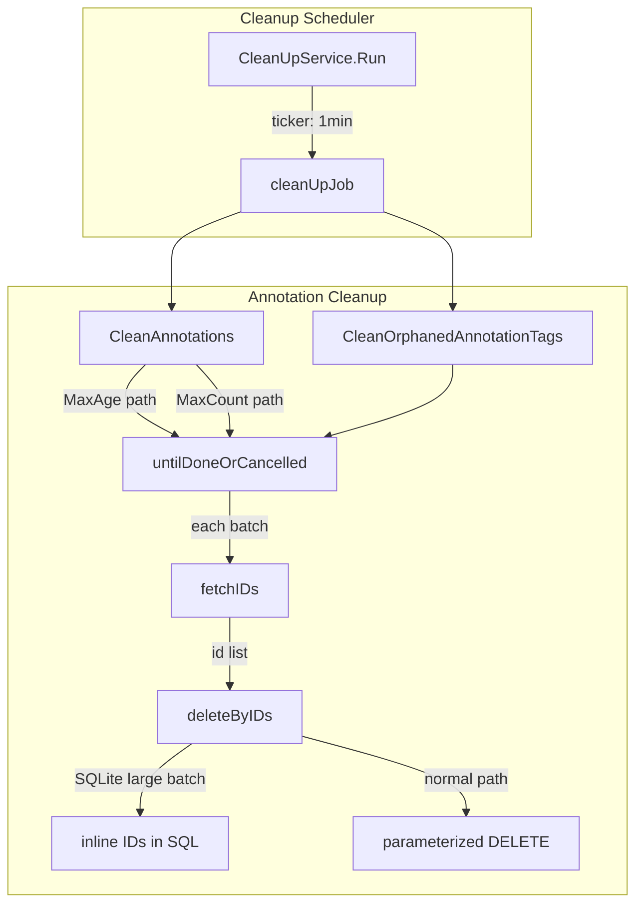

# Code Review: grafana__grafana__grafana__PR80329

**PR**: Database Performance Optimizations — https://github.com/grafana/grafana/pull/80329
**Instance**: grafana__grafana__grafana__PR80329
**Date**: 2026-04-08
**Source of truth**: AI failure mode checklist + structural detection targets (no spec available)

---

## Intent Register

### Intent Claims

1. The annotation cleanup system deletes old annotations by age (`MaxAge`) and by count (`MaxCount`) in batched operations.
2. The PR replaces single-statement DELETE-with-subquery with a two-step fetch-IDs-then-delete-by-IDs approach to avoid MySQL deadlocks during concurrent inserts.
3. Batch processing repeats until no more matching rows exist, the context is cancelled, or an error occurs (`untilDoneOrCancelled`).
4. Orphaned annotation tags (tags referencing deleted annotations) are cleaned in the same batched manner.
5. A SQLite-specific path handles the parameter limit by inlining IDs directly into the SQL statement when batch size exceeds 999.
6. The `fetchIDs` method requires a non-empty condition to prevent accidental full-table scans.
7. The `deleteByIDs` method is a no-op when given an empty ID slice.
8. Tests are refactored to be self-contained: each test case creates its own annotations and cleans up after itself.
9. Tests are renamed with `TestIntegration` prefix and skip under `testing.Short()`.
10. A new test validates that batch sizes larger than `SQLITE_MAX_VARIABLE_NUMBER` (32767) work correctly.
11. Test annotation creation is changed from individual inserts to batch inserts (`InsertMulti`) for performance.
12. The cleanup job ticker interval is changed from 10 minutes to 1 minute.

### Intent Diagram

---

## Verified Findings

### F-01 — Error-level logging for routine cleanup diagnostics
- **Sighting**: S-01
- **Location**: `pkg/services/annotations/annotationsimpl/xorm_store.go`, lines 239, 243, 263, 266, 289, 292
- **Type**: behavioral | **Severity**: major | **Origin**: introduced
- **Current behavior**: Six `r.log.Error` calls fire on every successful batch iteration with diagnostic messages ("Annotations to clean by time", "cleaned annotations by time", etc.). No error condition is required to trigger them. The `err` field logged in lines 239, 263, 289 is guaranteed nil at those points (error return already handled above).
- **Expected behavior**: Diagnostic progress logging for non-error code paths should use Info or Debug level. Error level should be reserved for actual error conditions.
- **Source of truth**: Checklist item 8 (semantic drift — log level ERROR signals error, code path is normal operation)
- **Evidence**: All six log calls are inside the `batchWork` callback in the normal (non-error) code path. The `if err != nil { return 0, err }` guard returns before these log calls when an actual error occurs.
- **Pattern label**: log-level-misuse
- **Detection source**: checklist

### F-02 — SQLite inline-ID path guard checks config, not actual parameter count
- **Sighting**: S-02
- **Location**: `pkg/services/annotations/annotationsimpl/xorm_store.go`, lines 322-331
- **Type**: behavioral | **Severity**: minor | **Origin**: introduced
- **Current behavior**: The SQLite ID-inlining path activates when `r.cfg.AnnotationCleanupJobBatchSize > 999`, not when `len(ids) > 999`. For final partial batches where `len(ids)` may be well under 999, the inline path fires unnecessarily. Both paths produce correct SQL (IDs are int64, no injection risk).
- **Expected behavior**: Guard should check `len(ids) > sqliteParameterLimit` — the actual parameter count being bound.
- **Source of truth**: Intent claim 5
- **Evidence**: Line 322: `if r.db.GetDBType() == migrator.SQLite && r.cfg.AnnotationCleanupJobBatchSize > sqliteParameterLimit`. fetchIDs applies `Limit(batchSize)`, so `len(ids)` never exceeds batchSize — the guard is conservative, not incorrect, but imprecise.
- **Pattern label**: parameter-guard-imprecision
- **Detection source**: intent

### F-03 — Zero-return ambiguity in batch loop termination
- **Sighting**: S-06
- **Location**: `pkg/services/annotations/annotationsimpl/xorm_store.go`, lines 357-384
- **Type**: fragile | **Severity**: minor | **Origin**: introduced
- **Current behavior**: `untilDoneOrCancelled` terminates when `batchWork` returns `(0, nil)`. If a concurrent delete removes rows between `fetchIDs` and `deleteByIDs`, `deleteByIDs` returns `(0, nil)` with a non-empty `ids` slice, and the loop exits prematurely — even though additional rows may still match the original query.
- **Expected behavior**: Loop termination should distinguish "no IDs fetched" (done) from "IDs fetched but deleted concurrently" (should retry). At minimum, document the invariant.
- **Source of truth**: Checklist item 9 (zero-value sentinel ambiguity)
- **Evidence**: Line 312-313: `deleteByIDs` returns `(0, nil)` for empty slice. Function comment at line 354 documents "returns zero affected objects" as termination. The PR comments acknowledge the under-delete possibility: "This may under-delete when concurrent inserts happen, but any such annotations will simply be cleaned on the next cycle."
- **Pattern label**: zero-sentinel-ambiguity
- **Detection source**: checklist

### F-04 — Log calls serialize full ID slices, causing log volume explosion
- **Sighting**: S-08
- **Location**: `pkg/services/annotations/annotationsimpl/xorm_store.go`, lines 239, 263, 289
- **Type**: behavioral | **Severity**: major | **Origin**: introduced
- **Current behavior**: Three log calls include `"ids", ids` where `ids` is a `[]int64` slice of up to `AnnotationCleanupJobBatchSize` elements (test case uses 32,767). Each log call serializes the full slice at Error level. With cleanup running every 1 minute (changed from 10), this produces unbounded log volume proportional to table size.
- **Expected behavior**: Batch logging should record count only (`"count", len(ids)`), not the full ID list. Debug-level ID-granularity logging should be gated behind a trace/debug level.
- **Source of truth**: Structural detection target (mixed logic and side effects)
- **Evidence**: Lines 239, 263, 289 each contain `"ids", ids`. Test case at line 107-108 uses `annotationCleanupJobBatchSize: 32767` with 40,003 annotations, confirming large slices are expected. cleanup.go line 390 confirms 1-minute interval.
- **Pattern label**: log-volume-explosion
- **Detection source**: structural-target

### F-05 — Cleanup ticker interval reduced 10x without documentation
- **Sighting**: S-09
- **Location**: `pkg/services/cleanup/cleanup.go`, line 390
- **Type**: behavioral | **Severity**: major | **Origin**: introduced
- **Current behavior**: The cleanup service ticker changed from `time.Minute * 10` to `time.Minute * 1`, a 10x increase in cleanup frequency. No comment or documentation explains the change. The `* 1` multiplier is redundant (equivalent to `time.Minute`), consistent with a debug artifact that was not reverted.
- **Expected behavior**: Either restore `time.Minute * 10` or document the rationale for 1-minute frequency. Write it as `time.Minute` if intentional.
- **Source of truth**: PR title "Database Performance Optimizations" conflicts with running cleanup 10x more frequently
- **Evidence**: Diff line: `-ticker := time.NewTicker(time.Minute * 10)` / `+ticker := time.NewTicker(time.Minute * 1)`. No surrounding comment explains the change.
- **Pattern label**: debug-leftover
- **Detection source**: intent

### F-06 — SQLite-specific test not guarded by database dialect
- **Sighting**: S-10
- **Location**: `pkg/services/annotations/annotationsimpl/cleanup_test.go`, lines 104-118
- **Type**: test-integrity | **Severity**: minor | **Origin**: introduced
- **Current behavior**: Test "should not fail if batch size is larger than SQLITE_MAX_VARIABLE_NUMBER for SQLite >= 3.32.0" runs on all CI backends. On non-SQLite backends, `r.db.GetDBType() != migrator.SQLite`, so the inline-ID branch is never taken. The test passes but exercises only the parameterized path already covered by other tests.
- **Expected behavior**: Skip on non-SQLite backends with `t.Skip`, or document that SQLite-specific coverage requires SQLite CI.
- **Source of truth**: Checklist item 4 (non-enforcing tests)
- **Evidence**: Guard at xorm_store.go line 322 is `r.db.GetDBType() == migrator.SQLite`. `db.InitTestDB(t)` respects `GRAFANA_TEST_DB` env var.
- **Pattern label**: backend-specific-coverage-gap
- **Detection source**: checklist

### F-07 — fetchIDs parameter "condition" receives full SQL clause fragment
- **Sighting**: S-11
- **Location**: `pkg/services/annotations/annotationsimpl/xorm_store.go`, fetchIDs (lines 297-308) and callers (lines 234, 258, 284)
- **Type**: structural | **Severity**: minor | **Origin**: introduced
- **Current behavior**: `fetchIDs` names its second parameter `condition` and appends it after `WHERE`. Callers pass composite SQL fragments containing WHERE predicate + ORDER BY + LIMIT clauses. The guard `if condition == ""` reinforces the impression it's a filtering condition.
- **Expected behavior**: Parameter should be renamed to reflect actual role (e.g., `sqlTail`) or the function should compose ORDER BY/LIMIT internally.
- **Source of truth**: Structural detection target (semantic drift)
- **Evidence**: Caller at line 234 passes `%s AND created < %v ORDER BY id DESC %s` as `condition`.
- **Pattern label**: semantic-drift
- **Detection source**: structural-target

### F-08 — Test name references wrong SQLite version limit
- **Sighting**: S-12
- **Location**: `cleanup_test.go` line 105 vs `xorm_store.go` line 321
- **Type**: test-integrity | **Severity**: minor | **Origin**: introduced
- **Current behavior**: Test named "...SQLITE_MAX_VARIABLE_NUMBER for SQLite >= 3.32.0" — the >= 3.32.0 limit is 32767. Production constant is `sqliteParameterLimit = 999` with comment "SQLite has a parameter limit of 999" — the pre-3.32.0 limit. The test correctly triggers the guard (32767 > 999) but the name misattributes which limit is being tested.
- **Expected behavior**: Test name should reference the actual production constant (999, pre-3.32.0), or the constant should be updated to 32767.
- **Source of truth**: Checklist item 8 (comment-code drift)
- **Evidence**: Code comment: "SQLite has a parameter limit of 999." Test name: "for SQLite >= 3.32.0." These reference different SQLite version limits.
- **Pattern label**: comment-code-drift
- **Detection source**: checklist

### F-09 — Test helper WithDbSession callbacks discard errors via unconditional nil return
- **Sighting**: S-13
- **Location**: `pkg/services/annotations/annotationsimpl/cleanup_test.go`, `createTestAnnotations` — both `WithDbSession` callback blocks (lines 188-196, 198-206)
- **Type**: test-integrity | **Severity**: minor | **Origin**: introduced
- **Current behavior**: Both `WithDbSession` callbacks call `require.NoError(t, err)` on `InsertMulti` results but `return nil` unconditionally. The outer `require.NoError(t, err)` on the `WithDbSession` return can never fail because the callback never returns an error. The error propagation path through the callback is broken — the outer check is structurally dead code.
- **Expected behavior**: Callbacks should `return err` to propagate errors through the normal return path.
- **Source of truth**: Structural detection target (silent error discard)
- **Evidence**: Lines 188-196 and 198-206: callback bodies end with `return nil` regardless of `InsertMulti` result. `WithDbSession` wraps callback return as its own error.
- **Pattern label**: error-propagation-gap
- **Detection source**: structural-target

---

## Findings Summary

| Finding | Type | Severity | One-line description |
|---------|------|----------|---------------------|
| F-01 | behavioral | major | `r.log.Error` used for routine cleanup diagnostics on every batch |
| F-02 | behavioral | minor | SQLite inline-ID guard checks config batch size, not actual `len(ids)` |
| F-03 | fragile | minor | `untilDoneOrCancelled` loop exit conflates "no IDs fetched" with "no rows deleted" |
| F-04 | behavioral | major | Log calls serialize full `[]int64` ID slices (up to 32K elements) |
| F-05 | behavioral | major | Cleanup ticker reduced from 10min to 1min without documentation |
| F-06 | test-integrity | minor | SQLite-specific test not skipped on non-SQLite backends |
| F-07 | structural | minor | `fetchIDs` parameter "condition" receives full SQL clause fragment |
| F-08 | test-integrity | minor | Test name references SQLite >= 3.32.0 limit but code guards at pre-3.32.0 (999) |
| F-09 | test-integrity | minor | `WithDbSession` callbacks return nil unconditionally; outer error check is dead |

**Totals**: 9 verified findings, 5 rejections (including 2 nits), 0% false positive rate (benchmark mode)

---

## Retrospective

### Sighting counts

- **Total sightings generated**: 14
- **Verified findings at termination**: 9
- **Rejections**: 5 (S-03: incorrect Go subtest premise, S-04: follows S-03, S-05: nit, S-07: nit, S-14: duplicate of F-06)
- **Nit count**: 2 (S-05: bare literal 500 in test helper, S-07: `time.Minute * 1`)

**By detection source**:
| Source | Sightings | Verified | Rejected |
|--------|-----------|----------|----------|
| checklist | 6 | 4 (F-01, F-03, F-06, F-08) | 2 (nits) |
| intent | 3 | 2 (F-02, F-05) | 1 (S-03) |
| structural-target | 5 | 3 (F-04, F-07, F-09) | 2 (S-04, S-14) |

**By type**:
- behavioral: 4 (F-01, F-02, F-04, F-05)
- test-integrity: 3 (F-06, F-08, F-09)
- fragile: 1 (F-03)
- structural: 1 (F-07) — sub-category: semantic drift

**By severity**:
- major: 3 (F-01, F-04, F-05)
- minor: 6 (F-02, F-03, F-06, F-07, F-08, F-09)

### Verification rounds

4 rounds to convergence (did not hit 5-round cap).

| Round | Sightings | Verified | Rejected | Notes |
|-------|-----------|----------|----------|-------|
| R1 | 8 | 4 | 4 | Core production issues (logging, SQLite, loop termination) |
| R2 | 4 | 4 | 0 | Ticker change, test coverage gaps, API contract |
| R3 | 2 | 1 | 1 | Error propagation in test helper; 1 duplicate |
| R4 | 0 | 0 | 0 | Converged |

Sightings-per-round trend: 8 → 4 → 2 → 0 (monotonic decrease, clean convergence).

### Scope assessment

- **Files reviewed**: 3 (cleanup_test.go, xorm_store.go, cleanup.go)
- **Lines of diff**: ~200 added/modified
- **Scope**: Annotation cleanup subsystem — batch deletion strategy, SQLite compatibility, test refactoring

### Context health

- Round count: 4
- Sightings-per-round trend: monotonic decrease (8, 4, 2, 0)
- Rejection rate per round: R1=50%, R2=0%, R3=50%, R4=N/A
- Hard cap reached: No

### Tool usage

- Linter output: N/A (isolated diff review, no project tooling available)
- Tools used: Read (diff file), Grep, Glob — standard fallback set

### Finding quality

- **False positive rate**: 0% (benchmark mode — no user dismissals)
- **False negative signals**: None available (no user feedback)
- **Origin breakdown**: All 9 findings classified as `introduced` (changes under review)

### Intent register

- **Claims extracted**: 12 (from diff context — PR title, code comments, test names, function documentation)
- **Findings attributed to intent comparison**: 2 (F-02 from intent claim 5, F-05 from intent claim 12)
- **Intent claims invalidated during verification**: 0

### Observations

1. **F-01 and F-04 are strongly coupled**: The Error-level logging and full-ID-slice serialization combine to create a production operational risk greater than either finding alone. Together with F-05 (1-minute ticker), these three findings form a compounding pattern: debug-quality logging at Error level, with full ID dumps, running every minute.

2. **The R1 rejection of S-03/S-04 was correct**: The Detector misunderstood Go's sequential subtest cleanup semantics. `t.Cleanup` runs synchronously at subtest exit before the next `t.Run` iteration. This is a recurring false positive pattern in Go test reviews.

3. **F-05 (ticker change) is the highest-confidence debug leftover**: The `time.Minute * 1` expression retains the multiplication pattern from `time.Minute * 10` but with a value that is mathematically redundant. Combined with the Error-level debug logging (F-01), this PR appears to contain development instrumentation that was not cleaned before submission.
