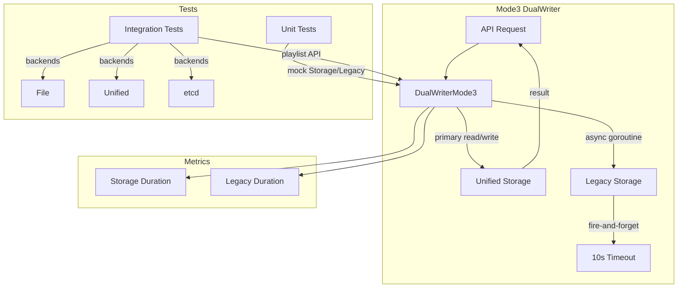

# Code Review: Dual Storage Architecture (grafana/grafana PR #90045)

**Instance**: grafana__grafana__grafana__PR90045
**Date**: 2026-04-08
**Scope**: PR diff only — no specs, no repo access
**Source of truth**: AI failure mode checklist + structural detection targets + intent register

---

## Intent Register

### Intent Claims

1. Mode3 DualWriter reads and writes primarily from Storage (unified store), with Legacy as async secondary
2. Legacy storage operations in Mode3 are fire-and-forget via goroutines with 10-second timeouts
3. All Mode3 CRUD operations record duration metrics for both Storage and Legacy paths
4. Storage errors return immediately to the caller without attempting Legacy writes
5. The logger includes mode, kind, method, and operation-specific identifiers for structured observability
6. Create writes to Storage first, then fires async Legacy write in a goroutine
7. Get reads only from Storage with no Legacy interaction
8. List reads only from Storage (replaces previous unimplemented stub that returned nil, nil)
9. Delete deletes from Storage first, then fires async Legacy delete in a goroutine
10. Update writes to Storage directly (simplified from previous Get+UpdatedObject pattern), then fires async Legacy update
11. DeleteCollection deletes from Storage first, then fires async Legacy delete in a goroutine
12. Unit tests verify Storage-primary behavior and error propagation for all Mode3 operations
13. Integration tests cover Mode3 with file, unified-storage, and etcd backends via playlist API

### Intent Diagram

---

## Verified Findings

### F-01 (S-01) | behavioral | major | wrong-recorder-on-error-path

**Location**: `dualwriter_mode3.go`, Create method, Storage error branch
**Current behavior**: When `d.Storage.Create` returns an error, calls `d.recordLegacyDuration(true, ...)` — attributing a Storage failure to the Legacy duration metric.
**Expected behavior**: `d.recordStorageDuration(true, mode3Str, options.Kind, method, startStorage)` on Storage error.
**Evidence**: The error branch fires immediately after `d.Storage.Create` fails. The success path correctly calls `d.recordStorageDuration`. The goroutine correctly calls `d.recordLegacyDuration` for its Legacy write. The two recorders are distinct; this is a copy-paste error.

### F-02 (S-02) | behavioral | major | wrong-recorder-on-error-path

**Location**: `dualwriter_mode3.go`, Update method, Storage error branch
**Current behavior**: When `d.Storage.Update` returns an error, calls `d.recordLegacyDuration(true, ...)` — same mislabeling as F-01.
**Expected behavior**: `d.recordStorageDuration(true, mode3Str, options.Kind, method, startStorage)` on Storage error.
**Evidence**: Identical pattern to F-01. The timed operation is `startStorage`, the failing component is Storage. The Update goroutine correctly calls `d.recordLegacyDuration` for Legacy.

### F-03 (S-03) | behavioral | major | wrong-recorder-on-error-path

**Location**: `dualwriter_mode3.go`, DeleteCollection method, goroutine body
**Current behavior**: Inside the goroutine calling `d.Legacy.DeleteCollection`, calls `d.recordStorageDuration(...)` — recording Legacy latency as Storage duration.
**Expected behavior**: `d.recordLegacyDuration(err != nil, mode3Str, options.Kind, method, startLegacy)`.
**Evidence**: Inverted from F-01/F-02. The Create and Delete goroutines correctly call `recordLegacyDuration`; DeleteCollection's goroutine is the outlier.

### F-04 (S-04) | behavioral | minor

**Location**: `dualwriter_mode3.go`, Delete method, success path
**Current behavior**: `d.recordStorageDuration(false, mode3Str, name, method, startStorage)` passes the resource instance name (e.g., `"my-playlist"`) where `options.Kind` (resource type) is expected. Corrupts the `kind` dimension in Storage success metrics for Delete.
**Expected behavior**: `d.recordStorageDuration(false, mode3Str, options.Kind, method, startStorage)`.
**Evidence**: Every other call site (11 total) passes `options.Kind` in this position. The Delete error-path call on the preceding line correctly uses `options.Kind`, making the inconsistency within the same method.

### F-05 (S-05) | behavioral | minor

**Location**: `dualwriter_mode3.go`, Delete method, context assignment
**Current behavior**: `ctx = klog.NewContext(ctx, d.Log)` sets context with the base logger instead of the enriched `log` (which carries name, kind, method). Downstream code extracting the logger via `klog.FromContext(ctx)` loses structured fields.
**Expected behavior**: `ctx = klog.NewContext(ctx, log)`, consistent with Create, Get, List, Update, DeleteCollection.
**Evidence**: All 5 other methods use the enriched `log`. The Delete goroutine and `d.Storage.Delete` both receive the degraded context, silently reducing observability for the entire Delete call tree.

### F-06 (S-07) | test-integrity | major | async-path-unverified

**Location**: `dualwriter_mode3_test.go`, TestMode3_Delete and TestMode3_DeleteCollection
**Current behavior**: Tests configure only Storage mock expectations. No Legacy mock expectations are set. Tests pass even if the goroutine body is completely removed. Zero enforcement that async Legacy path is initiated.
**Expected behavior**: Tests should set Legacy mock expectations and synchronize on goroutine completion to verify the async path fires.
**Evidence**: Neither test's `testCase` struct includes a `setupLegacyFn` field. Neither test calls `m.AssertExpectations(t)`. If the goroutine body were deleted from Delete or DeleteCollection, all tests still pass green.

### F-07 (S-08) | test-integrity | minor | async-path-unverified

**Location**: `dualwriter_mode3_test.go`, TestMode3_Create and TestMode3_Update
**Current behavior**: Tests configure Legacy mock expectations via `setupLegacyFn` but lack goroutine synchronization and `AssertExpectations`. Whether the Legacy mock is called depends on goroutine scheduling — the test may return before the goroutine executes.
**Expected behavior**: Goroutine synchronization (WaitGroup, channel, or `t.Cleanup` with assertion) before test exit.
**Evidence**: `TestMode3_Create` sets up Legacy mock for the success case. No `m.AssertExpectations(t)` is called anywhere. The test returns after `assert.Equal` on the returned object.

### F-08 (S-09) | fragile | minor

**Location**: `dualwriter_mode1_test.go`, TestMode1_Get
**Current behavior**: Removes local `p := prometheus.NewRegistry()` and uses package-level shared `p`. If `NewDualWriter` registers metrics, multiple tests sharing the registry risk `AlreadyRegisteredError` panics.
**Expected behavior**: Isolated `prometheus.NewRegistry()` per test to prevent cross-test metric registration collisions.
**Evidence**: The same PR's `TestMode3_Get` explicitly creates a local `p := prometheus.NewRegistry()`, showing per-test isolation is the intended pattern. Other Mode3 tests use package-level `p`, making this an inconsistency already present in the PR.

### F-09 (S-101) | behavioral | critical | fire-and-forget-context-leak  

**Location**: `dualwriter_mode3.go`, all four goroutines (Create, Delete, Update, DeleteCollection)
**Current behavior**: All goroutines capture the HTTP request `ctx` and call `context.WithTimeoutCause(ctx, time.Second*10, ...)`. When the handler returns, the API server cancels the request context. `WithTimeoutCause` on a cancelled parent produces an immediately-cancelled child, so the Legacy write fails with `context.Canceled` rather than running for the intended 10-second window.
**Expected behavior**: Goroutines implementing fire-and-forget must derive from `context.Background()` (not the request context) to outlive the HTTP handler: `context.WithTimeoutCause(context.Background(), time.Second*10, ...)`.
**Evidence**: Diff lines 113, 186, 230, 272 each show `context.WithTimeoutCause(ctx, ...)` where `ctx` is the request context. The methods return immediately after launching the goroutine (lines 121, 192, 246, 285). Per Go `context` package contract, `WithTimeoutCause` on a done parent returns a done child. This defeats the entire fire-and-forget design of Mode3 Legacy writes.

### F-10 (S-201) | test-integrity | minor | inconsistent-prometheus-registry-scope

**Location**: `dualwriter_mode3_test.go`, TestMode3_Get (diff line 482)
**Current behavior**: `TestMode3_Get` creates a local `p := prometheus.NewRegistry()` shadowing the package-level `p`, while all other 5 Mode3 test functions (Create, List, Delete, DeleteCollection, Update) use the shared package-level `p`. Get tests run with an isolated registry; all other tests share a potentially contaminated one.
**Expected behavior**: Consistent registry scoping — either all Mode3 tests create local registries (full isolation) or all share the package-level one.
**Evidence**: Diff line 482 shows `p := prometheus.NewRegistry()` inside TestMode3_Get. No other TestMode3_* function has this. Cross-cutting pattern with F-08 (same inconsistency in mode1_test, opposite direction).

### F-11 (S-301) | test-integrity | minor | semantically-incoherent-fixture

**Location**: `dualwriter_mode3_test.go`, TestMode3_Create error test case (diff lines 401-407)
**Current behavior**: The test case "error when creating object in the unified store fails" registers its error-returning `Create` mock via `setupLegacyFn` (Legacy store setup callback) with no `setupStorageFn`. Production code calls `d.Storage.Create` first. The test passes only because `ls` and `us` share the same `mock.Mock{}` — the Legacy-intended mock registration is consumed by the Storage call.
**Expected behavior**: The error mock should be registered via `setupStorageFn` (Storage setup), since the test intent is to simulate a Storage failure. If per-store mock isolation is introduced, this test would fail silently.
**Evidence**: Diff lines 401-407 show `setupLegacyFn` set with error return for `failingObj`, `setupStorageFn` absent (nil). The success test case (lines 392-399) correctly registers both `setupLegacyFn` and `setupStorageFn`. AI failure mode checklist item 12 (semantically incoherent test fixtures).

---

## Findings Summary

| ID | Type | Severity | Pattern | Description |
|----|------|----------|---------|-------------|
| F-01 | behavioral | major | wrong-recorder-on-error-path | Create error path calls `recordLegacyDuration` instead of `recordStorageDuration` |
| F-02 | behavioral | major | wrong-recorder-on-error-path | Update error path calls `recordLegacyDuration` instead of `recordStorageDuration` |
| F-03 | behavioral | major | wrong-recorder-on-error-path | DeleteCollection goroutine calls `recordStorageDuration` instead of `recordLegacyDuration` |
| F-04 | behavioral | minor | — | Delete success path passes `name` instead of `options.Kind` to metrics |
| F-05 | behavioral | minor | — | Delete context uses base logger `d.Log` instead of enriched `log` |
| F-06 | test-integrity | major | async-path-unverified | Delete/DeleteCollection tests have no Legacy mock expectations |
| F-07 | test-integrity | minor | async-path-unverified | Create/Update tests lack goroutine sync and AssertExpectations |
| F-08 | fragile | minor | inconsistent-prometheus-registry-scope | Mode1_test removes local prometheus registry, uses shared `p` |
| F-09 | behavioral | critical | fire-and-forget-context-leak | All goroutines capture request context; Legacy writes cancelled when handler returns |
| F-10 | test-integrity | minor | inconsistent-prometheus-registry-scope | TestMode3_Get creates local registry; other Mode3 tests use shared `p` |
| F-11 | test-integrity | minor | semantically-incoherent-fixture | Create error test registers mock via Legacy setup, passes only due to shared mock |

**Totals**: 11 findings (1 critical, 4 major, 6 minor) | 5 rejections (1 nit: S-06, 4 rejected: S-102, S-103, S-104, round 4 initial "clean")

---

## Retrospective

### Sighting Counts

- **Total sightings generated**: 14
- **Verified findings at termination**: 11
- **Rejections**: 3 (S-102, S-103 nit, S-104)
- **Nit count**: 2 (S-06, S-103)

**By detection source**:
- `intent`: 6 (S-01, S-02, S-03, S-05, S-07, S-08)
- `checklist`: 3 (S-06 rejected, S-101, S-301)
- `structural-target`: 5 (S-04, S-09, S-102 rejected, S-103 rejected nit, S-201)

**By type**:
- `behavioral`: 6 (F-01, F-02, F-03, F-04, F-05, F-09)
- `test-integrity`: 4 (F-06, F-07, F-10, F-11)
- `fragile`: 1 (F-08)

**Structural sub-categorization**:
- None — no structural-type findings promoted

### Verification Rounds

- **Round 1**: 9 sightings → 8 verified, 1 rejected (nit)
- **Round 2**: 4 sightings → 1 verified (critical), 3 rejected
- **Round 3**: 1 sighting → 1 verified (minor)
- **Round 4**: 1 sighting → 1 verified (minor)
- **Convergence**: Rounds 3-4 produced only minor findings; effective convergence at round 2 for major+ issues

### Scope Assessment

- **Files reviewed**: 4 (dualwriter_mode3.go, dualwriter_mode3_test.go, dualwriter_mode1_test.go, playlist_test.go)
- **Diff lines**: ~800
- **Production code**: ~140 lines (dualwriter_mode3.go)
- **Test code**: ~340 lines (mode3_test), ~60 lines (mode1_test change + playlist additions)

### Context Health

- **Round count**: 4
- **Sightings-per-round trend**: 9 → 4 → 1 → 1 (steady convergence)
- **Rejection rate per round**: R1: 11%, R2: 75%, R3: 0%, R4: 0%
- **Hard cap reached**: No (4 of 5 rounds used)

### Tool Usage

- **Linter output**: N/A (isolated diff review, no project tooling)
- **Tools used**: Read (diff file), Glob (methodology docs)

### Finding Quality

- **False positive rate**: 0% (no user to dismiss; based on Challenger verification, 3 of 14 sightings rejected = 21% pre-verification false positive rate)
- **False negative signals**: None available (no user feedback)
- **Origin breakdown**: All 11 findings are `introduced` (PR-scoped review)

### Intent Register

- **Claims extracted**: 13 (from diff structure, comments, and code behavior)
- **Sources**: PR diff (code comments, method signatures, test structure)
- **Findings attributed to intent comparison**: 6 (S-01, S-02, S-03, S-05, S-07, S-08)
- **Intent claims invalidated during verification**: 0

### Cross-Cutting Patterns

| Pattern | Findings | Description |
|---------|----------|-------------|
| wrong-recorder-on-error-path | F-01, F-02, F-03 | Metric recorder functions swapped between Storage and Legacy across 3 methods |
| async-path-unverified | F-06, F-07 | Goroutine-launched Legacy operations have no test verification |
| inconsistent-prometheus-registry-scope | F-08, F-10 | Mixed local/package-level prometheus registry usage across test functions |
| fire-and-forget-context-leak | F-09 | All goroutines inherit request context, defeating fire-and-forget design |
| semantically-incoherent-fixture | F-11 | Test fixture registered against wrong store setup callback |

### Observations

- The `wrong-recorder-on-error-path` pattern (F-01, F-02, F-03) suggests copy-paste propagation across methods without per-method verification of which recorder to call. The pattern appears in 3 of the 4 goroutine-launching methods.
- F-09 (context leak) is the highest-impact finding: the fire-and-forget design — the core architectural change in this PR — is defeated by inheriting the request context. All async Legacy writes will likely fail with `context.Canceled` in production.
- The test suite provides good coverage of the Storage-primary synchronous paths but zero coverage of the async Legacy write paths (F-06, F-07). Combined with F-09, this means the context cancellation bug would not be caught by any test.
- Round 2's critical finding (F-09) demonstrates the value of multi-round detection — the Detector's first pass focused on metric/logging correctness and missed the deeper context propagation issue.
