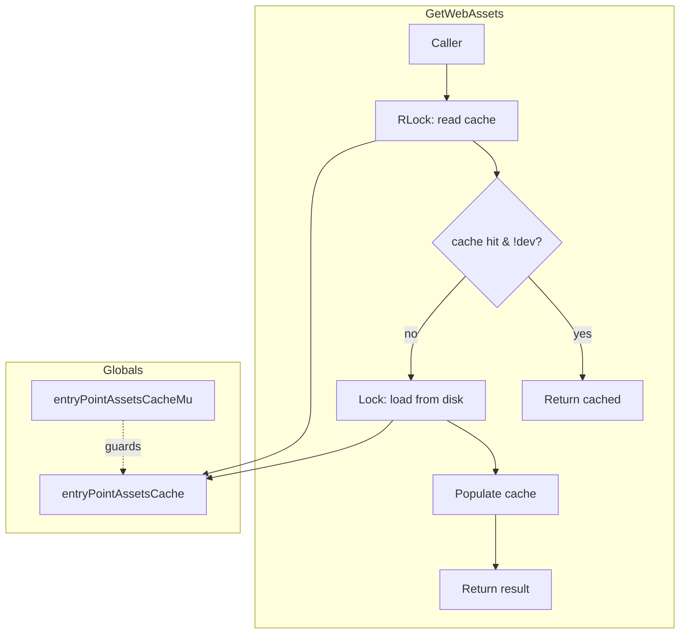

# Code Review: grafana/grafana PR90939

**Date**: 2026-04-06
**Scope**: `pkg/api/webassets/webassets.go` — add mutex protection to global web asset cache
**Source of truth**: AI failure mode checklist + structural detection targets (no spec available)
**Token use**: in: (opus-4: 0K) (sonnet-4: 0K) out: (opus-4: 9K) (sonnet-4: 7K) cache-w: (opus-4: 119K) (sonnet-4: 65K) cache-r: (opus-4: 889K) (sonnet-4: 159K)

---

## Intent Register

### Intent Claims

1. `GetWebAssets()` returns cached web asset metadata, loading from disk only on the first call (or always in dev mode).
2. The global `entryPointAssetsCache` stores the singleton cache value for the web asset entry point.
3. The PR introduces thread-safety by protecting `entryPointAssetsCache` with a `sync.RWMutex`.
4. The read path acquires an RLock, copies the cache pointer, and releases the RLock before checking the value.
5. If the cache is nil or running in dev mode, the write path acquires a full Lock to populate the cache.
6. The mutex is declared as a package-level global alongside the cache pointer.

### Intent Diagram

---

## Verified Findings

### F-01 — Missing double-check under write lock (major)

| Field | Value |
|---|---|
| **Sighting** | S-01 |
| **Location** | `pkg/api/webassets/webassets.go`, write-lock acquisition block |
| **Type** | behavioral |
| **Severity** | major |
| **Origin** | introduced |
| **Detection source** | intent |
| **Pattern label** | missing-double-check-under-write-lock |

**Current behavior:** After acquiring the write lock, the function proceeds directly to loading from disk without re-reading `entryPointAssetsCache`. Multiple goroutines that all observed `ret == nil` under the RLock will serialize on the write lock and each execute the full disk-load path, overwriting the cache on every turn.

**Expected behavior:** After acquiring the write lock, re-read `entryPointAssetsCache` and return early if another goroutine has already populated it. This is the standard double-checked locking pattern for RWMutex-guarded cache population.

**Evidence:** The diff shows no re-read of `entryPointAssetsCache` between `entryPointAssetsCacheMu.Lock()` and `var err error`. The unchanged portion loads from disk and sets the cache. Under concurrent cold-cache calls, goroutines queue on the write lock and each executes the redundant load path. Reachable in production on any concurrent web serving deployment.

### F-02 — Ambient state access (info)

| Field | Value |
|---|---|
| **Sighting** | S-03 |
| **Location** | `pkg/api/webassets/webassets.go`, lines 18–21 |
| **Type** | structural |
| **Severity** | info |
| **Origin** | pre-existing (extended by PR) |
| **Detection source** | structural-target |

**Current behavior:** `entryPointAssetsCache` and `entryPointAssetsCacheMu` are both package-level mutable globals accessed directly by `GetWebAssets()`. The PR adds the mutex as a companion global, extending the ambient state footprint. The TODO comment defers removal.

**Expected behavior:** Cache state injected or scoped to avoid package-level globals, enabling proper test isolation.

---

## Findings Summary

| ID | Type | Severity | Description |
|---|---|---|---|
| F-01 | behavioral | major | Missing double-check under write lock — TOCTOU race causes redundant disk loads on cold cache |
| F-02 | structural | info | Ambient state access — package-level globals for cache and mutex |

- Verified findings: 2
- Rejections: 1 (S-02: dev-mode RLock overhead — rejected as nit)
- False positive rate: 0% (no user-dismissed findings)

---

## Retrospective

### Sighting counts

- Total sightings generated: 3
- Verified findings at termination: 2 (1 major, 1 info)
- Rejections: 1
- Nits: 1 (S-02)
- By detection source: intent (2), structural-target (1)
- Structural sub-categorization: ambient state access (1)

### Verification rounds

- 2 rounds to convergence
- Round 1: 3 sightings → 2 verified, 1 rejected as nit
- Round 2: 0 new sightings above info → termination

### Scope assessment

- Files reviewed: 1 (`pkg/api/webassets/webassets.go`)
- Lines changed: ~20 (diff-only review)
- Small, focused concurrency fix — minimal scope

### Context health

- 2 rounds, declining sightings-per-round (3 → 0)
- Rejection rate: Round 1 33% (1/3), Round 2 N/A
- Hard cap (5 rounds) not reached

### Tool usage

- No project-native linters available (external project diff review)
- Diff-only analysis — no access to full file or test suite

### Finding quality

- False positive rate: 0%
- False negatives: none identified (diff scope is small)
- Origin breakdown: 1 introduced (F-01), 1 pre-existing (F-02)

### Intent register

- Claims extracted: 6 (from diff context and Go concurrency patterns)
- Findings attributed to intent comparison: 2 (F-01 from intent claim 5, F-02 from structural target)
- Intent claims invalidated: 0
