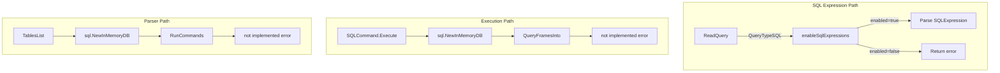

# Code Review: grafana__grafana__grafana__PR94942

**PR**: Advanced SQL Analytics Framework (https://github.com/grafana/grafana/pull/94942)
**Instance**: grafana__grafana__grafana__PR94942
**Date**: 2026-04-07

## Intent Register

### Intent Claims

1. The `go-duck` (DuckDB) external dependency is removed from the project (`go.mod`, `go.sum`)
2. A local stub `DB` struct in `pkg/expr/sql/db.go` replaces `duck.NewInMemoryDB()` — all methods return "not implemented" errors
3. SQL expression queries are gated behind the `FlagSqlExpressions` feature flag via `enableSqlExpressions()` in `pkg/expr/reader.go`
4. When SQL expressions are not enabled, `ReadQuery` returns an error: "sqlExpressions is not implemented"
5. `pkg/expr/sql/parser.go` and `pkg/expr/sql_command.go` are updated to use the local stub DB instead of `go-duck`

### Intent Diagram

---

## Verified Findings

### F-01 — `enableSqlExpressions` always returns `false` (inverted gate + dead branch)

| Field | Value |
|---|---|
| **Sighting** | S-01 (S-02 merged) |
| **Location** | `pkg/expr/reader.go`, `enableSqlExpressions` function |
| **Type** | behavioral |
| **Severity** | critical |
| **Detection source** | checklist (item 14: dead conditional guards) |
| **Pattern label** | inverted-gate / dead-branch |

**Current behavior**: `enableSqlExpressions` unconditionally returns `false` on every execution path. Line 1 negates the flag result (`enabled := !h.features.IsEnabledGlobally(...)`), making `enabled` semantically inverted — it is `true` when the flag is globally disabled. The `if enabled` branch returns `false`; the fall-through also returns `false`. The call site in `ReadQuery()` therefore always evaluates `!enabled` as `true` and always returns `fmt.Errorf("sqlExpressions is not implemented")`, regardless of whether `FlagSqlExpressions` is enabled in production.

**Expected behavior**: When `FlagSqlExpressions` is enabled globally, `enableSqlExpressions` should return `true`, allowing the SQL query path to proceed. The function could be a single expression: `return h.features.IsEnabledGlobally(featuremgmt.FlagSqlExpressions)`.

**Evidence**: Exhaustive path trace — flag on: `enabled = !true = false`, `if false` not entered, `return false`; flag off: `enabled = !false = true`, `if true` entered, `return false`. Both paths return `false`. The double defect is: (1) the negation operator inverts the flag semantics on assignment, and (2) both branches of the conditional return the same value, making the `if enabled` guard structurally dead (S-02 merged here as structural evidence for the same root cause).

---

### F-02 — Stub DB is dead infrastructure (consequential on F-01)

| Field | Value |
|---|---|
| **Sighting** | S-03 |
| **Location** | `pkg/expr/sql/db.go` (all methods); `pkg/expr/sql_command.go` |
| **Type** | structural |
| **Severity** | major |
| **Detection source** | checklist (item 7: dead infrastructure) |
| **Pattern label** | dead-infrastructure |

**Current behavior**: The `sql.DB` stub and its wiring in `sql_command.go` constitute dead infrastructure. Because `enableSqlExpressions` always returns `false` (F-01), the `QueryTypeSQL` branch in `ReadQuery()` always exits with an error before any SQL expression object is constructed or executed. The `db.QueryFramesInto` call in `sql_command.go` is unreachable through the normal pipeline.

**Expected behavior**: Either the feature gate should be corrected (F-01) so the stub is exercised under the flag, or the stub should not be wired up until the gate works.

**Evidence**: The gate check `if !enabled { return eq, fmt.Errorf(...) }` short-circuits before any command object using `sql.NewInMemoryDB()` is constructed. The stub's existence is contingent on F-01 being fixed to have any runtime effect.

---

### F-03 — Bare string error for feature gate rejection

| Field | Value |
|---|---|
| **Sighting** | S-04 |
| **Location** | `pkg/expr/reader.go`, `ReadQuery()` case `QueryTypeSQL` |
| **Type** | fragile |
| **Severity** | minor |
| **Detection source** | checklist (items 1, 11: bare literals, string-based error classification) |
| **Pattern label** | bare-string-error |

**Current behavior**: The error returned when SQL expressions are disabled is `fmt.Errorf("sqlExpressions is not implemented")`. This bare string error: (1) is semantically inaccurate — the feature exists behind a flag and is disabled, not unimplemented; (2) cannot be matched programmatically by callers without string comparison; (3) does not wrap a sentinel error with `%w`, preventing `errors.Is`/`errors.As` inspection.

**Expected behavior**: The error should use a sentinel (e.g., `ErrFeatureDisabled`) or at minimum carry a message that distinguishes "feature flag disabled" from "not implemented."

**Evidence**: `fmt.Errorf("sqlExpressions is not implemented")` produces an opaque `*errors.errorString` with no programmatic identity. Any caller needing to distinguish this error must do string matching.

---

## Findings Summary

| ID | Type | Severity | Description |
|---|---|---|---|
| F-01 | behavioral | critical | `enableSqlExpressions` always returns `false` — SQL expressions permanently blocked |
| F-02 | structural | major | Stub DB is dead infrastructure due to F-01's broken gate |
| F-03 | fragile | minor | Bare string error is semantically misleading and not inspectable |

**Totals**: 3 verified findings, 3 rejections (S-02 merged into F-01, S-05 subsumed by F-02, S-06 rejected as nit), 0 false positives

---

## Retrospective

### Sighting counts

- **Total sightings generated**: 6 (4 in Round 1, 2 in Round 2)
- **Verified findings at termination**: 3 (1 critical, 1 major, 1 minor)
- **Rejections**: 3 (S-02 merged into F-01, S-05 subsumed by F-02, S-06 nit)
- **Nit count**: 2 (S-05, S-06)
- **By detection source**: checklist: 3 (S-01, S-02, S-04), intent: 1 (S-03), structural-target: 1 (S-05), checklist: 1 (S-06)
- **Structural sub-categorization**: dead infrastructure: 1 (F-02)

### Verification rounds

- **Rounds**: 2 (converged on Round 2 — no new sightings above info severity)
- **Round 1**: 4 sightings produced, 3 verified (S-02 merged), 0 rejected
- **Round 2**: 2 sightings produced, 0 verified, 2 rejected (nits)

### Scope assessment

- **Files reviewed**: 5 changed files (go.mod, go.sum, pkg/expr/reader.go, pkg/expr/sql/db.go, pkg/expr/sql/parser.go, pkg/expr/sql_command.go)
- **Diff size**: 299 lines (primarily dependency removal in go.mod/go.sum, ~50 lines of logic changes)
- **Substantive code**: ~30 lines of new/modified Go code across 4 files

### Context health

- **Round count**: 2 (well under 5-round cap)
- **Sightings-per-round trend**: 4 → 2 (decreasing, healthy convergence)
- **Rejection rate per round**: R1: 0% (0/4, with 1 merge), R2: 100% (2/2)
- **Hard cap reached**: No

### Tool usage

- **Linter output**: N/A (diff-only benchmark, no project tooling available)
- **Tools used**: Read (diff file), Agent (detector/challenger spawns)

### Finding quality

- **False positive rate**: TBD (user has not reviewed findings)
- **False negative signals**: None reported
- **Origin breakdown**: All findings marked `introduced` (new code in this PR)

### Intent register

- **Claims extracted**: 5 (from diff analysis — no external documentation available)
- **Findings attributed to intent comparison**: 1 (F-02, detection source: intent via S-03)
- **Intent claims invalidated during verification**: 1 (Claim 3 — "SQL expressions are gated behind the feature flag" is technically true but the gate never opens, so the claim is misleading)
