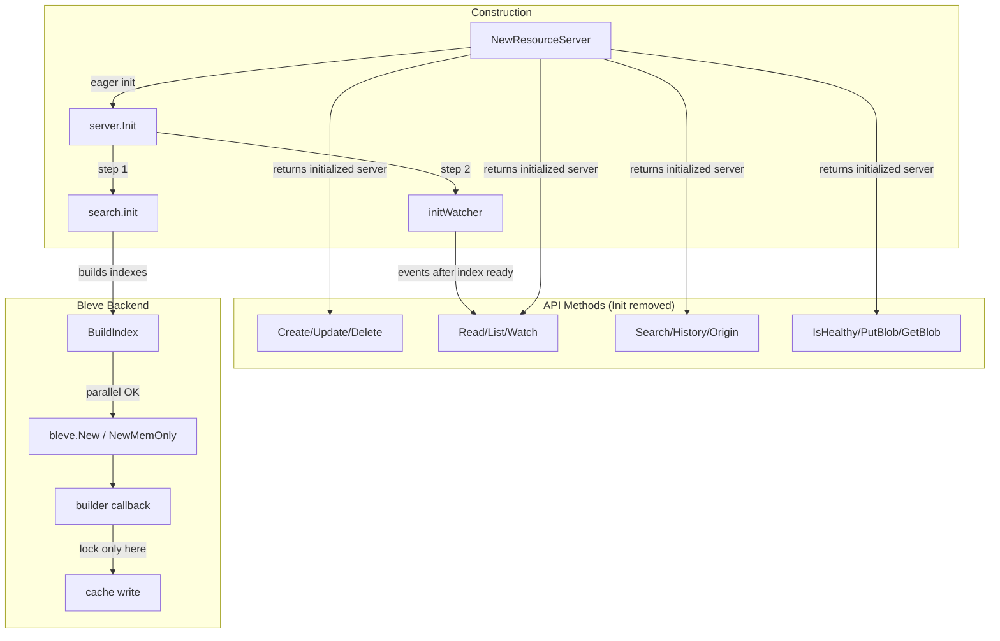

# Code Review: Unified Storage Performance Optimizations

**PR**: [grafana/grafana#97529](https://github.com/grafana/grafana/pull/97529)
**Instance**: grafana__grafana__grafana__PR97529
**Date**: 2026-04-07

## Intent Register

### Intent Claims

1. The unified storage server initializes eagerly during `NewResourceServer()` construction rather than lazily on first API call.
2. Search index initialization completes before the event watcher starts, ensuring the index is ready before events flow.
3. The bleve backend reduces mutex scope from the entire `BuildIndex` operation to only the cache write, enabling parallel index building.
4. Traced contexts from `tracer.Start()` are captured and propagated to child operations instead of being discarded (`_`).
5. Structured instance loggers (`s.log`) replace the global CLI logger (`grafana-cli/logger`) for contextual logging.
6. Integration tests that fail in CI (postgres in Drone) are skipped with TODO markers for future resolution.
7. Per-method `Init()` guard calls are removed from all server methods since initialization is now guaranteed at construction time.
8. Index creation timing is logged at Info level for operational observability.

### Intent Diagram

---

## Verified Findings

### F-01: Duplicate error log on Init failure (minor, behavioral)

- **Sighting**: S-01
- **Location**: `pkg/storage/unified/resource/server.go` — `NewResourceServer` (diff lines 71-75) and `Init` once block (diff lines 99-101)
- **Current behavior**: When `NewResourceServer` calls `s.Init(ctx)` and initialization fails, `Init()` logs `"error initializing resource server"` inside its `once.Do` block, then returns the error. `NewResourceServer` receives that error and logs the identical message a second time. One failure produces two identical log entries.
- **Expected behavior**: One error log entry per initialization failure. `Init()` already owns error reporting; the caller should only propagate the return value.
- **Source of truth**: Intent 1
- **Evidence**: Both log calls visible in the diff with identical message strings. Both are reachable on the same code path.

### F-02: Non-deferred mutex unlock in BuildIndex (minor, fragile)

- **Sighting**: S-02
- **Location**: `pkg/storage/unified/search/bleve.go`, diff lines 254-256
- **Current behavior**: `b.cacheMu.Lock()` / `b.cache[key] = idx` / `b.cacheMu.Unlock()` without `defer`. A panic between lock and unlock (e.g., nil map) would leave the mutex permanently held.
- **Expected behavior**: Per Go convention, `defer b.cacheMu.Unlock()` should be used to guarantee release on all exit paths.
- **Source of truth**: Intent 3
- **Evidence**: Non-deferred pattern directly visible in diff. Panic risk is low (single map write) but the convention violation is real.
- **Note**: Weakened from Detector claim — deadlock-on-panic scenario is theoretically valid but the code window is trivial.

### F-03: Concurrent build race for same-key file-backed indexes (major, behavioral)

- **Sighting**: S-03
- **Location**: `pkg/storage/unified/search/bleve.go`, diff lines 227-258
- **Current behavior**: Removing the broad mutex from `BuildIndex` allows concurrent goroutines to build indexes for the same cache key simultaneously. For file-backed indexes, both goroutines call `bleve.New(dir, mapper)` on the same filesystem path (derived deterministically from the key). The second call encounters an already-existing directory, causing error or corruption. Only the cache write is protected by the narrowed mutex.
- **Expected behavior**: Concurrent builds for the same key must be serialized or deduplicated. The old broad lock achieved this; the new narrow lock does not.
- **Source of truth**: Intent 3
- **Evidence**: Broad lock removal at diff lines 231-232. File path derivation at diff line 239. Narrow lock only at diff lines 254-256.

### F-04: Unconditionally skipped postgres test with no tracker reference (minor, test-integrity)

- **Sighting**: S-04
- **Location**: `pkg/server/module_server_test.go`, diff lines 9-12
- **Current behavior**: Test is skipped for postgres with a bare `// TODO - fix this test for postgres` comment. No issue number, no assignee, no resolution criteria.
- **Expected behavior**: TODO should include an actionable reference (issue number) to prevent indefinite deferral.
- **Source of truth**: Intent 6; checklist item 6
- **Evidence**: Skip block visible verbatim in diff with no tracker reference.

### F-05: Context discard fixes — pre-existing bugs corrected (info, behavioral)

- **Sighting**: S-05
- **Location**: `pkg/storage/unified/resource/search.go` (lines 32-33, 58-59); `pkg/storage/unified/sql/backend.go` (line 268-269)
- **Current behavior**: Three `tracer.Start()` calls previously discarded the enriched context (`_, span`). This diff corrects all three to `ctx, span`, enabling proper trace propagation.
- **Expected behavior**: Context from `tracer.Start()` must be captured and propagated.
- **Source of truth**: Intent 4
- **Evidence**: All three changes directly visible in diff. Pre-existing bugs, not regressions.

### F-06: History() and Origin() nil-safety gap after Init guard removal (major, behavioral)

- **Sighting**: S-06
- **Location**: `pkg/storage/unified/resource/server.go` — `History()` and `Origin()` methods
- **Current behavior**: After per-method `Init()` guards are removed, `History()` calls `s.search.History(ctx, req)` and `Origin()` calls `s.search.Origin(ctx, req)` with no nil check on `s.search`. The sibling `Search()` method explicitly guards `if s.search == nil { return nil, fmt.Errorf("search index not configured") }`. If the server runs without a search backend (`s.search == nil`), `History()` and `Origin()` panic with nil pointer dereference.
- **Expected behavior**: Both methods should guard against nil `s.search` with a structured error return, consistent with `Search()`.
- **Source of truth**: Intent 7; structural-target (nil-safety gap)
- **Evidence**: Diff lines 179-192 confirm guard removal with no nil check added. Diff lines 170-175 confirm `Search()` retains explicit nil check. `Init()` only calls `s.search.init(ctx)` when `s.search != nil` — it does not set `s.search`, so Init completion does not guarantee non-nil.

### F-07: Context discard in bleve.go BuildIndex missed by PR's own fix sweep (minor, fragile)

- **Sighting**: S-08
- **Location**: `pkg/storage/unified/search/bleve.go`, `BuildIndex()` (~line 234)
- **Current behavior**: `_, span := b.tracer.Start(ctx, tracingPrexfixBleve+"BuildIndex")` discards the child context. Child operations within `BuildIndex` won't carry the span in their trace hierarchy.
- **Expected behavior**: Should capture `ctx, span` consistent with the three analogous fixes in this same PR.
- **Source of truth**: Checklist item 10 (context bypass); Intent 4
- **Evidence**: Diff line 234 shows `_, span` intact. Diff lines 32-33, 58-59, 268-269 show the analogous `ctx, span` fixes applied elsewhere in this PR.
- **Pattern label**: context-discard (same pattern as F-05, missed instance)

---

## Findings Summary

| ID | Type | Severity | Origin | Description |
|----|------|----------|--------|-------------|
| F-01 | behavioral | minor | introduced | Duplicate error log on Init failure |
| F-02 | fragile | minor | introduced | Non-deferred mutex unlock in BuildIndex |
| F-03 | behavioral | major | introduced | Concurrent build race for same-key file-backed indexes |
| F-04 | test-integrity | minor | introduced | Unconditionally skipped postgres test with no tracker reference |
| F-05 | behavioral | info | pre-existing | Context discard fixes — pre-existing bugs corrected |
| F-06 | behavioral | major | introduced | History()/Origin() nil-safety gap after Init guard removal |
| F-07 | fragile | minor | pre-existing | Context discard in bleve.go BuildIndex missed by PR's fix sweep |

**Counts**: 7 verified findings, 1 rejection, 0 nits. False positive rate: N/A (benchmark mode, no user feedback).

---

## Retrospective

### Sighting Counts

- **Total sightings**: 8
- **Verified findings**: 7
- **Rejections**: 1 (S-07 — resource leak on Init failure, unverifiable from diff)
- **Nits**: 0

**By detection source**:
- `checklist`: 4 sightings (F-01, F-04, F-05, F-07)
- `structural-target`: 3 sightings (F-02, F-03, F-06)
- `intent`: 1 sighting (S-07 — rejected)

**By type**:
- `behavioral`: 4 (F-01, F-03, F-05, F-06)
- `fragile`: 2 (F-02, F-07)
- `test-integrity`: 1 (F-04)
- `structural`: 0

**By severity**:
- `critical`: 0
- `major`: 2 (F-03, F-06)
- `minor`: 4 (F-01, F-02, F-04, F-07)
- `info`: 1 (F-05)

**By origin**:
- `introduced`: 5 (F-01, F-02, F-03, F-04, F-06)
- `pre-existing`: 2 (F-05, F-07)

### Verification Rounds

- **Rounds to convergence**: 3
- Round 1: 5 sightings → 5 verified (F-01–F-05; F-02 weakened)
- Round 2: 3 sightings → 2 verified (F-06, F-07), 1 rejected (S-07)
- Round 3: Clean — no new sightings above info severity
- Hard cap (5 rounds) not reached

### Scope Assessment

- **Files in diff**: 5 (`module_server_test.go`, `search.go`, `server.go`, `bleve.go`, `backend.go`)
- **Diff lines**: ~273 (additions + deletions)
- **Review mode**: Diff-only, no repository access

### Context Health

- **Round count**: 3
- **Sightings-per-round trend**: 5 → 3 → 0 (monotonically decreasing)
- **Rejection rate per round**: R1: 0/5, R2: 1/3, R3: N/A
- **Hard cap reached**: No

### Tool Usage

- **Linter output**: N/A (benchmark mode, no project tooling)
- **Project tools**: None available (diff-only review)
- **Fallback**: Read-only diff analysis

### Finding Quality

- **False positive rate**: N/A (benchmark mode, no user dismissals)
- **False negative signals**: N/A (no user feedback)
- **Origin breakdown**: 5 introduced, 2 pre-existing

### Intent Register

- **Claims extracted**: 8 (from diff structural analysis)
- **Sources**: PR title, diff behavioral analysis
- **Findings attributed to intent comparison**: 1 sighting (S-07, rejected)
- **Intent claims invalidated**: None

### Key Observations

1. **The major findings (F-03, F-06) are both consequences of the same architectural change** — moving from lazy to eager init. F-03 arises from mutex scope reduction enabling concurrent builds. F-06 arises from removing per-method Init guards that were implicitly masking nil-safety gaps in History/Origin.

2. **The context-discard pattern (F-05, F-07) shows an incomplete sweep** — the PR correctly fixed 3 of 4 instances of `_, span := tracer.Start(ctx, ...)` but missed the one in `bleve.go BuildIndex`. This is a classic "fix pattern but miss an instance" failure mode.

3. **The diff is well-structured for review** — changes are cohesive around a single theme (performance via eager init + reduced locking), making behavioral comparison tractable despite no spec.
