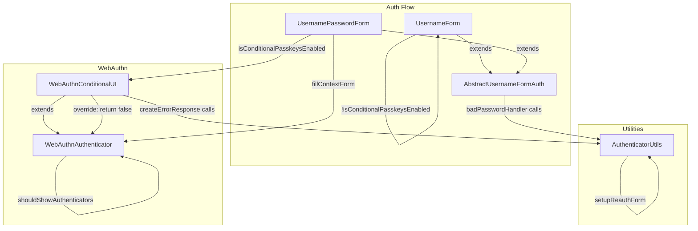

# Code Review: Fixing Re-authentication with passkeys

**Instance**: keycloak__ai-code-review-evaluation__keycloak-greptile__PR1
**PR**: Fixing Re-authentication with passkeys (keycloak-greptile#1)
**Date**: 2026-04-08

---

## Intent Register

### Intent Claims

1. During re-authentication (e.g., OIDC prompt=login), passkeys must remain available as an authentication option on the login form
2. The `UsernameForm.authenticate` must not skip the form during re-authentication when conditional passkeys are enabled, even if the user is already known
3. `UsernamePasswordForm.authenticate` must fill WebAuthn passkey form data regardless of whether the user was already identified, as long as conditional passkeys are enabled and user is non-null
4. The `challenge` error response in `UsernamePasswordForm` must include passkey form data during re-authentication (when user is known), reversing prior behavior that only included it when user was unknown
5. `WebAuthnConditionalUIAuthenticator` must override `shouldShowWebAuthnAuthenticators` to return false — conditional passkeys do not display individual authenticator listings
6. A shared utility method `AuthenticatorUtils.setupReauthenticationInUsernamePasswordFormError` centralizes re-authentication form setup (hidden username, disabled registration) to avoid duplication across `AbstractUsernameFormAuthenticator` and `WebAuthnConditionalUIAuthenticator`
7. `USER_SET_BEFORE_USERNAME_PASSWORD_AUTH` visibility changes from `protected` to `public` to enable cross-package access from `AuthenticatorUtils`
8. Tests verify: passkey login during re-auth with discoverable keys, re-auth with external keys, re-auth when passkeys disabled, re-auth with both password and passkey options, and passkey availability after failed password attempts

### Intent Diagram

---

## Findings Summary

| ID | Type | Severity | Description |
|----|------|----------|-------------|
| F-01 | structural | minor | Zero-arg `isConditionalPasskeysEnabled()` in UsernameForm has no visible definition in the diff |
| F-02 | structural | minor | `isConditionalPasskeysEnabled` name implies capability check but encodes user-presence gate |
| F-03 | test-integrity | minor | Dead `fail()` code in negative element assertions; inconsistent with codebase `assertThrows` pattern |
| F-04 | fragile | info | Null safety in `fillContextForm` moved from structural guard to implicit method contract |
| F-05 | test-integrity | minor | `reauthenticationOfUserWithoutPasskey` test name says "user without passkey" but only tests realm policy |
| F-06 | fragile | minor | Bare string literal "Please re-authenticate to continue" repeated in 3 test assertions |
| F-07 | test-integrity | minor | `events.clear()` removed from `webauthnLoginWithExternalKey_reauthenticationWithPasswordOrPasskey` |
| F-08 | test-integrity | minor | Missing CREDENTIAL_TYPE assertion in `reauthenticationOfUserWithoutPasskey` password-login event |

**Totals**: 8 findings verified, 5 sightings rejected, 0 nits excluded (1 nit identified but excluded per policy)

## Verified Findings

### F-01: Invisible method definition for `isConditionalPasskeysEnabled()` zero-arg call

**Sighting:** S-01
**Location:** `UsernameForm.java`, `authenticate` method
**Type:** structural | **Severity:** minor
**Current behavior:** `UsernameForm.authenticate` calls `isConditionalPasskeysEnabled()` with no arguments. The diff only defines `UsernamePasswordForm.isConditionalPasskeysEnabled(UserModel user)` — a one-argument method on a different class. No zero-arg overload appears in any diff hunk. The call resolves to a method outside the diff scope.
**Expected behavior:** The method controlling form-skipping during re-auth should be visible in the changeset that introduces the call, or documented as pre-existing.
**Source of truth:** Java method resolution requires exact arity match; Intent register #2.
**Evidence:** Diff line 36 shows `!isConditionalPasskeysEnabled()` in `UsernameForm`. The only `isConditionalPasskeysEnabled` definition is at `UsernamePasswordForm` lines 74-76 with signature `(UserModel user)`. These are distinct files/classes.

### F-02: Semantic drift in `isConditionalPasskeysEnabled` method name

**Sighting:** S-02
**Location:** `UsernamePasswordForm.java`, lines 74-76
**Type:** structural | **Severity:** minor
**Current behavior:** `isConditionalPasskeysEnabled(UserModel user)` returns `webauthnAuth != null && webauthnAuth.isPasskeysEnabled() && user != null`. The method name reads as a realm/feature capability predicate but folds in a user-presence check.
**Expected behavior:** A method named `isConditionalPasskeysEnabled` should test realm-level configuration. The user-presence gate should be at call sites or via a distinct method name (e.g., `canShowConditionalPasskeys`).
**Source of truth:** The original code separated capability checks from user-state checks explicitly. Structural target: semantic drift.
**Evidence:** The old `challenge` guard was `context.getUser() == null && webauthnAuth != null && webauthnAuth.isPasskeysEnabled()` — explicitly distinguishing user state from capability. The new method merges them under a capability-only name.

### F-03: Dead `fail()` and inconsistent negative element assertion pattern

**Sighting:** S-03
**Location:** `PasskeysUsernamePasswordFormTest.java`, `reauthenticationOfUserWithoutPasskey`, two assertion blocks
**Type:** test-integrity | **Severity:** minor
**Current behavior:** Test verifies absence of `//form[@id='webauth']` with `assertThat(driver.findElement(...), nullValue()); fail(...)` inside `catch (Exception)`. The `fail()` is unreachable: if the element is present, `assertThat(nonNull, nullValue())` throws `AssertionError` (extends `Error`, not `Exception`) which propagates correctly. The `nullValue()` matcher is used as a side-effect trigger, not a meaningful assertion.
**Expected behavior:** Use `Assert.assertThrows(NoSuchElementException.class, () -> driver.findElement(...))` consistent with the established pattern in `PasskeysOrganizationAuthenticationTest`.
**Source of truth:** `AssertionError extends Error`, not `Exception` (JLS). The companion test file used `assertThrows` for identical assertions.
**Evidence:** The `fail()` statement after `assertThat` is unreachable in both the element-absent path (NoSuchElementException caught) and element-present path (AssertionError propagates past catch). Pattern appears twice.

### F-04: Implicit null-safety contract in `shouldShowWebAuthnAuthenticators`

**Sighting:** S-04
**Location:** `WebAuthnAuthenticator.java`, `fillContextForm` method
**Type:** fragile | **Severity:** info
**Current behavior:** The original `if (user != null)` guard before `WebAuthnAuthenticatorsBean` construction was explicit null protection. The replacement `if (shouldShowWebAuthnAuthenticators(context))` delegates to a virtual method whose default returns `context.getUser() != null` — preserving safety, but through convention.
**Expected behavior:** A comment or assertion inside the guard block documenting that `context.getUser() != null` must hold when `shouldShowWebAuthnAuthenticators` returns true.
**Source of truth:** Structural target: composition opacity.
**Evidence:** The Javadoc added for `shouldShowWebAuthnAuthenticators` does not document the null-safety contract. A future subclass override returning true when user is null would NPE at `WebAuthnAuthenticatorsBean` construction.

### F-05: Test name-scope mismatch in `reauthenticationOfUserWithoutPasskey`

**Sighting:** S-08
**Location:** `PasskeysUsernamePasswordFormTest.java`, `reauthenticationOfUserWithoutPasskey`
**Type:** test-integrity | **Severity:** minor
**Current behavior:** Test name says "user without passkey" (user-credential property) but the test only disables passkeys at the realm policy level (`setWebAuthnPolicyPasskeysEnabled(Boolean.FALSE)`). Never verifies the test user lacks a passkey credential.
**Expected behavior:** Test name should match what is tested (realm policy disables passkeys), or the test should verify user credential state.
**Source of truth:** Checklist item 4 (name-assertion mismatch); checklist item 12 (semantically incoherent test fixtures).
**Evidence:** Test body sets only `setWebAuthnPolicyPasskeysEnabled(Boolean.FALSE)`. No credential query or assertion on `test-user@localhost`'s passkey credentials.

### F-06: Bare string literal repeated across 3 test assertions

**Sighting:** S-09
**Location:** `PasskeysUsernamePasswordFormTest.java`, 3 test methods
**Type:** fragile | **Severity:** minor
**Current behavior:** `"Please re-authenticate to continue"` appears as a bare literal in `assertEquals` calls in `webauthnLoginWithExternalKey_reauthentication`, `reauthenticationOfUserWithoutPasskey`, and `webauthnLoginWithExternalKey_reauthenticationWithPasswordOrPasskey`.
**Expected behavior:** Extract to a named constant shared across test assertions.
**Source of truth:** Checklist item 1 (bare literals).
**Evidence:** Three identical string literals with no shared constant. An i18n or message change requires three edits with no compile-time linkage.

### F-07: `events.clear()` removal risks stale event assertion

**Sighting:** S-10
**Location:** `PasskeysUsernamePasswordFormTest.java`, `webauthnLoginWithExternalKey_reauthenticationWithPasswordOrPasskey`
**Type:** test-integrity | **Severity:** minor
**Current behavior:** `events.clear()` was removed after `registerDefaultUser()` and `logout()`. Registration and logout events remain in the queue when the first `events.expectLogin().assertEvent()` executes.
**Expected behavior:** `events.clear()` after setup actions that generate events, consistent with the retained `events.clear()` in the parallel `passwordLoginWithExternalKey` method at the same position.
**Source of truth:** Diff shows `- events.clear()` at the hunk starting line 599. The parallel method retains it.
**Evidence:** `registerDefaultUser()` generates LOGIN events; without clearing, the subsequent `expectLogin()` may match the registration login rather than the webauthn login. The original code had `events.clear()` at this position.

### F-08: Missing CREDENTIAL_TYPE assertion in password re-auth test

**Sighting:** S-11
**Location:** `PasskeysUsernamePasswordFormTest.java`, `reauthenticationOfUserWithoutPasskey`, final event assertion
**Type:** test-integrity | **Severity:** minor
**Current behavior:** `events.expectLogin()` asserts `USER_VERIFICATION_CHECKED` is null but does not assert `CREDENTIAL_TYPE`. The test does not directly confirm password authentication was used.
**Expected behavior:** Include `.detail(Details.CREDENTIAL_TYPE, nullValue())` or equivalent to confirm password-based auth, consistent with passkey-path assertions that DO assert `CREDENTIAL_TYPE = TYPE_PASSWORDLESS`.
**Source of truth:** Intent register #8. Passkey-path assertions in the same PR assert credential type; password-path assertions do not.
**Evidence:** `events.expectLogin().user(...).detail(Details.USERNAME, ...).detail(WebAuthnConstants.USER_VERIFICATION_CHECKED, nullValue()).assertEvent()` — no CREDENTIAL_TYPE constraint.

---

## Retrospective

### Sighting Counts

- **Total sightings generated:** 13
- **Verified findings at termination:** 8
- **Rejections:** 5
- **Nits identified (excluded):** 1 (S-06: imprecise comment, not misinformation)
- **By detection source:**
  - spec-ac: 2 sightings → 2 findings (F-01, F-02)
  - checklist: 4 sightings → 3 findings (F-03, F-05, F-06)
  - structural-target: 3 sightings → 1 finding (F-04)
  - intent: 0
  - linter: N/A
- **Structural sub-categorization:** semantic drift (F-02), dead code (F-03)
- **By origin:** all `introduced`

### Verification Rounds

- **Round 1:** 5 sightings → 4 verified (F-01–F-04), 1 rejected (S-05, info-level correct behavior)
- **Round 2:** 6 sightings → 4 verified (F-05–F-08), 2 rejected (S-06 nit, S-07 incorrect premise)
- **Round 3:** 2 sightings → 0 verified, 2 rejected (S-12 intentional behavior change, S-13 call site IS on error path)
- **Convergence:** Round 3 clean → loop terminated

### Scope Assessment

- **Files reviewed:** 9 (6 production, 3 test)
- **Diff size:** ~679 lines
- **Production changes:** Visibility modifier, method extraction, condition refactoring, new utility method, new override
- **Test changes:** Updated assertions for new behavior, 5 new test methods, 1 extracted helper

### Context Health

- **Rounds:** 3
- **Sightings-per-round trend:** 5 → 6 → 2 (declining with convergence)
- **Rejection rate per round:** 20% → 33% → 100%
- **Hard cap reached:** No (converged at round 3)

### Tool Usage

- **Linter:** N/A (diff-only benchmark review, no project tooling)
- **Grep/Glob:** N/A (diff-only context)

### Finding Quality

- **False positive rate:** TBD (pending user review)
- **False negative signals:** None identified
- **Origin breakdown:** All findings are `introduced` (new code in this PR)

### Intent Register

- **Claims extracted:** 8 (from PR title, diff content, test names/comments)
- **Sources:** PR title, code comments, test method names, structural analysis
- **Findings attributed to intent comparison:** F-01, F-02 (detection source: spec-ac)
- **Intent claims invalidated:** None
