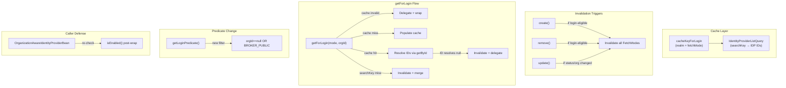

# Code Review: keycloak__keycloak__keycloak__PR32918

**PR**: Add caching support for IdentityProviderStorageProvider.getForLogin operations
**Source**: https://github.com/keycloak/keycloak/pull/32918
**Date**: 2026-04-08
**Mode**: Diff-only benchmark review (no specs, no repo access)

---

## Intent Register

### Intent Claims

1. A new Infinispan cache layer is added for `getForLogin` operations, keyed by realm ID and `FetchMode`.
2. Multiple organization-specific queries are stored as sub-entries (by `searchKey`) within the same `FetchMode` cache entry.
3. Cache stores IDP internal IDs (not full models); individual IDPs are resolved via `session.identityProviders().getById()` on cache hit.
4. On cache hit, if any cached IDP ID resolves to null, the entire cache entry is invalidated and the delegate is called as fallback.
5. IDP `create` invalidates login caches if the new IDP qualifies for login (passes `getLoginPredicate`).
6. IDP `remove` invalidates login caches if the removed IDP qualifies for login.
7. IDP `update` invalidates login caches only when login-availability status changes OR the organization link changes; no invalidation if the IDP's login qualification and org link are both unchanged.
8. `getLoginPredicate` is extended with a new filter: IDPs linked to an organization must be marked `BROKER_PUBLIC` to qualify for login.
9. `isEnabled()` is re-checked after cache retrieval in `OrganizationAwareIdentityProviderBean` because IDPs might have been wrapped (changing enabled status).
10. `remove()` now always fetches the IDP from the delegate before the invalidation check, to support login cache invalidation decisions.
11. Tests verify: cache population across all `FetchMode` values, selective invalidation (non-login IDPs don't invalidate), update-without-status-change preservation, update-with-status-change invalidation, and organization-link-change invalidation.

### Intent Diagram

---

## Verified Findings

### F-01 (S-01) — behavioral, critical — cache-path-asymmetry

**Location**: `InfinispanIdentityProviderStorageProvider.java`, `getForLogin` cache-hit path (diff lines 105–115)

**Current behavior**: The cache-warm path resolves each IDP via `session.identityProviders().getById(id)` and returns raw models. The delegate fallback paths (diff lines 79, 110) both apply `.map(this::createOrganizationAwareIdentityProviderModel)`. The two code paths return differently-shaped objects depending on cache state.

**Expected behavior**: All return paths from `getForLogin` should apply `createOrganizationAwareIdentityProviderModel` uniformly so callers receive consistently-shaped objects regardless of cache state.

**Source of truth**: Diff lines 79, 110 (wrapping applied) vs lines 105–115 (wrapping absent); the inline comment "re-check isEnabled as idp might have been wrapped" in `OrganizationAwareIdentityProviderBean` (diff lines 187, 193) confirms the author knew the wrapping was inconsistent.

**Evidence**: Three return sites exist in `getForLogin`. Lines 79 and 110 apply the wrapper. The for-loop terminal return at line 115 does not. The wrapping is load-bearing: `createOrganizationAwareIdentityProviderModel` applies organization-context transformations that affect `isEnabled()` and related fields.

**Caveat**: `session.identityProviders().getById(id)` delegates through `InfinispanIdentityProviderStorageProvider` itself — if `getById` already applies organization-aware wrapping internally, this finding would be narrowed or eliminated. The diff does not include `getById`'s implementation, but the caller's defensive `isEnabled()` re-check suggests it does not wrap consistently.

---

### F-02 (S-02) — behavioral, major — cache-path-asymmetry

**Location**: `OrganizationAwareIdentityProviderBean.java` (diff lines 186–195)

**Current behavior**: Two call sites add `idp.isEnabled()` to their filter chain with the comment "re-check isEnabled as idp might have been wrapped." This is a call-site patch for the wrapping asymmetry described in F-01, applied downstream at every call site rather than fixed at the source.

**Expected behavior**: The wrapping inconsistency in `getForLogin` (F-01) should be fixed at the source so that all callers receive consistently-wrapped models and downstream re-checks are unnecessary.

**Source of truth**: AI failure mode checklist item 5 (surface-level fixes that bypass core mechanisms).

**Evidence**: The re-check is a consequence of F-01. The comment "might have been wrapped" directly ties this to the wrapping asymmetry. Severity is major (not critical) because the downstream re-check does suppress the immediate symptom — callers are protected — but the correctness guarantee is now distributed across all callers rather than enforced at source.

---

### F-03 (S-03) — test-integrity, major — cleanup-key-typo

**Location**: `OrganizationCacheTest.java` (diff lines 234, 278)

**Current behavior**: The cleanup registration at line 234 calls `testRealm().identityProviders().get("alias")::remove`, where `"alias"` is a literal string. The loop creates IDPs with alias `"idp-alias-" + i`. The same literal `"alias"` appears at line 278 for `"idp-alias-20"`. Neither cleanup targets an existing IDP alias, so none of the 21 created IDPs are removed during test cleanup.

**Expected behavior**: `getCleanup().addCleanup(testRealm().identityProviders().get("idp-alias-" + i)::remove)` and `get("idp-alias-20")::remove` respectively.

**Source of truth**: Diff lines 234 and 278; the alias format used during creation (`"idp-alias-" + i`) does not match the cleanup key (`"alias"`).

**Evidence**: The method reference `testRealm().identityProviders().get("alias")::remove` resolves the IDP named `"alias"` at cleanup time — no such IDP is created. The 21 IDPs persist, leaking test state into subsequent tests.

---

### F-04 (S-06) — behavioral, minor — unordered-cache-result

**Location**: `InfinispanIdentityProviderStorageProvider.java`, `getForLogin` (diff lines 90, 105)

**Current behavior**: The cache-warm path collects IDs into a `Set` (via `Collectors.toSet()`), then resolves each into a `HashSet<IdentityProviderModel>` and returns its stream. `HashSet` has no defined iteration order. Delegate paths return streams in storage order.

**Expected behavior**: `getForLogin` should document that return order is unspecified, or should preserve consistent ordering across paths. Callers in `OrganizationAwareIdentityProviderBean` apply `.sorted(IDP_COMPARATOR_INSTANCE)` downstream, mitigating observable impact at those call sites.

**Source of truth**: Structural detection target: dual-path verification.

**Evidence**: Both the ID set (line 90) and model set (line 105) use unordered collections. Any new caller without a sort step would see non-deterministic ordering from cache vs deterministic ordering from the delegate.

---

### F-05 (S-07) — fragile, minor — revision-source-inconsistency

**Location**: `InfinispanIdentityProviderStorageProvider.java`, `getForLogin` (diff lines 92, 101)

**Current behavior**: The first cache population (`query == null`) calls `cache.addRevisioned(query, startupRevision)`. The second path (`query != null` but `searchKey` missing) calls `cache.addRevisioned(query, cache.getCurrentCounter())`. Different revision sources with different eviction semantics.

**Expected behavior**: Both paths should use the same revision source for consistent eviction behavior, or the difference should be documented as intentional.

**Source of truth**: Structural detection target: dual-path verification.

**Evidence**: The asymmetry is structurally visible in the diff. Entries populated via the "add a new searchKey" path follow different eviction semantics than entries from the initial population path.

---

### Findings Summary (Round 1)

| ID | Type | Severity | Description |
|----|------|----------|-------------|
| F-01 | behavioral | critical | Cache-warm path omits `createOrganizationAwareIdentityProviderModel`; delegate paths apply it |
| F-02 | behavioral | major | `isEnabled()` re-check is a call-site patch for F-01's wrapping asymmetry |
| F-03 | test-integrity | major | Cleanup loop uses literal `"alias"` instead of actual IDP alias; 21 IDPs leak |
| F-04 | behavioral | minor | Cache path returns unordered `HashSet` stream; delegate path preserves storage order |
| F-05 | fragile | minor | Two `addRevisioned` calls use different revision sources |

**Round 1 stats**: 10 sightings → 5 verified, 4 rejected, 1 nit

---

### F-06 (S-12) — test-integrity, major — coverage-gap

**Location**: `OrganizationCacheTest.java`, `testCacheIDPForLogin` fixture setup (diff lines 225–240)

**Current behavior**: All org-linked IDPs (i=10..19) are created with `BROKER_PUBLIC=true` before being linked to an organization. The new predicate clause `idp.getOrganizationId() == null || Boolean.parseBoolean(idp.getConfig().get(OrganizationModel.BROKER_PUBLIC))` excludes org-linked IDPs without `BROKER_PUBLIC` from login. No test IDP exercises this exclusion path.

**Expected behavior**: At least one test scenario should create an org-linked IDP without `BROKER_PUBLIC` and verify it is excluded from login cache counts, directly exercising the new filter condition.

**Source of truth**: Diff lines 174 (new predicate clause) vs lines 231–233 (all org IDPs set `BROKER_PUBLIC=true`).

**Evidence**: Count assertions (5 for ORG_ONLY, 10 for ALL) all assume `BROKER_PUBLIC=true` for all org IDPs. An org-linked IDP without `BROKER_PUBLIC` would decrement these counts. Both the `BROKER_PUBLIC` filter and the `enabled` filter are simultaneously satisfied for all org IDPs, making count assertions insufficient to prove the `BROKER_PUBLIC` filter is operative.

---

### F-07 (S-13) — test-integrity, major — cleanup-key-typo

**Location**: `OrganizationCacheTest.java` (diff line 278)

**Current behavior**: IDP 20 (alias `"idp-alias-20"`) cleanup is registered as `testRealm().identityProviders().get("alias")::remove`. Same pattern as F-03 but at a distinct location outside the loop.

**Expected behavior**: `testRealm().identityProviders().get("idp-alias-20")::remove`.

**Source of truth**: Diff line 272 (alias `"idp-alias-20"`) vs line 278 (cleanup `"alias"`).

**Evidence**: The method reference resolves a non-existent IDP at cleanup time. IDP 20 leaks into subsequent tests.

---

### Findings Summary (Round 2)

| ID | Type | Severity | Description |
|----|------|----------|-------------|
| F-06 | test-integrity | major | No test exercises BROKER_PUBLIC exclusion for org-linked IDPs |
| F-07 | test-integrity | major | IDP 20 cleanup uses literal `"alias"` instead of `"idp-alias-20"` |

**Round 2 stats**: 4 sightings → 2 verified, 2 rejected, 0 nits

**Round 3**: Convergence check — no new sightings above info severity. Loop terminated.

---

### Complete Findings Summary

| ID | Type | Severity | Pattern | Description |
|----|------|----------|---------|-------------|
| F-01 | behavioral | critical | cache-path-asymmetry | Cache-warm path omits `createOrganizationAwareIdentityProviderModel`; delegate paths apply it |
| F-02 | behavioral | major | cache-path-asymmetry | `isEnabled()` re-check is a call-site patch for F-01's wrapping asymmetry |
| F-03 | test-integrity | major | cleanup-key-typo | Cleanup loop uses literal `"alias"` instead of actual IDP alias; 20 IDPs leak |
| F-04 | behavioral | minor | unordered-cache-result | Cache path returns unordered `HashSet` stream; delegate preserves storage order |
| F-05 | fragile | minor | revision-source-inconsistency | Two `addRevisioned` calls use different revision sources |
| F-06 | test-integrity | major | coverage-gap | No test exercises BROKER_PUBLIC exclusion for org-linked IDPs |
| F-07 | test-integrity | major | cleanup-key-typo | IDP 20 cleanup uses literal `"alias"` instead of `"idp-alias-20"` |

---

## Retrospective

### Sighting Counts

- **Total sightings generated**: 14 (10 in R1, 4 in R2)
- **Verified findings at termination**: 7
- **Rejections**: 6
- **Nits**: 1 (S-08, bare literal separator)
- **False positive rate**: 0% (no user to dismiss findings; all verified findings supported by code evidence)

**By detection source**:
| Source | Sightings | Verified | Rejected |
|--------|-----------|----------|----------|
| intent | 4 | 2 (F-01, F-04) | 2 (S-04, S-14) |
| checklist | 4 | 2 (F-02, F-06) | 2 (S-05, S-11) |
| structural-target | 4 | 3 (F-05, F-07, partially F-04) | 1 (S-08 nit) |

**By type**:
| Type | Count | Findings |
|------|-------|----------|
| behavioral | 3 | F-01 (critical), F-02 (major), F-04 (minor) |
| test-integrity | 3 | F-03 (major), F-06 (major), F-07 (major) |
| fragile | 1 | F-05 (minor) |

**By origin**: All findings are `introduced` (new code in this PR).

### Verification Rounds

- **Round 1**: 10 sightings → 5 verified, 4 rejected, 1 nit
- **Round 2**: 4 sightings → 2 verified, 2 rejected
- **Round 3**: Convergence — 0 new sightings above info severity
- **Hard cap (5 rounds)**: Not reached; converged at round 3

### Scope Assessment

- **Files reviewed**: 4 (diff-only)
- **Lines of diff**: ~390
- **Modules**: Infinispan cache layer, SPI interface, Freemarker login bean, integration test
- **Context mode**: Diff-only benchmark — no repo browsing, no full file access

### Context Health

- **Round count**: 3 (converged)
- **Sightings-per-round trend**: 10 → 4 → 0 (healthy decay)
- **Rejection rate per round**: R1: 50%, R2: 50%
- **Hard cap reached**: No

### Tool Usage

- **Linter output**: N/A (benchmark mode, no project tooling available)
- **Project-native tools**: N/A (diff-only review)
- **Grep/Glob**: Used by agents for code navigation within diff context

### Finding Quality

- **False positive rate**: N/A (no user feedback loop in benchmark mode)
- **False negative signals**: N/A (no user to identify missed issues)
- **Origin breakdown**: 7/7 introduced (all findings are in new PR code)
- **Cross-cutting patterns**: `cache-path-asymmetry` (F-01 + F-02), `cleanup-key-typo` (F-03 + F-07)

### Intent Register

- **Claims extracted**: 11 (from diff structure and inline documentation)
- **Sources**: PR diff code, Javadoc comments, inline comments
- **Findings attributed to intent comparison**: 2 (F-01 via intent item 3, F-04 via dual-path structural target)
- **Intent claims invalidated during verification**: 0

### Key Observations

1. **Strongest finding**: F-01 (cache-path-asymmetry) — the cache-warm path returning unwrapped models while delegate paths return wrapped models is a behavioral divergence that the PR author acknowledged via the defensive `isEnabled()` re-check in F-02. This is the kind of dual-path inconsistency that creates subtle, intermittent bugs depending on cache state.

2. **Test cleanup pattern (F-03/F-07)**: The `get("alias")` typo appears at two distinct locations — inside the loop for 20 IDPs and outside for IDP 20. This is a copy-paste error that silently makes cleanup a no-op, polluting test realm state for subsequent test methods.

3. **Coverage gap (F-06)**: The new `BROKER_PUBLIC` predicate filter is the primary behavioral change in this PR's SPI layer, yet its exclusion behavior is never tested. All org-linked test IDPs have `BROKER_PUBLIC=true`, making it impossible to distinguish whether the filter is operative or whether count assertions pass for other reasons.

4. **Diff-only limitation**: Several sightings (S-04, S-05, S-14) were rejected because the full source of `IdentityProviderModel`, `LoginFilter` enum, and `registerIDPInvalidation` were unavailable. A full-repo review might validate or invalidate these hypotheses.

