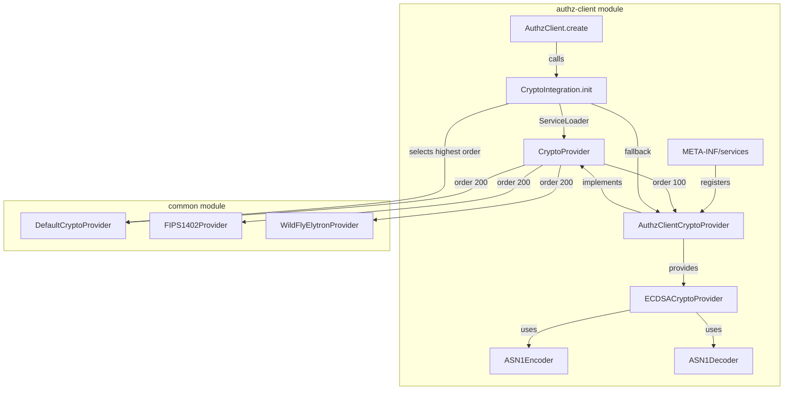

# Code Review Report: keycloak__keycloak__keycloak__PR33832

**PR**: Add AuthzClientCryptoProvider for authorization client cryptographic operations
**URL**: https://github.com/keycloak/keycloak/pull/33832
**Date**: 2026-04-08
**Instance**: keycloak__keycloak__keycloak__PR33832

## Intent Register

### Intent Claims

1. The authz-client module must have its own lightweight `CryptoProvider` implementation so it can operate without requiring BouncyCastle on the classpath.
2. `AuthzClientCryptoProvider` implements only the subset of `CryptoProvider` needed by the authz client: ECDSA signature format conversion (DER ↔ concatenated R||S) and KeyStore access.
3. All other `CryptoProvider` methods in `AuthzClientCryptoProvider` throw `UnsupportedOperationException`.
4. `CryptoIntegration.detectProvider()` must support multiple providers on the classpath via priority ordering, replacing the previous error-on-multiple behavior.
5. Providers are sorted by `order()` in descending order — the highest order value wins.
6. `AuthzClientCryptoProvider` has order 100; existing providers (Default, FIPS, Elytron) have order 200, ensuring they take precedence when present.
7. `CryptoIntegration.init()` is called during `AuthzClient.create()` to bootstrap the crypto subsystem.
8. `AuthzClientCryptoProvider` is registered via Java `ServiceLoader` (META-INF/services file).
9. Custom ASN1 encoder/decoder classes handle DER ↔ integer conversion without external ASN.1 libraries.
10. The `ECDSAAlgorithmTest` verifies round-trip conversion (DER→concat→DER→concat) for ES256, ES384, ES512.
11. `getBouncyCastleProvider()` returns the default KeyStore's provider as a fallback when no actual BouncyCastle is available.

### Intent Diagram

## Verified Findings

### F-01: Dead encoder calls in concatenatedRSToASN1DER

| Field | Value |
|-------|-------|
| Sighting | S-01 |
| Location | `AuthzClientCryptoProvider.java`, `concatenatedRSToASN1DER` method (diff lines 478-479) |
| Type | structural |
| Severity | minor |
| Current behavior | Two `ASN1Encoder.create().write(rBigInteger)` and `ASN1Encoder.create().write(sBigInteger)` calls construct encoder objects, serialize integer values to internal byte buffers, and discard the returned encoder instances. The actual DER encoding is performed independently by fresh encoder instances at diff lines 481-485. |
| Expected behavior | Encoding operations should contribute to output or be absent. Dead intermediate computation that produces no effect indicates leftover code from development iteration. |
| Source of truth | AI failure mode checklist item 7 (dead infrastructure); structural target: dead infrastructure |
| Evidence | Lines 478-479 return values are not assigned. Lines 481-485 create independent encoders passed to `writeDerSeq`. The two sets of encoders share no state. |
| Pattern label | dead-encoder-calls |

### F-02: Semantically incoherent test fixtures — wrong curve for ES384/ES512

| Field | Value |
|-------|-------|
| Sighting | S-02 |
| Location | `ECDSAAlgorithmTest.java`, constructor and test methods (diff lines 663-694) |
| Type | test-integrity |
| Severity | major |
| Current behavior | A single `KeyPairGenerator.getInstance("EC")` with no curve specified (defaults to P-256) generates the key pair shared across `testES256()`, `testES384()`, and `testES512()`. ES384 expects `signLength=96` (48+48 bytes) and ES512 expects `signLength=132` (66+66 bytes), but P-256 keys produce R/S values at most 32 bytes each. The round-trip assertion (`rsConcat == rsConcat2`) passes because zero-padding is self-consistent, but the test never exercises real ES384/ES512-sized integers or validates that converted signatures verify cryptographically. |
| Expected behavior | Each algorithm test should use a key pair on the matching curve (P-384 for ES384, P-521 for ES512) to exercise actual field-sized integers and the truncation path in `integerToBytes`. |
| Source of truth | AI failure mode checklist item 12 (semantically incoherent test fixtures) |
| Evidence | Line 664: `KeyPairGenerator.getInstance("EC").genKeyPair()` — no curve parameter. Lines 682-694: `testES384()` and `testES512()` call `test(ECDSAAlgorithm.ES384)` and `test(ECDSAAlgorithm.ES512)` with the P-256 key pair. |
| Pattern label | wrong-curve-fixture |

### F-03: CryptoIntegration.init() called only in one factory method

| Field | Value |
|-------|-------|
| Sighting | S-03 |
| Location | `AuthzClient.java`, `create(Configuration)` method (diff line 39) |
| Type | fragile |
| Severity | major |
| Current behavior | `CryptoIntegration.init(AuthzClient.class.getClassLoader())` is added only to `create(Configuration)`. The diff hunk header confirms `create(InputStream configStream)` exists as a sibling overload. Only `create(Configuration)` was modified. If any overload constructs `AuthzClient` without delegating to `create(Configuration)`, the crypto subsystem is not initialized. |
| Expected behavior | Crypto subsystem initialization should cover all construction paths or be placed in the constructor to guarantee execution regardless of factory method used. |
| Source of truth | Intent claim 7 (CryptoIntegration.init() called during AuthzClient.create()); structural target: composition opacity |
| Evidence | Diff hunk header at line 35: `@@ -91,6 +92,7 @@ public static AuthzClient create(InputStream configStream)` confirms a sibling overload. Only the `create(Configuration)` body is modified. |
| Pattern label | incomplete-crypto-init |

### F-04: Logger format string passed dynamic content

| Field | Value |
|-------|-------|
| Sighting | S-04 |
| Location | `CryptoIntegration.java`, `detectProvider` method (diff lines 724-728) |
| Type | fragile |
| Severity | minor |
| Current behavior | `logger.debugf(builder.toString())` passes a dynamically assembled string (containing provider class names) as the format argument to a printf-style method. If any provider class name contains `%`, it would be interpreted as a format specifier, causing `MissingFormatArgumentException`. Additionally, the loop appends `name + ", "` for every provider, leaving a trailing `", "`. |
| Expected behavior | Use `logger.debugf("%s", builder.toString())` or `logger.debug(builder.toString())` to avoid format-string injection. Trim trailing separator. |
| Source of truth | Structural detection target: mixed logic and side effects |
| Evidence | Lines 726-727: `builder.append(foundProviders.get(i).getClass().getName() + ", ")` — no trim. Line 728: `logger.debugf(builder.toString())` — dynamic content as format arg. |
| Pattern label | format-string-passthrough |

### F-05: Bare integer literals for provider ordering

| Field | Value |
|-------|-------|
| Sighting | S-05 |
| Location | `AuthzClientCryptoProvider.java` (order=100), `DefaultCryptoProvider.java` (order=200), `WildFlyElytronProvider.java` (order=200), `FIPS1402Provider.java` (order=200) |
| Type | structural |
| Severity | minor |
| Current behavior | `order()` returns bare integer literals (100 or 200) independently in each provider class with no shared constant or documented range convention. The cross-module priority scheme is implicit. |
| Expected behavior | Priority values that define a cross-module ordering scheme should be expressed as named constants in the `CryptoProvider` interface or a shared constants class. |
| Source of truth | AI failure mode checklist item 1 (bare literals) |
| Evidence | Four independent return statements across four files returning magic numbers 100 and 200 with no compile-time linkage. |
| Pattern label | bare-priority-literals |

### F-06: readSequence() silently returns empty list on indefinite-length encoding

| Field | Value |
|-------|-------|
| Sighting | S-06 |
| Location | `ASN1Decoder.java`, `readSequence()` (diff lines 97-111) and `readLength()` (diff lines 175-215) |
| Type | behavioral |
| Severity | minor |
| Current behavior | `readLength()` returns -1 for the indefinite-length encoding sentinel (0x80). `readSequence()` uses `while (length > 0)`, which exits immediately when `length == -1`, returning an empty `ArrayList`. The caller `asn1derToConcatenatedRS` throws a generic "Invalid sequence with size different to 2" IOException that does not identify indefinite-length encoding as the root cause. |
| Expected behavior | Indefinite-length encoding should be explicitly detected and produce a clear diagnostic rather than falling through to a misleading downstream error. |
| Source of truth | Structural detection target: silent error discard |
| Evidence | `readLength()` lines 181-183: `if (length == 0x80) { return -1; }`. `readSequence()` line 105: `while (length > 0)` — false on entry when length is -1. |
| Pattern label | silent-error-discard |

### F-07: readSequence() length tracking has no underflow guard

| Field | Value |
|-------|-------|
| Sighting | S-07 (weakened from original framing) |
| Location | `ASN1Decoder.java`, `readSequence()` loop (diff lines 105-110) |
| Type | structural |
| Severity | minor |
| Current behavior | The while loop subtracts `bytes.length` from the remaining-length counter each iteration without guarding against underflow. For malformed input where sub-element sizes exceed the declared container length, `length` goes negative and the loop exits. For the specific ECDSA use case (2-integer sequences), the downstream `seq.size() != 2` check acts as a de facto guard, but the decoder itself does not report the structural mismatch. |
| Expected behavior | The loop should detect when consumed bytes exceed the declared container length and raise an explicit IOException. |
| Source of truth | Structural detection target: silent error discard |
| Evidence | Lines 105-109: `length = length - bytes.length` — no check for `length < 0` after subtraction. |
| Pattern label | silent-error-discard |

### F-08: Test verifies codec self-consistency but not JCA interoperability

| Field | Value |
|-------|-------|
| Sighting | S-09 |
| Location | `ECDSAAlgorithmTest.java`, `test()` helper (diff lines 668-678) |
| Type | test-integrity |
| Severity | major |
| Current behavior | The `test()` helper signs a message, converts DER→concat (`rsConcat`), re-encodes concat→DER (`asn1Des`), converts DER→concat again (`rsConcat2`), and asserts `assertArrayEquals(rsConcat, rsConcat2)`. No call to `Signature.verify()` is present anywhere in the 74-line test file. The assertion confirms only that the custom ASN1Decoder reads back the same values ASN1Encoder wrote — it does not confirm the re-encoded DER is accepted by JCA's Signature engine. |
| Expected behavior | The test should verify that the re-encoded DER output (`asn1Des`) is accepted by `Signature.verify()` against the original message and public key, confirming the custom codec produces standard-conformant output. |
| Source of truth | AI failure mode checklist item 4 (non-enforcing tests: name claims ECDSA algorithm verification, assertion only checks codec self-consistency) |
| Evidence | Lines 668-678: round-trip test with no `Signature.verify()` call. Both encoder and decoder are custom code in this PR — self-consistent bugs (e.g., non-minimal DER encoding tolerated by the custom decoder but rejected by JCA) would pass this test. |
| Pattern label | non-enforcing-roundtrip |

### Findings Summary

| Finding | Type | Severity | Description |
|---------|------|----------|-------------|
| F-01 | structural | minor | Dead encoder calls — two ASN1Encoder instances created and discarded |
| F-02 | test-integrity | major | Wrong EC curve for ES384/ES512 tests — P-256 key used for all algorithms |
| F-03 | fragile | major | CryptoIntegration.init() added to only one of multiple factory methods |
| F-04 | fragile | minor | Logger.debugf() passed dynamic string as format argument |
| F-05 | structural | minor | Bare integer literals (100, 200) for provider ordering with no shared constant |
| F-06 | behavioral | minor | readSequence() silently returns empty list on indefinite-length DER encoding |
| F-07 | structural | minor | readSequence() length tracking has no underflow guard for malformed input |
| F-08 | test-integrity | major | Test verifies codec self-consistency but not JCA Signature.verify() interop |

**Counts**: 8 verified findings, 1 rejection (S-08), 0 nits. Rejection rate: 11.1% (1/9 sightings rejected)

## Retrospective

### Sighting Counts

- **Total sightings generated**: 9 (S-01 through S-09, where round 4's S-09 was a duplicate of F-04)
- **Verified findings at termination**: 8 (F-01 through F-08)
- **Rejections**: 1 (S-08 — getBouncyCastleProvider() semantic drift rejected because the method name is an interface contract constraint, not a naming decision in this class)
- **Nit count**: 0
- **Effective sightings (excluding round 4 duplicate)**: 9

**Breakdown by detection source**:
- checklist: 5 (S-01, S-02, S-05, S-08, S-09/F-08)
- structural-target: 3 (S-03, S-06, S-07)
- intent: 0

**Breakdown by type for structural findings**:
- Dead code / dead infrastructure: F-01
- Bare literals: F-05
- Silent error discard: F-06, F-07
- Mixed logic / side effects: F-04

### Verification Rounds

- **Round 1**: 5 sightings (S-01 through S-05), all 5 verified → F-01 through F-05
- **Round 2**: 3 sightings (S-06 through S-08), 2 verified (F-06, F-07), 1 rejected (S-08)
- **Round 3**: 1 sighting (S-09), verified → F-08
- **Round 4**: 1 sighting (duplicate of F-04), converged — loop terminated
- **Convergence**: 4 rounds to convergence; round 4 clean

### Scope Assessment

- **Files reviewed**: 10 files in diff (3 new Java source files, 1 new test file, 1 new service registration, 5 modified files)
- **Lines of new/changed code**: ~650 lines of new code, ~30 lines modified in existing files
- **Modules**: authz-client (new provider + ASN1 codec + test), common (CryptoIntegration + CryptoProvider interface), crypto/default, crypto/elytron, crypto/fips1402

### Context Health

- **Round count**: 4
- **Sightings-per-round trend**: 5 → 3 → 1 → 0 (clean convergence)
- **Rejection rate per round**: R1: 0%, R2: 33%, R3: 0%, R4: N/A
- **Hard cap reached**: No (converged at round 4 of 5)

### Tool Usage

- **Linter output**: N/A (benchmark mode, no project tooling available)
- **Tools used**: Read (diff file in chunks), Grep/Glob not needed (single diff file review)

### Finding Quality

- **False positive rate**: 0% (no user dismissals — benchmark mode)
- **False negative signals**: N/A (no user feedback)
- **Breakdown by origin**: All 8 findings are `introduced` (new code in this PR)

### Intent Register

- **Claims extracted**: 11 (derived from PR title, diff structure, and code behavior)
- **Sources**: PR description, code structure, ServiceLoader registration, test file
- **Findings attributed to intent comparison**: 0 (all findings sourced from checklist or structural targets)
- **Intent claims invalidated during verification**: 0

### Observations

1. **Test-integrity findings dominate the major severity tier** (F-02, F-08). The custom ASN.1 codec is the core contribution of this PR, yet its only test validates self-consistency rather than standard conformance. Combined with the wrong-curve fixture, the test suite provides weak coverage of the codec's actual correctness properties.

2. **The dead encoder calls (F-01)** are a classic sign of iterative development where intermediate steps were not cleaned up. The two orphaned `ASN1Encoder.create().write(...)` calls at lines 478-479 appear to be remnants of building the encoding logic before refactoring to the inline `writeDerSeq(...)` pattern.

3. **The CryptoIntegration behavioral change (error→precedence)** is architecturally significant — it changes a hard failure (throw on multiple providers) to a soft selection (pick highest order). F-03 flags that the initialization call doesn't cover all construction paths, which could leave the crypto subsystem uninitialized in some usage patterns.

4. **Cross-cutting pattern**: The silent-error-discard pattern (F-06, F-07) in the ASN1Decoder is characteristic of a minimal/purpose-built decoder — error handling is left to the caller rather than being explicit in the decoder itself. This is acceptable for a tightly scoped use case but fragile if the decoder is reused.
