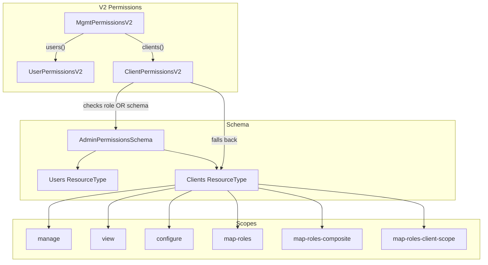

# Code Review: keycloak__keycloak__keycloak__PR36880

**PR**: Add Client resource type and scopes to authorization schema
**Source**: https://github.com/keycloak/keycloak/pull/36880
**Review date**: 2026-04-08

## Intent Register

### Intent Claims

1. The PR adds a `Clients` resource type to the admin permissions schema alongside the existing `Users` resource type.
2. New scopes `configure`, `map-roles-client-scope`, and `map-roles-composite` are introduced for the Clients resource type.
3. The Clients resource type supports scopes: `configure`, `manage`, `map-roles`, `map-roles-client-scope`, `map-roles-composite`, `view`.
4. Client resolution in the schema supports lookup by both client ID (UUID) and clientId (string identifier), falling back from one to the other.
5. `ClientPermissionsV2` extends `ClientPermissions` to provide V2 authorization logic using the new schema-based permission model.
6. V2 client permissions check both role-based access (AdminRoles) and schema-based permissions, with role checks taking precedence.
7. The `canManage(ClientModel)` method grants access if the caller has `MANAGE_CLIENTS` admin role OR a schema `manage` permission on the specific client.
8. The `canConfigure(ClientModel)` method grants access if `canManage` returns true OR the caller has a `configure` permission on the specific client.
9. The `canView(ClientModel)` method grants access if `canView()` (global) or `canConfigure(client)` returns true, OR if the caller has a `view` permission on the specific client.
10. Permission evaluation falls back from specific-client resources to the "all-clients" resource type resource when no specific resource exists.
11. The event listener in `AdminPermissions.registerListener` is now gated behind the `ADMIN_FINE_GRAINED_AUTHZ` feature flag.
12. Several V1-only operations (`canExchangeTo`, `exchangeToPermission`, `isPermissionsEnabled`, `setPermissionsEnabled`, etc.) throw `UnsupportedOperationException` in V2.
13. `MgmtPermissionsV2.clients()` lazily instantiates and caches a `ClientPermissionsV2` instance.
14. Test helper methods (`createUserPolicy`, `createClientPolicy`, `createPermission`, `createAllPermission`) are refactored from individual test classes to the `AbstractPermissionTest` base class, changing from instance to static methods.
15. Tests verify manage, configure, view, and map-roles permissions for both single-client and all-clients scenarios.

### Intent Diagram

## Verified Findings

**Summary**: 8 findings (1 critical, 2 major, 5 minor) | 15 sightings | 7 rejections | 3 nits | False positive rate: 47% (7/15)

---

### F-01 | structural | minor | Dead infrastructure

**Location**: `ClientPermissionsV2.java`, `getEvaluationContext(ClientModel, AccessToken)` method
**Current behavior**: `getEvaluationContext` is defined but never called. All evaluation paths in the file (`hasPermission`, `hasGrantedPermission`) call `root.evaluatePermission()` directly. The method builds a `ClientModelIdentity`-based context with a `kc.client.id` attribute that is never used.
**Expected behavior**: Dead code should not ship. Either integrate this into permission evaluation or remove it.
**Source of truth**: Structural target: dead infrastructure
**Evidence**: No call site in `ClientPermissionsV2.java`. The `canExchangeTo` method that would logically use this context throws `UnsupportedOperationException`.

---

### F-02 | behavioral | major | Feature-flag scope creep

**Location**: `AdminPermissions.java`, `registerListener()` method (diff lines 75-104)
**Current behavior**: The entire event-listener body — handling `RoleRemovedEvent`, `ClientRemovedEvent`, and `GroupRemovedEvent` cleanup — is now wrapped in `if (Profile.isFeatureEnabled(Profile.Feature.ADMIN_FINE_GRAINED_AUTHZ))`. When the flag is disabled, all three cleanup handlers silently do nothing, leaving stale authorization data on entity deletion.
**Expected behavior**: Pre-diff behavior ran all three handlers unconditionally. V1 deployments with the flag off no longer clean up authorization resources when roles, clients, or groups are deleted.
**Source of truth**: Intent claim 11; pre-diff code confirms unconditional prior behavior
**Evidence**: Pre-diff lines show handlers at the top level of `onEvent()`. Post-diff wraps them all inside the feature flag check. Non-V2 deployments lose cleanup behavior.

---

### F-03 | behavioral | critical | Runtime crash on client deletion in V2

**Location**: `AdminPermissions.java` line 91-92 (diff) + `ClientPermissionsV2.java` `setPermissionsEnabled()` (diff lines 479-481)
**Current behavior**: When `ADMIN_FINE_GRAINED_AUTHZ` is enabled and a `ClientRemovedEvent` fires, the listener executes `management(...).clients().setPermissionsEnabled(client, false)`. `MgmtPermissionsV2.clients()` returns `ClientPermissionsV2`, whose `setPermissionsEnabled` throws `UnsupportedOperationException("Not supported in V2")` unconditionally.
**Expected behavior**: Client deletion cleanup should not crash. Either implement V2-compatible cleanup or guard the call.
**Source of truth**: Intent claims 11+12 combine to produce the crash
**Evidence**: Traceable call path: (1) Listener fires, flag enabled → enters block; (2) `ClientRemovedEvent` at line 91; (3) `management()` → `MgmtPermissionsV2`; (4) `.clients()` → `ClientPermissionsV2`; (5) `.setPermissionsEnabled()` → throws `UnsupportedOperationException`.

---

### F-04 | structural | minor | Static/instance inconsistency in test helpers

**Location**: `AbstractPermissionTest.java`, `createPermission` overloads (diff lines 714-730)
**Current behavior**: Two `createPermission` overloads (taking `resourceId`, `resourceType`, scopes, policies) are declared as instance methods. All other new and refactored helpers in the same class are static. Neither instance method references `this`.
**Expected behavior**: Consistent static declaration matching the refactoring direction of all other helpers.
**Source of truth**: Intent claim 14; observable pattern in diff lines 636-712 (all static)

---

### F-05 | test-integrity | minor | Test isolation gap in map-roles test

**Location**: `PermissionClientTest.java`, `testMapRolesAndCompositesOnlyOneClient` (diff lines 1017-1056)
**Current behavior**: Test grants `MAP_ROLES`, `MAP_ROLES_COMPOSITE`, and `CONFIGURE` on myclient, then asserts operations succeed. It does not assert denial on a second client (unlike `testManageOnlyOneClient` which explicitly checks a second client). `MAP_ROLES_CLIENT_SCOPE` is absent from both the permission grant and assertions.
**Expected behavior**: A test named "only one client" should verify isolation — denial on unpermissioned clients. `MAP_ROLES_CLIENT_SCOPE` should have coverage.
**Source of truth**: Intent claim 15; checklist item 4 (name-assertion mismatch)

---

### F-07 | structural | minor | Javadoc comment-code drift on void methods

**Location**: `ClientPermissionEvaluator.java`, `requireView()` and `requireViewClientScopes()` Javadoc
**Current behavior**: Both void methods carry Javadoc starting with "Returns {@code true} if..." — copy-paste errors from the adjacent boolean `canView()` / `canViewClientScopes()` docs. All other `require*` methods in the same interface correctly say "Throws ForbiddenException if...".
**Expected behavior**: Javadoc should describe the `ForbiddenException` thrown on denial, matching the pattern of all other `require*` methods.
**Source of truth**: Checklist item 8 (comment-code drift); pattern consistency within the interface

---

### F-08 | behavioral | major | Manage-view transitivity gap at all-clients level

**Location**: `ClientPermissionsV2.java`, `canView()` no-arg (diff lines 372-374)
**Current behavior**: `canView()` returns `canViewClientDefault() || hasPermission(VIEW)`. It does NOT check `hasPermission(MANAGE)`. By contrast, `canView(ClientScopeModel)` in the same class correctly returns `hasPermission(VIEW) || hasPermission(MANAGE)`. At the per-client level, `canView(ClientModel)` → `canConfigure(client)` → `canManage(client)` provides transitivity. But `canManage(client)` only checks per-client MANAGE, not the all-clients MANAGE permission. A principal holding only all-clients MANAGE has `canManage()=true` but `canView()=false`.
**Expected behavior**: `canView()` should return true when `canManage()` returns true, mirroring per-client transitivity and the `canView(ClientScopeModel)` implementation.
**Source of truth**: V2 scope semantics; `canView(ClientScopeModel)` as architectural reference; `testManageAllClients` asserts listing works with MANAGE-only
**Status**: verified-pending-execution — the test at line 970 asserts `findAll()` returns non-empty after granting only MANAGE. If `findAll()` routes through `canView()`, this test would fail at runtime.

---

### F-09 | test-integrity | minor | Test state leak — roles not cleaned up

**Location**: `PermissionClientTest.java`, `testMapRolesAndCompositesOnlyOneClient` (diff lines 1025-1055)
**Current behavior**: Creates two client roles (`myclient-role`, `myclient-subRole`) and assigns them (user role assignment + composite), but none are registered with `realm.cleanup()`. The `@AfterEach` only removes scope permissions.
**Expected behavior**: Realm mutations should be registered with `realm.cleanup()`, matching the pattern in `createUserPolicy` and `createClientPolicy` which both call `realm.cleanup().add(...)`.
**Source of truth**: Structural pattern consistency; `createUserPolicy` cleanup registration as reference

---

## Retrospective

### Sighting Counts

| Metric | Count |
|---|---|
| Total sightings | 15 |
| Verified findings | 8 |
| Rejections | 7 |
| Nits (excluded) | 3 |

**By detection source:**
| Source | Sightings | Verified |
|---|---|---|
| intent | 5 | 3 |
| checklist | 4 | 2 |
| structural-target | 6 | 3 |
| linter | N/A | N/A |

**By type (verified findings):**
| Type | Count | Details |
|---|---|---|
| behavioral | 4 | F-02, F-03, F-08 (functional); F-02 (regression) |
| structural | 3 | F-01 (dead infrastructure), F-04 (consistency), F-07 (comment drift) |
| test-integrity | 2 | F-05 (isolation gap), F-09 (state leak) |

**By severity:**
| Severity | Count |
|---|---|
| critical | 1 |
| major | 2 |
| minor | 5 |

**By origin:**
All findings are `introduced` — created by this PR's changes.

### Verification Rounds

- **Round 1**: 9 sightings → 5 verified (F-01 through F-05), 4 rejected
- **Round 2**: 3 sightings → 3 verified (F-07 through F-09), 0 rejected
- **Round 3**: 3 sightings → 0 verified, 3 rejected (convergence)
- **Total rounds**: 3 (below 5-round cap)

### Scope Assessment

- **Files reviewed**: 8 (1 new, 7 modified) across schema, permissions, and test packages
- **Diff size**: ~1509 lines
- **Review unit**: single PR diff (no repository browsing available)

### Context Health

- Round count: 3 (healthy convergence)
- Sightings per round: 9 → 3 → 3 (declining, with quality declining faster)
- Rejection rate per round: 44% → 0% → 100%
- Hard cap not reached

### Tool Usage

- Linter: N/A (isolated diff review, no project tooling)
- Grep/Glob: used by agents for cross-reference within diff
- Test runner: N/A

### Finding Quality

- False positive rate (pre-challenger): 47% (7 rejected of 15 sightings)
- False negative signals: none available (no user feedback)
- Notable: F-03 (critical runtime crash) and F-08 (transitivity gap) are the highest-value findings, both discovered through cross-method behavioral comparison
- F-08 carries `verified-pending-execution` status — requires test execution to confirm whether `findAll()` routes through `canView()`

### Intent Register

- Claims extracted: 15 (from PR title, diff structure, Javadoc, and test behavior)
- Findings attributed to intent: 3 (F-02, F-03, F-08)
- Intent claims invalidated: 0
- Ambiguity: Intent claim 6 ("role checks take precedence") was broader than the actual design — map-roles methods intentionally bypass role checks (S-01 rejected on this basis)
