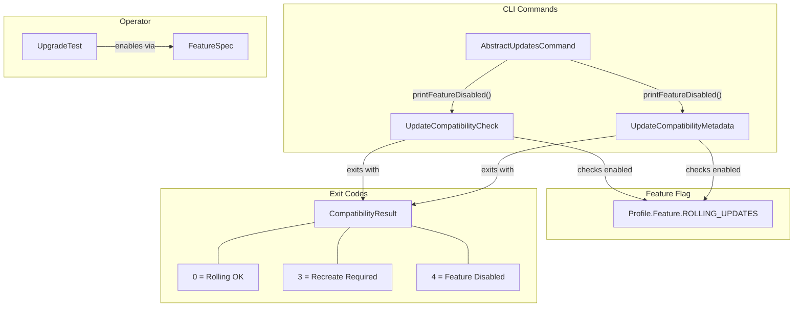

# Code Review: keycloak__keycloak__keycloak__PR36882

**PR**: Add rolling-updates feature flag and compatibility framework
**Instance**: keycloak__keycloak__keycloak__PR36882
**Date**: 2026-04-08
**Source**: Diff-only (no specs, no repo access)

---

## Intent Register

### Intent Claims

1. A new `ROLLING_UPDATES` feature flag is added as a `PREVIEW` type feature in the Keycloak profile system.
2. The `update-compatibility check` CLI command must gate on the `ROLLING_UPDATES` feature flag — if disabled, it prints an error and exits with code 4.
3. The `update-compatibility metadata` CLI command must gate on the `ROLLING_UPDATES` feature flag — if disabled, it prints an error and exits with code 4.
4. The `RECREATE_UPGRADE_EXIT_CODE` constant is changed from 4 to 3 to avoid collision with the new `FEATURE_DISABLED` exit code (4).
5. Exit codes are now aligned with picocli conventions: 0 = rolling upgrade OK, 1 = software error (picocli), 2 = usage error (picocli), 3 = recreate required, 4 = feature disabled.
6. The Keycloak Operator documentation warns that the `rolling-updates` feature must be enabled for the operator to function.
7. The `update-compatibility` documentation template macro hardcodes `--features=rolling-updates` into all example commands.
8. The operator integration test (`UpgradeTest`) now uses `FeatureSpec` instead of `UnsupportedSpec` to enable the feature flag.
9. A new integration test (`testFeatureNotEnabled`) verifies the error message when the feature is not enabled.
10. Existing integration tests are updated to pass `--features=rolling-updates` to all `update-compatibility` subcommands.

### Intent Diagram

---

## Findings Summary

| Finding | Type | Severity | One-line Description |
|---------|------|----------|---------------------|
| F-01 | structural | minor | Bare string literal `"rolling-updates"` in `printFeatureDisabled()` instead of `Profile.Feature.ROLLING_UPDATES.getKey()` |
| F-02 | test-integrity | major | `testFeatureNotEnabled` only covers `metadata` subcommand, not `check`; no exit code assertion for `FEATURE_DISABLED=4` |
| F-03 | test-integrity | minor | `testMissingOptionOnSave` uses negative-only assertion with no positive verification (pre-existing) |
| F-04 | fragile | minor | `kc.adoc` template macro unconditionally hardcodes `--features=rolling-updates` |
| F-05 | fragile | minor | `Dockerfile-custom-image` hardcodes `--features=rolling-updates` in build step |
| F-06 | structural | minor | Identical feature-gate guard block duplicated in `UpdateCompatibilityCheck.run()` and `UpdateCompatibilityMetadata.run()` |
| F-07 | test-integrity | major | `testWrongVersions` missing exit code assertion after `RECREATE_UPGRADE_EXIT_CODE` changed from 4 to 3 |
| F-08 | structural | minor | `RECREATE_UPGRADE_EXIT_CODE` value changed from 4 to 3 on public interface with no changelog or migration note |
| F-09 | fragile | minor | `ENABLE_FEATURE` test constant uses bare string `"--features=rolling-updates"` instead of composing from typed enum |

**Totals**: 9 verified findings, 2 rejections (1 factual error, 1 duplicate), 0 nits. False positive rate: 0% (no user dismissals — benchmark mode).

---

## Verified Findings

### F-01 (S-01) — Bare literal feature name in error message
- **Finding ID**: F-01
- **Sighting**: S-01
- **Location**: `quarkus/runtime/src/main/java/org/keycloak/quarkus/runtime/cli/command/AbstractUpdatesCommand.java`, `printFeatureDisabled()`
- **Type**: structural
- **Severity**: minor
- **Current behavior**: `printFeatureDisabled()` hardcodes `"rolling-updates"` as a bare string literal in the error message. The same literal is duplicated in the test assertion in `UpdateCommandDistTest.java`.
- **Expected behavior**: Feature name derived from `Profile.Feature.ROLLING_UPDATES.getKey()`, which is the canonical accessor used elsewhere in the same diff (`UpgradeTest.java` line 138).
- **Source of truth**: AI failure mode checklist item 1 (bare literals); structural target: test-production string alignment
- **Evidence**: `UpgradeTest.java` demonstrates `Profile.Feature.ROLLING_UPDATES.getKey()` exists and is used. The literal `"rolling-updates"` appears independently in `printFeatureDisabled()` and the test assertion, creating two unlinked maintenance points.
- **Pattern label**: bare-literal-feature-name

### F-02 (S-02) — testFeatureNotEnabled incomplete coverage
- **Finding ID**: F-02
- **Sighting**: S-02
- **Location**: `quarkus/tests/integration/src/test/java/org/keycloak/it/cli/dist/UpdateCommandDistTest.java`, `testFeatureNotEnabled()`
- **Type**: test-integrity
- **Severity**: major
- **Current behavior**: Test launches only `UpdateCompatibilityMetadata` without the feature flag and asserts the error message string. Does not test `UpdateCompatibilityCheck` under the same condition. Does not assert exit code equals `FEATURE_DISABLED` (4).
- **Expected behavior**: Both gated commands should be tested. Exit code should be asserted (`assertEquals(4, result.exitCode())`), consistent with `testCompatible` which asserts `assertEquals(0, result.exitCode())`.
- **Source of truth**: Intent register items #2, #3, #5; checklist item 4 (non-enforcing tests)
- **Evidence**: `UpdateCompatibilityCheck.run()` has an identical feature gate (same diff) that is not exercised by any test with the feature disabled. `testCompatible` at line 266 demonstrates the project's convention of asserting exit codes.
- **Pattern label**: non-enforcing-test

### F-03 (S-03) — testMissingOptionOnSave negative-only assertion
- **Finding ID**: F-03
- **Sighting**: S-03
- **Location**: `quarkus/tests/integration/src/test/java/org/keycloak/it/cli/dist/UpdateCommandDistTest.java`, `testMissingOptionOnSave()`
- **Type**: test-integrity
- **Severity**: minor
- **Current behavior**: Asserts `assertNoMessage("Missing required argument")` — confirms absence of one specific error string but does not verify what the command actually produces or its exit code.
- **Expected behavior**: Test should assert the positive expected outcome (success output or expected exit code), not only the absence of one error string.
- **Source of truth**: Checklist item 6 (non-enforcing test variants — advisory assertions)
- **Evidence**: The negative-only assertion passes vacuously if the command fails silently or with a different error message.
- **Pattern label**: non-enforcing-test

### F-04 (S-04) — Documentation template hardcodes feature flag
- **Finding ID**: F-04
- **Sighting**: S-04
- **Location**: `docs/guides/templates/kc.adoc`, `updatecompatibility` FreeMarker macro
- **Type**: fragile
- **Severity**: minor
- **Current behavior**: Macro unconditionally appends `--features=rolling-updates` to all generated `update-compatibility` command examples.
- **Expected behavior**: When `ROLLING_UPDATES` graduates from PREVIEW to GA, the flag becomes unnecessary. No conditional logic or tracking mechanism connects the template to the feature lifecycle.
- **Source of truth**: Intent register item #7; structural target: semantic drift
- **Evidence**: The template has no mechanism to track feature lifecycle state. The coupling between a FreeMarker template and a Java enum constant is entirely manual.
- **Pattern label**: bare-literal-feature-name

### F-05 (S-05) — Dockerfile hardcodes feature flag
- **Finding ID**: F-05
- **Sighting**: S-05
- **Location**: `operator/scripts/Dockerfile-custom-image`
- **Type**: fragile
- **Severity**: minor
- **Current behavior**: Build command hardcodes `--features=rolling-updates`. Same lifecycle coupling as F-04.
- **Expected behavior**: Feature flag lifecycle changes should propagate without manual updates to deployment infrastructure artifacts.
- **Source of truth**: Intent register item #6; structural target: semantic drift
- **Evidence**: Same root cause as F-04 in a different artifact type (Docker build vs. FreeMarker template).
- **Pattern label**: bare-literal-feature-name

### F-06 (S-06) — Duplicated feature gate guard
- **Finding ID**: F-06
- **Sighting**: S-06
- **Location**: `UpdateCompatibilityCheck.java` lines 43-47 and `UpdateCompatibilityMetadata.java` lines 43-47
- **Type**: structural
- **Severity**: minor
- **Current behavior**: Both `run()` methods contain identical 4-line blocks: check `isFeatureEnabled`, call `printFeatureDisabled()`, call `picocli.exit(FEATURE_DISABLED)`, return. The base class `AbstractUpdatesCommand` already centralizes `printFeatureDisabled()` and `printPreviewWarning()`.
- **Expected behavior**: Guard logic should be factored into the base class (template method pattern), not duplicated per subcommand.
- **Source of truth**: Structural target: caller re-implementation
- **Evidence**: `AbstractUpdatesCommand` already demonstrates the centralization pattern for shared behavior. Adding a third subcommand would require a third copy of this block.
- **Pattern label**: caller-re-implementation

### F-07 (S-07) — testWrongVersions missing exit code assertion
- **Finding ID**: F-07
- **Sighting**: S-07
- **Location**: `quarkus/tests/integration/src/test/java/org/keycloak/it/cli/dist/UpdateCommandDistTest.java`, `testWrongVersions()`
- **Type**: test-integrity
- **Severity**: major
- **Current behavior**: `testWrongVersions` asserts only error message text for the recreate-required outcome. Does not assert exit code. `RECREATE_UPGRADE_EXIT_CODE` was changed from 4 to 3 in this PR.
- **Expected behavior**: `assertEquals(3, result.exitCode())` mirroring `testCompatible`'s `assertEquals(0, result.exitCode())`.
- **Source of truth**: Checklist item 6 (non-enforcing test variants); intent: exit code is the machine-readable contract
- **Evidence**: `testCompatible` at line 266 asserts exit code 0, establishing the project convention. The recreate path has no corresponding assertion, and the constant value just changed — a regression would be invisible.
- **Pattern label**: dual-path-verification

### F-08 (S-08) — Public constant value changed without migration note
- **Finding ID**: F-08
- **Sighting**: S-08
- **Location**: `quarkus/runtime/src/main/java/org/keycloak/quarkus/runtime/compatibility/CompatibilityResult.java`
- **Type**: structural
- **Severity**: minor
- **Current behavior**: `RECREATE_UPGRADE_EXIT_CODE` changed from 4 to 3 on a public interface. Comment explains picocli reservations but does not document the value change. No changelog, deprecation notice, or migration note anywhere in the diff.
- **Expected behavior**: Breaking change to a named public constant's value should carry a migration note or changelog entry. Severity bounded by preview status.
- **Source of truth**: Checklist item 8 (comment-code drift)
- **Evidence**: Any external automation branching on exit code 4 for "recreate required" now silently receives "feature disabled" instead. The comment explains the new layout but omits the behavioral change history.
- **Pattern label**: (none)

### F-09 (S-11) — ENABLE_FEATURE test constant uses bare string
- **Finding ID**: F-09
- **Sighting**: S-11
- **Location**: `quarkus/tests/integration/src/test/java/org/keycloak/it/cli/dist/UpdateCommandDistTest.java`, line 232
- **Type**: fragile
- **Severity**: minor
- **Current behavior**: `ENABLE_FEATURE` defined as `"--features=rolling-updates"` bare string. Used in 5+ call sites within the test file.
- **Expected behavior**: Compose from typed enum: `"--features=" + Profile.Feature.ROLLING_UPDATES.getKey()`, as demonstrated in `UpgradeTest.java` line 138.
- **Source of truth**: Checklist item 1 (bare literals)
- **Evidence**: `UpgradeTest.java` in the same diff uses `Profile.Feature.ROLLING_UPDATES.getKey()`. If the feature key changes, `ENABLE_FEATURE` silently drifts with no compile-time signal.
- **Pattern label**: bare-literal-feature-name

---

## Retrospective

### Sighting Counts
- **Total sightings generated**: 11
- **Verified findings at termination**: 9
- **Rejections**: 2 (S-09: factual error in exit code table claim; S-10: duplicate of F-02)
- **Nits**: 0

**By detection source**:
| Source | Sightings | Verified |
|--------|-----------|----------|
| checklist | 6 | 5 (F-01, F-03, F-07, F-08, F-09) |
| intent | 4 | 3 (F-02, F-04, F-05) |
| structural-target | 1 | 1 (F-06) |
| linter | 0 | N/A |

**By type**:
| Type | Count | Details |
|------|-------|---------|
| structural | 3 | F-01 (bare literal), F-06 (duplication), F-08 (contract change) |
| test-integrity | 3 | F-02 (incomplete coverage), F-03 (negative-only assertion), F-07 (missing exit code assertion) |
| fragile | 3 | F-04 (doc template), F-05 (Dockerfile), F-09 (test constant) |

**Structural sub-categorization**: bare literals (F-01), duplication (F-06), contract/migration (F-08)

**By origin**:
| Origin | Count |
|--------|-------|
| introduced | 7 (F-01, F-02, F-04, F-05, F-06, F-08, F-09) |
| pre-existing | 2 (F-03, F-07) |

### Verification Rounds
- **Rounds to convergence**: 4
- **Round 1**: 5 sightings, 5 verified
- **Round 2**: 4 sightings, 3 verified, 1 rejected
- **Round 3**: 2 sightings, 1 verified, 1 rejected (duplicate)
- **Round 4**: 0 sightings (convergence)

### Scope Assessment
- **Files in diff**: 10
- **Diff size**: ~295 lines
- **All files examined**: Yes

### Context Health
- **Sightings-per-round trend**: 5 → 4 → 2 → 0 (monotonically decreasing)
- **Rejection rate per round**: 0% → 25% → 50% → N/A
- **Hard cap reached**: No (converged at round 4 of 5)

### Tool Usage
- **Linter**: N/A (diff-only benchmark, no project tooling)
- **Grep/Glob**: Used by agents within diff file only
- **Test runners**: N/A

### Finding Quality
- **False positive rate**: 0% (benchmark mode, no user dismissals)
- **False negative signals**: None available (benchmark mode)
- **Cross-cutting patterns identified**:
  - `bare-literal-feature-name`: F-01, F-04, F-05, F-09 — the feature key string `"rolling-updates"` appears as a bare literal in 4 distinct artifacts (Java error message, FreeMarker template, Dockerfile, test constant) with no compile-time link to the canonical `Profile.Feature.ROLLING_UPDATES` enum
  - `non-enforcing-test`: F-02, F-03 — tests that verify less than their names suggest
  - `dual-path-verification`: F-07 — exit code asserted on success path but not failure path

### Intent Register
- **Claims extracted**: 10 (from diff context only)
- **Findings attributed to intent comparison**: 3 (F-02, F-04, F-05)
- **Intent claims invalidated during verification**: 0
