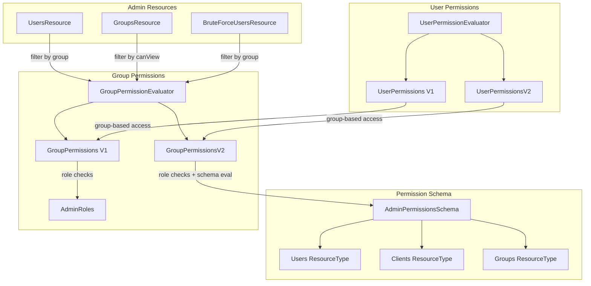

# Code Review Report: keycloak__keycloak__keycloak__PR37038

**PR**: Add Groups resource type and scopes to authorization schema
**URL**: https://github.com/keycloak/keycloak/pull/37038
**Date**: 2026-04-08

## Intent Register

### Intent Claims

1. A new `Groups` resource type is added to the admin permissions schema with scopes: `manage`, `view`, `manage-membership`, `manage-members`, `view-members`.
2. `GroupPermissionsV2` extends `GroupPermissions` to implement fine-grained authorization for groups using the V2 permission model (schema-based evaluation).
3. The `canManage()` method on groups checks `MANAGE_USERS` role OR V2 schema permissions (VIEW or MANAGE) on the groups resource type.
4. The `canView()` method on groups checks `MANAGE_USERS`/`VIEW_USERS` roles OR V2 schema permissions (VIEW or MANAGE).
5. Per-group `canManage(GroupModel)` checks `MANAGE_USERS` role OR MANAGE permission on the specific group resource.
6. Per-group `canView(GroupModel)` checks `MANAGE_USERS`/`VIEW_USERS` roles OR VIEW/MANAGE permission on the specific group.
7. `canViewMembers(GroupModel)` checks `VIEW_MEMBERS` or `MANAGE_MEMBERS` scope on the group.
8. `canManageMembers(GroupModel)` checks `MANAGE_MEMBERS` scope on the group.
9. `canManageMembership(GroupModel)` checks `MANAGE` or `MANAGE_MEMBERSHIP` scope on the group.
10. `getGroupIdsWithViewPermission()` returns group IDs where `VIEW_MEMBERS` or `MANAGE_MEMBERS` scope is granted; returns empty set when user has global `canView()`.
11. User search no longer post-filters results with `usersEvaluator::canView` — relies on DB-level group filtering via session attributes.
12. Group listing no longer pre-computes `canViewGlobal` — delegates all visibility checks to `auth.groups()::canView`.
13. `AdminRoles.ADMIN` was removed from role checks in `UserPermissionsV2.canView(UserModel)` and `canManage(UserModel)`.
14. `canManageDefault()` and `canViewDefault()` helper methods removed from `UserPermissions`; logic inlined at call sites.
15. `getGroupsWithViewPermission(GroupModel)` method removed from interface; replaced by `canViewMembers(GroupModel)`.
16. `resolveGroup()` method added to `AdminPermissionsSchema` to resolve group resources by ID.
17. V1-only operations (`isPermissionsEnabled`, `setPermissionsEnabled`, `viewMembersPermission`, etc.) throw `UnsupportedOperationException` in V2.
18. Feature flag check in `AdminPermissions.registerListener()` moved from per-event to registration time.
19. `searchGroupModelsByAttributes` passthrough removed from `ModelToRepresentation`; callers use `session.groups()` directly.
20. `RealmAdminPermissionsConfig` adds `QUERY_GROUPS` role to `myadmin` test user.

### Intent Diagram

## Verified Findings

### F-01 (Critical, Behavioral) — Resource ID vs Group UUID mismatch

- **Sighting**: S-02, S-13
- **Location**: `GroupPermissionsV2.java`, `getGroupIdsWithViewPermission()` and `hasPermission()`
- **Current behavior**: `getGroupIdsWithViewPermission()` calls `hasPermission(groupResource.getId(), ...)` passing the authorization Resource's internal UUID. Inside `hasPermission`, `resourceStore.findByName(server, groupId)` searches by resource name — but the resource name for groups is the group UUID (set by `resolveGroup` which returns `group.getId()`). The internal resource ID does not match any resource name, so every per-group lookup falls back to the all-groups resource policy check. Additionally, `granted.add(groupResource.getId())` stores internal resource IDs, not group UUIDs, so `session.setAttribute(UserModel.GROUPS, groupIds)` receives IDs that the user DB query cannot match against group membership records.
- **Expected behavior**: Should use `groupResource.getName()` (the group UUID) both as the argument to `hasPermission` and as the value added to the granted set.
- **Evidence**: `resolveGroup` returns `group.getId()` as the resource name. `findByName` searches by name. `groupResource.getId()` in the findByType callback is the authorization entity's own ID, distinct from the resource name. The same `findByName(server, group.getId())` pattern works correctly in `canView(GroupModel)` and `canManage(GroupModel)` because those pass the actual group UUID.
- **Pattern**: `resource-id-vs-group-uuid`

### F-02 (Minor, Structural) — Javadoc copy-paste error on requireManageMembers

- **Sighting**: S-09
- **Location**: `GroupPermissionEvaluator.java`, `requireManageMembers` Javadoc
- **Current behavior**: Javadoc references `{@link #canManageMembership(GroupModel)}` — copied from the preceding `requireManageMembership` method.
- **Expected behavior**: Should reference `{@link #canManageMembers(GroupModel)}`.
- **Evidence**: `requireManageMembership` (lines 399-402) correctly references `canManageMembership`. `requireManageMembers` (lines 404-407) duplicates the same text without updating the cross-reference.

### F-03 (Minor, Test-integrity) — Double-close of Response in test setup

- **Sighting**: S-11
- **Location**: `GroupResourceTypeEvaluationTest.java`, `onBefore`, `testManageGroup`, `testViewGroups`
- **Current behavior**: `ApiUtil.handleCreatedResponse` now closes the response via its own try-with-resources. Test methods also wrap the response in an outer try-with-resources, causing double-close.
- **Expected behavior**: Response should be closed exactly once. Since `handleCreatedResponse` now owns the close, callers should not also wrap in try-with-resources when passing to that method.
- **Evidence**: `handleCreatedResponse` uses `try (response)` at diff line 1073. Three call sites in the new test wrap the same response in outer try-with-resources blocks.

### F-04 (Major, Test-integrity) — No test for ID type contract of getGroupIdsWithViewPermission

- **Sighting**: S-12
- **Location**: `GroupResourceTypeEvaluationTest.java`, `testCanViewUserByViewGroupMembers` and `testCanViewUserByManageGroupMembers`
- **Current behavior**: End-to-end tests verify user visibility via group-scoped permissions but do not assert that the IDs stored in session attribute `UserModel.GROUPS` are group UUIDs. The tests would catch F-01 indirectly (empty results), but no targeted assertion isolates the ID-type contract.
- **Expected behavior**: A test should verify that `getGroupIdsWithViewPermission()` returns group model UUIDs usable for DB-level group membership filtering.
- **Pattern**: `resource-id-vs-group-uuid`

### Findings Summary (Round 1)

| Finding | Type | Severity | Description |
|---------|------|----------|-------------|
| F-01 | behavioral | critical | `getGroupIdsWithViewPermission()` uses Resource internal ID instead of group UUID |
| F-02 | structural | minor | Javadoc copy-paste error on `requireManageMembers` |
| F-03 | test-integrity | minor | Double-close of Response in test setup |
| F-04 | test-integrity | major | No test isolates the ID-type contract of `getGroupIdsWithViewPermission()` |

**Round 1 stats**: 13 sightings, 4 verified, 8 rejected, 0 nits, 1 weakened (S-10 subsumed by F-01)

### F-05 (Major, Behavioral) — AdminRoles.ADMIN removed from V2 user permission checks

- **Sighting**: S-14
- **Location**: `UserPermissionsV2.java`, `canView(UserModel)` and `canManage(UserModel)`
- **Current behavior**: Both methods previously granted immediate access to callers holding `AdminRoles.ADMIN`. The role was removed from `hasOneAdminRole` checks. `canView(UserModel)` narrowed from `(ADMIN, MANAGE_USERS, VIEW_USERS)` to `(MANAGE_USERS, VIEW_USERS)`. `canManage(UserModel)` narrowed from `(ADMIN, MANAGE_USERS)` to `(MANAGE_USERS)`. A realm administrator holding only the ADMIN role in V2 mode must now have explicit permission policies to view/manage individual users.
- **Expected behavior**: Either ADMIN continues to grant unconditional access (making removal a regression), or the removal is intentional with test coverage proving the new constraint.
- **Evidence**: The old code explicitly listed ADMIN as a distinct role alongside MANAGE_USERS, which would be redundant if ADMIN implied MANAGE_USERS through `hasOneAdminRole` evaluation. This explicit listing indicates the authors knew ADMIN did not automatically satisfy MANAGE_USERS in this check path. No test in the diff exercises this scenario.
- **Pattern**: `admin-role-removal`

### F-07 (Minor, Test-integrity) — No test for AdminRoles.ADMIN behavior in V2 mode

- **Sighting**: S-17
- **Location**: Test suite — no test covers this scenario
- **Current behavior**: No test exercises a principal holding `AdminRoles.ADMIN` (without `MANAGE_USERS` or `VIEW_USERS`) attempting per-user view/manage in V2 mode. `RealmAdminPermissionsConfig` assigns `QUERY_USERS` and `QUERY_GROUPS` to `myadmin`, not `ADMIN`.
- **Expected behavior**: A test should verify the ADMIN role removal is safe or document the new intended behavior.
- **Pattern**: `admin-role-removal`

### Findings Summary (Round 1 + Round 2)

| Finding | Type | Severity | Description |
|---------|------|----------|-------------|
| F-01 | behavioral | critical | `getGroupIdsWithViewPermission()` uses Resource internal ID instead of group UUID |
| F-02 | structural | minor | Javadoc copy-paste error on `requireManageMembers` |
| F-03 | test-integrity | minor | Double-close of Response in test setup (3 call sites) |
| F-04 | test-integrity | major | No test isolates the ID-type contract of `getGroupIdsWithViewPermission()` |
| F-05 | behavioral | major | `AdminRoles.ADMIN` removed from V2 per-user permission checks |
| F-07 | test-integrity | minor | No test for ADMIN role behavior in V2 mode |

**Round 2 stats**: 4 sightings (S-14 to S-17), 2 verified (F-05, F-07), 1 rejected (S-15), 1 duplicate of F-03 (S-16)

**Round 3 stats**: 2 sightings (S-18, S-19), 0 verified above info, 1 duplicate of F-03 (S-18), 1 info-level (S-19 — test uses non-existent group ID `"no-such"` for permission denial test, ambiguous whether it validates permission check or group-not-found)

## Retrospective

### Sighting Counts

- **Total sightings generated**: 19 (13 in round 1, 4 in round 2, 2 in round 3)
- **Verified findings at termination**: 6 (F-01 through F-05, F-07; F-06 merged into F-03)
- **Rejections**: 10
- **Nit count**: 0
- **Duplicates**: 2 (S-16 and S-18 duplicated F-03)

**By detection source**:
- `intent`: 9 sightings (S-01, S-03, S-04, S-05, S-08, S-10, S-14, S-17, S-19)
- `checklist`: 3 sightings (S-02, S-09, S-15)
- `structural-target`: 5 sightings (S-07, S-12, S-13, S-16, S-18)
- `linter`: N/A (no linters run — benchmark mode)

**By type** (verified findings only):
- `behavioral`: 2 (F-01 critical, F-05 major)
- `structural`: 1 (F-02 minor)
- `test-integrity`: 3 (F-03 minor, F-04 major, F-07 minor)

**Structural sub-categorization**: F-02 is comment-code drift (Javadoc copy-paste)

### Verification Rounds

- **Rounds to convergence**: 3
- Round 1: 13 sightings → 4 verified (F-01, F-02, F-03, F-04)
- Round 2: 4 sightings → 2 verified (F-05, F-07), 1 rejected, 1 duplicate
- Round 3: 2 sightings → 0 new above info (convergence)

### Scope Assessment

- **Files reviewed**: 14 files in diff (~1434 diff lines)
- **Primary focus**: Permission evaluation layer (`GroupPermissionsV2.java`, `UserPermissionsV2.java`, `GroupPermissions.java`, `UserPermissions.java`), admin REST resources, authorization schema, integration tests
- **Language**: Java (Keycloak server-side)

### Context Health

- **Round count**: 3 (well under 5-round cap)
- **Sightings-per-round trend**: 13 → 4 → 2 (healthy convergence)
- **Rejection rate per round**: 62% → 25% → N/A (improving precision)
- **Hard cap reached**: No

### Tool Usage

- **Linter output**: N/A (benchmark mode — no project tooling available)
- **Tools used**: Read (diff file), Grep/Glob (not needed — diff-only context)

### Finding Quality

- **False positive rate**: Unknown (no user feedback in benchmark mode)
- **False negative signals**: None observed
- **Breakdown by origin**: All findings are `introduced` (created by this PR)

### Intent Register

- **Claims extracted**: 20 (from PR diff context — no external specs or docs)
- **Sources**: PR title, code changes, Javadoc additions, test behavior
- **Findings attributed to intent comparison**: F-05, F-07 (S-14, S-17 detected via intent claim 13)
- **Intent claims invalidated during verification**: None — intent claims were conservative descriptions of observed behavior

### Key Patterns

1. **`resource-id-vs-group-uuid`** (F-01, F-04): The dominant defect cluster. `getGroupIdsWithViewPermission()` in V2 conflates the authorization framework's internal Resource ID with the domain-level group UUID. This affects both the permission evaluation path (re-lookup by name fails) and the downstream DB filter (wrong IDs stored in session attribute). The removal of the post-filter safety net in `UsersResource.searchForUser` makes this load-bearing.

2. **`admin-role-removal`** (F-05, F-07): `AdminRoles.ADMIN` silently dropped from V2 per-user permission checks with no test coverage or documentation justifying the change. The explicit listing of ADMIN in the old code suggests it was not redundant with MANAGE_USERS through role composition.

3. **`double-close`** (F-03): `ApiUtil.handleCreatedResponse` was refactored to own response lifecycle via try-with-resources, but callers in the new test class still wrap the same response in outer try-with-resources blocks. Harmless but indicates incomplete refactoring.
