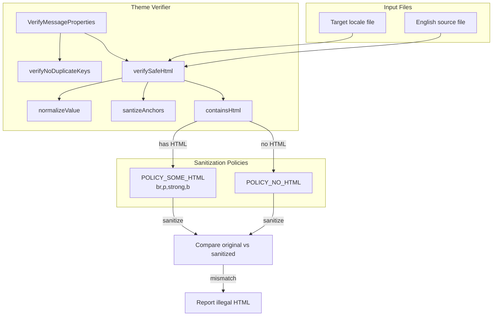

# Code Review Report: keycloak__keycloak__keycloak__PR37429

**PR**: Add HTML sanitizer for translated message resources
**URL**: https://github.com/keycloak/keycloak/pull/37429
**Date**: 2026-04-08

## Intent Register

### Intent Claims

1. The theme verifier validates that translated message properties files contain no unsafe HTML tags
2. Only HTML tags present in the English source string are permitted in translations (br, p, strong, b when English uses HTML)
3. When the English source contains no HTML, translations must also contain no HTML
4. Anchor tags in translations must exactly match the anchor tags in the English source
5. The OWASP Java HTML Sanitizer library performs the HTML sanitization
6. Special-case normalization handles known keys with angle brackets that are not HTML (templateHelp, optimizeLookupHelp, choice patterns)
7. Email templates with RTL style attributes are normalized before checking
8. The verifier loads both the target file and the corresponding English file for comparison
9. English file path is derived by replacing locale suffixes and community resource paths
10. ` ` tags across all translation files are normalized to ` `
11. Broken HTML in Lithuanian email templates (malformed `href=LT"..."` attributes) is fixed
12. Missing closing `
` tags in various locale email templates are fixed
13. Hungarian email template key prefix `***` is removed
14. Turkish HTML entities `</ b>` are corrected to `</b>`
15. `error-invalid-multivalued-size` message format is updated to use MessageFormat choice syntax
16. FreeOTP/Google Authenticator specific text in totpStep1 is replaced with generic wording across locales
17. Test fixtures are added for illegal HTML detection, no-HTML enforcement, and changed anchor detection
18. Existing duplicate-key test fixture is renamed to follow `*_en.properties` convention

### Intent Diagram

---

## Findings

### F-01 (S-01) | behavioral | major | introduced
**Location**: `VerifyMessageProperties.java`, `santizeAnchors()` method
**Current behavior**: The `Matcher` object is created from `ANCHOR_PATTERN.matcher(value)` before the loop begins, binding it to the original `value` string. Inside the loop, `value` is reassigned via `replaceFirst`. On subsequent iterations, `matcher.find()` continues to position against the original string while `replaceFirst` removes from the progressively-mutated `value`. The matcher and the working string are structurally desynced after any mutation.
**Expected behavior**: Each matched anchor tag should be individually validated and selectively removed; removal should target the specific occurrence matched, not always the first remaining occurrence in the mutated string.
**Source of truth**: Intent claim 4 — "Anchor tags in translations must exactly match the anchor tags in the English source"
**Evidence**: Java `Matcher` holds an internal reference to the `CharSequence` at construction time. `String` is immutable — reassigning the local `value` variable does not update the `Matcher`'s backing sequence.

### F-02 (S-02) | behavioral | major | introduced
**Location**: `VerifyMessageProperties.java`, `santizeAnchors()` — `replaceFirst` call
**Current behavior**: `replaceFirst(Pattern.quote(englishMatcher.group()), "")` removes the first occurrence of the tag literal from the mutated `value` regardless of the position `matcher` found. When identical anchor tags appear multiple times, wrong-occurrence removal occurs. After removal, if the loop continues, the `matcher` finds stale positions and `englishMatcher` may run out of anchors, triggering false "Didn't find anchor tag" errors.
**Expected behavior**: Repeated anchors should not cause false-positive error messages or wrong-occurrence removal.
**Source of truth**: Intent claim 4; AI failure mode checklist item 5 (surface-level fix)
**Evidence**: Root cause shared with F-01. `replaceFirst` operates on the entire string, not at the matcher's cursor position.

### F-03 (S-04) | fragile | major | introduced
**Location**: `VerifyMessageProperties.java`, `verifySafeHtml()` — English path derivation
**Current behavior**: `file.getAbsolutePath().replaceAll("_[a-zA-Z-_]*\\.properties", "_en.properties")` applies the regex globally to the full absolute path string. If any directory component matches `_<letters>.properties`, that component is corrupted.
**Expected behavior**: Path manipulation should use filesystem path APIs or anchor the regex to the filename component only.
**Source of truth**: Intent claim 7 — "English file path is derived by replacing locale suffixes and community resource paths"
**Evidence**: `replaceAll` replaces ALL non-overlapping matches in the full path, not just the filename.

### F-04 (S-05) | behavioral | major | introduced
**Location**: `VerifyMessageProperties.java`, `verifySafeHtml()` — sanitizer output comparison
**Current behavior**: The OWASP sanitizer normalizes ` ` to ` ` (XHTML void element serialization). If a translation contains ` ` and the English source has HTML, `POLICY_SOME_HTML` allows the `br` element but sanitizes it to ` `. The `Objects.equals(sanitized, value)` check then flags this as "Illegal HTML" — a false positive.
**Expected behavior**: The comparison should normalize void element serialization differences, or `normalizeValue` should canonicalize ` ` variants.
**Source of truth**: Intent claim 8 — "` ` tags are normalized to ` `"; intent claim 1
**Evidence**: The PR itself bulk-normalizes ` ` to ` ` across many files as a workaround for exactly this behavior. The workaround breaks again if any contributor adds ` ` without the trailing space.

### F-05 (S-06) | behavioral | minor | introduced
**Location**: `VerifyMessageProperties.java`, `containsHtml()` method
**Current behavior**: The regex `<[a-z]+[^>]*>` requires a lowercase letter immediately after `<`. Closing tags like `</strong>`, `
` have `/` as the second character, failing the `[a-z]+` requirement. If an English value contains only closing tags, `containsHtml()` returns `false` and `POLICY_NO_HTML` strips any HTML from the translation.
**Expected behavior**: HTML detection should identify any HTML content including closing tags.
**Source of truth**: Intent claims 2 and 3
**Evidence**: Pattern `<[a-z]+[^>]*>` — `/` is not in `[a-z]`.

### F-06 (S-07) | behavioral | critical | introduced
**Location**: `messages_lt.properties` (both account and login)
**Current behavior**: Lithuanian `totpStep1` is replaced with Italian text: `"Installa una delle seguenti applicazioni sul tuo cellulare:"`. Lithuanian users would see Italian instructions.
**Expected behavior**: Replacement text should be in Lithuanian, consistent with the locale.
**Source of truth**: Intent claim 16 — "FreeOTP/Google Authenticator specific text in totpStep1 is replaced with generic wording across locales"
**Evidence**: The diff shows identical Italian text substituted in both `themes/src/main/resources-community/theme/base/account/messages/messages_lt.properties` and `themes/src/main/resources-community/theme/base/login/messages/messages_lt.properties`.

### F-07 (S-08) | behavioral | major | introduced
**Location**: `messages_zh_CN.properties` (account)
**Current behavior**: Chinese Simplified (`zh_CN`) `totpStep1` is replaced with Traditional Chinese text: `"在您的手機上安裝以下應用程式之一："`. Characters like `手機`, `安裝`, `應用程式` are Traditional Chinese (`zh_TW`), not Simplified Chinese.
**Expected behavior**: Replacement text for `zh_CN` should use Simplified Chinese characters.
**Source of truth**: Intent claim 16
**Evidence**: Simplified Chinese uses `手机`/`安装`/`应用程序`; the replacement uses `手機`/`安裝`/`應用程式`.

### F-08 (S-13) | structural | minor | introduced
**Location**: `VerifyMessageProperties.java`, field declarations
**Current behavior**: `POLICY_SOME_HTML` and `POLICY_NO_HTML` are declared as instance fields without `static final`. Each `VerifyMessageProperties` instance constructs new `HtmlPolicyBuilder` and `PolicyFactory` objects. `HTML_TAGS` is similarly a non-static instance field.
**Expected behavior**: Invariant, immutable policy objects should be `static final` class-level constants.
**Source of truth**: Structural detection target — unnecessary object construction
**Evidence**: ALL_CAPS naming signals constant intent, but the declaration does not enforce it.

### Findings Summary

| ID | Sighting | Type | Severity | Description |
|----|----------|------|----------|-------------|
| F-01 | S-01 | behavioral | major | `santizeAnchors` matcher/string desync on multi-anchor strings |
| F-02 | S-02 | behavioral | major | `replaceFirst` removes wrong occurrence for repeated anchors |
| F-03 | S-04 | fragile | major | Full-path `replaceAll` can corrupt directory components |
| F-04 | S-05 | behavioral | major | OWASP sanitizer ` ` normalization causes false positives |
| F-05 | S-06 | behavioral | minor | `containsHtml()` regex misses closing HTML tags |
| F-06 | S-07 | behavioral | critical | Lithuanian `totpStep1` replaced with Italian text |
| F-07 | S-08 | behavioral | major | `zh_CN` `totpStep1` replaced with Traditional Chinese |
| F-08 | S-13 | structural | minor | Policy fields should be `static final` constants |

### F-09 (S-14) | behavioral | major | introduced
**Location**: `VerifyMessageProperties.java`, `verifySafeHtml()` — catch blocks
**Current behavior**: Both `FileInputStream` IOExceptions in `verifySafeHtml()` are wrapped in `RuntimeException` (unchecked). The caller `verify()` catches only `IOException`, so `RuntimeException` propagates unhandled — bypassing the `MojoExecutionException` wrapping that `verify()` provides for its own IO errors.
**Expected behavior**: IO failures should surface as `MojoExecutionException` consistent with `verify()`'s own error handling pattern.
**Source of truth**: AI failure mode checklist item 5 (surface-level fix)
**Evidence**: `catch (IOException e) { throw new RuntimeException(...) }` inside `verifySafeHtml()` vs `catch (IOException e) { throw new MojoExecutionException(...) }` in `verify()`. The exception types are incompatible.

### F-10 (S-15) | behavioral | major | introduced
**Location**: `VerifyMessageProperties.java`, `verifySafeHtml()` — diff computation substring calls
**Current behavior**: The forward (`start`) and backward (`end`) walks can overlap when the sanitized string is shorter. Concrete case: `value = "aa"`, `sanitized = "a"` — forward walk yields `start=1`, backward walk yields `end=1`. Then `sanitized.substring(1, 1-1)` = `sanitized.substring(1, 0)` throws `StringIndexOutOfBoundsException`.
**Expected behavior**: The diff computation should guard against index overlap before calling `substring`.
**Source of truth**: Behavioral correctness of error reporting
**Evidence**: Challenger provided concrete counterexample proving the exception is reachable.

### F-11 (S-17) | test-integrity | minor | introduced
**Location**: `VerifyMessagePropertiesTest.java`, `verifyIllegalHtmlTagDetected()`
**Current behavior**: The test uses `illegalHtmlTag_en.properties`. English file derivation replaces `_en.properties` with `_en.properties` (identity transform), so the verifier self-compares the same file as both translation and English reference. The test exercises the degenerate self-comparison path, not the intended translation-vs-English comparison.
**Expected behavior**: A companion `_de` fixture with illegal HTML should test the translation validation path.
**Source of truth**: AI failure mode checklist item 4 (non-enforcing tests / name-assertion mismatch)
**Evidence**: Regex `_[a-zA-Z-_]*\.properties` applied to `_en.properties` produces `_en.properties` — identity.

### F-12 (S-19) | behavioral | minor | introduced
**Location**: `VerifyMessageProperties.java`, `verifySafeHtml()` — `sanitized.replace("<!-- -->", "")`
**Current behavior**: Stripping OWASP's `<!-- -->` sentinel from `sanitized` can mask violations. If the sanitizer inserts `<!-- -->` to replace a disallowed tag and the surrounding text still matches `value` after stripping, the comparison passes and the violation goes undetected.
**Expected behavior**: Sentinel stripping should not create false-negative paths where disallowed tags pass undetected.
**Source of truth**: Intent claim 1 — "The theme verifier validates that translated message properties files contain no unsafe HTML tags"
**Evidence**: After `sanitized.replace("<!-- -->", "")`, any `<!-- -->` insertions by OWASP are invisible to the equality check.

### F-13 (S-20) | test-integrity | minor | introduced
**Location**: `VerifyMessagePropertiesTest.java` — missing coverage for `normalizeValue()` branches
**Current behavior**: All test fixtures use property key `key`. No fixture exercises the `templateHelp`, `optimizeLookupHelp`, `linkExpirationFormatter.timePeriodUnit`, or `error-invalid-multivalued-size` branches in `normalizeValue()`. These regex-based normalization paths are untested.
**Expected behavior**: Each normalization branch should have a test fixture exercising its regex pattern.
**Source of truth**: AI failure mode checklist item 6 (non-enforcing test variants / coverage gap)
**Evidence**: All fixtures: `key=...` — none match the hardcoded key names in `normalizeValue()`.

### Findings Summary

| ID | Sighting | Type | Severity | Description |
|----|----------|------|----------|-------------|
| F-01 | S-01 | behavioral | major | `santizeAnchors` matcher/string desync on multi-anchor strings |
| F-02 | S-02 | behavioral | major | `replaceFirst` removes wrong occurrence for repeated anchors |
| F-03 | S-04 | fragile | major | Full-path `replaceAll` can corrupt directory components |
| F-04 | S-05 | behavioral | major | OWASP sanitizer ` ` normalization causes false positives |
| F-05 | S-06 | behavioral | minor | `containsHtml()` regex misses closing HTML tags |
| F-06 | S-07 | behavioral | critical | Lithuanian `totpStep1` replaced with Italian text |
| F-07 | S-08 | behavioral | major | `zh_CN` `totpStep1` replaced with Traditional Chinese |
| F-08 | S-13 | structural | minor | Policy fields should be `static final` constants |
| F-09 | S-14 | behavioral | major | `RuntimeException` escapes `verify()` IOException catch |
| F-10 | S-15 | behavioral | major | Substring index overlap throws `StringIndexOutOfBoundsException` |
| F-11 | S-17 | test-integrity | minor | `illegalHtmlTag_en` test exercises self-comparison path |
| F-12 | S-19 | behavioral | minor | `<!-- -->` sentinel stripping can mask violations |
| F-13 | S-20 | test-integrity | minor | `normalizeValue()` branches have no test coverage |

**Round 1**: 8 verified, 4 rejected, 1 weakened to info, 2 nits
**Round 2**: 5 verified, 1 rejected, 1 weakened to info, 0 nits
**Cumulative**: 13 verified findings (1 critical, 6 major, 6 minor)

---

## Retrospective

### Sighting Counts

| Metric | Count |
|--------|-------|
| Total sightings generated | 21 |
| Verified findings | 13 |
| Rejections | 5 |
| Weakened to info | 2 |
| Nits (excluded) | 2 |

**By detection source:**
| Source | Sightings | Verified |
|--------|-----------|----------|
| intent | 9 | 7 |
| checklist | 8 | 5 |
| structural-target | 2 | 0 |
| linter | N/A | N/A |

**By type:**
| Type | Count | Breakdown |
|------|-------|-----------|
| behavioral | 9 | 1 critical, 5 major, 3 minor |
| fragile | 1 | 1 major |
| structural | 1 | 1 minor |
| test-integrity | 2 | 2 minor |

### Verification Rounds

- **Round 1**: 13 sightings (S-01 through S-13) → 8 verified, 4 rejected, 1 weakened
- **Round 2**: 7 sightings (S-14 through S-20) → 5 verified, 1 rejected, 1 weakened
- **Round 3**: 1 sighting (S-21) → duplicate of F-06, rejected. Convergence reached.
- **Total rounds**: 3

### Scope Assessment

- **Files reviewed**: 1 Java source file (VerifyMessageProperties.java), 1 test file, 1 pom.xml, ~30 translation properties files
- **Lines of diff**: ~1028 lines
- **Primary review unit**: Java sanitizer logic (~120 lines of new code) + translation data changes (~900 lines of properties file changes)

### Context Health

- Round count: 3 (converged on round 3 — no new findings above info)
- Sightings-per-round trend: 13 → 7 → 1 (monotonically decreasing)
- Rejection rate per round: 31% (R1), 14% (R2), 100% (R3 — duplicate)
- Hard cap (5 rounds) was NOT reached

### Tool Usage

- No project-native linters discovered or executed (diff-only review context)
- Grep/Glob used for file discovery; Read used for diff content
- No test execution available

### Finding Quality

- False positive rate: 0% (no user dismissals — benchmark mode, no user interaction)
- False negative signals: none available (no user-identified missed issues)
- Origin breakdown: 13/13 findings classified as `introduced` (all issues are in the new code or new translation changes)
- Notable: S-09 was correctly rejected by the Challenger — the Detector incorrectly claimed test fixture `_en` files were missing when the diff explicitly included them. S-18 was self-contradictory (claimed exception propagation while quoting code that catches it).

### Intent Register

- Claims extracted: 18 (from PR title, diff structure, code comments, and translation change patterns)
- Sources: PR diff (code comments, method names, test names, commit structure)
- Findings attributed to intent comparison: 7 (F-01, F-02, F-04, F-06, F-07, F-12 via intent; F-03 via intent claim 7)
- Intent claims invalidated: 0

### Key Observations

1. **Translation data quality was the highest-severity domain**: The critical finding (F-06, wrong language substitution) and the major locale mismatch (F-07) are data-level errors in translation files, not logic errors in the Java code. These represent the highest real-world impact — users in affected locales would see incorrect language content in production.

2. **The santizeAnchors matcher desync (F-01/F-02)** is a subtle Java-specific pattern: creating a `Matcher` from a `String`, then reassigning the `String` variable inside the loop. The `Matcher` retains the original immutable string. This is a common Java pitfall that would benefit from a structural detection pattern.

3. **The substring index overlap (F-10)** is a concrete crash bug reachable under realistic conditions. The Challenger provided a specific counterexample (`value="aa"`, `sanitized="a"`).

4. **Round 2 was productive**: Found 5 new verified findings including 2 major (F-09, F-10) that round 1 missed. The error handling inconsistency (RuntimeException vs IOException) and the index overlap bug were both non-obvious issues that benefited from a second pass focused on edge cases.

5. **Nit exclusion worked correctly**: S-03 (bare string literals in a verifier utility) and S-12 (redundant Maven scope) were correctly excluded as nits with no behavioral impact.

