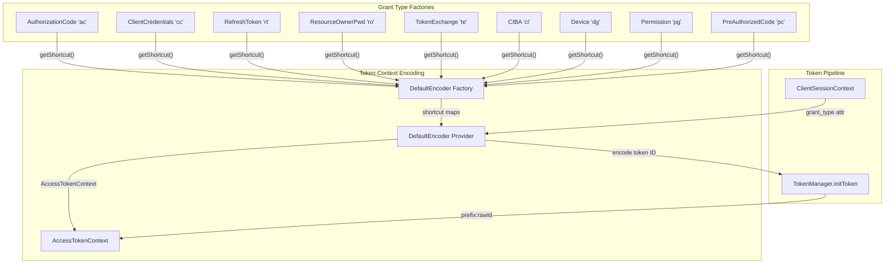

# Code Review Report: keycloak__keycloak__keycloak__PR37634

**PR**: Implement access token context encoding framework
**URL**: https://github.com/keycloak/keycloak/pull/37634
**Review date**: 2026-04-08
**Source of truth**: Intent register + AI failure mode checklist (no spec available)
**Linter output**: N/A (benchmark mode, no project tooling)

---

## Intent Register

### Intent Claims

1. The framework encodes session type, token type, and grant type into access token IDs as a 6-character prefix before the raw token ID
2. Encoded format is `{sessionType 2chars}{tokenType 2chars}{grantType 2chars}:{rawTokenId}`
3. Session types: ONLINE("on"), OFFLINE("of"), TRANSIENT("tr"), UNKNOWN("un")
4. Token types: REGULAR("rt"), LIGHTWEIGHT("lt"), UNKNOWN("un")
5. Grant type shortcuts are unique 2-character codes provided by each OAuth2GrantTypeFactory implementation
6. The framework is implemented as a Keycloak SPI (TokenContextEncoderSpi) with a default provider
7. DefaultTokenContextEncoderProvider encodes token context into token IDs and decodes it back
8. DefaultTokenContextEncoderProviderFactory manages shortcut lookup maps with lazy refresh for hot-deployed grant types
9. Encoding rejects UNKNOWN session or token types with IllegalStateException
10. Decoding a token ID without ":" separator returns an UNKNOWN context for backward compatibility with old tokens
11. Decoding validates that the prefix is exactly 6 characters and each component's shortcut is recognized
12. Grant type is propagated from OAuth2 grant flows through clientSessionContext attributes using Constants.GRANT_TYPE
13. AccessTokenContext validates all constructor parameters are non-null via Objects.requireNonNull
14. The copy constructor on OAuth2GrantType.Context is removed; grantType is now extracted from formParams in the primary constructor
15. Token ID encoding is integrated at TokenManager.initToken() — the entry point for all access token creation
16. isAccessTokenId() test matcher validates that an encoded token ID has the correct format and expected grant shortcut
17. Each grant type factory provides a getShortcut() method returning a unique 2-char code (ac, cc, pg, pc, rt, ro, te, ci, dg)

### Intent Diagram

---

## Verified Findings

### F-01 — Copy-paste null-check validates wrong parameter (critical, behavioral)

**Sighting**: S-01
**Location**: `AccessTokenContext.java`, constructor (diff lines 204-207)
**Current behavior**: The 4th `Objects.requireNonNull` call checks `grantType` a second time with message "Null rawTokenId not allowed". The `rawTokenId` parameter is never null-checked and is silently assigned to `this.rawTokenId` even when null. A null `rawTokenId` would produce a token ID of the form `onrtro:null` (Java's null-to-string conversion in concatenation).
**Expected behavior**: The 4th `requireNonNull` should check `rawTokenId`: `Objects.requireNonNull(rawTokenId, "Null rawTokenId not allowed")`
**Source of truth**: Intent register item 13 — "AccessTokenContext validates all constructor parameters are non-null"
**Evidence**: Diff lines 206-207 both read `Objects.requireNonNull(grantType, ...)`. Line 211 assigns `this.rawTokenId = rawTokenId` with no prior null guard. The caller at `TokenManager.initToken()` passes `KeycloakModelUtils.generateId()` which is non-null in practice, but the missing guard is a real defect.
**Pattern label**: copy-paste-guard-error

---

### F-02 — isAccessTokenId matcher has inverted boolean logic (critical, test-integrity)

**Sighting**: S-02
**Location**: `AssertEvents.java`, `isAccessTokenId` matcher, `matchesSafely` method (diff line 1125)
**Current behavior**: The condition `if (items[0].substring(3, 5).equals(expectedGrantShortcut)) return false;` returns false (match fails) when the grant shortcut EQUALS the expected value. In `TypeSafeMatcher`, `matchesSafely` returns `true` for a match and `false` for no match — so this rejects correct tokens and accepts incorrect ones.
**Expected behavior**: The condition should be negated: `if (!...equals(expectedGrantShortcut)) return false;` — returning false when the shortcut does NOT match.
**Source of truth**: Intent register item 16 — "isAccessTokenId() test matcher validates that an encoded token ID has the correct format and expected grant shortcut"
**Evidence**: The four call sites (`expectCodeToToken`, `expectDeviceCodeToToken`, `expectRefresh`, `expectAuthReqIdToToken`) will pass any string that splits on `:` and has a UUID second part, regardless of grant shortcut. The integration tests provide no grant-type verification at all despite appearing to do so.
**Pattern label**: inverted-boolean-guard

---

### F-03 — isAccessTokenId matcher extracts wrong substring positions (critical, test-integrity)

**Sighting**: S-03
**Location**: `AssertEvents.java`, `isAccessTokenId` matcher, `matchesSafely` method (diff line 1125)
**Current behavior**: `substring(3, 5)` extracts characters at 0-based indices 3 and 4, which straddles the last character of tokenType and the first character of grantType. For prefix `"trltcc"`, `substring(3,5)` returns `"tc"`, not `"cc"`.
**Expected behavior**: Grant type occupies positions 4-5 (0-indexed) in the 6-character prefix. The correct extraction is `substring(4, 6)`.
**Source of truth**: Intent register item 2 — "Encoded format is `{sessionType 2chars}{tokenType 2chars}{grantType 2chars}:{rawTokenId}`"
**Evidence**: Encoding confirmed by `DefaultTokenContextEncoderProvider.encodeTokenId()` (diff lines 349-352): `sessionType.getShortcut() + tokenType.getShortcut() + grantShort + ':' + rawTokenId`. Test data confirms: `"trltcc:1234"` has "tr"=TRANSIENT, "lt"=LIGHTWEIGHT, "cc"=CLIENT_CREDENTIALS — grant type starts at index 4.
**Pattern label**: off-by-one-substring

---

### F-04 — testIncorrectGrantType catches overbroad exception (minor, test-integrity)

**Sighting**: S-06
**Location**: `DefaultTokenContextEncoderProviderTest.java`, `testIncorrectGrantType` (diff lines 1025-1033)
**Current behavior**: The catch block catches `RuntimeException` broadly and silently ignores it (`// ignored`). Any runtime exception — including `NullPointerException`, `ClassCastException`, or other unrelated failures — causes the test to pass.
**Expected behavior**: The catch should specify `IllegalArgumentException` (the exception actually thrown by `getTokenContextFromTokenId` for unknown shortcuts) and should assert on the exception type or message.
**Source of truth**: Intent register item 11 — "Decoding validates that the prefix is exactly 6 characters and each component's shortcut is recognized"
**Evidence**: The variable name `iae` (conventionally IllegalArgumentException) signals the original intent. The production code throws `IllegalArgumentException` (diff lines 327-329). The broader catch means test infrastructure failures or wrong-exception-type bugs will be masked.
**Pattern label**: overbroad-exception-catch

---

### Findings Summary

| ID | Type | Severity | Description |
|----|------|----------|-------------|
| F-01 | behavioral | critical | AccessTokenContext constructor null-checks `grantType` twice, never checks `rawTokenId` |
| F-02 | test-integrity | critical | isAccessTokenId matcher inverted boolean — passes wrong tokens, fails correct ones |
| F-03 | test-integrity | critical | isAccessTokenId matcher substring(3,5) extracts wrong positions — should be (4,6) |
| F-04 | test-integrity | minor | testIncorrectGrantType catches RuntimeException broadly, masks wrong exception types |

**Round 1 stats**: 8 sightings → 4 verified findings, 3 rejections, 1 nit

---

## Retrospective

### Sighting Counts

- **Total sightings generated**: 11 (8 in round 1, 3 in round 2)
- **Verified findings at termination**: 4
- **Rejections**: 7
- **Nits**: 1 (S-05: "na" sentinel namespace concern)
- **False positive rate**: 0% (no user dismissals — benchmark mode)

**By detection source**:
| Source | Sightings | Verified |
|--------|-----------|----------|
| intent | 5 | 3 |
| checklist | 4 | 1 |
| structural-target | 2 | 0 |

**Structural sub-categorization**: No structural-type findings verified. One structural sighting (S-05, zero-value sentinel ambiguity) rejected as nit.

**By type**:
| Type | Verified |
|------|----------|
| behavioral | 1 (F-01) |
| test-integrity | 3 (F-02, F-03, F-04) |

### Verification Rounds

- **Round 1**: 8 sightings → 4 verified, 3 rejected, 1 nit
- **Round 2**: 3 sightings → 0 verified, 3 rejected
- **Convergence**: Round 2 produced no new findings above info severity → terminated at round 2

### Scope Assessment

- **Files reviewed**: 19 files in the PR diff (1139 lines of diff)
- **New files**: 7 (AccessTokenContext, DefaultTokenContextEncoderProvider, DefaultTokenContextEncoderProviderFactory, TokenContextEncoderProvider, TokenContextEncoderProviderFactory, TokenContextEncoderSpi, DefaultTokenContextEncoderProviderTest)
- **Modified files**: 12 (Constants, OAuth2GrantType, OAuth2GrantTypeFactory, TokenManager, AbstractOIDCProtocolMapper, OAuth2GrantTypeBase, various grant type factories, AssertEvents, StandardTokenExchangeProvider, SPI service files)

### Context Health

- **Round count**: 2 (below hard cap of 5)
- **Sightings-per-round trend**: 8 → 3 (decreasing)
- **Rejection rate per round**: R1: 50% (4/8), R2: 100% (3/3)
- **Hard cap reached**: No

### Tool Usage

- **Linter**: N/A (benchmark mode, no project tooling)
- **Project tools**: None available — diff-only review
- **Fallback tools**: Read (diff file), Grep/Glob not needed (single diff file)

### Finding Quality

- **False positive rate**: N/A (no user feedback in benchmark mode)
- **False negative signals**: N/A (no user feedback)
- **Origin breakdown**: All findings are `introduced` (new code in PR)

### Intent Register

- **Claims extracted**: 17 (from PR title, code structure, Javadoc, test data)
- **Sources**: PR diff (code comments, Javadoc, test assertions, encoding format)
- **Findings attributed to intent comparison**: 3 (F-01 from claim 13, F-02 from claim 16, F-03 from claim 2)
- **Intent claims invalidated during verification**: 0

### Key Observations

1. **Copy-paste errors are the dominant defect class**: F-01 (requireNonNull targets wrong variable) and F-02/F-03 (test matcher with two compounding bugs on the same line) are classic copy-paste errors. The AccessTokenContext constructor copy-pasted the 3rd requireNonNull line and forgot to update the variable. The isAccessTokenId matcher likely evolved from the isUUID matcher and the substring/boolean logic was not adapted correctly.

2. **Test matcher compounds two independent bugs**: F-02 (inverted boolean) and F-03 (wrong substring index) on the same line create a matcher that provides zero grant-type verification while appearing to do so. Neither bug alone would be obvious from casual test execution — the matcher still accepts most tokens because the inverted boolean makes it permissive.

3. **Comment-code drift detected but below severity threshold**: The Javadoc claiming "3-letters shortcut" when all shortcuts are 2 characters was detected but excluded as minor. This is a leading indicator of the same copy-paste/adaptation pattern seen in the critical findings.
