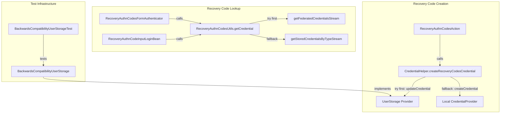

# Code Review: keycloak__keycloak__keycloak__PR38446

**PR**: Implement recovery key support for user storage providers
**Instance**: keycloak__keycloak__keycloak__PR38446
**Date**: 2026-04-08

## Intent Register

### Intent Claims

1. Recovery authentication codes (recovery keys) can be stored in external user storage providers (federated storage), not just Keycloak's local DB
2. `CredentialHelper.createRecoveryCodesCredential()` tries user storage first via `updateCredential()`; if the user storage reports success, skips local creation; otherwise falls back to local credential provider
3. `RecoveryAuthnCodesUtils.getCredential()` checks federated credentials first via `getFederatedCredentialsStream()`, then falls back to local stored credentials via `getStoredCredentialsByTypeStream()`
4. `RecoveryAuthnCodesFormAuthenticator` and `RecoveryAuthnCodeInputLoginBean` are updated to use the unified lookup instead of local-only queries
5. `RecoveryAuthnCodesAction.processAction()` is updated to use the unified creation helper instead of directly calling the local credential provider
6. `BackwardsCompatibilityUserStorage` test provider is extended to store, retrieve, and validate recovery codes — demonstrating a working user storage implementation
7. Recovery codes are serialized as a JSON list of plaintext strings for transport to/from user storage via `UserCredentialModel.challengeResponse`
8. Recovery code validation in the test user storage provider compares plaintext input against all stored codes via `anyMatch`
9. The integration test verifies the full setup-and-login flow for recovery codes through an external user storage provider
10. Whitespace/formatting cleanup applied to `CredentialHelper.getConfigurableAuthenticatorFactory()` and other minor locations

### Intent Diagram

## Verified Findings

### F-01 — Bare string literal for provider ID (structural / major)

- **Sighting**: S-01
- **Location**: `server-spi-private/src/main/java/org/keycloak/utils/CredentialHelper.java`, line 51
- **Current behavior**: `session.getProvider(CredentialProvider.class, "keycloak-recovery-authn-codes")` uses a bare string literal. `RecoveryAuthnCodesCredentialProviderFactory.PROVIDER_ID` holds the same value as a named constant. The diff for `RecoveryAuthnCodesAction.java` removes its import of that factory class — the constant was known and previously used.
- **Expected behavior**: Provider lookup strings should reference named constants. `RecoveryAuthnCodesCredentialProviderFactory.PROVIDER_ID` should be used.
- **Source of truth**: Checklist item 1 — Bare literals
- **Evidence**: Diff line 51 shows the bare literal. `RecoveryAuthnCodesAction.java` diff removes the import of the class that holds the constant, confirming the constant was in active use before this change.
- **Pattern label**: bare-literal-provider-id

### F-02 — Empty string credential ID (structural / minor)

- **Sighting**: S-02
- **Location**: `server-spi-private/src/main/java/org/keycloak/utils/CredentialHelper.java`, line 58
- **Current behavior**: `new UserCredentialModel("", credentialModel.getType(), recoveryCodesJson)` passes an empty string as the credential ID. This value is forwarded to user storage providers via `updateCredential()`. The OTP path in `BackwardsCompatibilityUserStorage` was updated in this same diff to explicitly set a generated ID via `KeycloakModelUtils.generateId()`.
- **Expected behavior**: The credential ID should be a newly generated ID or explicitly documented as intentionally empty.
- **Source of truth**: Intent claim 7; Checklist item 9 — Zero-value sentinel ambiguity
- **Evidence**: Diff line 58 confirms the empty string. Diff line 275 shows the OTP path now calls `newOTP.setId(KeycloakModelUtils.generateId())`. The test provider ignores the input ID and generates its own, but other providers' behavior is unspecified.

### F-03 — Unconditional Optional.get() in login bean (behavioral / major)

- **Sighting**: S-03
- **Location**: `services/src/main/java/org/keycloak/forms/login/freemarker/model/RecoveryAuthnCodeInputLoginBean.java`, lines 196–199
- **Current behavior**: `RecoveryAuthnCodesUtils.getCredential(user)` returns `Optional<CredentialModel>`. The next line calls `credentialModelOpt.get()` with no `isPresent()` guard. When no recovery codes credential exists, the constructor throws `NoSuchElementException` during login page rendering.
- **Expected behavior**: Guard with `isPresent()` before calling `.get()`, consistent with `RecoveryAuthnCodesFormAuthenticator` which guards the same utility call.
- **Source of truth**: Intent claim 4; structural target — silent error discard
- **Evidence**: Diff lines 196–199 show the unconditional `.get()`. `RecoveryAuthnCodesFormAuthenticator` (diff lines 120–122) guards with `if (optUserCredentialFound.isPresent())`. Additionally, line 201 has a second unconditional `.get()` on `getNextRecoveryAuthnCode()` — a second crash path in the same constructor if the credential has no remaining codes.

### F-04 — Raw List type in recovery code validation (structural / minor)

- **Sighting**: S-04
- **Location**: `testsuite/.../BackwardsCompatibilityUserStorage.java`, lines 346–354
- **Current behavior**: `List generatedKeys` (raw type) is populated via `JsonSerialization.readValue(storedRecoveryKeys.getCredentialData(), List.class)`. The `anyMatch(key -> key.equals(...))` operates on `Object` elements, suppressing compile-time type checking.
- **Expected behavior**: Declare as `List<String>` to preserve compile-time type safety.
- **Source of truth**: Intent claim 8; Checklist item 12 — Semantically incoherent test fixtures
- **Evidence**: Diff lines 346–347 show `List generatedKeys;` with no type parameter. No runtime failure, but compile-time safety is lost.

### F-05 — Fragile test assertion hardcoded to code index 0 (fragile / minor)

- **Sighting**: S-06
- **Location**: `testsuite/.../BackwardsCompatibilityUserStorageTest.java`, lines 603–610 and call at line 519
- **Current behavior**: `enterRecoveryCodes` asserts `assertEquals(expectedCode, requestedCode)` where `expectedCode` is always `0` from the call site. If the server requests any code index other than 0, the assertion fails before login. The actual code-entry logic on the final line correctly uses `requestedCode`.
- **Expected behavior**: The assertion should not constrain which code index the server may request — the method already uses the correct index for entry.
- **Source of truth**: Intent claim 9; Checklist item 4 — Non-enforcing tests
- **Evidence**: Diff lines 603–610 show the helper takes `int expectedCode`, asserts it matches `requestedCode`, then uses `requestedCode` for the actual entry. Call site at line 519 passes literal `0`.

### F-06 — Silent error discard in getCredentials() (structural / major)

- **Sighting**: S-07
- **Location**: `testsuite/.../BackwardsCompatibilityUserStorage.java`, lines 302–314 (`getCredentials` method)
- **Current behavior**: `getCredentials()` deserializes recovery codes using raw `List.class` (same raw-type issue as F-04). On `IOException`, the method catches the exception, logs an error, and continues — the recovery credential is silently omitted from the returned stream. The caller sees the user as having no recovery credentials.
- **Expected behavior**: Deserialization failure on authentication-material credentials should propagate or result in a clearly failed state, not silent omission.
- **Source of truth**: Structural target — silent error discard
- **Evidence**: Diff lines 305–314 confirm both the raw `List.class` at line 307 and the swallowed `IOException` at lines 312–314. The catch block only logs, then falls through without adding the credential.
- **Pattern label**: silent-error-discard

### F-07 — Test only exercises recovery code index 0 (test-integrity / minor)

- **Sighting**: S-08
- **Location**: `testsuite/.../BackwardsCompatibilityUserStorageTest.java`, lines 603–610 and call at line 519
- **Current behavior**: `enterRecoveryCodes` helper accepts `expectedCode` parameter but the only caller passes `0`. The test never exercises any recovery code index other than 0.
- **Expected behavior**: Recovery code validation should be tested with multiple code indices to verify the lookup path handles different positions.
- **Source of truth**: Checklist item 4 — Non-enforcing tests
- **Evidence**: Diff line 519 passes literal `0`. The helper at lines 603–610 asserts `expectedCode == requestedCode`, then uses `requestedCode` for the actual entry.

### F-08 — Dead delay infrastructure with typo (structural / minor)

- **Sighting**: S-10
- **Location**: `testsuite/.../BackwardsCompatibilityUserStorageTest.java`, lines 482–485
- **Current behavior**: `configureBrowserFlowWithRecoveryAuthnCodes` adds a `"delayed-authenticator"` execution and accepts a `delay` parameter, but the only call passes `delay=0` (no-op). The config alias contains a typo: `"delayed-suthenticator-config"`.
- **Expected behavior**: Either exercise the delay with a meaningful value, or remove the dead infrastructure. Fix the alias typo.
- **Source of truth**: Checklist item 7 — Dead infrastructure
- **Evidence**: Diff line 483 shows `config.setAlias("delayed-suthenticator-config")` with the typo. Diff line 503 shows the only call: `configureBrowserFlowWithRecoveryAuthnCodes(testingClient, 0)`.

### Round 1 Rejections

- **S-05** (credentialData vs secretData in test fixture): Rejected as nit. The test provider's field mapping is internally consistent.

### Round 2 Rejections

- **S-09** (hardcoded username "otp1" in test helper): Rejected as nit. Private helper with single caller using that exact username.
- **S-11** (dual-path deserialization divergence getCredentials vs isValid): Rejected — behavioral divergence claim unsubstantiated. Both paths operate on the same plain-text stored data; `createFromValues()` is used for model construction, not validation.
- **S-12** (.findFirst().get() in getOtpCredentialFromAccountREST): Rejected — pre-existing issue, out of scope for this PR.

### Round 3 Rejections

- **S-13** (missing deletion of prior credential on re-enrollment): Rejected — the local-DB fallback path calls the same `createCredential()` method the original code used before this PR. The behavior is pre-existing and unchanged by the refactoring. The user-storage path (`updateCredential`) naturally overwrites the previous value in the test provider's single field.

## Findings Summary

| ID | Type | Severity | Description |
|----|------|----------|-------------|
| F-01 | structural | major | Bare string literal `"keycloak-recovery-authn-codes"` instead of `PROVIDER_ID` constant |
| F-02 | structural | minor | Empty string `""` credential ID in `UserCredentialModel` constructor |
| F-03 | behavioral | major | Unconditional `Optional.get()` in `RecoveryAuthnCodeInputLoginBean` — crashes on absent credential |
| F-04 | structural | minor | Raw `List` type (no generics) in `isValid()` recovery code deserialization |
| F-05 | fragile | minor | Test assertion hardcoded to recovery code index 0 |
| F-06 | structural | major | Silent `IOException` discard in `getCredentials()` — credential silently disappears |
| F-07 | test-integrity | minor | Test only exercises recovery code index 0, no coverage of other positions |
| F-08 | structural | minor | Dead delay infrastructure with typo `"delayed-suthenticator-config"` |

**Totals**: 8 verified findings (3 major, 5 minor), 5 rejections, 2 nits

## Retrospective

### Sighting Counts

- **Total sightings generated**: 13
- **Verified findings**: 8
- **Rejections**: 5
- **Nit count**: 2 (S-05, S-09)
- **By detection source**:
  - checklist: 7 (S-01, S-02, S-03, S-04, S-07, S-08, S-12)
  - structural-target: 4 (S-05, S-09, S-10, S-11)
  - intent: 2 (S-06, S-13)
- **By type (verified findings)**:
  - structural: 5 (F-01, F-02, F-04, F-06, F-08) — bare literals: 1, raw type: 1, silent error discard: 1, dead infrastructure: 1, zero-value sentinel: 1
  - behavioral: 1 (F-03)
  - fragile: 1 (F-05)
  - test-integrity: 1 (F-07)

### Verification Rounds

- **Rounds**: 3
- **Round 1**: 6 sightings → 5 verified, 1 rejected (nit)
- **Round 2**: 6 sightings → 3 verified, 3 rejected (1 nit, 1 unsubstantiated, 1 pre-existing)
- **Round 3**: 1 sighting → 0 verified, 1 rejected (pre-existing)
- **Convergence**: Round 3 produced no new verified findings above info severity — loop terminated

### Scope Assessment

- **Files reviewed**: 8 files in PR diff (~615 lines of diff)
- **Production code**: 4 files (CredentialHelper.java, RecoveryAuthnCodesUtils.java, RecoveryAuthnCodesFormAuthenticator.java, RecoveryAuthnCodesAction.java, RecoveryAuthnCodeInputLoginBean.java)
- **Test infrastructure**: 2 files (BackwardsCompatibilityUserStorage.java, BackwardsCompatibilityUserStorageFactory.java)
- **Test code**: 1 file (BackwardsCompatibilityUserStorageTest.java)

### Context Health

- **Sightings-per-round trend**: 6 → 6 → 1 (healthy decay)
- **Rejection rate per round**: 17% → 50% → 100% (increasing selectivity, confirming convergence)
- **Hard cap reached**: No (terminated at round 3 of 5)

### Tool Usage

- **Linter output**: N/A (isolated diff review, no project tooling available)
- **Tools used**: Read, Grep, Glob (diff-only context)

### Finding Quality

- **False positive rate**: N/A (benchmark mode, no user dismissals)
- **Origin breakdown**: All verified findings classified as `introduced` (new code in this PR)
- **Notable patterns**: The unconditional `Optional.get()` pattern (F-03) appeared in multiple locations across the diff, with the production instance being the most severe. The raw-type deserialization pattern appeared in two methods of the same test class (F-04, F-06).

### Intent Register

- **Claims extracted**: 10 (from PR title, diff structure, and code comments)
- **Findings attributed to intent**: 2 sightings (S-06, S-13), 0 verified from intent alone
- **Intent claims invalidated**: None
