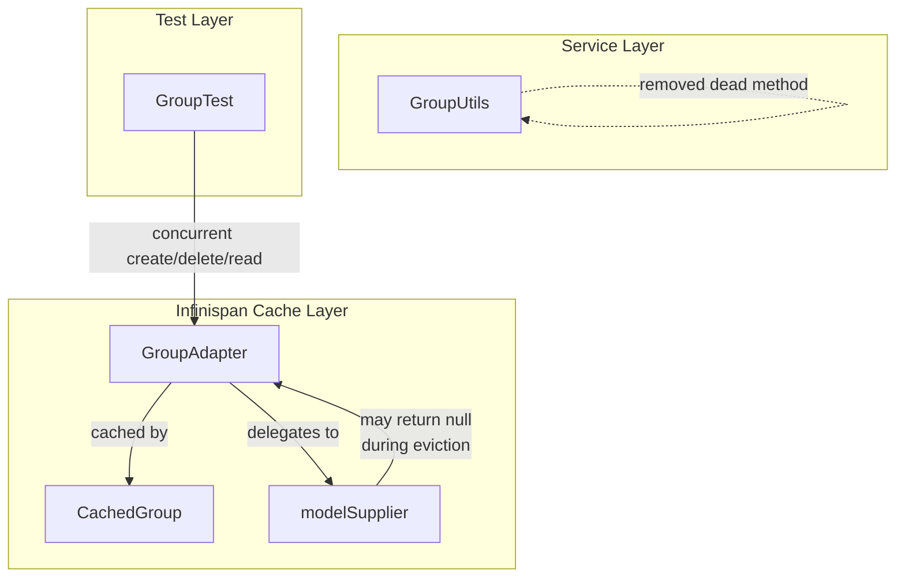

# Code Review: keycloak/keycloak PR #40940

## Review Metadata
- **Date**: 2026-04-06
- **Target**: keycloak/keycloak PR #40940 (diff review)
- **Source of truth**: AI failure mode checklist + structural detection targets + intent register
- **Linter output**: N/A (external project diff review)
- **Token usage**: in: (opus-4: 0K) (sonnet-4: 0K)  out: (opus-4: 21K) (sonnet-4: 17K)  cache-w: (opus-4: 176K) (sonnet-4: 140K)  cache-r: (opus-4: 1.7M) (sonnet-4: 575K)

## Files Changed
1. `model/infinispan/src/main/java/org/keycloak/models/cache/infinispan/GroupAdapter.java` — Null-safe model access in `getSubGroupsCount()`
2. `model/infinispan/src/main/java/org/keycloak/models/cache/infinispan/entities/CachedGroup.java` — Added `@Override` annotation to `getRealm()`
3. `services/src/main/java/org/keycloak/utils/GroupUtils.java` — Removed unused private method `groupMatchesSearchOrIsPathElement`
4. `tests/base/src/test/java/org/keycloak/tests/admin/group/GroupTest.java` — Added concurrent create/delete/read test

---

## Intent Register

### Intent Claims

1. **GroupAdapter.getSubGroupsCount() must not throw NPE when the underlying model is evicted from cache during concurrent operations** — The core fix: `modelSupplier.get()` can return null if the group was deleted between cache lookup and model resolution.
2. **CachedGroup.getRealm() overrides a parent method** — The `@Override` annotation documents an existing override relationship, improving compile-time correctness checking.
3. **GroupUtils.groupMatchesSearchOrIsPathElement is dead code and should be removed** — The private method has no callers within GroupUtils.
4. **Concurrent group creation, deletion, and listing must not throw exceptions** — The new test `createMultiDeleteMultiReadMulti` creates 100 groups, concurrently lists and deletes them, asserting zero exceptions.
5. **The Infinispan cache layer must handle cache invalidation races gracefully** — When a group is deleted while another thread is reading a cached group list, the cache adapter must return null-safe results rather than propagating NPEs.

### Intent Diagram

---

## Verified Findings

### F-01 — Null return from getSubGroupsCount() relocates NPE to callers

| Field | Value |
|---|---|
| **Sighting** | S-01 |
| **Location** | `GroupAdapter.java`, lines 273-275 (post-patch) |
| **Type** | behavioral |
| **Severity** | critical |
| **Origin** | introduced |
| **Detection source** | checklist |

**Current behavior**: When `modelSupplier.get()` returns null (group evicted from cache during concurrent deletion), `getSubGroupsCount()` returns `null`. The return type is `Long` (boxed). Any caller that auto-unboxes the returned `Long` to a primitive `long` — or uses the result in arithmetic/comparison — will throw `NullPointerException` at the call site. The fix relocates the NPE from inside the adapter to the caller, rather than eliminating it.

**Expected behavior**: `getSubGroupsCount()` should return a non-null `Long` consistent with the `GroupModel` interface contract. When the model is unavailable due to cache eviction, the method should return a sentinel value (`0L`), re-fetch the model, or propagate a typed exception.

**Source of truth**: AI failure mode checklist item 5 (surface-level fixes that bypass core mechanisms); checklist item 9 (zero-value sentinel ambiguity); intent claim 1.

**Evidence**: Diff line 11: `return model == null ? null : model.getSubGroupsCount();` — null is explicitly returned when model is null. The `GroupModel` interface contract documents this method as non-null. Production callers (REST endpoint group listing -> service layer -> `GroupModel.getSubGroupsCount()`) will auto-unbox and NPE.

---

### F-02 — Reader thread not joined before assertion (flaky test)

| Field | Value |
|---|---|
| **Sighting** | S-03 |
| **Location** | `GroupTest.java`, lines 99-120 (`createMultiDeleteMultiReadMulti`) |
| **Type** | test-integrity |
| **Severity** | major |
| **Origin** | introduced |
| **Detection source** | checklist |

**Current behavior**: The main thread sets `deletedAll = true` after the delete loop, then immediately evaluates `assertThat(caughtExceptions, Matchers.empty())` without calling `Thread.join()`. The reader thread may be mid-execution of an HTTP call to `groups()` when the flag is set. An exception from that final in-flight call is added to `caughtExceptions` after the flag flips but potentially after the assertion has already evaluated. The thread reference is not even stored, making `join()` impossible without refactoring.

**Expected behavior**: The test should store the `Thread` reference and call `join()` (or use a `CountDownLatch`/`Phaser`) before evaluating the assertion, guaranteeing the reader thread has completed all in-flight work.

**Source of truth**: AI failure mode checklist item 6 (non-enforcing test variants); intent claim 4 (concurrent operations must not throw exceptions — but the test can pass even when exceptions do occur in the last reader cycle).

**Evidence**: `AtomicBoolean deletedAll` is set to true at line 118 with no synchronization point before the assertion at line 120. `new Thread(...)` is started at line 112 but the reference is discarded (not assigned to a variable). The while-loop condition `!deletedAll.get()` is checked only at the top of each iteration — the thread can be inside the `groups()` HTTP call when the flag flips, and any exception from that call arrives in `caughtExceptions` after the assertion has already passed.

---

### F-03 — Discarded thread reference leaks on failure path

| Field | Value |
|---|---|
| **Sighting** | S-06 |
| **Location** | `GroupTest.java`, `createMultiDeleteMultiReadMulti()`, thread start at line 112 |
| **Type** | test-integrity |
| **Severity** | major |
| **Origin** | introduced |
| **Detection source** | structural-target |

**Current behavior**: The reader thread is started via `new Thread(...).start()` with the `Thread` reference discarded (not assigned to a variable). The thread's sole exit condition is `!deletedAll.get()`. If the test throws before `deletedAll.set(true)` — e.g., if a `remove()` call in the delete loop throws an unchecked `ProcessingException` or `WebApplicationException` — the flag is never set. Because the thread reference is not retained, no teardown hook can call `interrupt()` or `join()`. The thread continues spinning and issuing live HTTP requests to the server indefinitely, leaking a thread and an HTTP connection for the remainder of the JVM process lifetime.

**Expected behavior**: The `Thread` object should be assigned to a variable. A `try/finally` block around the delete loop and `deletedAll.set(true)` should ensure the flag is always set on exit — normal or exceptional — followed by a `join()` call.

**Source of truth**: Structural detection target (dead infrastructure — discarded thread reference is an unmanageable resource); shares structural root with F-02 but describes a distinct failure mode (resource leak on exceptional exit vs. assertion race on normal exit).

**Evidence**: `remove()` is a JAX-RS proxy method that can throw unchecked `javax.ws.rs.ProcessingException` or `javax.ws.rs.WebApplicationException`. Either propagates out of the `forEach` lambda, bypassing `deletedAll.set(true)`. The thread loops on `!deletedAll.get()` with the flag stuck at `false`, issuing `Integer.MAX_VALUE`-page-size HTTP list requests in a tight loop against the test server. A `try/finally` wrapping the delete loop and flag set would close both F-02 and F-03 simultaneously.

---

## Findings Summary

| Finding | Type | Severity | One-line description |
|---|---|---|---|
| F-01 | behavioral | critical | Null return from `getSubGroupsCount()` violates `GroupModel` contract, relocates NPE to callers |
| F-02 | test-integrity | major | Reader thread not joined before assertion — race can miss exceptions |
| F-03 | test-integrity | major | Discarded thread reference leaks on failure path — thread spins indefinitely |

- **Finding count**: 3 verified
- **Rejection count**: 4 (S-02 pre-existing scope, S-04 nit, S-05 nit, S-07 nit)
- **Nit count**: 3 (S-04, S-05, S-07)
- **False positive rate**: 0% (no user-dismissed findings)

---

## Retrospective

### Sighting Counts

| Metric | Value |
|---|---|
| Total sightings generated | 7 |
| Verified findings at termination | 3 |
| Rejections | 4 |
| Nits | 3 |

**Breakdown by detection source:**
- `checklist`: 5 sightings (S-01, S-02, S-03, S-04, S-05) → 2 verified (F-01, F-02)
- `structural-target`: 2 sightings (S-06, S-07) → 1 verified (F-03)
- `spec-ac`: 0 (no spec available)
- `intent`: 0
- `linter`: 0 (no linter available)

**Structural sub-categorization:**
- No structural-type findings in the final set (all verified findings are behavioral or test-integrity)

### Verification Rounds

- **Rounds to convergence**: 4
- Round 1: 5 sightings → 2 verified (F-01, F-02), 3 rejected
- Round 2: 1 sighting → 1 verified (F-03)
- Round 3: 1 sighting → 0 verified (rejected as nit)
- Round 4: 0 sightings → converged

### Scope Assessment

- **Files reviewed**: 4 (GroupAdapter.java, CachedGroup.java, GroupUtils.java, GroupTest.java)
- **Lines changed**: ~55 (additions + removals in diff)
- **Diff scope**: Small, focused PR — cache layer null-safety fix + test + cleanup

### Context Health

- **Round count**: 4
- **Sightings-per-round trend**: 5 → 1 → 1 → 0 (rapid convergence)
- **Rejection rate per round**: R1: 60%, R2: 0%, R3: 100%, R4: N/A
- **Hard cap reached**: No (converged at round 4 of 5)

### Tool Usage

- No project-native linters available (external diff review)
- Grep/Glob fallback: not needed (diff-only review)

### Finding Quality

- **False positive rate**: 0/3 (pending user review)
- **Origin breakdown**: All 3 findings are `introduced` (created by this PR)
- **Finding type distribution**: 1 behavioral, 2 test-integrity

### Intent Register

- **Claims extracted**: 5 (from diff analysis)
- **Sources**: Diff content, code structure, change intent
- **Findings attributed to intent comparison**: 0 (all findings sourced from checklist or structural targets)
- **Intent claims invalidated during verification**: 0
