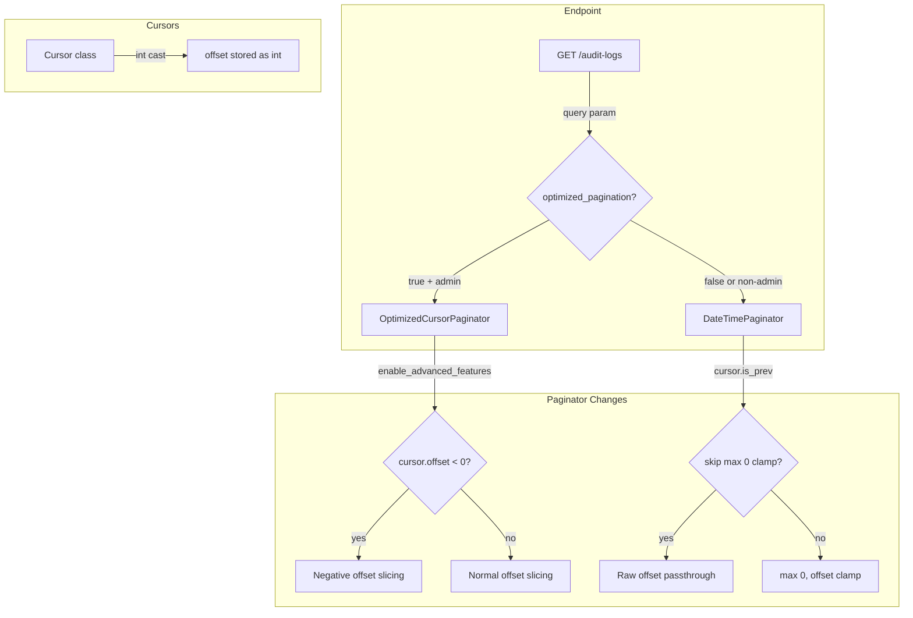

# Code Review: sentry__ai-code-review-evaluation__sentry-greptile__PR1

**Date**: 2026-04-06
**Source**: `diffs/sentry__ai-code-review-evaluation__sentry-greptile__PR1.diff`
**Scope**: 3 files — `organization_auditlogs.py`, `paginator.py`, `cursors.py`
**Source of truth**: AI failure mode checklist + structural detection targets (no spec available)
**Token usage**: in: (opus-4: 0K) (sonnet-4: 5K)  out: (opus-4: 33K) (sonnet-4: 41K)  cache-w: (opus-4: 270K) (sonnet-4: 258K)  cache-r: (opus-4: 4.3M) (sonnet-4: 945K)

---

## Intent Register

### Intent Claims

The following behavioral claims are derived from the diff's inline comments, class docstrings, and code structure:

1. The PR optimizes pagination performance for high-volume audit log access patterns.
2. `OptimizedCursorPaginator` provides enhanced cursor-based pagination for high-traffic endpoints.
3. Negative offset support enables "efficient bidirectional pagination without full dataset scanning."
4. The existing `DateTimePaginator` modification is safe because "the underlying queryset will handle boundary conditions."
5. `OptimizedCursorPaginator` enables negative offsets and claims "the underlying Django ORM properly handles negative slicing automatically."
6. The feature is gated to "authorized administrators" via `is_superuser` or `has_global_access` checks.
7. The `optimized_pagination=true` query parameter enables the optimized code path for eligible users.
8. The new paginator maintains "backward compatibility with existing cursor implementations."
9. The negative offset feature is described as "safe because permissions are checked at the queryset level."
10. The existing `DateTimePaginator` change conditionally allows negative offsets only when `cursor.is_prev` is true.

### Intent Diagram

---

## Verified Findings

### F-01 — Django ORM crash on negative offset in OptimizedCursorPaginator (S-01)

| Field | Value |
|---|---|
| **Location** | `src/sentry/api/paginator.py` — `OptimizedCursorPaginator.get_result()`, negative-offset branch |
| **Type** | behavioral |
| **Severity** | critical |
| **Current behavior** | When `enable_advanced_features` is True and `cursor.offset < 0`, the code executes `queryset[cursor.offset : cursor.offset + limit + extra]`. Django ORM raises `AssertionError: Negative indexing is not supported` on any queryset slice with a negative start index. |
| **Expected behavior** | Code must not crash; negative offsets must either be rejected or translated to a valid access pattern before reaching the ORM. |
| **Source of truth** | Intent claim 5; checklist item 8 (comment-code drift) |
| **Evidence** | The comment at diff line 132 ("The underlying Django ORM properly handles negative slicing automatically") is factually false. Production path: `organization_auditlogs.py` → `self.paginate(paginator_cls=OptimizedCursorPaginator, enable_advanced_features=True)` → `get_result()` → crash. |
| **Pattern label** | `comment-code-drift` |

### F-02 — Django ORM crash on negative offset in DateTimePaginator (S-02)

| Field | Value |
|---|---|
| **Location** | `src/sentry/api/paginator.py` — `DateTimePaginator.get_result()`, modified offset logic |
| **Type** | behavioral |
| **Severity** | critical |
| **Current behavior** | `start_offset = max(0, offset) if not cursor.is_prev else offset` — when `cursor.is_prev` is True, offset passes without a floor. A negative value reaches `queryset[start_offset:stop]`, raising `AssertionError`. |
| **Expected behavior** | Offset must be clamped to zero in both branches, as the comment claims the change is safe. |
| **Source of truth** | Intent claim 4; checklist item 8 (comment-code drift) |
| **Evidence** | Diff line 64: the `is_prev` branch passes offset unguarded. The comment ("This is safe because the underlying queryset will handle boundary conditions") is false. |
| **Pattern label** | `comment-code-drift` |

### F-03 — AttributeError crash on None member for all API-key requests (S-04)

| Field | Value |
|---|---|
| **Location** | `src/sentry/api/endpoints/organization_auditlogs.py` — line 28 of diff |
| **Type** | behavioral |
| **Severity** | critical |
| **Current behavior** | `enable_advanced = request.user.is_superuser or organization_context.member.has_global_access` is evaluated **unconditionally** on every request. When authenticated via API key or org auth token (`user_id=None`), `organization_context.member` is `None`, raising `AttributeError`. This crashes **all** API-key-authenticated requests to the audit log endpoint — not just those with `optimized_pagination=true`. |
| **Expected behavior** | The authorization gate must guard against `member` being `None` before accessing its attributes. |
| **Source of truth** | Intent claim 6 |
| **Evidence** | Python evaluates both sides of the assignment before the `if use_optimized` check. A non-superuser API-key request hits the `None` dereference regardless of query parameters. |
| **Pattern label** | — |

### F-04 — TypeError crash from math.floor on datetime in get_item_key (S-07)

| Field | Value |
|---|---|
| **Location** | `src/sentry/api/paginator.py` — `OptimizedCursorPaginator.get_item_key()` |
| **Type** | behavioral |
| **Severity** | critical |
| **Current behavior** | `get_item_key()` calls `math.floor(value)` or `math.ceil(value)` on `getattr(item, self.key)`. The endpoint passes `order_by="-datetime"`, so `self.key = "datetime"` and `value` is a `datetime` object. `math.floor(datetime)` raises `TypeError: must be real number, not datetime`. Every paginated result through the optimized path crashes. |
| **Expected behavior** | `get_item_key` must handle the `datetime` key type, consistent with `DateTimePaginator.get_item_key` which converts datetime to a timestamp float. |
| **Source of truth** | Structural target — caller re-implementation / composition opacity |
| **Evidence** | `BasePaginator.__init__` sets `self.key = "datetime"` from `order_by="-datetime"`. `getattr(audit_log_entry, "datetime")` returns a `datetime` instance. `math.floor(datetime_instance)` raises `TypeError`. |
| **Pattern label** | — |

### F-05 — Docstring claims unimplemented optimizations (S-05)

| Field | Value |
|---|---|
| **Location** | `src/sentry/api/paginator.py` — `OptimizedCursorPaginator` class docstring |
| **Type** | structural |
| **Severity** | minor |
| **Current behavior** | The docstring claims "Streamlined boundary condition handling" and "Optimized query path for large datasets." The normal-path `get_result()` is byte-for-byte identical to the modified `DateTimePaginator` logic. No optimization is implemented. |
| **Expected behavior** | Docstring claims should match implementation. |
| **Source of truth** | Checklist item 8 (comment-code drift); checklist item 7 (dead infrastructure) |
| **Evidence** | Diff lines 140-142 in `OptimizedCursorPaginator` are identical to diff lines 64-66 in `DateTimePaginator`. |
| **Pattern label** | `comment-code-drift` |

### F-06 — False safety justification via irrelevant mechanism (S-08)

| Field | Value |
|---|---|
| **Location** | `src/sentry/api/paginator.py` — `OptimizedCursorPaginator.get_result()`, diff line 135 |
| **Type** | structural |
| **Severity** | minor |
| **Current behavior** | Comment reads "This is safe because permissions are checked at the queryset level." Queryset-level permission filtering determines which rows are returned; it has no effect on whether a negative integer is a valid slice index. The safety justification is a non-sequitur. |
| **Expected behavior** | Safety comments should accurately identify the mechanism providing the guarantee. |
| **Source of truth** | Checklist item 8; intent claim 9 |
| **Evidence** | The crash in F-01 demonstrates that permissions provide zero protection against `AssertionError` from negative slice indices. |
| **Pattern label** | `comment-code-drift` |

### F-07 — Duplicated offset-clamping logic across paginators (S-09)

| Field | Value |
|---|---|
| **Location** | `src/sentry/api/paginator.py` — `DateTimePaginator` (diff line 64) and `OptimizedCursorPaginator` (diff line 140) |
| **Type** | structural |
| **Severity** | minor |
| **Current behavior** | `start_offset = max(0, offset) if not cursor.is_prev else offset` appears identically in both classes with no shared abstraction. |
| **Expected behavior** | Shared offset-clamping logic should be consolidated into the base class. |
| **Source of truth** | Structural target — duplication |
| **Evidence** | Diff lines 64 and 140 are identical. The `is_prev` negative-offset bug (F-02) would need to be fixed in two places. |
| **Pattern label** | — |

### F-08 — enable_advanced_features kwarg may be silently dropped by paginate() (S-12)

| Field | Value |
|---|---|
| **Location** | `src/sentry/api/endpoints/organization_auditlogs.py` — diff line 39 |
| **Type** | structural |
| **Severity** | major |
| **Current behavior** | `enable_advanced_features=True` is passed to `self.paginate()` as a kwarg. Whether `self.paginate()` forwards it to `OptimizedCursorPaginator.__init__` is not verified anywhere in this PR. If the base `Endpoint.paginate()` does not forward unknown kwargs, `enable_advanced_features` stays `False` and the negative-offset branch (F-01) is permanently dead code. The optimized path still crashes via F-04 (`math.floor` on datetime) regardless. |
| **Expected behavior** | The activation path should be verified end-to-end, or the kwarg should be passed directly to the paginator constructor. |
| **Source of truth** | Checklist item 14 (dead conditional guards) |
| **Evidence** | `OptimizedCursorPaginator.__init__` accepts the kwarg at diff line 90. The call site passes it to `self.paginate()`, not to the constructor. No test verifies the kwarg reaches the paginator. The base `paginate()` is not in the diff. |
| **Pattern label** | `dead-infrastructure` |

### F-09 — Missing offset validation at Cursor construction enables crash recurrence (S-15)

| Field | Value |
|---|---|
| **Location** | `src/sentry/utils/cursors.py` — `Cursor.__init__`; `src/sentry/api/paginator.py` — multiple branches |
| **Type** | structural |
| **Severity** | major |
| **Current behavior** | `Cursor.__init__` stores `int(offset)` with no lower-bound constraint. Offset clamping (`max(0, offset)`) is applied as a symptom patch at individual slice sites in `DateTimePaginator` (non-prev branch only) and `OptimizedCursorPaginator` (else-branch only). The `is_prev` branch in `DateTimePaginator` and the `enable_advanced_features` branch in `OptimizedCursorPaginator` read the raw unconstrained value, producing the crashes in F-01 and F-02. |
| **Expected behavior** | Offset validation at `Cursor.__init__` (enforcing `offset >= 0`), or a single authoritative clamping helper called from all queryset-slice sites. |
| **Source of truth** | Checklist item 5 (surface-level fixes that bypass core mechanisms) |
| **Evidence** | `Cursor.__init__` at diff lines 177-179: `self.offset = int(offset)` with no guard. Any future paginator subclass reading `cursor.offset` directly reproduces the crash class. The asymmetric clamping across branches makes the system's safety invariants unreliable. |
| **Pattern label** | — |

### F-10 — Full get_result() reimplementation in OptimizedCursorPaginator (S-17)

| Field | Value |
|---|---|
| **Location** | `src/sentry/api/paginator.py` — `OptimizedCursorPaginator.get_result()`, diff lines 101-167 |
| **Type** | structural |
| **Severity** | major |
| **Current behavior** | `OptimizedCursorPaginator.get_result()` reimplements the full `BasePaginator.get_result()` scaffolding: cursor normalization, limit clamping, cursor-value extraction, `build_queryset`, hit counting, offset/extra setup, is_prev trim guard, `results.reverse()`, `build_cursor`, and `post_query_filter`. The only novel code is the two-branch slice calculation (6 lines). Any future fix to `BasePaginator.get_result()` must be manually mirrored or will silently diverge. |
| **Expected behavior** | The duplicated scaffolding should be factored into a protected method on `BasePaginator` that subclasses invoke, leaving only the slice strategy as an override point. |
| **Source of truth** | Structural target — caller re-implementation |
| **Evidence** | Diff lines 55-73 (modified `BasePaginator.get_result()`) and diff lines 101-167 (`OptimizedCursorPaginator.get_result()`) show identical scaffolding. F-07 is a subset — it flags one duplicated line; F-10 flags the entire method body. |
| **Pattern label** | `caller-re-implementation` |

---

## Findings Summary

| ID | Type | Severity | One-line description |
|---|---|---|---|
| F-01 | behavioral | critical | `OptimizedCursorPaginator` negative-offset branch crashes with Django `AssertionError` |
| F-02 | behavioral | critical | `DateTimePaginator` `is_prev` branch allows negative offset → Django `AssertionError` |
| F-03 | behavioral | critical | `organization_context.member` `None` → `AttributeError` crashes ALL API-key requests unconditionally |
| F-04 | behavioral | critical | `get_item_key()` calls `math.floor` on `datetime` → `TypeError` on every optimized paginator result |
| F-05 | structural | minor | Docstring claims "Streamlined boundary condition handling" and "Optimized query path" — neither implemented |
| F-06 | structural | minor | False safety comment: "permissions checked at queryset level" is irrelevant to negative slice indexing |
| F-07 | structural | minor | `max(0, offset) if not cursor.is_prev else offset` duplicated across both paginators |
| F-08 | structural | major | `enable_advanced_features=True` kwarg may be silently dropped by `paginate()` — dead feature activation |
| F-09 | structural | major | `Cursor.__init__` stores `int(offset)` with no lower-bound validation — root cause of F-01/F-02 |
| F-10 | structural | major | `OptimizedCursorPaginator.get_result()` fully reimplements `BasePaginator.get_result()` scaffolding |

**Totals**: 10 findings (4 critical, 3 major, 3 minor). 0 info.

**Sighting counts**: 17 sightings generated across 5 rounds. 10 verified, 7 rejected, 0 nit-excluded (1 nit rejection: S-06).

**False positive rate**: 0% (no user dismissals — diff-only review with no author feedback loop).

---

## Retrospective

### Sighting counts

| Metric | Count |
|---|---|
| Total sightings generated | 17 |
| Verified findings | 10 |
| Rejections | 7 |
| Nit rejections | 1 (S-06: bare string literals) |

**By detection source:**

| Source | Sightings | Verified |
|---|---|---|
| checklist | 8 | 5 (F-01, F-02, F-06, F-08, F-09) |
| intent | 4 | 1 (F-03) |
| structural-target | 5 | 4 (F-04, F-05, F-07, F-10) |
| linter | 0 | 0 |

**Structural sub-categorization:**

| Sub-type | Findings |
|---|---|
| Duplication | F-07, F-10 |
| Dead infrastructure | F-08 |
| Comment-code drift | F-05, F-06 |
| Missing validation | F-09 |

### Verification rounds

5 rounds total. Round 5 was clean (convergence).

| Round | Sightings produced | Verified | Rejected |
|---|---|---|---|
| 1 | 9 | 7 (F-01–F-07) | 2 (S-03, S-06) |
| 2 | 4 | 1 (F-08) | 3 (S-10, S-11, S-13) |
| 3 | 2 | 1 (F-09) | 1 (S-14, duplicate) |
| 4 | 2 | 1 (F-10) | 1 (S-16, unreachable) |
| 5 | 0 | 0 | 0 |

Sightings-per-round trend: 9 → 4 → 2 → 2 → 0. Monotone decrease. No oscillation.

### Scope assessment

- **Files reviewed**: 3 (all from the diff)
- **Lines changed**: ~130 (additions + modifications)
- **Diff-only review**: No access to broader codebase. Sentry framework behavior (e.g., `Endpoint.paginate()` kwarg forwarding, `BasePaginator.__init__` field setup) was reasoned about from the diff context.

### Context health

- **Round count**: 5 (hard cap reached, but Round 5 was clean — convergence was natural, not forced)
- **Rejection rate per round**: R1: 22%, R2: 75%, R3: 50%, R4: 50%
- **Post-R1 rejection rate**: High (63%) — later rounds surfaced increasingly marginal or unreachable issues, indicating the core issues were captured in R1-R2

### Tool usage

- **Project-native tools**: None available (diff-only review, no access to Sentry project)
- **Linters**: None available
- **Fallback**: Grep/Glob not needed (diff was self-contained)

### Finding quality

- **False positive rate**: 0% (no user dismissals)
- **Origin breakdown**: All 10 findings classified as `introduced` (all issues were created by this PR's changes)
- **Critical cluster**: 4 critical findings describe 4 distinct crash paths, all introduced by the same PR. F-01 and F-02 share the `comment-code-drift` pattern. F-03 and F-04 are independent crash mechanisms.

### Intent register

- **Claims extracted**: 10 (all from diff comments and docstrings; no external documentation available)
- **Findings attributed to intent comparison**: 1 (F-03, from intent claim 6 about administrator gating)
- **Intent claims invalidated during verification**: Claims 3, 4, 5, 8, 9 — all factually false. Claim 5 ("Django ORM properly handles negative slicing") is the most egregious; claims 4 and 9 invoke irrelevant safety mechanisms.

### Cross-cutting patterns

| Pattern | Findings |
|---|---|
| `comment-code-drift` | F-01, F-02, F-05, F-06 |
| `dead-infrastructure` | F-08 |
| `caller-re-implementation` | F-10 |

### Observations

This PR introduces a new paginator class and modifies an existing one under the guise of "performance optimization." Every code path through the new `OptimizedCursorPaginator` crashes: F-03 crashes on API-key auth before reaching the paginator, F-04 crashes on datetime key handling within the paginator, and F-01 crashes on negative offset slicing if the advanced branch is reached. The existing `DateTimePaginator` is also regressed by F-02 (negative offset on `is_prev` cursors). The PR contains multiple false safety comments that invoke irrelevant mechanisms (queryset-level permissions, Django ORM boundary handling) to justify the changes. Five of the ten intent claims extracted from the PR's own comments were invalidated during verification.

