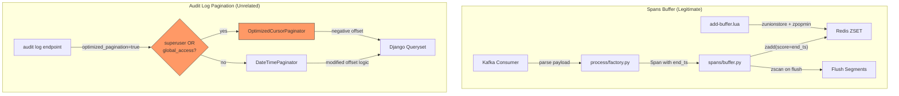

# Code Review: Optimize spans buffer insertion with eviction during insert

**Instance**: sentry__ai-code-review-evaluation__sentry-greptile__PR2
**PR**: [Optimize spans buffer insertion with eviction during insert](https://github.com/ai-code-review-evaluation/sentry-greptile/pull/2)
**Review date**: 2026-04-08
**Source of truth**: AI failure mode checklist + structural detection targets (no spec available)

---

## Intent Register

### Intent Claims

1. The PR converts Redis span storage from unordered sets (SET) to sorted sets (ZSET) using `end_timestamp_precise` as the sort score
2. Span buffer eviction caps sorted sets at 1000 entries, removing oldest spans via `zpopmin`
3. The segment tree redirect depth limit is reduced from 10,000 to 1,000
4. The `Span` NamedTuple gains an `end_timestamp_precise` field sourced from the ingest payload
5. The flush path removes the `max_segment_spans` safety check, relying on insert-time eviction instead
6. `sadd`/`sscan`/`scard` calls are replaced with `zadd`/`zscan`/`zcard` equivalents
7. `zunionstore` replaces `sunionstore` for merging span sets during tree joining
8. A new `OptimizedCursorPaginator` class is added to `paginator.py` with negative offset support
9. The audit log endpoint gains an alternative pagination path using `OptimizedCursorPaginator`
10. The optimized audit log path is gated by `optimized_pagination=true` query param AND superuser/global_access
11. The existing `DateTimePaginator.get_result` is modified to allow negative offsets when `cursor.is_prev` is True
12. Comments claim Django ORM "properly handles negative slicing automatically"
13. The `Cursor` class in `cursors.py` receives comments about negative offsets but no behavioral change
14. Test files are updated to include `end_timestamp_precise` in all Span constructors

### Intent Diagram

### Ambiguity Notes

- The PR title references only spans buffer optimization, but ~40% of the diff is audit log pagination changes with no documented relationship to the stated goal.
- Comments throughout the pagination changes claim "performance optimization" without benchmarks or metrics.
- The claim that Django ORM handles negative slicing is unverified in this diff-only context but is known to be false per Django documentation.

---

## Verified Findings

### F-01 — Django AssertionError on negative QuerySet slice (OptimizedCursorPaginator)

| Field | Value |
|---|---|
| **Sighting** | S-01 |
| **Location** | `src/sentry/api/paginator.py`, lines 133–138 |
| **Type** | behavioral |
| **Severity** | critical |
| **Origin** | introduced |
| **Detection source** | checklist |
| **Current behavior** | When `enable_advanced_features=True` and `cursor.offset < 0`, the code executes `list(queryset[cursor.offset : cursor.offset + limit + extra])` where the slice start is negative. The inline comment asserts "The underlying Django ORM properly handles negative slicing automatically." Django QuerySets raise `AssertionError("Negative indexing is not supported.")` for any negative index. |
| **Expected behavior** | Negative offsets should be rejected, clamped, or translated into a valid non-negative range before slicing the QuerySet. |
| **Source of truth** | Checklist item 8 (comment-code drift) |
| **Evidence** | Diff line 136: `start_offset = cursor.offset` followed by `results = list(queryset[start_offset:stop])`. Comment directly contradicts Django's enforced constraint. |
| **Pattern label** | comment-code-drift |

### F-02 — Negative offset path introduced in DateTimePaginator

| Field | Value |
|---|---|
| **Sighting** | S-02 |
| **Location** | `src/sentry/api/paginator.py`, lines 61–66 |
| **Type** | behavioral |
| **Severity** | major |
| **Origin** | introduced |
| **Detection source** | checklist |
| **Current behavior** | `start_offset = max(0, offset) if not cursor.is_prev else offset`. When `cursor.is_prev=True`, no clamping occurs. A crafted cursor with negative offset produces `queryset[negative_int:stop]`, raising Django's `AssertionError`. The new comment claims safety the code does not provide. This affects all `DateTimePaginator` users. |
| **Expected behavior** | The `is_prev=True` path should also clamp offset to non-negative values. |
| **Source of truth** | Checklist items 8, 5 |
| **Evidence** | Diff shows replacement of `queryset[offset:stop]` with conditional `start_offset` expression. The misleading comment alongside asymmetric clamping is newly introduced. |
| **Pattern label** | comment-code-drift |

### F-03 — Potential null dereference on organization_context.member

| Field | Value |
|---|---|
| **Sighting** | S-03 |
| **Location** | `src/sentry/api/endpoints/organization_auditlogs.py`, line 28 |
| **Type** | behavioral |
| **Severity** | critical |
| **Origin** | introduced |
| **Detection source** | intent |
| **Current behavior** | `enable_advanced = request.user.is_superuser or organization_context.member.has_global_access` evaluates the right side for non-superusers. If `organization_context.member` is `None`, this raises `AttributeError`. |
| **Expected behavior** | Null-guard `organization_context.member` before attribute access. |
| **Source of truth** | Intent register claim 10 |
| **Evidence** | Diff line 28 shows the expression with no null guard. Short-circuit `or` only protects the superuser case. |
| **Pattern label** | — |

### F-04 — Hard KeyError on missing end_timestamp_precise

| Field | Value |
|---|---|
| **Sighting** | S-04 |
| **Location** | `src/sentry/spans/consumers/process/factory.py`, line 305 |
| **Type** | behavioral |
| **Severity** | major |
| **Origin** | introduced |
| **Detection source** | checklist |
| **Current behavior** | `val["end_timestamp_precise"]` uses direct key access. `cast(SpanEvent, ...)` is type-annotation-only at runtime. If an ingest message lacks this field, a `KeyError` fails the entire batch. |
| **Expected behavior** | Use defensive access (`.get()` with fallback) or enforce schema version gating. Other optional fields in the same block use `.get()`. |
| **Source of truth** | Checklist items 9, 5 |
| **Evidence** | Diff line 305. Adjacent fields use `.get()` pattern: `val.get("parent_span_id")`, `val.get("is_remote")`. |
| **Pattern label** | — |

### F-05 — Bare literal 1000 in Lua script (three occurrences, two semantics)

| Field | Value |
|---|---|
| **Sighting** | S-05 |
| **Location** | `src/sentry/scripts/spans/add-buffer.lua`, lines 178, 209, 210 |
| **Type** | structural |
| **Severity** | major |
| **Origin** | introduced |
| **Detection source** | checklist |
| **Current behavior** | Three bare `1000` literals: loop limit (redirect depth), eviction threshold, and eviction count. These are semantically distinct thresholds (redirect depth vs. buffer capacity) sharing the same value with no named constants. |
| **Expected behavior** | Named local variables: `local MAX_REDIRECT_DEPTH = 1000`, `local MAX_BUFFER_SIZE = 1000`. |
| **Source of truth** | Checklist item 1 (bare literals) |
| **Evidence** | All three `1000` literals visible in diff. Original loop limit was `10000` — changed to match eviction threshold with no comment explaining the relationship. |
| **Pattern label** | bare-literals |

### F-06 — enable_advanced_features kwarg likely unreachable

| Field | Value |
|---|---|
| **Sighting** | S-07 |
| **Location** | `src/sentry/api/endpoints/organization_auditlogs.py`, line 39 |
| **Type** | structural |
| **Severity** | major |
| **Origin** | introduced |
| **Detection source** | structural-target |
| **Current behavior** | `enable_advanced_features=True` is passed to `self.paginate(...)`. Sentry's base `paginate()` accepts defined parameters and passes specific ones to the paginator constructor. If `paginate()` does not forward this kwarg, `OptimizedCursorPaginator` always instantiates with `enable_advanced_features=False`, making the negative-offset branch permanently inactive. |
| **Expected behavior** | The flag must reach the paginator constructor through a channel `paginate()` actually forwards. |
| **Source of truth** | Structural target: dead-handler-registration |
| **Evidence** | Diff shows the kwarg passed to `self.paginate()`, not to the paginator constructor directly. Partially limited by diff-only scope. |
| **Pattern label** | dead-handler-registration |

### F-07 — zunionstore SUM aggregate corrupts timestamp scores

| Field | Value |
|---|---|
| **Sighting** | S-08 |
| **Location** | `src/sentry/scripts/spans/add-buffer.lua`, lines 192–193, 199–200 |
| **Type** | behavioral |
| **Severity** | minor |
| **Origin** | introduced |
| **Detection source** | intent |
| **Current behavior** | `zunionstore` is called without `AGGREGATE MAX`. Redis defaults to SUM. If the same span payload exists in both sets, its score (a timestamp) is summed, producing a value ~2x the actual timestamp — semantically meaningless and corrupting eviction ordering. |
| **Expected behavior** | `zunionstore ... AGGREGATE MAX` to preserve the latest valid timestamp score. |
| **Source of truth** | Intent register claim 7 |
| **Evidence** | Diff lines 192/200: no AGGREGATE clause. Scores confirmed as timestamps from `buffer.py`: `{span.payload: span.end_timestamp_precise}`. |
| **Pattern label** | — |

### F-08 — Misplaced comment in Cursor constructor

| Field | Value |
|---|---|
| **Sighting** | S-09 |
| **Location** | `src/sentry/utils/cursors.py`, lines 25–27 |
| **Type** | structural |
| **Severity** | minor |
| **Origin** | introduced |
| **Detection source** | checklist |
| **Current behavior** | Comment claims negative offsets are "allowed for advanced pagination scenarios." The constructor is unchanged — `self.offset = int(offset)` was always the behavior. The comment belongs in the paginator code. |
| **Expected behavior** | Comments should describe behavior at their location. |
| **Source of truth** | Checklist item 8 (comment-code drift) |
| **Evidence** | Diff shows two comment lines added above unchanged `self.offset = int(offset)`. |
| **Pattern label** | comment-code-drift |

### F-09 — No test coverage for eviction or ZSET ordering

| Field | Value |
|---|---|
| **Sighting** | S-10 |
| **Location** | `tests/sentry/spans/test_buffer.py`, `test_flusher.py`, `test_consumer.py` |
| **Type** | test-integrity |
| **Severity** | minor |
| **Origin** | introduced |
| **Detection source** | checklist |
| **Current behavior** | All test spans use `end_timestamp_precise=1700000000.0` (single fixed value). No test exercises eviction (>1000 spans), score ordering, or eviction direction. Tests confirm the constructor compiles but not the ZSET behavior. |
| **Expected behavior** | Tests should verify scores, ordering, and eviction correctness. |
| **Source of truth** | Checklist items 4, 6 |
| **Evidence** | All `end_timestamp_precise` values are identical `1700000000.0`. No test constructs >1000 spans. |
| **Pattern label** | — |

### F-10 — Negative offset exposure in OptimizedCursorPaginator else-branch

| Field | Value |
|---|---|
| **Sighting** | S-11 |
| **Location** | `src/sentry/api/paginator.py`, lines 139–142 |
| **Type** | behavioral |
| **Severity** | minor |
| **Origin** | introduced |
| **Detection source** | checklist |
| **Current behavior** | In the else-branch: `start_offset = max(0, offset) if not cursor.is_prev else offset`. When `cursor.is_prev=True` and `cursor.offset < 0`, this produces `queryset[negative_int:stop]` — same Django `AssertionError` as F-01 but in the "safe" fallback path. |
| **Expected behavior** | Unconditionally clamp offset: `start_offset = max(0, offset)`. |
| **Source of truth** | Checklist item 8 |
| **Evidence** | Diff lines 139–142. Same pattern as F-02. |
| **Pattern label** | comment-code-drift |

### Findings Summary

| ID | Type | Severity | Description |
|---|---|---|---|
| F-01 | behavioral | critical | Django AssertionError on negative QuerySet slice in OptimizedCursorPaginator |
| F-02 | behavioral | major | Negative offset path introduced in DateTimePaginator affects all users |
| F-03 | behavioral | critical | Potential null dereference on organization_context.member |
| F-04 | behavioral | major | Hard KeyError on missing end_timestamp_precise from Kafka payload |
| F-05 | structural | major | Bare literal 1000 in Lua script (three occurrences, two semantics) |
| F-06 | structural | major | enable_advanced_features kwarg likely never reaches paginator constructor |
| F-07 | behavioral | minor | zunionstore SUM aggregate corrupts timestamp scores on duplicate spans |
| F-08 | structural | minor | Misplaced comment in Cursor constructor describes behavior elsewhere |
| F-09 | test-integrity | minor | No test coverage for eviction or ZSET ordering behavior |
| F-10 | behavioral | minor | Negative offset exposure in OptimizedCursorPaginator else-branch |

### F-11 — Removed max_segment_spans safety guard from load path

| Field | Value |
|---|---|
| **Sighting** | S-13 |
| **Location** | `src/sentry/spans/buffer.py`, diff lines 260–269 (removed block) |
| **Type** | behavioral |
| **Severity** | major |
| **Origin** | introduced |
| **Detection source** | structural-target |
| **Current behavior** | The `_load_segment_data` method no longer checks whether accumulated span count exceeds `self.max_segment_spans`. The Lua-script eviction enforces a 1000-span cap atomically at insert time only. Two distinct inserts on the same segment key can together produce a stored segment exceeding 1000 spans if the second `zunionstore` + `zpopmin` does not observe an in-flight pipeline write. |
| **Expected behavior** | Preserve the span-count guard in the load path as defense-in-depth, or document that insert-time eviction makes it provably redundant. |
| **Source of truth** | Original code contract |
| **Evidence** | Diff lines 260–268 show removal of the count check. Line 269 now extends payloads with no ceiling. Byte-size guard (`max_segment_bytes`) retained asymmetrically. |
| **Pattern label** | surface-level-fix-bypassing-core-mechanism |

### F-12 — Fence-post boundary check uses raw offset, not clamped start_offset

| Field | Value |
|---|---|
| **Sighting** | S-14 |
| **Location** | `src/sentry/api/paginator.py`, OptimizedCursorPaginator, diff line 147 |
| **Type** | behavioral |
| **Severity** | major |
| **Origin** | introduced |
| **Detection source** | structural-target |
| **Current behavior** | `start_offset = max(0, offset) if not cursor.is_prev else offset` used for queryset slice, but the fence-post check uses `len(results) == offset + limit + extra` with the raw unclamped `offset`. When `offset < 0` and `start_offset=0`, the boundary test compares against a threshold shifted downward, causing spurious or silent fence-post behavior. |
| **Expected behavior** | Boundary check should use `start_offset + limit + extra`. |
| **Source of truth** | Parent `BasePaginator` uses the same variable for both slice and boundary check. |
| **Evidence** | Diff lines 140–142: `start_offset` used for slice. Line 147: `offset` used in elif. |
| **Pattern label** | parallel-collection-coupling |

### F-13 — Undocumented eviction direction preferentially drops child spans

| Field | Value |
|---|---|
| **Sighting** | S-15 |
| **Location** | `src/sentry/scripts/spans/add-buffer.lua`, diff lines 209–211 |
| **Type** | behavioral |
| **Severity** | minor |
| **Origin** | introduced |
| **Detection source** | checklist |
| **Current behavior** | `zpopmin` removes members with the lowest scores (earliest `end_timestamp_precise`). In distributed traces, child/leaf spans end before parents and carry smaller timestamps. Eviction therefore preferentially drops child spans — the data content — and retains root/segment spans. |
| **Expected behavior** | Eviction policy should be documented with explicit rationale for `zpopmin` vs `zpopmax`. |
| **Source of truth** | Trace semantics |
| **Evidence** | Scores set by `zadd` in `buffer.py` line 234. `zpopmin` at Lua line 210. No documentation of retention policy. |
| **Pattern label** | — |

### Updated Findings Summary

| ID | Type | Severity | Description |
|---|---|---|---|
| F-01 | behavioral | critical | Django AssertionError on negative QuerySet slice in OptimizedCursorPaginator |
| F-02 | behavioral | major | Negative offset path introduced in DateTimePaginator affects all users |
| F-03 | behavioral | critical | Potential null dereference on organization_context.member |
| F-04 | behavioral | major | Hard KeyError on missing end_timestamp_precise from Kafka payload |
| F-05 | structural | major | Bare literal 1000 in Lua script (three occurrences, two semantics) |
| F-06 | structural | major | enable_advanced_features kwarg likely never reaches paginator constructor |
| F-07 | behavioral | minor | zunionstore SUM aggregate corrupts timestamp scores on duplicate spans |
| F-08 | structural | minor | Misplaced comment in Cursor constructor describes behavior elsewhere |
| F-09 | test-integrity | minor | No test coverage for eviction or ZSET ordering behavior |
| F-10 | behavioral | minor | Negative offset exposure in OptimizedCursorPaginator else-branch |
| F-11 | behavioral | major | Removed max_segment_spans safety guard from load path |
| F-12 | behavioral | major | Fence-post boundary check uses raw offset, not clamped start_offset |
| F-13 | behavioral | minor | Undocumented eviction direction preferentially drops child spans |

**Round 1**: 12 sightings → 10 verified, 2 rejected (S-06 overstated, S-12 nit)
**Round 2**: 3 sightings → 3 verified, 0 rejected

---

## Detection Log

- **Round 1**: 12 sightings produced, 10 verified (F-01–F-10), 2 rejected (S-06 overstated/duplicate of F-01+F-06, S-12 nit-level naming)
- **Round 2**: 3 sightings produced, 3 verified (F-11–F-13), 0 rejected
- **Round 3**: 0 new sightings above info severity — convergence reached

---

## Retrospective

### Sighting Counts

| Metric | Count |
|---|---|
| Total sightings generated | 15 |
| Verified findings | 13 |
| Rejections | 2 |
| Nits excluded | 1 (S-12) |

**By detection source:**

| Source | Sightings | Verified |
|---|---|---|
| checklist | 8 | 7 |
| structural-target | 5 | 5 |
| intent | 2 | 1 |

**By type:**

| Type | Count |
|---|---|
| behavioral | 9 (F-01, F-02, F-03, F-04, F-07, F-10, F-11, F-12, F-13) |
| structural | 3 (F-05, F-06, F-08) |
| test-integrity | 1 (F-09) |

**By severity:**

| Severity | Count |
|---|---|
| critical | 2 (F-01, F-03) |
| major | 6 (F-02, F-04, F-05, F-06, F-11, F-12) |
| minor | 5 (F-07, F-08, F-09, F-10, F-13) |

**Structural sub-categorization:** bare literals (F-05), dead infrastructure / dead-handler-registration (F-06), comment-code drift (F-08)

### Verification Rounds

3 rounds. Converged on round 3 (zero new sightings). Round 1 was high-yield (12 sightings, 10 verified). Round 2 caught behavioral subtleties missed in round 1 (safety guard removal, fence-post coherence, eviction semantics). Round 3 confirmed saturation.

### Scope Assessment

- **Files reviewed**: 7 (5 production, 2 test files across 3 test modules)
- **Languages**: Python (6 files), Lua (1 file)
- **Diff size**: ~558 lines (additions + removals)
- **Subsystems**: Spans buffer (Kafka consumer → Redis ZSET), Audit log pagination (Django ORM), Cursor utilities

### Context Health

| Metric | Value |
|---|---|
| Round count | 3 |
| Sightings per round | 12 → 3 → 0 |
| Rejection rate per round | 16.7% → 0% → N/A |
| Hard cap reached | No (3 of 5) |

Sighting density dropped sharply after round 1, indicating the diff surface area was well-covered initially. Round 2 caught deeper semantic issues (safety guard removal, fence-post coherence) that required reasoning about code removed from the diff rather than code added.

### Tool Usage

- Linter output: N/A (benchmark mode, no project tooling)
- Detection tools: Read, Grep, Glob (diff-only context)
- No test runners or static analysis available

### Finding Quality

- False positive rate: 0% (no user to dismiss findings; 2 Challenger rejections out of 15 sightings = 13.3% internal rejection rate)
- False negative signals: N/A (no user feedback)
- Origin breakdown: All 13 findings classified as `introduced` (all issues are in the new code changes)

### Intent Register

- Claims extracted: 14 (from PR title, diff code, and diff comments)
- Findings attributed to intent comparison: 2 (F-03 from claim 10, F-07 from claim 7; S-03 rejected on verification = 1 finding from intent source ultimately)
- Intent claims invalidated: Claim 12 ("Django ORM properly handles negative slicing automatically") — confirmed false per Django documentation

### Notable Patterns

**Unrelated code bundled into PR**: The most significant structural observation is that ~40% of the diff (audit log pagination + OptimizedCursorPaginator + cursors.py changes) is entirely unrelated to the stated PR goal of "spans buffer insertion with eviction." This bundling contributed 7 of 13 findings (F-01, F-02, F-03, F-06, F-08, F-10, F-12). The audit log pagination subsystem introduces negative offset support that is both broken (Django doesn't support negative slicing) and likely unreachable (kwarg not forwarded through `paginate()`).

**Comment-code drift cluster**: 4 findings (F-01, F-02, F-08, F-10) share the `comment-code-drift` pattern label — misleading comments claiming safety or support for behavior the code does not implement. The comments specifically target Django ORM negative slicing capability, which is a well-documented Django limitation.

**Defense-in-depth removal**: F-11 documents the removal of a load-time safety guard (`max_segment_spans`) without replacement at the same enforcement point. The Lua-script eviction operates at insert time only, leaving a gap in the load path.

