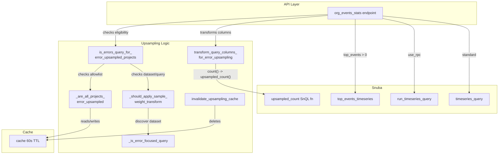

# Code Review Report

**Instance**: sentry__ai-code-review-evaluation__sentry-greptile__PR3
**PR**: feat(upsampling) - Support upsampled error count with performance optimizations
**URL**: https://github.com/ai-code-review-evaluation/sentry-greptile/pull/3
**Date**: 2026-04-08
**Source of truth**: AI failure mode checklist + structural detection targets (no spec available)

---

## Intent Register

### Intent Claims

1. When ALL projects in a query are on the error upsampling allowlist, `count()` aggregations are transformed to `upsampled_count() as count` (which computes `toInt64(sum(sample_weight))`)
2. When any project in the query is NOT on the allowlist, no transformation occurs — regular `count()` is used
3. Upsampling applies only to error events; transactions are never upsampled
4. For the `discover` dataset, upsampling applies only when the query string contains `event.type:error`
5. Allowlist eligibility is cached for 60 seconds per organization+projects key for performance
6. A cache invalidation function (`invalidate_upsampling_cache`) is provided for allowlist changes
7. The `upsampled_count` SnQL function is defined as `toInt64(sum(sample_weight))` with result type "number"
8. Test factory extracts `client_sample_rate` from `contexts.error_sampling` and sets `sample_rate` on normalized event data
9. The upsampling eligibility check runs once early, then column transformation is applied just before each query execution path
10. Empty project ID lists always return false for upsampling eligibility

### Intent Diagram

---

## Verified Findings

### Summary

| ID | Type | Severity | Location | Description |
|----|------|----------|----------|-------------|
| F-01 | fragile | minor | error_upsampling.py:156-158 | Cache `is not None` sentinel fragility for bool values |
| F-02 | behavioral | minor | error_upsampling.py:261-266 | Substring match `event.type:error` matches negated/partial strings |
| F-03 | structural | minor | organization_events_stats.py | Column transform called 3x in mutually exclusive branches |
| F-04 | behavioral | minor | factories.py:307-320 | `if client_sample_rate:` drops zero; bare `except Exception: pass` |
| F-05 | test-integrity | major | test_organization_events_stats.py:525-526 | Test asserts count==10 via indirect sample_weight derivation |
| F-06 | test-integrity | minor | test_error_upsampling.py | No tests for public functions or cache paths |
| F-07 | behavioral | major | discover.py + error_upsampling.py | `upsampled_count` registered only in discover dataset; errors dataset path reachable |
| F-08 | structural | minor | organization_events_stats.py:58-64 | Dead variable `should_upsample` aliased to `upsampling_enabled` with misleading comment |
| F-09 | behavioral | major | error_upsampling.py:237-239 | Errors dataset unconditionally triggers upsampling without query check |
| F-10 | structural | minor | error_upsampling.py:207-221 | Docstring says `sum(sample_weight)` but function emits `upsampled_count()` string |
| F-11 | test-integrity | major | test_organization_events_stats.py:458-466 | setUp overwrites `self.user` after `login_as`; `self.authed_user` saved but never used |
| F-12 | test-integrity | minor | test_organization_events_stats.py:525-526 | Comments say "1 event" but assertions check count==10 |
| F-13 | fragile | major | error_upsampling.py:153,199 | `hash()` on tuple is PYTHONHASHSEED-randomized; breaks cross-worker cache sharing and invalidation |
| F-14 | structural | minor | error_upsampling.py:169 | `_are_all_projects_error_upsampled` accepts `organization` param but never uses it |
| F-15 | test-integrity | major | test_organization_events_stats.py:503-621 | Integration tests mock `options` but don't clear cache; stale cache bypasses mocks |
| F-16 | behavioral | minor | discover.py:284 | `upsampled_count` result type "number" vs `count()` result type "integer" |

### Major Findings

#### F-05 — Indirect sample_weight derivation in test fixture (test-integrity)
- **Sighting**: S-06
- **Location**: tests/snuba/api/endpoints/test_organization_events_stats.py, lines 525-526
- **Current behavior**: Test stores events with `client_sample_rate: 0.1` and asserts `count == 10`, assuming `sample_weight = 1/0.1 = 10`. The fixture sets `sample_rate` via factory helper, but the derivation of `sample_weight` from `sample_rate` inside Snuba is not demonstrated in this diff.
- **Expected behavior**: Test fixtures should directly set or verify `sample_weight` rather than relying on indirect derivation through an unverified pipeline.
- **Source of truth**: Checklist item 12 (semantically incoherent test fixtures)
- **Evidence**: Lines 478-479 set `client_sample_rate: 0.1`. Factory helper copies to `sample_rate`. No code in diff shows `sample_weight` materialization. Assertion at line 525 checks `count == 10` with no intermediate verification.
- **Status**: verified-pending-execution

#### F-07 — `upsampled_count` missing from errors dataset (behavioral)
- **Sighting**: S-08
- **Location**: src/sentry/search/events/datasets/discover.py, lines 1038-1046; src/sentry/api/helpers/error_upsampling.py, lines 237-239
- **Current behavior**: `upsampled_count` SnQL function is registered only in the discover dataset. `_should_apply_sample_weight_transform` returns `True` for `dataset == errors`, triggering column transformation that produces `upsampled_count() as count` — a function not registered in the errors dataset's function converter.
- **Expected behavior**: If the errors dataset is a valid upsampling path, `upsampled_count` must be registered there.
- **Source of truth**: Intent register item 3; Checklist item 3 (components implemented but never connected)
- **Evidence**: Diff adds `upsampled_count` only to discover.py. `_should_apply_sample_weight_transform` at line 238-239: `if dataset == errors: return True`. Caller path from `_get_event_stats` passes `dataset` from request context.

#### F-09 — Errors dataset unconditionally triggers upsampling (behavioral)
- **Sighting**: S-10
- **Location**: src/sentry/api/helpers/error_upsampling.py, lines 237-239
- **Current behavior**: `_should_apply_sample_weight_transform` returns `True` unconditionally for `dataset == errors` without inspecting the query via `_is_error_focused_query(request)`. The discover dataset correctly gates on query content.
- **Expected behavior**: Consistent gating logic across datasets, or documented justification for why the errors dataset is guaranteed to only serve error events.
- **Source of truth**: Intent register item 3
- **Evidence**: Line 238: `if dataset == errors: return True` — no call to `_is_error_focused_query`. Discover path at lines 248-250 calls `_is_error_focused_query(request)` as gate.

#### F-11 — setUp overwrites `self.user` after authentication (test-integrity)
- **Sighting**: S-12
- **Location**: tests/snuba/api/endpoints/test_organization_events_stats.py, lines 458-466
- **Current behavior**: `login_as(user=self.user)` authenticates one user, then `self.user = self.create_user()` overwrites with a different user. `self.authed_user` is saved but never referenced again. Event fixtures use `self.user.email` (new unauthenticated user) for tags.
- **Expected behavior**: Authenticated user and fixture user should be consistent, or the distinction should be intentional and used.
- **Source of truth**: Checklist item 12 (semantically incoherent test fixtures)
- **Evidence**: Line 458 authenticates, line 459 saves as `self.authed_user`, line 465 overwrites. `self.authed_user` absent from all subsequent test code.

#### F-13 — Non-deterministic cache key via `hash()` (fragile)
- **Sighting**: S-14
- **Location**: src/sentry/api/helpers/error_upsampling.py, lines 153 and 199
- **Current behavior**: Cache key uses `hash(tuple(sorted(project_ids)))`. Python's tuple hashing is seeded per-process via PYTHONHASHSEED. Different worker processes compute different hash values for the same project set. Cache writes from one worker cannot be read or invalidated by another. `invalidate_upsampling_cache` will silently fail to locate the entry to delete across process boundaries.
- **Expected behavior**: Use a deterministic representation like sorted comma-joined string of project IDs.
- **Source of truth**: Intent register items 5, 6
- **Evidence**: Line 153 and 199 both use `hash(tuple(sorted(...)))`. Python docs confirm hash randomization for composites since 3.3.

#### F-15 — Cache not cleared between integration tests (test-integrity)
- **Sighting**: S-16
- **Location**: tests/snuba/api/endpoints/test_organization_events_stats.py, lines 503-621
- **Current behavior**: Four integration tests mock `options` with different allowlist values but none clear the cache. On a warm cache from a prior test, `cache.get` returns the stale value and the mock is bypassed entirely. All tests share the same org and project IDs.
- **Expected behavior**: Tests should clear or mock the cache to guarantee isolation.
- **Source of truth**: Checklist item 13 (mock permissiveness masking constraints)
- **Evidence**: `cache.set(cache_key, is_eligible, 60)` in production code. No `cache.clear()`, `cache.delete()`, or `invalidate_upsampling_cache()` call in test code.
- **Status**: verified-pending-execution

### Minor Findings

#### F-01 — Cache sentinel fragility (fragile)
- **Location**: src/sentry/api/helpers/error_upsampling.py, lines 156-158
- **Current behavior**: Cache hit/miss detection uses `is not None` sentinel, relying on invariant that only booleans are stored. Works today but breaks silently if non-bool is stored.
- **Source of truth**: Checklist item 9 (zero-value sentinel ambiguity)

#### F-02 — Substring match for event type detection (behavioral)
- **Location**: src/sentry/api/helpers/error_upsampling.py, lines 261-266
- **Current behavior**: `"event.type:error" in query` matches negated filters (`!event.type:error`) and partial type names (`event.type:error_custom`), incorrectly triggering upsampling.
- **Source of truth**: Checklist item 11 (string-based error classification)

#### F-03 — Redundant transform calls across branches (structural)
- **Location**: src/sentry/api/endpoints/organization_events_stats.py
- **Current behavior**: `transform_query_columns_for_error_upsampling(query_columns)` called identically in 3 mutually exclusive branches. Could be computed once before branching.
- **Source of truth**: Structural target: caller re-implementation

#### F-04 — Zero-value drop and silent error discard in factory (behavioral)
- **Location**: src/sentry/testutils/factories.py, lines 307-320
- **Current behavior**: `if client_sample_rate:` drops zero values. Bare `except Exception: pass` blocks discard all exceptions including setup errors.
- **Source of truth**: Checklist item 9 (zero-value sentinel ambiguity); structural target: silent error discard

#### F-06 — Missing tests for public API surface (test-integrity)
- **Location**: tests/sentry/api/helpers/test_error_upsampling.py
- **Current behavior**: Tests cover only private functions. `is_errors_query_for_error_upsampled_projects` (cache logic) and `invalidate_upsampling_cache` have zero test coverage.
- **Source of truth**: Checklist item 6 (non-enforcing test variants)

#### F-08 — Dead variable with misleading comment (structural)
- **Location**: src/sentry/api/endpoints/organization_events_stats.py, lines 58-64
- **Current behavior**: `should_upsample` immediately aliased to `upsampling_enabled`. Comment claims "separation allows for better query optimization and caching" but no separation exists.
- **Source of truth**: Structural target: dead infrastructure; checklist item 8 (comment-code drift)

#### F-10 — Docstring describes wrong output (structural)
- **Location**: src/sentry/api/helpers/error_upsampling.py, lines 207-221
- **Current behavior**: Docstring says "transform to use sum(sample_weight)" but function emits `"upsampled_count() as count"`. The actual `sum(sample_weight)` lives in discover.py's SnQL function.
- **Source of truth**: Checklist item 8 (comment-code drift)

#### F-12 — Comment contradicts assertion value (test-integrity)
- **Location**: tests/snuba/api/endpoints/test_organization_events_stats.py, lines 525-526
- **Current behavior**: Comments say "First bucket has 1 event" / "Second bucket has 1 event" but assertions check `count == 10` (upsampled value).
- **Source of truth**: Checklist item 4 (name-assertion mismatch)

#### F-14 — Unused `organization` parameter (structural)
- **Location**: src/sentry/api/helpers/error_upsampling.py, line 169
- **Current behavior**: `_are_all_projects_error_upsampled` accepts `organization: Organization` but never references it. Only `project_ids` and the global options allowlist are used.
- **Source of truth**: Structural target: semantic drift

#### F-16 — Result type mismatch between count() and upsampled_count() (behavioral)
- **Location**: src/sentry/search/events/datasets/discover.py, line 284
- **Current behavior**: `upsampled_count` declared with `default_result_type="number"` while `count()` uses `"integer"`. The SnQL aggregate casts to `toInt64` (integer), but the type annotation says "number". Downstream type-aware consumers (serializers, chart renderers) see a different type for what is semantically a drop-in replacement.
- **Expected behavior**: `default_result_type="integer"` to match `count()` and the actual `toInt64` cast.
- **Source of truth**: Intent register item 1 (transparent transformation); checklist item 2 (hardcoded coupling)

---

## Retrospective

### Sighting Counts

- **Total sightings generated**: 20
- **Verified findings at termination**: 16
- **Rejections**: 3 (1 nit, 1 duplicate, 1 refinement of existing finding)
- **Nit count**: 1 (bare string literal `"count()"`)

**Breakdown by detection source**:
| Source | Sightings | Findings |
|--------|-----------|----------|
| checklist | 12 | 11 |
| structural-target | 5 | 4 |
| intent | 3 | 3 |
| spec-ac | 0 | 0 |
| linter | 0 | 0 |

**Structural findings sub-categorization**:
- Caller re-implementation: F-03
- Dead infrastructure: F-08
- Comment-code drift: F-10
- Semantic drift: F-14

**Findings by type**:
| Type | Count | Major | Minor |
|------|-------|-------|-------|
| behavioral | 6 | 2 (F-07, F-09) | 4 (F-02, F-04, F-14, F-16) |
| structural | 4 | 0 | 4 (F-03, F-08, F-10, F-14) |
| test-integrity | 5 | 3 (F-05, F-11, F-15) | 2 (F-06, F-12) |
| fragile | 2 | 1 (F-13) | 1 (F-01) |

**Findings by origin**: All 16 findings are `introduced` (new code in this PR).

### Verification Rounds

- **Round 1**: 8 sightings → 7 verified, 1 rejected (nit). Severity adjustment: S-01 major→minor.
- **Round 2**: 6 sightings → 6 verified, 0 rejected. Severity adjustment: S-08 (upsampled_count in errors dataset) minor→major.
- **Round 3**: 3 sightings → 2 verified, 1 rejected (duplicate of F-11).
- **Round 4**: 3 sightings → 1 new finding (F-16), 1 refinement of F-04 (not promoted), 1 duplicate of F-12. Convergence reached.
- **Total rounds**: 4 (hard cap of 5 not reached)

### Scope Assessment

- **Files reviewed**: 7 (1 config, 3 production, 1 test utility, 2 test files)
- **Lines of diff**: ~622
- **New code**: ~440 lines (error_upsampling.py: 140, tests: ~275, endpoint changes: ~25)

### Context Health

- **Round count**: 4
- **Sightings-per-round trend**: 8 → 6 → 3 → 1 (converging)
- **Rejection rate per round**: 12.5% → 0% → 33% → 67%
- **Hard cap reached**: No

### Tool Usage

- **Linter output**: N/A (benchmark mode, no project tooling)
- **Project-native tools**: N/A
- **Tools used**: Read, Grep, Glob (diff-only review)

### Finding Quality

- **False positive rate**: Cannot be determined (no user feedback in benchmark mode)
- **False negative signals**: None (no user-identified issues to compare against)
- **Verified-pending-execution**: 2 (F-05, F-15) — require test execution to confirm definitively

### Intent Register

- **Claims extracted**: 10 (from PR diff context: docstrings, comments, test assertions, code behavior)
- **Sources**: PR diff (code comments, docstrings, test names/assertions)
- **Findings attributed to intent comparison**: 3 (F-07, F-09, F-16)
- **Intent claims invalidated during verification**: 0

### Key Observations

1. **Cache implementation has two compounding bugs**: F-13 (non-deterministic hash key) and F-15 (no test cache isolation) mean the caching layer is both broken in production across workers and untested. The cache invalidation function (F-06: untested) would also fail due to the hash issue.

2. **Errors dataset path is doubly broken**: F-07 (`upsampled_count` not registered) and F-09 (unconditional True without query check) create a path where queries through the errors dataset would attempt to use an unregistered function.

3. **Comment-code drift is pervasive**: F-08 (misleading optimization comments), F-10 (docstring describes wrong output), F-12 (comment contradicts assertion) — the PR's comments frequently describe intended or aspirational behavior rather than actual behavior. This is consistent with AI-generated code where comments are produced from the prompt/plan rather than from the implementation.

4. **Test infrastructure issues cluster**: 5 of 16 findings are test-integrity, with 3 at major severity. The tests provide less verification than they appear to offer.
