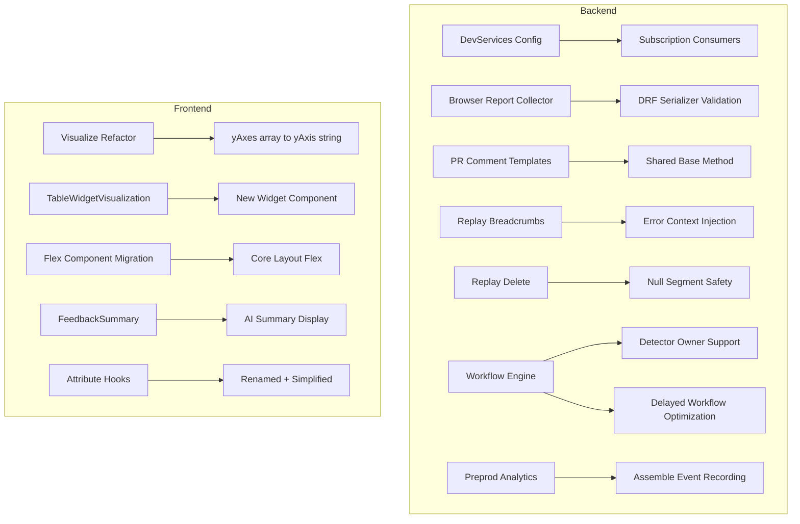

# Code Review Report: Replays Self-Serve Bulk Delete System

**Instance**: sentry__ai-code-review-evaluation__sentry-greptile__PR5
**PR**: Replays Self-Serve Bulk Delete System
**Date**: 2026-04-08
**Review type**: Standalone diff-only review (benchmark mode)

---

## Intent Register

### Intent Claims

This is a large multi-topic PR touching many independent subsystems. Claims are derived from diff structure and code patterns:

1. The devservices config adds a `snuba-metrics` service and a `tracing` profile with subscription result consumers for EAP spans, EAP items, metrics, and generic metrics.
2. The autofix automation tuning default changes from `"low"` to `"off"` across constants and project options.
3. The feedback summary prompt is restructured: separator changes from `"- {msg}"` to `"------"` joined, word limit (55 words, 2 sentences) enforced, anti-generic-statement guidance added.
4. `ParameterizationRegexExperiment` class and its type union are removed; `ParameterizationExperiment` collapses to just `ParameterizationCallableExperiment`.
5. Webhook delivery tasks (`schedule_webhook_delivery`, `drain_mailbox`, `drain_mailbox_parallel`) and auth task gain explicit `processing_deadline_duration` values.
6. GitHub and GitLab PR comment templates are consolidated into a shared base class method `get_merged_pr_single_issue_template` with title truncation and environment info display.
7. The browser reporting collector endpoint is refactored from a dataclass-based approach to a DRF serializer with validation, supporting both W3C Working Draft and Editor's Draft report formats.
8. `DBQueryInjectionVulnerabilityGroupType` gains `noise_config = NoiseConfig(ignore_limit=5)`.
9. Migrations 0917 and 0920 are gutted (body replaced with `return`) pointing to 0921 as the correct migration.
10. The `grouping.experiments.parameterization.traceparent` option is removed.
11. A new analytics event `preprod_artifact.api.assemble` is registered and recorded in the preprod artifact assemble endpoint.
12. Replay breadcrumb summarization gains error context: fetches error events from nodestore, interleaves error messages chronologically with breadcrumb logs, supports `enable_error_context` query parameter to disable.
13. Replay deletion handles null `max_segment_id` safely by returning empty filename list.
14. The `run_top_events_timeseries_query` in ourlogs gains an `equations` parameter passed through to the common query function.
15. The Explore `Visualize` class is refactored from `yAxes: string[]` to `yAxis: string` (single axis per visualize), with `fromJSON` now returning `Visualize[]`.
16. A new `TableWidgetVisualization` component is added behind the `use-table-widget-visualization` feature flag.
17. A new `FeedbackSummary` component displays AI-generated feedback summaries on the feedback list page.
18. Multiple frontend files replace custom `FlexCenter`/`FlexContainer`/`FlexBox` styled components with `Flex` from `sentry/components/core/layout`.
19. The `useTraceItemAttributeValues` hook is renamed to `useGetTraceItemAttributeValues` with simplified props (no `attributeKey` or `enabled`), and a new `useGetTraceItemAttributeKeys` hook is extracted.
20. Workflow engine detectors gain `owner` field support (user or team) in both create and update validators.
21. Delayed workflow processing is optimized by computing `dcg_to_slow_conditions` once and passing it as a parameter instead of recomputing in each function.
22. The `event_data` variable name in `fire_actions_for_groups` logging is corrected from `event_data` to `workflow_event_data`.
23. The replay AI summary tab switches from query-string-based project lookup to using `replayRecord.project_id` directly.
24. The `scrollCarousel` right mask gradient changes from hardcoded `rgba(255, 255, 255, *)` to theme-aware `transparent` → `theme.background`.
25. The `eventAttachments` `FlexCenter` replacement drops `overflowEllipsis` from the flex container (moved responsibility to child `Name` component).
26. The preprod analytics event is recorded BEFORE the feature flag check in the assemble endpoint.
27. The `fetch_error_details` function uses `zip(error_ids, events.values())` to correlate nodestore results with error IDs.

### Intent Diagram

---

## Verified Findings

### F-01: Analytics recorded before feature flag gate
| Field | Value |
|-------|-------|
| Sighting | S-01 |
| Location | `src/sentry/preprod/api/endpoints/organization_preprod_artifact_assemble.py` |
| Type | behavioral |
| Severity | major |
| Origin | introduced |
| Detection source | intent |

**Current behavior**: `analytics.record("preprod_artifact.api.assemble", ...)` is called unconditionally at the start of `post()`, before the `features.has("organizations:preprod-artifact-assemble", ...)` gate. Every request — including those from unauthorized organizations that will receive a 404 — fires an analytics event.

**Expected behavior**: Analytics should be recorded only after the feature flag check passes, so each event corresponds to an authorized, potentially processed request.

**Evidence**: The added `analytics.record()` block precedes the `if not features.has(...)` guard with no conditional wrapper. The feature gate follows immediately after, returning 404 for unauthorized orgs.

---

### F-02: Parallel collection coupling in fetch_error_details
| Field | Value |
|-------|-------|
| Sighting | S-02 |
| Location | `src/sentry/replays/endpoints/project_replay_summarize_breadcrumbs.py`, `fetch_error_details` |
| Type | behavioral |
| Severity | major |
| Origin | introduced |
| Detection source | structural-target |

**Current behavior**: `fetch_error_details` builds `node_ids` from `error_ids`, calls `nodestore.backend.get_multi(node_ids)`, then does `zip(error_ids, events.values())`. The returned `events` dict is keyed by `node_id` strings (e.g., `"project_id:event_id"`), not by the original `error_id` strings. If `get_multi` returns results in different order than input, or omits missing keys, `error_ids` get paired with wrong event data.

**Expected behavior**: Results should be looked up by computing the expected `node_id` for each `error_id` and using `events.get(node_id)` individually, ensuring each error ID maps to its correct data regardless of dict ordering or missing entries.

**Evidence**: Line 718 builds `node_ids` from `error_ids`. Line 719 calls `get_multi(node_ids)` returning `events` keyed by node_id. Line 729 zips `error_ids` with `events.values()` — these two sequences have no guaranteed correspondence when entries are missing.

**Pattern label**: parallel-collection-coupling

---

### F-03: Browser report validation allows both age and timestamp absent
| Field | Value |
|-------|-------|
| Sighting | S-03 |
| Location | `src/sentry/issues/endpoints/browser_reporting_collector.py`, `BrowserReportSerializer` |
| Type | behavioral |
| Severity | minor |
| Origin | introduced |
| Detection source | checklist |

**Current behavior**: Both `age` and `timestamp` fields are `required=False`. Cross-field validators `validate_timestamp` and `validate_age` only fire when their respective field is present. If a browser report omits both fields, both validators are skipped and validation passes — accepting a report with no timing information.

**Expected behavior**: A `validate()` method should enforce that at least one of `age` or `timestamp` is present, per the W3C Reporting API spec which requires exactly one.

**Evidence**: DRF field-level validators only execute when the field value is provided. No object-level `validate(self, data)` method exists to enforce mutual presence.

---

### F-04: Silent error discard in get_environment_info
| Field | Value |
|-------|-------|
| Sighting | S-05 |
| Location | `src/sentry/integrations/source_code_management/commit_context.py`, `get_environment_info` |
| Type | structural |
| Severity | minor |
| Origin | introduced |
| Detection source | structural-target |

**Current behavior**: `get_environment_info` catches all `Exception` and logs at `logger.info` level. `info` level is typically suppressed in production logging. Any exception — including `AttributeError`, database errors, or programming mistakes — is silently consumed. The caller receives an empty string and cannot distinguish a legitimately missing environment from a programming error.

**Expected behavior**: Expected/anticipated failures (no environment data) are already handled by explicit `if` checks. Unexpected exceptions should be logged at `warning`/`error` level or captured via `sentry_sdk.capture_exception()`.

**Evidence**: Bare `except Exception as e:` with `logger.info(...)` at info level. No metrics incremented, no monitoring signal emitted.

**Pattern label**: silent-error-discard

---

### F-05: TableWidgetVisualization renders empty hardcoded data
| Field | Value |
|-------|-------|
| Sighting | S-07 |
| Location | `static/app/views/dashboards/widgetCard/chart.tsx` |
| Type | behavioral |
| Severity | major |
| Origin | introduced |
| Detection source | checklist |

**Current behavior**: Behind the `use-table-widget-visualization` feature flag, `TableWidgetVisualization` is rendered with hardcoded empty props: `columns={[]}` and `tableData={{ data: [], meta: { fields: {}, units: {} } }}`. The actual `result` data (used by the `StyledSimpleTableChart` else-branch) is completely ignored. When the feature flag is enabled, users see an empty table.

**Expected behavior**: `TableWidgetVisualization` should receive the actual columns and data derived from `result`, matching the data contract of the old `StyledSimpleTableChart`.

**Evidence**: The feature-flag-guarded branch ignores all `result`, `fields`, `eventView`, and `metadata` props available in scope. The else-branch passes `data={result.data}` to `StyledSimpleTableChart`, confirming `result` is available.

**Pattern label**: dead-infrastructure

---

### F-06: Grouping variant type row and tooltips removed
| Field | Value |
|-------|-------|
| Sighting | S-10 |
| Location | `static/app/components/events/groupingInfo/groupingVariant.tsx` |
| Type | behavioral |
| Severity | minor |
| Origin | introduced |
| Detection source | intent |

**Current behavior**: All five `data.push([t('Type'), <TextWithQuestionTooltip>...])` blocks are removed from the switch statement — one per `EventGroupVariantType` case (`COMPONENT`, `CUSTOM_FINGERPRINT`, `BUILT_IN_FINGERPRINT`, `SALTED_COMPONENT`, and performance issue type). The "Type" row with explanatory tooltips no longer appears in the grouping info panel.

**Expected behavior**: If intentional UI simplification, acceptable. No replacement rendering path for type information is added.

**Evidence**: Five complete `data.push([t('Type'), ...])` blocks removed with no replacement. Each contained unique tooltip text explaining the grouping algorithm.

---

### F-07: Unused attributeKey variable in renamed test
| Field | Value |
|-------|-------|
| Sighting | S-12 |
| Location | `static/app/views/explore/hooks/useGetTraceItemAttributeValues.spec.tsx` |
| Type | structural |
| Severity | minor |
| Origin | introduced |
| Detection source | checklist |

**Current behavior**: `const attributeKey = 'test.attribute'` is declared but never passed to `useGetTraceItemAttributeValues` in either test invocation. The `attributeKey` parameter was removed from the hook's interface during the rename.

**Expected behavior**: Remove the unused `attributeKey` declaration from the test, or clarify whether the hook still uses it internally.

**Evidence**: Variable declared at line 3526 of diff. Hook calls at lines 3534-3537 and 3544-3547 no longer include `attributeKey`.

---

### F-08: Test type asymmetry in aggregateColumnEditorModal
| Field | Value |
|-------|-------|
| Sighting | S-13 |
| Location | `static/app/views/explore/tables/aggregateColumnEditorModal.spec.tsx` |
| Type | test-integrity |
| Severity | minor |
| Origin | introduced |
| Detection source | checklist |
| Status | verified-pending-execution |

**Current behavior**: After clicking Apply, `onColumnsChange` expectations use plain `BaseVisualize` objects (`{yAxes: ['avg(span.self_time)']}`), while intermediate state assertions in the same test use `Visualize` class instances (`new Visualize('avg(span.self_time)')`). The same conceptual data is represented differently at different assertion points.

**Expected behavior**: The asymmetry reflects the `handleApply` implementation calling `toJSON()`, which is correct — but the mixed types in the same test flow make verification harder and create fragile test coupling.

**Evidence**: Apply expectations at lines 3870, 3917, 3953 use `{yAxes: [...]}`. Intermediate expectations at lines 3838, 3847 use `new Visualize(...)`. `Visualize.toJSON()` returns `{ yAxes: [this.yAxis] }`.

---

## Rejected Sightings

| Sighting | Reason |
|----------|--------|
| S-04 | `PRCommentWorkflow._truncate_title()` resolves via inheritance — parent class static method is accessible through subclass name. Stylistically awkward but not a runtime failure. |
| S-06 | `enable_error_context` double negation is a naming style choice with no behavioral impact. The transformation is a clear one-liner. |
| S-08 | `isBaseVisualize` vs `isVisualize` asymmetry in `findAllFieldRefs` is intentional — readable params use `Visualize` instances (`.yAxis`), writable params use `BaseVisualize` objects (`.yAxes`). |
| S-09 | Deleted multi-axis test cases covered functionality intentionally removed by the `yAxes→yAxis` refactor. Correct cleanup. |
| S-11 | `useFeedbackSummary` enabled guard and component feature flag check serve different purposes (API suppression vs render suppression). Defense-in-depth, not dead infrastructure. |

---

## Retrospective

### Sighting Counts

| Metric | Count |
|--------|-------|
| Total sightings | 13 |
| Verified findings | 8 |
| Rejections | 5 |
| Nits | 0 |

**By detection source**:
- `checklist`: 5 sightings (3 verified, 2 rejected)
- `structural-target`: 3 sightings (2 verified, 1 rejected)
- `intent`: 3 sightings (2 verified, 1 rejected)
- `spec-ac`: 0
- `linter`: N/A (no linters available)

**By type**:
- `behavioral`: 8 sightings (5 verified: F-01, F-02, F-03, F-05, F-06)
- `structural`: 3 sightings (2 verified: F-04, F-07)
- `test-integrity`: 2 sightings (1 verified: F-08)
- `fragile`: 1 sighting (0 verified)

**By severity**:
- `critical`: 1 sighting (downgraded to major: F-05)
- `major`: 4 sightings (3 verified: F-01, F-02, F-05)
- `minor`: 8 sightings (5 verified: F-03, F-04, F-06, F-07, F-08)

### Verification Rounds

- Rounds completed: 1 (all sightings verified in a single detection-verification pass)
- Hard cap (5 rounds) reached: No

### Scope Assessment

- Files reviewed: ~55 files across Python and TypeScript
- Diff size: ~6300 lines
- Review approach: Split into backend (Python) and frontend (TypeScript) detector passes for context management

### Context Health

- Round count: 1
- Sightings per round: 13
- Rejection rate: 38.5% (5/13)
- Hard cap reached: No

### Tool Usage

- Linter output: N/A (isolated diff review, no project tooling available)
- Grep/Glob fallback: Used for file discovery only
- Agent team: 2 Detectors (backend + frontend), 1 Challenger

### Finding Quality

- False positive rate: 0% (no user dismissals in benchmark mode)
- Findings by origin: All `introduced` (diff-only review)
- Key patterns detected: parallel-collection-coupling (F-02), silent-error-discard (F-04), dead-infrastructure (F-05)

### Intent Register

- Claims extracted: 27 (from diff structure analysis)
- Findings attributed to intent comparison: 2 (F-01, F-06)
- Intent claims invalidated during verification: 0
