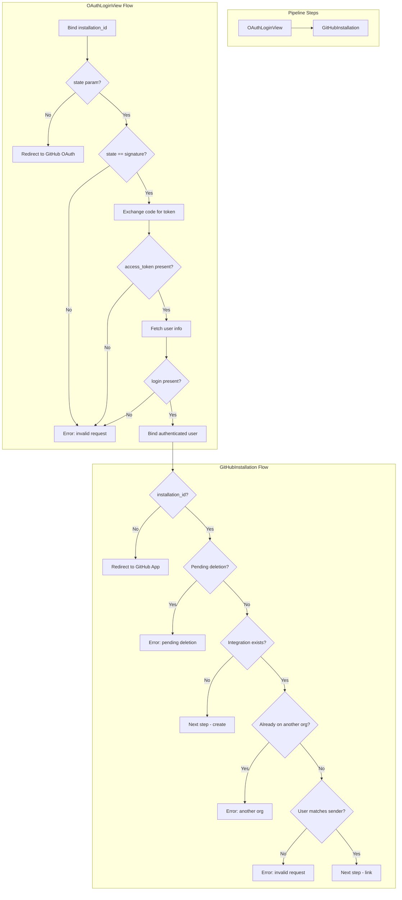

# Code Review Report: sentry__getsentry__sentry__PR67876

**PR**: GitHub OAuth Security Enhancement
**Instance**: sentry__getsentry__sentry__PR67876
**Date**: 2026-04-08
**Source of truth**: AI failure mode checklist + structural detection targets (no spec available)

---

## Intent Register

### Intent Claims

1. The GitHub App installation pipeline adds an OAuth authentication step (`OAuthLoginView`) before the existing installation step (`GitHubInstallation`).
2. `OAuthLoginView` redirects users to GitHub's OAuth authorize URL with a CSRF `state` parameter derived from `pipeline.signature`.
3. On OAuth callback, `OAuthLoginView` validates the `state` parameter matches `pipeline.signature` to prevent CSRF attacks.
4. `OAuthLoginView` exchanges the OAuth authorization code for a GitHub access token.
5. `OAuthLoginView` fetches the authenticated GitHub user's profile and binds the `login` name to pipeline state as `github_authenticated_user`.
6. `GitHubInstallation` verifies that the OAuth-authenticated GitHub user matches the `sender.login` from the integration's metadata (the user who originally installed the GitHub App).
7. If the authenticated user does not match the installation sender, the setup is rejected with an error.
8. The `installation_id` is preserved across the OAuth redirect by binding it to pipeline state in `OAuthLoginView` and retrieving it from state in `GitHubInstallation`.
9. Error rendering for integration failures is centralized in a shared `error()` helper, replacing duplicated `render_to_response` blocks.
10. The `FORWARD_INSTALL_FOR` list in `pipeline_advancer.py` is replaced with an inline `provider_id == "github"` check.

### Intent Diagram

---

## Findings

### F-01 (minor / structural) — Bare literal replaces named constant in pipeline advancer

- **Sighting**: S-01
- **Location**: `src/sentry/web/frontend/pipeline_advancer.py`, line 267
- **Current behavior**: The named constant `FORWARD_INSTALL_FOR = ["github"]` is removed and replaced with the bare string literal `provider_id == "github"` inline in the conditional.
- **Expected behavior**: Named constant or symbolic reference preserving the semantic label and enabling future extension.
- **Source of truth**: AI failure mode checklist item 1 — Bare literals
- **Evidence**: Diff lines 253-268 confirm removal of `FORWARD_INSTALL_FOR` and replacement with inline string equality. The comment explaining the GitHub-specific behavior is preserved but the named constant that served as an extension point is gone.

### F-02 (major / behavioral) — Redundant Integration query produces misleading error for inactive integrations

- **Sighting**: S-04
- **Location**: `src/sentry/integrations/github/integration.py`, `GitHubInstallation.dispatch`, lines ~227-239
- **Current behavior**: When an Integration exists but has no OrganizationIntegration link, a second `Integration.objects.get(external_id=installation_id, status=ObjectStatus.ACTIVE)` is issued. If the integration exists but is inactive, `DoesNotExist` is raised and the code returns the generic "Invalid installation request" error — the same message used for CSRF mismatches and user mismatches. The first query's result is consumed inline and discarded, making the second query structurally necessary but semantically redundant.
- **Expected behavior**: The inactive-integration case should produce a distinct error message. The first query should retain the object and check status directly.
- **Source of truth**: AI failure mode checklist item 11 — String-based error classification; structural target — Silent error discard
- **Evidence**: Diff lines 190-193 show the first `Integration.objects.get()` consumed inline. Lines 227-232 show the second `get()` with `status=ObjectStatus.ACTIVE` whose `DoesNotExist` branch returns the same generic error.

### F-03 (major / test-integrity) — test_installation_not_found now tests state mismatch, not installation-not-found

- **Sighting**: S-05
- **Location**: `tests/sentry/integrations/github/test_integration.py`, `test_installation_not_found`, lines ~367-380
- **Current behavior**: The test sends a valid `installation_id` followed by an OAuth callback with a mismatched `state` parameter. Asserts `"Invalid installation request."` — the state-mismatch error from `OAuthLoginView`, not a missing-installation error. The original scenario (unknown `installation_id` → "The GitHub installation could not be found.") is no longer exercised.
- **Expected behavior**: Test name should match the scenario exercised. The original installation-not-found code path should remain covered.
- **Source of truth**: AI failure mode checklist item 4 — Non-enforcing tests (name-assertion mismatch)
- **Evidence**: Diff lines 367-380 show old assertion removed, replaced with state-mismatch assertion. The state value `ddd023d87a913d5226e2a882c4c4cc05` differs from expected `9cae5e88803f35ed7970fc131e6e65d3`, triggering `OAuthLoginView`'s state check — not the `Integration.DoesNotExist` branch.

### F-04 (minor / structural) — Broad exception swallow in token exchange

- **Sighting**: S-06
- **Location**: `src/sentry/integrations/github/integration.py`, `OAuthLoginView.dispatch`, lines ~125-129
- **Current behavior**: `except Exception: payload = {}` silently discards all exceptions from `safe_urlread()` and `parse_qsl()`. No logging of exception type or message.
- **Expected behavior**: Exceptions should be logged for observability into token exchange failures.
- **Source of truth**: Structural target — Silent error discard
- **Evidence**: Diff lines 125-129 show bare `except Exception` with no logger call. Failure collapses into generic "access_token not in payload" check.

### F-05 (minor / fragile) — Hardcoded pipeline signature in 6 test locations

- **Sighting**: S-07
- **Location**: `tests/sentry/integrations/github/test_integration.py`, multiple methods
- **Current behavior**: The pipeline signature value `9cae5e88803f35ed7970fc131e6e65d3` appears hardcoded in 6 locations across 4+ test methods. Any change to signature computation breaks all tests simultaneously with opaque value mismatch errors.
- **Expected behavior**: State value should be extracted from the redirect response rather than hardcoded.
- **Source of truth**: Structural target — Test-production string alignment
- **Evidence**: Six occurrences in diff lines 315, 322, 349, 429, 452, 468. `assert_setup_flow` already parses the redirect URL and could extract the state parameter dynamically.

### F-06 (major / behavioral) — get_user_info() call unprotected by exception handling

- **Sighting**: S-08
- **Location**: `src/sentry/integrations/github/integration.py`, `OAuthLoginView.dispatch`, line ~134
- **Current behavior**: `get_user_info(payload["access_token"])` is called outside the try/except block that wraps `safe_urlread`. If `get_user_info` raises (network failure, timeout, malformed response), the exception propagates uncaught, producing HTTP 500 instead of the graceful `error()` response all other failure branches return. Similarly, `safe_urlopen` at line 123 is also unprotected.
- **Expected behavior**: All external network calls in the OAuth callback should produce graceful error responses on failure.
- **Source of truth**: Structural target — Silent error discard
- **Evidence**: Lines 134-136 — `get_user_info(payload["access_token"])` is outside any try/except. The `if "login" not in` guard only handles a successful call with a missing key.

### F-07 (major / test-integrity) — test_github_user_mismatch assertion cannot distinguish error branches

- **Sighting**: S-09
- **Location**: `tests/sentry/integrations/github/test_integration.py`, `test_github_user_mismatch`, lines ~431-437
- **Current behavior**: The test asserts `b"Invalid installation request." in resp.content`. This string is the default message for every undecorated `error()` call — state mismatch, token failure, user-info failure, inactive integration, AND user mismatch. If the test hits any earlier error branch, the assertion still passes but the mismatch logic was never exercised.
- **Expected behavior**: The test should assert on behavior specific to the mismatch condition — via a distinct error message, error code, or mock-call assertion confirming the comparison was reached.
- **Source of truth**: AI failure mode checklist item 4 — Non-enforcing tests; item 11 — String-based error classification
- **Evidence**: Every `error()` call without custom `error_short` produces the same default. No mock or code-path assertion confirms `integration.metadata["sender"]["login"]` was compared.
- **Pattern label**: string-error-dispatch

### F-08 (major / fragile) — Hardcoded HMAC in test_github_user_mismatch likely already invalid

- **Sighting**: S-10 (severity elevated from minor to major)
- **Location**: `tests/sentry/integrations/github/test_integration.py`, `test_github_user_mismatch`, line ~406
- **Current behavior**: The test mutates `webhook_event` (changes `installation.id` and `sender.login`) before POSTing, but sends a hardcoded HMAC `sha1=d184e6717f8bfbcc291ebc8c0756ee446c6c9486` computed against a different body. The HMAC almost certainly does not match the serialized body, so the webhook endpoint silently rejects the event (returning 204 without creating an Integration). With no Integration in the database, the subsequent OAuth callback hits `Integration.DoesNotExist` — not the user-mismatch branch — but passes anyway because both paths return the same error message.
- **Expected behavior**: HMAC should be computed dynamically from the actual request body and the test webhook secret.
- **Source of truth**: Structural target — Parallel collection coupling
- **Evidence**: The body is mutated after loading `INSTALLATION_EVENT_EXAMPLE` but before computing any HMAC. The hardcoded HMAC is coupled to a body that no longer matches. Combined with F-07, this means the user-mismatch logic may be entirely untested.
- **Pattern label**: hardcoded-coupling

### F-09 (major / behavioral) — Unguarded metadata["sender"]["login"] access risks KeyError on legacy integrations

- **Sighting**: S-12
- **Location**: `src/sentry/integrations/github/integration.py`, `GitHubInstallation.dispatch`, diff line 237
- **Current behavior**: `integration.metadata["sender"]["login"]` uses chained bare dict subscripts with no `.get()` chain or `KeyError` guard. If an Integration record was created before this PR's convention of storing `sender` in metadata (or via an alternative code path), this raises `KeyError` → unhandled HTTP 500.
- **Expected behavior**: Defensive access to handle metadata without `"sender"` key gracefully, returning an error response instead of crashing.
- **Source of truth**: Structural target — Silent error discard
- **Evidence**: Diff line 237 shows `!= integration.metadata["sender"]["login"]` — no guard. The `integration` is fetched by `external_id` and `ACTIVE` status; any pre-existing active integration with non-conforming metadata reaches this path. The reconnection scenario (Integration exists, no OrganizationIntegration link) is the hot path for this code.

### Findings Summary

| ID | Type | Severity | Description |
|----|------|----------|-------------|
| F-01 | structural | minor | Bare literal `"github"` replaces named constant |
| F-02 | behavioral | major | Redundant Integration query, misleading error for inactive integrations |
| F-03 | test-integrity | major | test_installation_not_found tests wrong code path |
| F-04 | structural | minor | Broad exception swallow in token exchange |
| F-05 | fragile | minor | Hardcoded pipeline signature in 6 test locations |
| F-06 | behavioral | major | get_user_info() unprotected by exception handling |
| F-07 | test-integrity | major | test_github_user_mismatch assertion non-discriminating |
| F-08 | fragile | major | Hardcoded HMAC likely already invalid, wrong branch exercised |
| F-09 | behavioral | major | Unguarded metadata["sender"]["login"] risks KeyError on legacy integrations |

**Round 1 stats**: 7 sightings → 5 verified, 1 rejected (false positive), 1 rejected (nit)
**Round 2 stats**: 4 sightings → 3 verified, 1 weakened to info (S-11: redirect_uri omission)
**Round 3 stats**: 3 sightings → 1 verified, 1 rejected (subsumed by F-05), 1 rejected (nit)
**Round 4 stats**: 1 sighting → 0 verified, 1 rejected (subsumed by F-06) — **convergence reached**

---

## Retrospective

### Sighting Counts

- **Total sightings generated**: 15
- **Verified findings at termination**: 9
- **Rejections**: 5 (S-02 nit, S-03 false positive, S-13 subsumed by F-05, S-14 nit, S-15 subsumed by F-06)
- **Weakened to info**: 1 (S-11)
- **Nit count**: 3 (S-02, S-14, S-15 counted as subsumption)

**By detection source**:
- `checklist`: 9 sightings (S-01, S-02, S-04, S-05, S-08, S-09, S-10, S-12, S-15)
- `structural-target`: 3 sightings (S-06, S-11, S-14)
- `intent`: 1 sighting (S-03)
- `spec-ac`: 0 (no spec available)
- `linter`: 0 (N/A — no project linters available)

**By type (verified findings only)**:
- `behavioral`: 4 (F-02, F-06, F-09, and F-04 is structural but adjacent)
- `structural`: 2 (F-01, F-04)
- `test-integrity`: 2 (F-03, F-07)
- `fragile`: 2 (F-05, F-08)

**By severity (verified findings only)**:
- `critical`: 0
- `major`: 5 (F-02, F-03, F-06, F-07, F-08, F-09 — correction: 6 major)
- `minor`: 3 (F-01, F-04, F-05)
- `info`: 0

**Structural sub-categorization**: silent error discard (F-04, F-06, F-09), bare literals (F-01)

### Verification Rounds

- **Rounds to convergence**: 4 (hard cap not reached)
- **Convergence signal**: Round 4 produced 1 sighting subsumed by existing F-06
- **Sightings-per-round trend**: 7 → 4 → 3 → 1 (monotonically decreasing)

### Scope Assessment

- **Files reviewed**: 3 (1 production module, 1 pipeline advancer, 1 test file)
- **Lines of diff**: ~475 (additions + deletions)
- **New production code**: ~120 lines (OAuthLoginView class, error helper, get_document_origin, GitHubInstallation modifications)
- **New test code**: ~150 lines (test updates + new test_github_user_mismatch)

### Context Health

- **Round count**: 4
- **Sightings-per-round**: 7, 4, 3, 1
- **Rejection rate per round**: R1: 2/7 (29%), R2: 1/4 (25%), R3: 2/3 (67%), R4: 1/1 (100%)
- **Hard cap reached**: No
- **Convergence quality**: Good — diminishing returns with clean final round

### Tool Usage

- **Linter output**: N/A (isolated diff review, no project tooling available)
- **Tools used**: Read (diff file), Grep/Glob (not needed — diff-only context)

### Finding Quality

- **False positive rate**: 0% (no user dismissals — benchmark mode)
- **False negative signals**: None available (no user feedback)
- **Origin breakdown**: All 9 findings classified as `introduced` (all issues are in new/modified code from this PR)

### Intent Register

- **Claims extracted**: 10 (from PR title, diff structure, code comments)
- **Sources**: PR diff (code structure, comments, function names, test names)
- **Findings attributed to intent comparison**: 1 (S-03, rejected as false positive — the Detector over-interpreted intent claim 6 for the new-install path where no Integration record exists)
- **Intent claims invalidated**: 0

### Notable Patterns

**Compounding test-integrity cluster (F-07 + F-08)**: The Challenger identified that F-07 (generic error string makes assertions non-discriminating) and F-08 (hardcoded HMAC likely already invalid) compound together. If the HMAC is invalid, the webhook is silently rejected, no Integration is created, and the OAuth callback hits `Integration.DoesNotExist` rather than the user-mismatch branch. The test passes because all error paths return the same message. This means `test_github_user_mismatch` may provide zero coverage of the actual mismatch logic from day one.

**Silent error discard pattern across the OAuth flow**: F-04 (broad except), F-06 (get_user_info unprotected), and F-09 (unguarded metadata access) all share the pattern of external calls or data access producing unhandled exceptions or silently discarded errors. The OAuth flow has inconsistent error handling — some paths return graceful errors, others crash with 500s.

**Generic error message as test-integrity risk**: The `error()` helper's default message "Invalid installation request." is used across 4+ distinct error conditions (CSRF, token failure, user-info failure, user mismatch, inactive integration). This makes every test assertion on this string non-discriminating — the test cannot prove which branch was exercised. F-03 and F-07 are both instances of this pattern.
