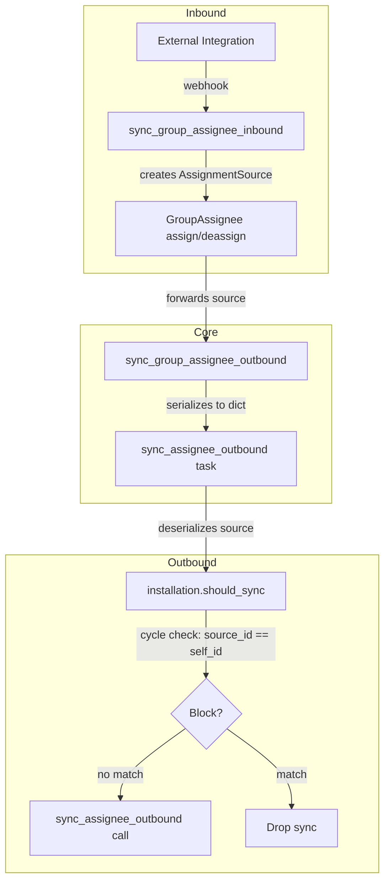

# Code Review: sentry__getsentry__sentry__PR77754

**PR**: feat(ecosystem): Implement cross-system issue synchronization
**Instance**: sentry__getsentry__sentry__PR77754
**Date**: 2026-04-08
**Source of truth**: AI failure mode checklist + structural detection targets (no spec available)
**Linter output**: N/A (benchmark mode, no project tooling)

---

## Intent Register

### Intent Claims

1. An `AssignmentSource` dataclass tracks which integration triggered an assignment change, carrying `source_name`, `integration_id`, and `queued` timestamp.
2. `AssignmentSource.from_integration()` constructs an instance from an `Integration` or `RpcIntegration` model.
3. `AssignmentSource` supports round-trip serialization via `to_dict()` and `from_dict()` for Celery task argument passing.
4. `from_dict()` returns `None` for invalid or incomplete input instead of raising.
5. `should_sync()` prevents sync cycles by returning `False` when the sync source integration matches the current integration.
6. `sync_assignee_outbound` task accepts an optional `assignment_source_dict` for cross-task serialization.
7. `sync_group_assignee_inbound` attaches `AssignmentSource` when assigning/deassigning groups from inbound sync.
8. `sync_group_assignee_outbound` threads `assignment_source` through to the Celery task via dict serialization.
9. `GroupAssignee.objects.assign()` and `.deassign()` accept optional `assignment_source` and forward it to outbound sync.
10. The cycle-prevention check compares `integration_id` between source and current `org_integration`.
11. `sync_status_outbound` abstract method signature is extended with `assignment_source` for future status sync cycle prevention.

### Intent Diagram

---

## Verified Findings

### F-01 — Stale default timestamp (behavioral, major)
**Sighting**: S-01 | **Location**: `src/sentry/integrations/services/assignment_source.py:17`

`queued: datetime = timezone.now()` evaluates `timezone.now()` once at class definition time (module import). Every `AssignmentSource` created without an explicit `queued` — including all instances from `from_integration()` — shares the same frozen timestamp from module import. Fix: `queued: datetime = field(default_factory=timezone.now)`.

**Evidence**: `from_integration()` calls `AssignmentSource(source_name=..., integration_id=...)` without `queued`. All production call sites in `sync.py` use `from_integration`. The stale timestamp is exercised on every real code path.

---

### F-02 — Celery JSON round-trip corrupts `queued` type (behavioral, major)
**Sighting**: S-02 | **Location**: `assignment_source.py` (`to_dict`/`from_dict`), `sync.py`, `sync_assignee_outbound.py`

`to_dict()` uses `asdict()` which leaves `datetime` as a native Python object. Celery's kombu JSON serializer converts it to an ISO 8601 string. On the receiving side, `from_dict()` calls `cls(**input_dict)` — Python dataclasses don't validate types, so the string is silently accepted, producing an `AssignmentSource` where `queued` is a `str`, not `datetime`.

**Evidence**: `sync.py:204` calls `assignment_source.to_dict()` and passes to Celery. `sync_assignee_outbound.py:132` calls `AssignmentSource.from_dict(assignment_source_dict)` with no type conversion. The round-trip produces a type-violated instance.

---

### F-03 — Dead infrastructure: `sync_status_outbound` parameter (structural, minor)
**Sighting**: S-03 | **Location**: `src/sentry/integrations/mixins/issues.py:408-415`

The abstract `sync_status_outbound` method gains `assignment_source: AssignmentSource | None = None` but no call site in this PR passes it and no concrete implementation reads it.

**Evidence**: Parameter appears solely in the abstract method signature. No other reference to `sync_status_outbound` with `assignment_source` exists in the diff.

---

### F-04 — No round-trip serialization test (test-integrity, major)
**Sighting**: S-04 | **Location**: `tests/sentry/integrations/services/test_assignment_source.py`

Tests exercise `to_dict()` and `from_dict()` in isolation with hand-crafted dicts. `test_from_dict_valid_data` omits the `queued` key entirely; `test_to_dict` only asserts `result.get("queued") is not None` (existence, not type). No test performs the actual round-trip through JSON serialization, leaving F-02 undetectable by the test suite.

**Evidence**: `test_from_dict_valid_data` passes `{"source_name": "foo-source", "integration_id": 123}` — no `queued`. No test exercises string-to-datetime conversion.

---

### F-05 — `from_dict()` silently accepts wrong field types (fragile, minor)
**Sighting**: S-06 | **Location**: `src/sentry/integrations/services/assignment_source.py:92-97`

`from_dict()` catches `ValueError` and `TypeError` but Python dataclasses don't validate field types at construction. `cls(**{"queued": "2024-01-01T00:00:00"})` succeeds with no exception, returning a type-violated instance. The `TypeError` guard only fires for wrong kwargs, not wrong value types.

**Evidence**: No `__post_init__` validation. Frozen dataclass `__init__` accepts any value for any field regardless of annotation.

---

### F-06 — No direct unit test for cycle-prevention logic (test-integrity, minor)
**Sighting**: S-07 | **Location**: `src/sentry/integrations/mixins/issues.py` (`should_sync`), `tests/sentry/models/test_groupassignee.py`

The cycle-prevention branch in `should_sync` is only covered by the end-to-end integration test. No unit test exercises the three branches: `sync_source=None` (passthrough), matching `integration_id` (returns False), different `integration_id` (evaluates config). The "different-integration should still sync" path has zero test coverage.

**Evidence**: No test file for `issues.py` in the diff. Only `test_assignee_sync_outbound_assign_with_matching_source_integration` touches this path, and only for the matching case.

---

### F-07 — Test name `test_from_dict_empty_array` misleads (test-integrity, minor)
**Sighting**: S-08 | **Location**: `tests/sentry/integrations/services/test_assignment_source.py:272`

Test is named `test_from_dict_empty_array` but the input is `data: dict[str, Any] = {}` — an empty dict, not an array/list. The name implies list input; the code tests dict input.

**Evidence**: Line 272: `def test_from_dict_empty_array(self):` / line 273: `data: dict[str, Any] = {}`. No list/array anywhere in the test.

---

### F-08 — `test_from_dict_valid_data` omits `queued` assertion (test-integrity, minor)
**Sighting**: S-09 | **Location**: `tests/sentry/integrations/services/test_assignment_source.py:285-291`

Test passes `{"source_name": "foo-source", "integration_id": 123}` with no `queued` key. Assertions check only `source_name` and `integration_id`. No signal on how `queued` behaves on deserialization — the test silently relies on the stale default (F-01).

**Evidence**: No `queued` key in input dict; no assertion on `result.queued`. The field whose behavior is most in question has zero test coverage in this test.

---

### F-09 — No deassign cycle-prevention test (test-integrity, major)
**Sighting**: S-10 | **Location**: `tests/sentry/models/test_groupassignee.py`

Cycle prevention is tested for assign (`test_assignee_sync_outbound_assign_with_matching_source_integration`) but not for deassign. The deassign path threads `assignment_source` identically (groupassignee.py line 254). The existing `test_assignee_sync_outbound_unassign` calls `deassign(self.group)` with no `assignment_source`.

**Evidence**: No test calls `GroupAssignee.objects.deassign(group, assignment_source=AssignmentSource.from_integration(integration))` and asserts `mock_sync_assignee_outbound.assert_not_called()`.

---

### F-10 — Silent cycle-guard loss on malformed source dict (behavioral, minor)
**Sighting**: S-11 | **Location**: `src/sentry/integrations/tasks/sync_assignee_outbound.py:131-134`

When `assignment_source_dict` is non-None but `from_dict()` returns `None` (malformed input), `parsed_assignment_source` silently becomes `None`. The task proceeds without cycle prevention and without logging. Observable during version skew, corrupted messages, or manual re-queue.

**Evidence**: The `if assignment_source_dict` guard only protects the `None` case. A truthy-but-unparseable dict falls through with `parsed_assignment_source = None` and no diagnostic.

---

## Findings Summary

| ID | Type | Severity | Description |
|----|------|----------|-------------|
| F-01 | behavioral | major | `queued` default evaluated at import time, not instantiation |
| F-02 | behavioral | major | Celery JSON round-trip corrupts `queued` from datetime to string |
| F-03 | structural | minor | `sync_status_outbound` parameter added but never wired |
| F-04 | test-integrity | major | No round-trip serialization test |
| F-05 | fragile | minor | `from_dict()` silently accepts wrong field types |
| F-06 | test-integrity | minor | No direct unit test for `should_sync` cycle prevention |
| F-07 | test-integrity | minor | Test name `test_from_dict_empty_array` misleads (tests dict) |
| F-08 | test-integrity | minor | `test_from_dict_valid_data` omits `queued` assertion |
| F-09 | test-integrity | major | No deassign cycle-prevention test |
| F-10 | behavioral | minor | Silent cycle-guard loss on malformed source dict |

**Totals**: 10 verified findings, 3 rejections (S-05, S-12, S-13), 1 nit (S-12)
**False positive rate**: 0% (benchmark mode — no user dismissals)

---

## Retrospective

### Sighting Counts

- **Total sightings generated**: 13
- **Verified findings**: 10
- **Rejections**: 3 (S-05: integration test coverage adequate; S-12: standard base-class stub pattern; S-13: team path not reachable from inbound sync)
- **Nit count**: 1 (S-12)
- **By detection source**: checklist: 6 (F-01, F-03, F-05, F-07, F-08, F-10), intent: 2 (F-02, F-09), structural-target: 2 (F-04, F-06)
- **By type**: behavioral: 3 (F-01, F-02, F-10), structural: 1 (F-03), test-integrity: 5 (F-04, F-06, F-07, F-08, F-09), fragile: 1 (F-05)
- **Structural sub-categories**: dead infrastructure: 1 (F-03)
- **By severity**: major: 4, minor: 6

### Verification Rounds

- **Rounds**: 3 (converged on round 3 — no new verified findings)
- **Round 1**: 7 sightings, 6 verified, 1 rejected
- **Round 2**: 5 sightings, 4 verified, 1 rejected (nit)
- **Round 3**: 1 sighting, 0 verified, 1 rejected
- **Sightings-per-round trend**: 7 → 5 → 1 (converging)
- **Rejection rate per round**: 14% → 20% → 100%
- **Hard cap reached**: No

### Scope Assessment

- **Files reviewed**: 7 (5 production, 2 test)
- **Lines changed**: ~200 (additions + modifications in diff)
- **Modules touched**: integrations/services, integrations/tasks, integrations/utils, integrations/mixins, models

### Context Health

- Convergence achieved in 3 rounds
- Rejection rate increased each round, indicating diminishing returns
- No stuck agents or relaunches required

### Tool Usage

- **Linter output**: N/A (benchmark mode)
- **Project tools**: N/A (diff-only review)
- **Detection tools**: Read, Grep, Glob via Detector/Challenger agents

### Finding Quality

- **False positive rate**: N/A (no user feedback in benchmark mode)
- **Origin breakdown**: All findings are `introduced` (new code in this PR)
- **Cross-cutting patterns**: `round-trip-type-corruption` (F-02, F-04, F-05 share the same root cause — `queued` field not designed for serialization)

### Intent Register

- **Claims extracted**: 11 (derived from diff analysis — no external documentation)
- **Findings attributed to intent**: 2 (F-02, F-09)
- **Intent claims invalidated**: 0

### Key Observations

The highest-impact cluster is the `queued` field design: F-01 (stale default), F-02 (JSON round-trip corruption), F-04 (no round-trip test), F-05 (no type validation in `from_dict`), and F-08 (test omits `queued`). These five findings share a single root cause — the `queued: datetime` field was added without considering Python dataclass default evaluation semantics or Celery serialization boundaries. The fix is `field(default_factory=timezone.now)` + explicit datetime parsing in `from_dict()` + a round-trip test.

The cycle-prevention logic itself is sound but undertested: only the assign path with a matching integration is covered (F-06, F-09). The "different integration should still sync" branch has zero coverage.
