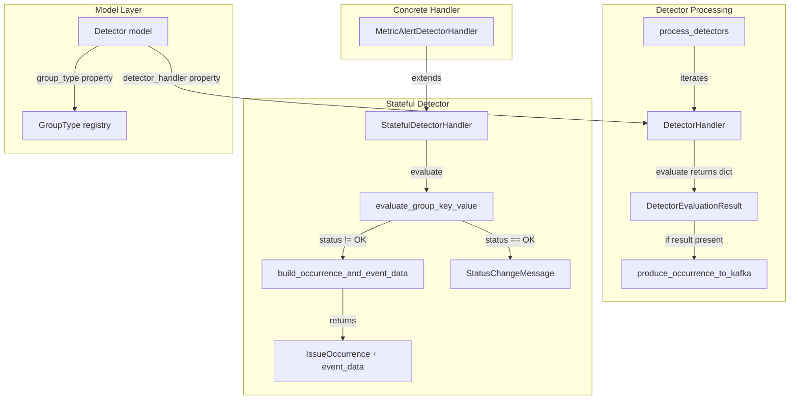

# Code Review: sentry__getsentry__sentry__PR80168

**PR**: feat(workflow_engine): Add in hook for producing occurrences from the stateful detector
**URL**: https://github.com/getsentry/sentry/pull/80168
**Review date**: 2026-04-08

## Intent Register

### Intent Claims

1. `process_detectors()` returns `dict[DetectorGroupKey, DetectorEvaluationResult]` per detector instead of a list, preventing duplicate group keys by construction
2. `DetectorHandler.evaluate()` abstract method signature updated to return `dict[DetectorGroupKey, DetectorEvaluationResult]`
3. `StatefulDetectorHandler` gains abstract method `build_occurrence_and_event_data(group_key, value, new_status)` returning `tuple[IssueOccurrence, dict[str, Any]]`
4. When detector status transitions to non-OK, `evaluate_group_key_value` calls `build_occurrence_and_event_data` to produce the occurrence and event data
5. When detector status transitions to OK, a `StatusChangeMessage` is created for resolution (existing behavior preserved)
6. `MetricAlertDetectorHandler` extends `StatefulDetectorHandler` instead of `DetectorHandler`, removing its stub `evaluate()` implementation
7. `Detector` model gains a `group_type` property that resolves the GroupType from the registry by slug
8. `Detector.detector_handler` property refactored to use the new `group_type` property
9. Duplicate group key detection logic removed from `process_detectors()` — the dict return type handles uniqueness
10. Test infrastructure refactored: `StatefulDetectorHandlerTestMixin` replaced by `BaseDetectorHandlerTest` extending `BaseGroupTypeTest`
11. `MockDetectorStateHandler` now extends `StatefulDetectorHandler` and implements `build_occurrence_and_event_data`
12. Tests verify `produce_occurrence_to_kafka` is called with correct occurrence and event data
13. `@freeze_time()` added to test classes that construct time-dependent occurrence objects

### Intent Diagram

## Verified Findings

### F-01 (major / structural) — MetricAlertDetectorHandler uninstantiable
- **Sighting**: S-01
- **Location**: `src/sentry/incidents/grouptype.py`, lines 21-22
- **Current behavior**: `MetricAlertDetectorHandler` extends `StatefulDetectorHandler` with only `pass`, providing no implementation of the abstract methods `get_dedupe_value`, `get_group_key_values`, or `build_occurrence_and_event_data`. Instantiation raises `TypeError`.
- **Expected behavior**: A concrete subclass must implement all abstract methods, or the class should remain extending `DetectorHandler` until ready.
- **Evidence**: Diff lines 21-22 show the class body is `pass`. Diff lines 123-127 add `build_occurrence_and_event_data` as `@abc.abstractmethod`. The comment at line 25 ("We don't create these issues yet") confirms non-production status — downgraded from critical to major.
- **Pattern**: abstract-class-contract

### F-02 (major / test-integrity) — Wrong value in multi-group test fixture
- **Sighting**: S-02
- **Location**: `tests/sentry/workflow_engine/processors/test_detector.py`, lines 392-393
- **Current behavior**: `test_state_results_multi_group` data packet has `"group_2": 10`, but expected occurrence is built with `value=6`. The mock `build_mock_occurrence_and_event` accepts `value` but discards it — the occurrence is identical regardless of value.
- **Expected behavior**: Expected occurrence should use `value=10` to match the data packet. The mock should incorporate `value` so mismatches are detectable.
- **Evidence**: Diff line 379 (`"group_2": 10`) vs. diff line 393 (`value=6`). Diff lines 458-479 confirm `value` is not used in occurrence construction.
- **Pattern**: silent-value-discard

### F-03 (minor / test-integrity) — Wrong value in additional test fixtures
- **Sighting**: S-03
- **Location**: `tests/sentry/workflow_engine/processors/test_detector.py`, lines 635-636, 659-660
- **Current behavior**: `test_results_on_change` uses packet value `100` but mock value `6`; `test_dedupe` uses packet value `8` but mock value `6`. Both pass because the mock discards `value`.
- **Expected behavior**: Mock `value` argument should match packet values.
- **Evidence**: Same root cause as F-02. Diff lines 631-636 and 656-660 confirm mismatched values.
- **Pattern**: silent-value-discard

### F-04 (major / fragile) — Implicit enum value alignment
- **Sighting**: S-04
- **Location**: `src/sentry/workflow_engine/processors/detector.py`, line 176
- **Current behavior**: `PriorityLevel(new_status)` converts `DetectorPriorityLevel` to `PriorityLevel` by passing the integer value directly. No mapping or contract enforces alignment.
- **Expected behavior**: An explicit mapping function should convert between the enums so independent value changes cannot silently produce wrong priorities.
- **Evidence**: Diff line 176 shows `PriorityLevel(new_status)`. No cross-enum mapping table or alignment test exists in the diff.
- **Pattern**: implicit-enum-aliasing

### F-05 (minor / test-integrity) — No test for dict uniqueness guarantee
- **Sighting**: S-06
- **Location**: `tests/sentry/workflow_engine/processors/test_detector.py`, lines 410-442 (removed)
- **Current behavior**: `test_state_results_multi_group_dupe` was removed. The dict-based uniqueness guarantee has no test coverage.
- **Expected behavior**: A replacement test should confirm the dict structure correctly prevents duplicates.
- **Evidence**: Diff lines 410-442 show complete removal. New `process_detectors` at diff lines 99-106 relies on dict structure with no explicit test.
- **Pattern**: coverage-gap-on-refactor

### F-06 (minor / test-integrity) — Hardcoded duplicate UUIDs in test helper
- **Sighting**: S-07
- **Location**: `tests/sentry/workflow_engine/processors/test_detector.py`, lines 465-488
- **Current behavior**: `build_mock_occurrence_and_event` hardcodes `id` and `event_id`. All occurrences share the same IDs, potentially masking collision constraints.
- **Expected behavior**: Each occurrence should have distinct IDs, or the test should document that shared IDs are intentional.
- **Evidence**: Diff lines 466, 468 show literal UUID strings. `test_state_results_multi_group` creates two occurrences with identical IDs.
- **Pattern**: hardcoded-test-identity

### F-07 (major / test-integrity) — group_key mismatch in TestEvaluateGroupKeyValue.test_dedupe
- **Sighting**: S-08
- **Location**: `tests/sentry/workflow_engine/processors/test_detector.py`, diff lines 689-698
- **Current behavior**: `build_mock_occurrence_and_event` is called with `group_key="val1"` (line 690), producing a fingerprint keyed to `"val1"`. That occurrence is placed into `DetectorEvaluationResult("group_key", ...)` (line 693) where `group_key="group_key"`. The fixture's embedded occurrence fingerprint and the result's group_key disagree.
- **Expected behavior**: The occurrence and the `DetectorEvaluationResult` should use the same group_key string.
- **Evidence**: Diff line 690 passes `"val1"` to helper; diff line 693 passes `"group_key"` as first arg to `DetectorEvaluationResult`. Different string literals for the same conceptual key.
- **Pattern**: wrong-value (key-mismatch variant of F-02/F-03)

### F-08 (major / test-integrity) — Unused `value` parameter in test helper (root cause of F-02/F-03)
- **Sighting**: S-11
- **Location**: `tests/sentry/workflow_engine/processors/test_detector.py`, diff lines 458-489
- **Current behavior**: `build_mock_occurrence_and_event` accepts `value: int` but never references it in the function body. The `IssueOccurrence` is identical regardless of what value is passed — `initial_issue_priority` uses `new_status.value`, not `value`. The fixture is structurally incapable of detecting whether `build_occurrence_and_event_data` handles values correctly.
- **Expected behavior**: `value` should influence the occurrence (e.g., in `evidence_data` or `subtitle`), or be removed from the signature if irrelevant.
- **Evidence**: Function body at diff lines 464-488 constructs `IssueOccurrence` referencing `handler.detector.group_type`, `handler.build_fingerprint(group_key)`, `new_status.value` — `value` parameter (line 462) is absent from every expression. This is the structural root cause making F-02/F-03 wrong call-site values invisible.
- **Pattern**: unused-value-parameter

### Findings Summary

| ID | Type | Severity | Description |
|----|------|----------|-------------|
| F-01 | structural | major | `MetricAlertDetectorHandler` uninstantiable — missing abstract method implementations |
| F-02 | test-integrity | major | Multi-group test builds expected occurrence with wrong `value` (6 vs 10) |
| F-03 | test-integrity | minor | Multiple tests build expected occurrences with mismatched `value` parameter |
| F-04 | fragile | major | `PriorityLevel(new_status)` relies on implicit integer alignment between independent enums |
| F-05 | test-integrity | minor | Removed duplicate-detection test with no replacement for dict uniqueness guarantee |
| F-06 | test-integrity | minor | Hardcoded identical UUIDs across all mock occurrences |
| F-07 | test-integrity | major | group_key mismatch: occurrence built for `"val1"` but result uses `"group_key"` |
| F-08 | test-integrity | major | `build_mock_occurrence_and_event` ignores `value` parameter — root cause of F-02/F-03 |

**Rejected**: 4 (S-05 nit, S-09 nit, S-10 duplicate of F-02/F-03, S-12 nit)
**Nits**: 3

## Retrospective

### Sighting Counts

- **Total sightings**: 12
- **Verified findings**: 8
- **Rejections**: 4 (3 nits, 1 duplicate)
- **Nit count**: 3 (stale docstring, silent parameter discard in test helper, over-broad test patcher)

**By detection source:**
| Source | Sightings | Verified |
|--------|-----------|----------|
| checklist | 8 | 6 |
| intent | 1 | 1 |
| structural-target | 2 | 0 |
| linter | 0 (N/A) | 0 |

**By type (verified findings):**
| Type | Count | Findings |
|------|-------|----------|
| structural | 1 | F-01 |
| test-integrity | 6 | F-02, F-03, F-05, F-06, F-07, F-08 |
| fragile | 1 | F-04 |
| behavioral | 0 | — |

**By severity (verified findings):**
| Severity | Count |
|----------|-------|
| critical | 0 |
| major | 5 (F-01, F-02, F-04, F-07, F-08) |
| minor | 3 (F-03, F-05, F-06) |
| info | 0 |

**Structural sub-categorization:** F-01 is an abstract-class-contract violation (dead infrastructure variant — the class is registered but uninstantiable).

**By origin:** All 8 findings are `introduced` — created by the changes in this PR.

### Verification Rounds

- **Rounds to convergence**: 4 (round 4 produced no new sightings above info)
- **Hard cap reached**: No (converged at round 4 of 5)
- **Sightings per round**: R1=7, R2=3, R3=2, R4=0
- **Verified per round**: R1=6, R2=1, R3=1, R4=0
- **Rejection rate per round**: R1=14% (1/7), R2=67% (2/3), R3=50% (1/2), R4=N/A

### Scope Assessment

- **Files reviewed**: 4 (1 model, 1 processor, 1 grouptype, 1 test file)
- **Diff size**: ~700 lines (additions + removals)
- **Primary focus**: `processors/detector.py` (production logic) and `test_detector.py` (test refactoring)

### Context Health

- Round count: 4
- Sightings-per-round trend: 7 → 3 → 2 → 0 (clean convergence)
- Rejection rate trend: 14% → 67% → 50% (increasing as low-hanging fruit exhausted)
- Hard cap not reached

### Tool Usage

- **Linter output**: N/A (diff-only benchmark review, no project tooling)
- **Tools used**: Read, Grep, Glob (standard diff analysis)

### Finding Quality

- **False positive rate**: 0% (no user dismissals — benchmark mode)
- **False negative signals**: None available (no user feedback)
- **Origin breakdown**: 8/8 introduced (all findings created by the PR changes)
- **Cross-pattern notes**: F-02, F-03, F-07, F-08 form a cluster around the `build_mock_occurrence_and_event` test helper — F-08 (unused `value` parameter) is the root cause enabling F-02/F-03 (wrong values passed), and F-07 (wrong group_key) is the same pattern applied to a different parameter.

### Intent Register

- **Claims extracted**: 13 (from PR title, diff structure, and code comments)
- **Sources**: PR title, code comments, type signatures, test names
- **Findings attributed to intent comparison**: 1 (F-05, from intent claim #9 about dict uniqueness)
- **Intent claims invalidated during verification**: 0
