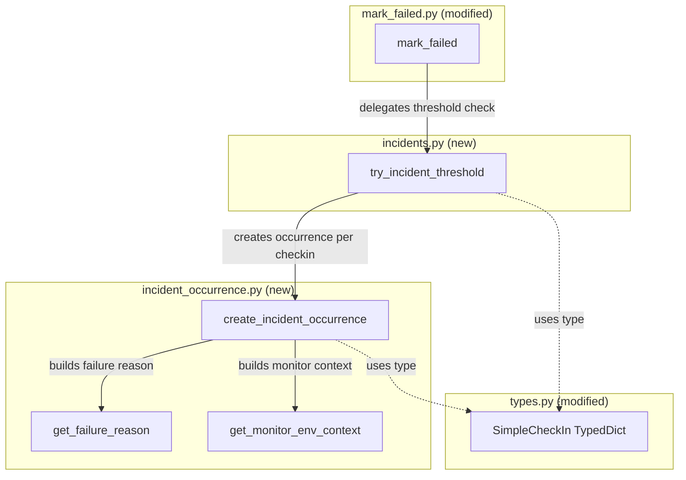

# Code Review: sentry__getsentry__sentry__PR80528

**PR**: ref(crons): Reorganize incident creation / issue occurrence logic
**URL**: https://github.com/getsentry/sentry/pull/80528
**Instance**: sentry__getsentry__sentry__PR80528
**Date**: 2026-04-08

## Intent Register

### Intent Claims

1. `try_incident_threshold` in `incidents.py` is behaviorally identical to the former `mark_failed_threshold` in `mark_failed.py`
2. `create_incident_occurrence` in `incident_occurrence.py` is behaviorally identical to the former `create_issue_platform_occurrence` in `mark_failed.py`
3. `get_failure_reason` is moved without behavioral changes
4. `get_monitor_environment_context` is moved without behavioral changes
5. `SimpleCheckIn` TypedDict is moved to `types.py` with identical fields (only a docstring added)
6. `mark_failed.py` delegates to `try_incident_threshold` at the exact call site where `mark_failed_threshold` was previously called
7. All helper constants (`HUMAN_FAILURE_STATUS_MAP`, `SINGULAR_HUMAN_FAILURE_MAP`) are moved without changes
8. The module decomposition separates incident threshold logic (`incidents.py`) from occurrence creation logic (`incident_occurrence.py`)

### Intent Diagram

---

## Verified Findings

### F-01: copy-mutate-discard in `get_monitor_environment_context`

| Field | Value |
|---|---|
| Sighting | S-01 |
| Location | `src/sentry/monitors/logic/incident_occurrence.py`, lines 165-177 |
| Type | behavioral |
| Severity | minor |
| Origin | pre-existing |
| Detection source | checklist |
| Pattern label | copy-mutate-discard |

**Current behavior**: `get_monitor_environment_context` copies `monitor.config` into a local variable `config`, conditionally transforms `config["schedule_type"]` to a display string, then returns a dict with `monitor_environment.monitor.config` (the original, unmodified dict) in the `"config"` field. The modified copy is discarded.

**Expected behavior**: The `"config"` field in the returned dict should reference the local `config` variable so the humanized `schedule_type` is included when present.

**Evidence**: The copy-then-mutate pattern on lines 166-168 expresses intent to return the transformed value. Line 174 uses `monitor_environment.monitor.config` (original) instead of `config` (modified copy).

---

### F-02: Missing empty guard in `get_failure_reason`

| Field | Value |
|---|---|
| Sighting | S-02 |
| Location | `src/sentry/monitors/logic/incident_occurrence.py`, lines 136-162 |
| Type | behavioral |
| Severity | minor |
| Origin | pre-existing |
| Detection source | checklist |
| Pattern label | missing-empty-guard |

**Current behavior**: When no check-ins have a status in `HUMAN_FAILURE_STATUS_MAP`, `status_counts` is empty. The sum check (0 != 1) falls through to the plural branch, calling `get_text_list([])` which returns `""`. The format string produces `" check-ins detected"` — semantically broken user-facing text.

**Expected behavior**: A fallback message when `status_counts` is empty, or upstream guarantees that all inputs have recognized statuses.

**Evidence**: `Counter` filtered to `HUMAN_FAILURE_STATUS_MAP` keys produces empty Counter when no statuses match. `get_text_list([])` returns `""` in Django. Format string produces leading-space output.

---

### F-03: Loop-multiplied side effect in occurrence creation

| Field | Value |
|---|---|
| Sighting | S-03 |
| Location | `src/sentry/monitors/logic/incidents.py`, lines 275-283 |
| Type | behavioral |
| Severity | minor |
| Origin | pre-existing |
| Detection source | structural-target |
| Pattern label | loop-multiplied-side-effect |

**Current behavior**: When `failure_issue_threshold > 1` and the monitor first crosses the threshold, one Kafka occurrence is produced for every check-in in the threshold window (up to N occurrences for an N-check-in window). Each occurrence has a unique `event_id` but shares the same `incident.grouphash` fingerprint.

**Expected behavior**: Typically one occurrence per threshold-crossing event. If multiple occurrences are intentional (attaching evidence per check-in), this should be documented.

**Evidence**: Lines 276-283: `filter(id__in=...)` fetches all IDs from `previous_checkins`, and the for-loop calls `create_incident_occurrence` for each. The comment on line 272 says "Only create an occurrence if..." (singular).

---

### F-04: Unconditional signal emission

| Field | Value |
|---|---|
| Sighting | S-04 |
| Location | `src/sentry/monitors/logic/incidents.py`, line 285 |
| Type | behavioral |
| Severity | minor |
| Origin | pre-existing |
| Detection source | intent |
| Pattern label | unconditional-signal |

**Current behavior**: `monitor_environment_failed.send()` fires unconditionally after the occurrence creation block. In the ERROR branch, `incident` may be `None` (when `active_incident` returns `None`), in which case no occurrence is created but the signal still fires. The signal also fires when the monitor/env is muted and occurrence creation is skipped.

**Expected behavior**: Signal emission should correlate with meaningful failure processing — either when an occurrence is created or when incident state is valid.

**Evidence**: Lines 255-267 (ERROR branch sets `incident = monitor_env.active_incident`, which can be `None`) and line 285 (signal send is outside all guards).

---

### F-05: Off-by-window threshold check

| Field | Value |
|---|---|
| Sighting | S-06 |
| Location | `src/sentry/monitors/logic/incidents.py`, lines 220-236 |
| Type | behavioral |
| Severity | major |
| Origin | pre-existing |
| Detection source | checklist |
| Pattern label | off-by-window |

**Current behavior**: When fewer than `failure_issue_threshold` check-ins exist in the database (e.g., a newly configured monitor), `previous_checkins[:failure_issue_threshold]` returns a shorter list. If none of those are OK, incident creation proceeds — meaning an incident triggers before the configured threshold of consecutive failures is reached.

**Expected behavior**: Incident creation should require exactly `failure_issue_threshold` consecutive failures. If fewer check-ins exist than the threshold, the threshold has not been met.

**Evidence**: Lines 220-236. `previous_checkins[:failure_issue_threshold]` slices a queryset that may have fewer entries than `failure_issue_threshold`. No `len()` check enforces the minimum count before the OK-status guard and subsequent incident creation.

---

### F-06: Redundant DB fetch for threshold=1 case

| Field | Value |
|---|---|
| Sighting | S-07 |
| Location | `src/sentry/monitors/logic/incidents.py`, lines 275-283 |
| Type | structural |
| Severity | minor |
| Origin | pre-existing |
| Detection source | structural-target |
| Pattern label | redundant-db-fetch |

**Current behavior**: When `failure_issue_threshold == 1`, `previous_checkins` is built from `failed_checkin`'s own fields. The subsequent DB query on line 276 (`MonitorCheckIn.objects.filter(id__in=[...])`) re-fetches the same row that `failed_checkin` already represents, issuing a redundant database round-trip.

**Expected behavior**: When the only check-in in `previous_checkins` is the already-loaded `failed_checkin`, pass it directly to `create_incident_occurrence` without re-fetching.

**Evidence**: Lines 211-218 (threshold==1 builds from `failed_checkin`) and lines 275-277 (DB query filters by those IDs). Re-fetch is only necessary for the N>1 path where `previous_checkins` entries are raw dicts from `.values()`.

---

### F-07: Double `get_environment()` call

| Field | Value |
|---|---|
| Sighting | S-09 |
| Location | `src/sentry/monitors/logic/incident_occurrence.py`, lines 73 and 96 |
| Type | structural |
| Severity | minor |
| Origin | pre-existing |
| Detection source | structural-target |
| Pattern label | redundant-accessor |

**Current behavior**: `monitor_env.get_environment().name` is called twice within `create_incident_occurrence` — once for the `IssueEvidence` "Environment" field and once for `event_data["environment"]`. If `get_environment()` is not cached, this issues two DB queries for the same value.

**Expected behavior**: Assign `monitor_env.get_environment()` to a local variable once and reference it at both call sites.

**Evidence**: Diff lines 73 and 96 in `incident_occurrence.py`. The function already correctly caches `get_last_successful_checkin()` in a local variable (line 52), making this asymmetry likely an oversight.

---

### F-08: Duplicated `SimpleCheckIn` dict construction

| Field | Value |
|---|---|
| Sighting | S-10 |
| Location | `src/sentry/monitors/logic/incidents.py`, lines 211-218 and 257-264 |
| Type | structural |
| Severity | minor |
| Origin | pre-existing |
| Detection source | structural-target |
| Pattern label | duplicated-construction |

**Current behavior**: The identical dict literal `{"id": failed_checkin.id, "date_added": failed_checkin.date_added, "status": failed_checkin.status}` is constructed at two separate sites within `try_incident_threshold` — the threshold==1 branch and the ERROR branch.

**Expected behavior**: A helper function or shared expression should construct a `SimpleCheckIn` from a `MonitorCheckIn`, called at both sites.

**Evidence**: Lines 211-218 and 257-264. Both construct identical single-element lists from the same `failed_checkin` object using the same three fields. If `SimpleCheckIn` gains a required field, both sites must be updated independently.

---

## Findings Summary

| ID | Type | Severity | Origin | Description |
|---|---|---|---|---|
| F-01 | behavioral | minor | pre-existing | `get_monitor_environment_context` returns original config, discarding modified copy |
| F-02 | behavioral | minor | pre-existing | `get_failure_reason` produces broken output when `status_counts` is empty |
| F-03 | behavioral | minor | pre-existing | Loop creates N occurrences for N-check-in threshold window |
| F-04 | behavioral | minor | pre-existing | `monitor_environment_failed` signal fires unconditionally |
| F-05 | behavioral | major | pre-existing | Incident triggers before threshold reached with insufficient history |
| F-06 | structural | minor | pre-existing | Redundant DB fetch when threshold=1 |
| F-07 | structural | minor | pre-existing | `get_environment()` called twice in same function |
| F-08 | structural | minor | pre-existing | Identical `SimpleCheckIn` dict constructed at two sites |

**Totals**: 8 verified findings (1 major, 7 minor), 0 critical, all pre-existing

---

## Retrospective

### Sighting Counts

| Metric | Count |
|---|---|
| Total sightings generated | 10 |
| Verified findings | 8 |
| Rejections | 2 |
| Nits (excluded) | 2 |

**By detection source**:
- checklist: 4 sightings (3 verified, 1 nit)
- structural-target: 4 sightings (4 verified)
- intent: 2 sightings (1 verified, 1 nit)

**Structural sub-categorization**:
- Dead code / dead infrastructure: 1 (F-01 copy-mutate-discard)
- Duplication / caller re-implementation: 2 (F-06, F-08)
- Composition opacity: 0
- Bare literals: 0

### Verification Rounds

- **Round 1**: 7 sightings → 6 verified, 1 nit rejected
- **Round 2**: 3 sightings → 2 verified, 1 nit rejected
- **Convergence**: Round 2 produced only minor pre-existing structural observations on verbatim-moved code. Effective convergence reached at round 2.

### Scope Assessment

- **Files reviewed**: 4 (2 new, 2 modified)
- **Lines in diff**: ~598 (171 new in `incident_occurrence.py`, 104 new in `incidents.py`, ~245 removed from `mark_failed.py`, ~12 added to `types.py`)
- **Nature**: Pure refactoring — code moved verbatim with function renames only

### Context Health

- **Round count**: 2
- **Sightings-per-round trend**: 7 → 3 (declining)
- **Rejection rate per round**: R1: 1/7 (14%), R2: 1/3 (33%)
- **Hard cap reached**: No

### Tool Usage

- **Linter output**: N/A (benchmark mode — no project tooling available)
- **Project-native tools**: N/A (diff-only context)

### Finding Quality

- **False positive rate**: Unknown (no user feedback in benchmark mode)
- **Origin breakdown**: 8/8 pre-existing (100%) — expected for a pure refactoring PR
- **Key observation**: All findings describe issues that existed before the PR. The refactoring itself is faithful — no behavioral changes were introduced by the code reorganization.

### Intent Register

- **Claims extracted**: 8 (from PR title, diff structure, and code comparison)
- **Sources**: PR title, diff analysis
- **Findings attributed to intent comparison**: 1 (F-04, detection source: intent)
- **Intent claims invalidated**: 0 — all 8 claims verified as accurate; the refactoring preserves behavioral identity

### Notable Observations

1. **F-01 (copy-mutate-discard)** is the most interesting finding — `get_monitor_environment_context` copies and modifies config but returns the original. This is a pre-existing bug where the `schedule_type` humanization is silently lost. A refactoring PR is a natural opportunity to fix this.

2. **F-05 (off-by-window)** is the only major-severity finding — incident creation can trigger before the configured threshold is reached when a monitor has insufficient check-in history. This is a pre-existing logic issue.

3. This PR is a clean, well-scoped refactoring. The decomposition into `incidents.py` (threshold logic) and `incident_occurrence.py` (occurrence construction) is a sound separation of concerns. No new issues were introduced.
