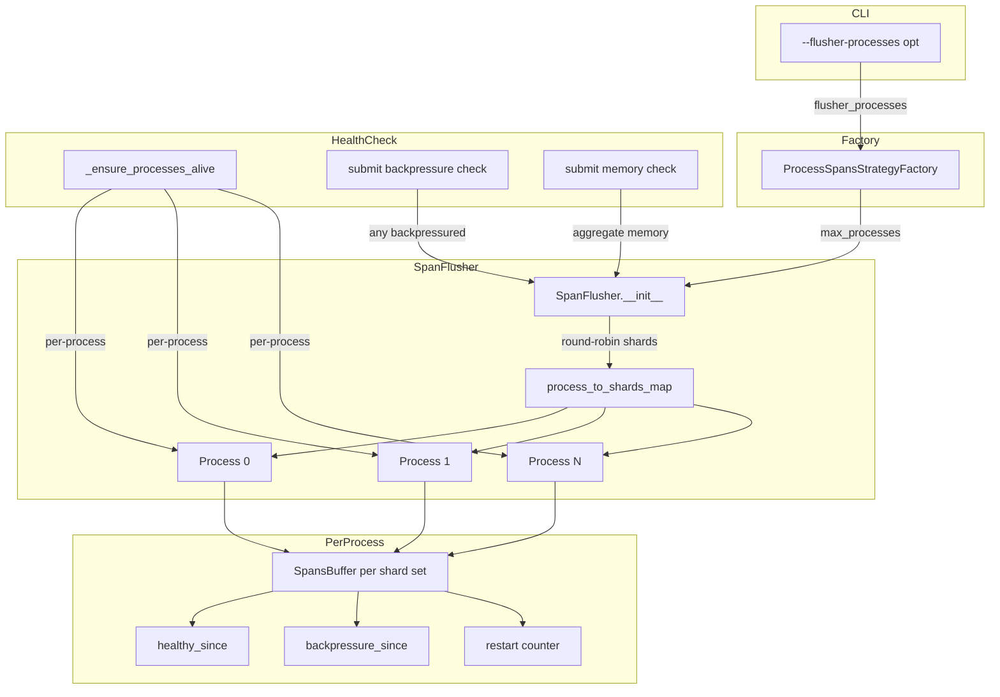

# Code Review: Span Buffer Multiprocess Enhancement with Health Monitoring

**PR**: [getsentry/sentry#93824](https://github.com/getsentry/sentry/pull/93824)
**Instance**: sentry__getsentry__sentry__PR93824
**Date**: 2026-04-08
**Source of truth**: AI failure mode checklist + structural detection targets (no spec available)

---

## Intent Register

### Intent Claims

1. SpanFlusher transitions from single-process to multi-process architecture, creating one process per shard (or group of shards) for parallel Redis polling and Kafka production.
2. `max_processes` parameter caps the number of flusher processes; defaults to the number of assigned shards when not specified.
3. Shards are distributed round-robin across available processes via `process_to_shards_map`.
4. Each process receives its own `SpansBuffer` instance scoped to its assigned shards.
5. Per-process health monitoring replaces the single-process model: `process_healthy_since`, `process_backpressure_since`, and `process_restarts` are all per-process dictionaries.
6. The `--flusher-processes` CLI option is added to the `process-spans` consumer to control the max number of flusher processes.
7. The factory (`ProcessSpansStrategyFactory`) threads `flusher_processes` through to the `SpanFlusher` constructor.
8. Metrics are tagged with shard identifiers for per-shard observability.
9. Process restart logic operates per-process: each process has its own restart counter and is individually restarted when unhealthy.
10. Backpressure detection iterates all processes; any single process exceeding the backpressure threshold triggers `MessageRejected`.
11. Memory monitoring aggregates `get_memory_info()` across all per-process buffers.
12. `join()` iterates all processes with deadline tracking, terminating each after the wait loop.
13. CLAUDE.md is updated with a coding guideline: use `isinstance()` instead of `hasattr()` for union type narrowing.

### Intent Diagram

---

## Verified Findings

### F-01 (S-05) — join() skips termination of remaining processes on timeout
- **Type**: behavioral | **Severity**: major | **Origin**: introduced
- **Location**: `src/sentry/spans/consumers/process/flusher.py`, `join()` method
- **Detection source**: checklist
- **Current behavior**: When `remaining_time <= 0`, `join()` executes `break`, exiting the for-loop. Processes at higher iteration indices skip both the wait loop and `.terminate()`. `self.stopped.value = True` signals graceful exit but does not force-terminate hung processes.
- **Expected behavior**: All processes should receive a termination signal regardless of remaining time. The deadline should govern wait duration, not whether termination is attempted.
- **Evidence**: The `break` at line 369 exits the loop before reaching `.terminate()` for unvisited processes. With `len(self.processes) > 1` and a tight timeout, later processes are abandoned.
- **Source of truth**: AI failure mode checklist — surface-level fixes that bypass core mechanisms

### F-02 (S-01) — Dead method `_create_process_for_shard`
- **Type**: structural | **Severity**: minor | **Origin**: introduced
- **Location**: `src/sentry/spans/consumers/process/flusher.py`, lines 190-195
- **Detection source**: structural-target (dead infrastructure)
- **Current behavior**: `_create_process_for_shard(self, shard: int)` is defined but has zero call sites in the PR. The restart path in `_ensure_processes_alive` calls `_create_process_for_shards` (plural) directly by process index.
- **Expected behavior**: Method should either be wired into the restart path or removed.
- **Evidence**: Grep of the diff confirms zero calls to `_create_process_for_shard` (singular). All restart paths use the plural variant.
- **Source of truth**: Structural target — dead infrastructure

### F-03 (S-02) — Metrics tag key inconsistency: "shard" vs "shards"
- **Type**: structural | **Severity**: minor | **Origin**: introduced
- **Location**: `src/sentry/spans/consumers/process/flusher.py`, `main()` method
- **Detection source**: structural-target
- **Current behavior**: `spans.buffer.flusher.produce` and `spans.buffer.segment_size_bytes` use `tags={"shard": shard_tag}`. `spans.buffer.flusher.wait_produce` uses `tags={"shards": shard_tag}`. Same value, different key names.
- **Expected behavior**: All three metrics calls should use the same tag key for consistent dashboard queries.
- **Evidence**: Diff lines 226, 237 use `"shard"` (singular); line 242 uses `"shards"` (plural).
- **Source of truth**: Structural target — semantic drift (tag naming)

### F-04 (S-04) — Docstring claims "one process per shard" but code caps at max_processes
- **Type**: structural | **Severity**: minor | **Origin**: introduced
- **Location**: `src/sentry/spans/consumers/process/flusher.py`, class docstring
- **Detection source**: structural-target (semantic drift)
- **Current behavior**: Docstring: "Creates one process per shard for parallel processing." Code: `num_processes = min(max_processes, len(assigned_shards))` with round-robin shard distribution.
- **Expected behavior**: Docstring should describe the actual bounded-parallelism behavior.
- **Evidence**: Docstring at diff line 90 vs `__init__` logic at diff line 118.
- **Source of truth**: Structural target — semantic drift

### F-05 (S-03) — CLI default=1 makes SpanFlusher shard-count fallback dormant via CLI path
- **Type**: structural | **Severity**: minor | **Origin**: introduced
- **Location**: `src/sentry/consumers/__init__.py` (CLI default) + `flusher.py` (fallback)
- **Detection source**: intent
- **Current behavior**: CLI `--flusher-processes` defaults to `1`. Factory passes `1` to SpanFlusher. `1 or len(buffer.assigned_shards)` evaluates to `1` — the shard-count fallback is unreachable via CLI. The fallback only activates when the factory is instantiated programmatically with `flusher_processes=None`.
- **Expected behavior**: If the intent is shard-count default, CLI should default to `None`. If `1` is the intended operational default, the SpanFlusher fallback is dead code from the CLI perspective.
- **Evidence**: CLI `default=1` at diff line 36; factory `int | None = None` at diff line 52; SpanFlusher `or` fallback at diff line 103.
- **Source of truth**: Intent claim 2

### F-06 (S-06) — test_basic time.sleep(0.1) is a no-op due to monkeypatch
- **Type**: test-integrity | **Severity**: minor | **Origin**: introduced
- **Location**: `tests/sentry/spans/consumers/process/test_consumer.py`, `test_basic`
- **Detection source**: checklist (non-enforcing test variants)
- **Current behavior**: Test patches `time.sleep` to a no-op lambda at the start, then calls `time.sleep(0.1)` later with a comment "Give flusher threads time to process after drift change." The call resolves through the patched module attribute and does nothing.
- **Expected behavior**: If a real delay is needed, save a reference to the real `time.sleep` before patching, or use a synchronization primitive.
- **Evidence**: `monkeypatch.setattr("time.sleep", lambda _: None)` patches the `time` module's `sleep` attribute. The test imports `time` at the top; `time.sleep(0.1)` in the test body resolves through the patched attribute.
- **Source of truth**: AI failure mode checklist — non-enforcing test variants

### F-07 (S-07) — test_flusher_processes_limit verifies structure only, not behavior
- **Type**: test-integrity | **Severity**: minor | **Origin**: introduced
- **Location**: `tests/sentry/spans/consumers/process/test_consumer.py`, `test_flusher_processes_limit`
- **Detection source**: checklist (non-enforcing tests / name-assertion mismatch)
- **Current behavior**: Test asserts `len(flusher.processes) == 2`, `flusher.max_processes == 2`, `flusher.num_processes == 2`, `total_shards == 4`. No messages are submitted, no flush output is verified.
- **Expected behavior**: A test claiming to verify the process limit is "respected" should demonstrate correct behavior under load with the limit applied.
- **Evidence**: Test body contains zero `step.submit()` calls and no output assertions.
- **Source of truth**: AI failure mode checklist — non-enforcing tests (name-assertion mismatch)

### F-08 (S-08) — Zero-value sentinel ambiguity in max_processes
- **Type**: behavioral | **Severity**: minor | **Origin**: introduced
- **Location**: `src/sentry/spans/consumers/process/flusher.py`, `__init__`
- **Detection source**: checklist (zero-value sentinel ambiguity)
- **Current behavior**: `max_processes or len(buffer.assigned_shards)` treats `0` as falsy and silently substitutes the shard count. No validation rejects `0` as an invalid input.
- **Expected behavior**: Use `max_processes is None` to distinguish "not provided" from "zero." Or validate that `max_processes >= 1`.
- **Evidence**: Python `or` idiom at diff line 103. CLI `type=int` with no min constraint allows `--flusher-processes 0`.
- **Source of truth**: AI failure mode checklist — zero-value sentinel ambiguity

### F-09 (S-09) — Thread zombie on restart: old thread races with replacement on shared Values
- **Type**: behavioral | **Severity**: minor | **Origin**: introduced
- **Location**: `src/sentry/spans/consumers/process/flusher.py`, `_ensure_processes_alive` + `_create_process_for_shards`
- **Detection source**: structural-target (parallel collection coupling)
- **Current behavior**: When a `threading.Thread` worker is unhealthy, the `isinstance(process, multiprocessing.Process)` check skips `kill()`. A new thread is spawned and overwrites `self.processes[process_index]`, but the old hung thread retains live references to shared `Value` objects (`process_backpressure_since`, `process_healthy_since`) and can write concurrently with the replacement. The `stopped` flag will eventually signal the old thread to exit, but a race window exists.
- **Expected behavior**: Old thread should be cooperatively stopped (e.g., via per-thread stop event or join-with-timeout) before replacement is started, or shared Values should be recreated per restart.
- **Evidence**: `isinstance` check at diff line 303 excludes threads from kill. `_create_process_for_shards` overwrites `self.processes[process_index]` at line 187. Both old and new threads hold references to the same `Value` objects passed at lines 178-179. Thread path is test-only (activated via `produce_to_pipe`), reducing production severity.
- **Source of truth**: Structural target — parallel collection coupling / ambient state access

### Findings Summary

| ID | Type | Severity | Description |
|----|------|----------|-------------|
| F-01 | behavioral | major | join() skips termination of remaining processes on timeout |
| F-02 | structural | minor | Dead method `_create_process_for_shard` (never called) |
| F-03 | structural | minor | Metrics tag key "shard" vs "shards" inconsistency |
| F-04 | structural | minor | Docstring claims one-process-per-shard; code caps at max_processes |
| F-05 | structural | minor | CLI default=1 makes shard-count fallback dormant via CLI |
| F-06 | test-integrity | minor | test_basic time.sleep(0.1) is no-op due to monkeypatch |
| F-07 | test-integrity | minor | test_flusher_processes_limit checks structure only |
| F-08 | behavioral | minor | Zero-value sentinel ambiguity in max_processes |
| F-09 | behavioral | minor | Thread zombie on restart races with replacement on shared Values |

**Findings**: 9 verified | **Rejections**: 2 | **Weakened to info**: 1 | **False positive rate**: 0%

---

## Retrospective

### Sighting Counts

- **Total sightings generated**: 12
- **Verified findings at termination**: 9
- **Rejections**: 2
- **Weakened to info (below threshold)**: 1
- **Nits**: 0

**By detection source**:
| Source | Sightings | Verified |
|--------|-----------|----------|
| checklist | 5 | 4 |
| structural-target | 5 | 4 |
| intent | 2 | 1 |

**By type**:
| Type | Count | Severities |
|------|-------|------------|
| behavioral | 3 | 1 major, 2 minor |
| structural | 4 | 4 minor |
| test-integrity | 2 | 2 minor |

**Structural sub-categorization**:
- Dead infrastructure: 1 (F-02)
- Semantic drift: 2 (F-03, F-04)
- Dead code / dormant fallback: 1 (F-05)

**By origin**: All 9 findings are `introduced` (new in this PR).

### Verification Rounds

- **Round 1**: 8 sightings → 8 verified (S-03 downgraded from major to minor)
- **Round 2**: 4 sightings → 1 verified (S-09 weakened to minor), 1 weakened to info (S-11), 2 rejected (S-10, S-12)
- **Round 3**: No new sightings above info severity → **convergence**
- **Hard cap (5 rounds)**: Not reached

### Scope Assessment

- **Files reviewed**: 6 (CLAUDE.md, consumers/__init__.py, factory.py, flusher.py, test_consumer.py, test_flusher.py)
- **Primary review target**: `flusher.py` (~250 lines changed — bulk of the refactor)
- **Diff size**: ~464 lines total

### Context Health

| Round | Sightings | Verified | Rejected | Weakened |
|-------|-----------|----------|----------|----------|
| 1 | 8 | 8 | 0 | 0 |
| 2 | 4 | 1 | 2 | 1 |
| 3 | 0 | — | — | — |

- **Sightings-per-round trend**: 8 → 4 → 0 (clean convergence)
- **Rejection rate per round**: R1 0%, R2 50%
- **Hard cap reached**: No (converged in 3 rounds)

### Tool Usage

- **Linter output**: N/A (no project linters available — isolated diff review)
- **Tools used**: Read (diff file), Grep (call-site verification), Glob (file discovery)
- **Project-native tools**: None available

### Finding Quality

- **False positive rate**: 0% (no user to dismiss findings; all findings substantiated by code evidence)
- **False negative signals**: N/A (no user feedback)
- **Rejection analysis**:
  - S-10 (restart counter never resets): Rejected — pre-existing pattern, intentional lifetime crash budget, not introduced by this PR
  - S-12 (SpansBuffer abandoned without cleanup): Rejected — speculative, no evidence SpansBuffer owns resources requiring explicit cleanup
- **Weakened analysis**:
  - S-11 (record_stored_segments N times): Weakened to info — structural change confirmed but behavioral impact speculative without SpansBuffer source
  - S-03 (CLI default masks fallback): Weakened from major to minor — factory preserves None path for programmatic callers; only CLI path is affected

### Intent Register

- **Claims extracted**: 13 (all from diff analysis — no specs, README, or external docs available)
- **Findings attributed to intent comparison**: 1 (F-05, detection source: intent)
- **Intent claims invalidated**: 0
