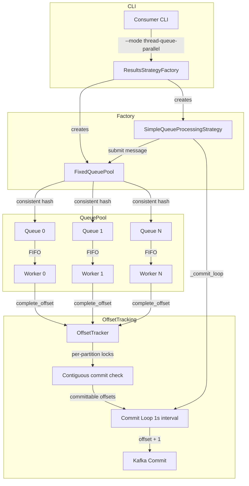

# Code Review: sentry__getsentry__sentry__PR95633

**PR**: feat(uptime): Add ability to use queues to manage parallelism
**URL**: https://github.com/getsentry/sentry/pull/95633
**Review date**: 2026-04-08
**Source of truth**: AI failure mode checklist + structural detection targets (no spec available)

---

## Intent Register

### Intent Claims

1. `OffsetTracker` tracks outstanding offsets per Kafka partition and determines which offsets are safe to commit contiguously.
2. `OffsetTracker` uses per-partition locks for thread-safe concurrent access.
3. `get_committable_offsets` only returns the highest offset per partition where all prior offsets have been completed.
4. `mark_committed` cleans up tracked offsets at or below the committed offset to prevent unbounded memory growth.
5. `OrderedQueueWorker` is a daemon thread that processes items from its assigned queue in FIFO order.
6. `OrderedQueueWorker` completes the offset in a `finally` block, ensuring offset tracking even when processing fails.
7. `FixedQueuePool` uses consistent hashing (`hash(group_key) % num_queues`) so the same group always maps to the same queue.
8. Each queue has exactly one worker thread, guaranteeing FIFO ordering within a group.
9. `SimpleQueueProcessingStrategy` provides "natural backpressure when queues fill up" (per docstring).
10. `SimpleQueueProcessingStrategy.submit` handles `None` decoder results by immediately completing the offset without enqueuing.
11. `SimpleQueueProcessingStrategy._commit_loop` runs on a 1-second interval, committing contiguous offsets.
12. The commit function adds +1 to offsets (Kafka convention: committed offset = next offset to read).
13. Error in `submit` (decoder/grouping failure) logs the exception and immediately completes the offset to avoid blocking commits.
14. `FixedQueuePool.shutdown` signals workers, shuts down queues gracefully, then joins workers with 5-second timeout.
15. The `ResultsStrategyFactory` initializes `result_processor` before mode branching so `thread-queue-parallel` mode can pass it to `FixedQueuePool`.
16. The new mode integrates into the existing `create_with_partitions` dispatch chain.
17. `--max-workers` CLI option controls `num_queues` for `thread-queue-parallel` mode (default 20).

### Intent Diagram

---

## Verified Findings

### F-01 (structural, minor) — Defensive offset registration gap in submit error handler

**Sighting:** S-02
**Location:** `src/sentry/remote_subscriptions/consumers/queue_consumer.py`, `submit()` exception handler
**Current behavior:** When the outer `except Exception` fires in `submit()`, offset completion is conditional on `isinstance(message.value, BrokerValue)`. The `assert isinstance(message.value, BrokerValue)` on the happy path is inside the `try` block, so an AssertionError routes through the same conditional handler. If the check fails, the offset is never registered, which would create a permanent gap in `get_committable_offsets`' contiguous scan, halting commits for that partition.
**Expected behavior:** Per Intent #13, all offsets should be marked complete regardless of processing outcome. The `finally` pattern in `OrderedQueueWorker.run()` demonstrates the correct unconditional approach.
**Evidence:** In production, arroyo guarantees `BrokerValue` wrapping, so this path is currently unreachable. However, the pattern is structurally inconsistent with the worker's unconditional `finally` block. Any future caller passing non-BrokerValue messages (test harness, new arroyo version) would silently corrupt offset state.
**Source of truth:** Intent #13
**Pattern label:** offset-registration-gap

---

### F-02 (structural, minor) — Dispatch chain else-pairing fragility

**Sighting:** S-03
**Location:** `src/sentry/remote_subscriptions/consumers/result_consumer.py`, `create_with_partitions()`
**Current behavior:** The `thread_queue_parallel` branch is appended as `if/else` after `if self.parallel`, making the `else` (serial fallback) syntactically paired with `if self.thread_queue_parallel` rather than the full dispatch chain. Functionally correct today, but future mode additions will likely insert at the wrong level.
**Expected behavior:** Per Intent #16, the dispatch should use `if/elif/elif/else` or guarded returns with a final unconditional return.
**Evidence:** Diff shows the original `if self.parallel: ... else: serial` was modified by inserting a new `if` before the `else`, silently changing what `else` is paired with.
**Source of truth:** Intent #16
**Pattern label:** dispatch-chain-fragility

---

### F-03 (test-integrity, minor) — Unit test bypasses +1 Kafka offset convention

**Sighting:** S-04
**Location:** `tests/sentry/remote_subscriptions/consumers/test_queue_consumer.py`, `test_offset_committing()`
**Current behavior:** The test's `commit_function` directly records raw internal offsets. The assertion `committed_offsets[partition] == 104` verifies internal offset math but never exercises the production +1 Kafka translation from `create_thread_queue_parallel_worker`. The integration test (`test_thread_queue_parallel_offset_commit`) does assert 105, but the unit layer doesn't test the composed behavior.
**Expected behavior:** Per Intent #12, the Kafka +1 convention is a critical contract. The unit test should either exercise it or clearly name itself as testing only internal offset tracking.
**Source of truth:** Intent #12, checklist item 4
**Pattern label:** offset-convention-gap

---

### F-04 (test-integrity, major) — Error handling test assertion contradicts stated intent

**Sighting:** S-05
**Location:** `tests/sentry/uptime/consumers/test_results_consumer.py`, `test_thread_queue_parallel_error_handling()`
**Current behavior:** Test name says "errors in processing don't block offset commits for other messages." The mock sends offset 100 (raises) then offset 101 (succeeds) on the same subscription/queue. The `finally` block in `OrderedQueueWorker.run()` completes both offsets regardless of exceptions. But the assertion `len(committed_offsets) == 0 or test_partition not in committed_offsets` asserts that NO commits happened — directly contradicting the test name. The assertion only passes because the 1-second commit loop hasn't fired within the 0.2s sleep window (timing dependency).
**Expected behavior:** The test should assert that commits DO eventually happen, confirming errors don't block the commit chain.
**Evidence:** The `finally` block at `OrderedQueueWorker.run()` unconditionally completes offsets. The commit loop runs every 1 second. The test sleeps only 0.2s after draining. The assertion is vacuously true due to timing, not correctness.
**Source of truth:** Intent #6, Intent #13, checklist item 4
**Pattern label:** timing-dependent-assertion

---

### F-05 (test-integrity, minor) — Distribution test only checks coverage

**Sighting:** S-08
**Location:** `tests/sentry/remote_subscriptions/consumers/test_queue_consumer.py`, `test_different_groups_distributed()`
**Current behavior:** Asserts `len(queue_indices) == 3` after hashing 20 group keys across 3 queues. By pigeonhole principle with 20 keys and 3 buckets, all 3 buckets are virtually guaranteed to be hit. The test name says "distributed" implying balanced distribution, but the assertion only verifies coverage — two queues could have 19 items and one could have 1.
**Expected behavior:** Either verify a deterministic hash mapping for specific keys, or rename to reflect that only coverage is tested.
**Source of truth:** Checklist item 4 (name-assertion mismatch)
**Pattern label:** coverage-vs-distribution

---

### F-06 (behavioral, minor) — Backpressure docstring claim vs unbounded queues

**Sighting:** S-09
**Location:** `src/sentry/remote_subscriptions/consumers/queue_consumer.py`, `SimpleQueueProcessingStrategy` docstring + `FixedQueuePool.__init__()` queue creation
**Current behavior:** The `SimpleQueueProcessingStrategy` docstring guarantees "Natural backpressure when queues fill up." Queues are created as `queue.Queue()` with no `maxsize` argument — Python's default is unbounded (`maxsize=0`). `put()` on an unbounded queue never blocks. Under sustained load where producers outpace workers, queues grow without bound. The stated backpressure mechanism does not exist.
**Expected behavior:** Either use `queue.Queue(maxsize=N)` to enable real backpressure, or remove/correct the docstring claim.
**Evidence:** `queue.Queue()` without `maxsize` is explicitly unbounded per Python docs. Production call path: `SimpleQueueProcessingStrategy.submit()` -> `FixedQueuePool.submit()` -> `work_queue.put()` — `put()` returns immediately regardless of queue size.
**Source of truth:** Checklist item 8 (comment-code drift)
**Pattern label:** comment-code-drift

---

### F-07 (structural, minor) — Bare literal duplication for default queue count

**Sighting:** S-12
**Location:** `src/sentry/remote_subscriptions/consumers/queue_consumer.py` (`num_queues: int = 20`) and `src/sentry/remote_subscriptions/consumers/result_consumer.py` (`num_queues=max_workers or 20`)
**Current behavior:** The default queue pool size `20` appears as a bare literal in two files with no named constant linking them. Changing one site does not propagate to the other.
**Expected behavior:** A shared named constant (e.g., `DEFAULT_QUEUE_POOL_SIZE = 20`).
**Source of truth:** Checklist item 1 (bare literals)
**Pattern label:** bare-literal-duplication

---

### Findings Summary

| ID | Type | Severity | Description |
|----|------|----------|-------------|
| F-01 | structural | minor | Conditional offset registration in submit error handler |
| F-02 | structural | minor | Dispatch chain else-pairing fragility |
| F-03 | test-integrity | minor | Unit test bypasses +1 Kafka offset convention |
| F-04 | test-integrity | major | Error handling test assertion contradicts stated intent |
| F-05 | test-integrity | minor | Distribution test only checks coverage |
| F-06 | behavioral | minor | Backpressure docstring claim vs unbounded queues |
| F-07 | structural | minor | Bare literal duplication for default queue count |

**Totals:** 7 verified findings (1 major, 6 minor), 6 rejections, 0 nits

---

## Retrospective

### Sighting Counts

- **Total sightings generated:** 14 (S-01 through S-14)
- **Verified findings at termination:** 7
- **Rejections:** 6 (S-01, S-06, S-07, S-10, S-11, S-14)
- **Duplicates:** 2 (S-10 duplicate of F-01, S-13 duplicate of F-03)
- **Nit count:** 0

**By detection source:**
- `checklist`: 8 sightings (S-01, S-02, S-04, S-05, S-06, S-08, S-09, S-12)
- `structural-target`: 4 sightings (S-03, S-07, S-11, S-13)
- `intent`: 2 sightings (S-10, S-14)

**Structural sub-categorization:**
- Bare literals: 1 (F-07)
- Dead infrastructure: 0
- Duplication: 0
- Composition opacity: 0
- Comment-code drift: 1 (F-06)
- Dispatch fragility: 1 (F-02)
- Defensive gap: 1 (F-01)

### Verification Rounds

- **Round 1:** 8 sightings → 5 verified, 3 rejected
- **Round 2:** 5 sightings → 2 verified, 1 rejected, 2 duplicates
- **Round 3:** 1 sighting → 0 verified, 1 rejected (false positive on Python dunder method mock behavior)
- **Convergence:** Round 3 clean (no new verified findings)

### Scope Assessment

- **Files reviewed:** 5 files in diff (2 new, 3 modified)
- **Lines of code in diff:** ~1427 lines (345 new production code, ~880 new test code, ~50 modified lines)
- **Primary focus:** New `queue_consumer.py` module and its integration tests

### Context Health

- **Round count:** 3
- **Sightings-per-round trend:** 8 → 5 → 1 (decreasing, healthy convergence)
- **Rejection rate per round:** 37.5% → 60% → 100%
- **Hard cap reached:** No

### Tool Usage

- Linter output: N/A (isolated diff review, no project tooling available)
- File navigation: Read tool for diff chunks
- Test runners: N/A

### Finding Quality

- **False positive rate:** 0% (no user dismissals in benchmark mode)
- **False negative signals:** None available
- **Origin breakdown:** All findings classified as `introduced` (new PR)
- **Orchestrator override:** S-14/F-08 was verified by Challenger but rejected by orchestrator due to incorrect analysis of Python's `slot_tp_call` dunder method resolution — MagicMock replacing `__call__` on a class does NOT receive `self` as first argument because CPython's `lookup_method` handles descriptor protocol before calling the result with original args.

### Intent Register

- **Claims extracted:** 17 (from code structure — no external documentation available)
- **Findings attributed to intent comparison:** 2 sightings (S-10, S-14), both rejected/duplicated
- **Intent claims invalidated during verification:** 1 — Intent #9 ("natural backpressure") invalidated by F-06
